# `crates/veilvoice-gui/src/main.rs`

[[veilvoice-gui|Crate-veilvoice-gui]] &middot; 67 lines &middot; [read the source](https://github.com/tilas01/veilvoice/blob/main/crates/veilvoice-gui/src/main.rs)

## Contents

- [What calls what](#what-calls-what)
- [Items](#items)

Entry point for the desktop application: open a window, hand it to
`veilvoice_gui::VeilVoiceApp`, and get out of the way.

Everything of substance is in the library beside this file. That split is
the point: a binary crate cannot be unit tested, so the whole user interface
lives in `lib.rs` and its modules where tests can reach it, and this file
holds only what genuinely needs a window to exist.

Three decisions are made here and nowhere else.

**No console window on Windows, in release only.** A release build sets
`windows_subsystem = "windows"`, so double-clicking the application does not
flash up a terminal behind it. A debug build deliberately keeps the console,
because that is where panics and `eprintln!` go and losing them while
developing costs far more than the flash of a window is worth.

**The icon is raw RGBA, not a PNG.** `assets/generate.py` writes
`icon-32.rgba` beside the PNG it generates from the same pixels, so the
application can set its own title-bar icon without linking an image decoder.
A decoder is a parser, a parser is an attack surface, and this one would
exist solely to draw a 32x32 square. The length is checked before use, and a
mismatch means the window simply opens without an icon rather than panicking
at startup.

**The window has a minimum size.** The layout is monospace and column-based,
and below roughly 560 by 480 the columns start overlapping rather than
reflowing -- so the floor is enforced here instead of being left to produce
an unreadable window on somebody else's machine.

## What calls what

```mermaid
%%{init: {"theme":"base","themeVariables":{"background":"#1a1b26","primaryColor":"#1f2335","primaryTextColor":"#c0caf5","primaryBorderColor":"#7aa2f7","secondaryColor":"#16161e","tertiaryColor":"#16161e","lineColor":"#565f89","textColor":"#c0caf5","mainBkg":"#1f2335","nodeBorder":"#7aa2f7","clusterBkg":"#16161e","clusterBorder":"#2f3549","fontFamily":"ui-monospace, SFMono-Regular, Consolas, monospace","fontSize":"14px"}}}%%
flowchart TD
    n_main["main"]
```

## Items

| Item | Line | Documentation |
|---|---:|---|
| `ICON_RGBA` const | [42](https://github.com/tilas01/veilvoice/blob/main/crates/veilvoice-gui/src/main.rs#L42) | The window icon, as raw 32x32 RGBA produced by assets/generate.py. |
| `ICON_SIZE` const | [43](https://github.com/tilas01/veilvoice/blob/main/crates/veilvoice-gui/src/main.rs#L43) |  |
| `main` fn | [45](https://github.com/tilas01/veilvoice/blob/main/crates/veilvoice-gui/src/main.rs#L45) |  |
