# `crates/veilvoice-gui/src/main.rs`

[[veilvoice-gui|Crate-veilvoice-gui]] &middot; 40 lines &middot; [read the source](https://github.com/tilas01/veilvoice/blob/main/crates/veilvoice-gui/src/main.rs)

## Contents

- [What calls what](#what-calls-what)
- [Items](#items)

VeilVoice desktop application entry point.

## What calls what

```mermaid
%%{init: {"theme":"base","themeVariables":{"background":"#1a1b26","primaryColor":"#1f2335","primaryTextColor":"#c0caf5","primaryBorderColor":"#7aa2f7","secondaryColor":"#16161e","tertiaryColor":"#16161e","lineColor":"#565f89","textColor":"#c0caf5","mainBkg":"#1f2335","nodeBorder":"#7aa2f7","clusterBkg":"#16161e","clusterBorder":"#2f3549","fontFamily":"ui-monospace, SFMono-Regular, Consolas, monospace","fontSize":"14px"}}}%%
flowchart TD
    n_main["main"]
```

## Items

| Item | Line | Documentation |
|---|---:|---|
| `ICON_RGBA` const | [15](https://github.com/tilas01/veilvoice/blob/main/crates/veilvoice-gui/src/main.rs#L15) | The window icon, as raw 32x32 RGBA produced by assets/generate.py. |
| `ICON_SIZE` const | [16](https://github.com/tilas01/veilvoice/blob/main/crates/veilvoice-gui/src/main.rs#L16) |  |
| `main` fn | [18](https://github.com/tilas01/veilvoice/blob/main/crates/veilvoice-gui/src/main.rs#L18) |  |
