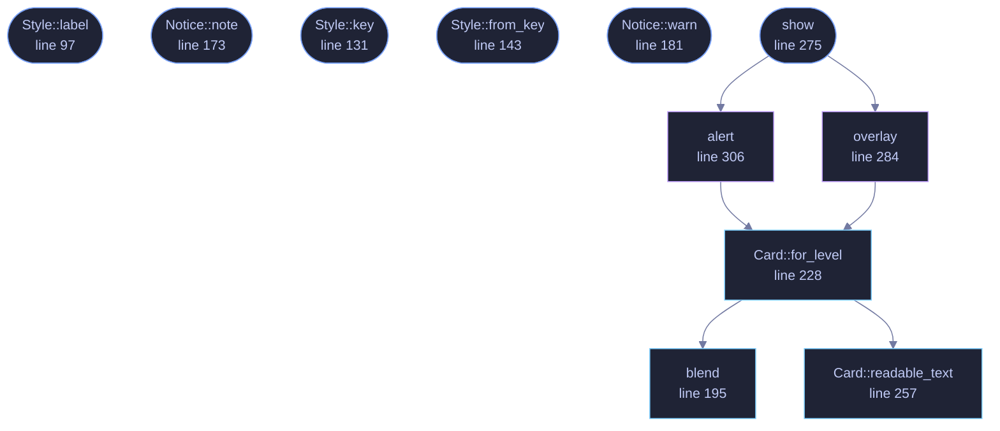

<!-- GENERATED by tools/docs/generate.py from the doc comments in the source. Do not edit: edit the .rs file and run the generator. -->

# `crates/veilvoice-gui/src/notify.rs`

[[veilvoice-gui|Crate-veilvoice-gui]] &middot; 460 lines &middot; [read the source](https://github.com/tilas01/veilvoice/blob/main/crates/veilvoice-gui/src/notify.rs)

## Contents

- [Three modes, and none of them is the obviously right one](#three-modes-and-none-of-them-is-the-obviously-right-one)
- [The contrast is computed, never assumed](#the-contrast-is-computed-never-assumed)
- [What this does not do](#what-this-does-not-do)
- [In plain words](#in-plain-words)
  - [What calls what](#what-calls-what)
  - [Items](#items)

How the application tells you something, and the three ways to be told.

# Three modes, and none of them is the obviously right one

`Style::Overlay` draws a rounded, translucent card in the corner of
VeilVoice's own window. It is the quiet option: it does not steal focus, it
does not interrupt what you are typing, and it fades on its own.

`Style::Alert` is the loud one. It stops the panel it is on until it is
dismissed, so it cannot be missed and it cannot be missed *quietly* --
which is the point when the thing being reported is that something started
recording your screen.

`Style::Off` shows nothing. It is offered because a monitor that
interrupts somebody every thirty seconds is a monitor they switch off at the
operating system, and then it is not watching for anything at all. Better a
reader who chose silence knowingly than one who disabled the whole feature
to get it.

There is no default that suits everybody, so the default is the middle one
and the choice is a preference rather than a guess.

# The contrast is computed, never assumed

A translucent card is a colour laid over whatever is behind it, so the text
on it is legible only if the *composited* result has enough contrast. Two
things follow, and both were got wrong in the first version of this file:

* The background to measure against is the blend, not the card's own tint.
`blend` does that arithmetic, and `Card::readable_text` measures the
result with the same WCAG ratio `crate::palettes` already uses on user
palettes.
* If no candidate reaches the threshold, the card is drawn **opaque**
rather than shipped illegible. Translucency is a nicety; being able to
read a warning is not.

# What this does not do

It does not raise a system notification, put anything in a tray, or reach
outside VeilVoice's own window. Those need per-platform APIs and, on two of
the three, a registered application identity -- and this project is
published under a pseudonym on purpose. A notification that only appears
while the window is open is a real limit, and `SCOPE` says so rather than
letting somebody rely on being told while VeilVoice is closed.

# In plain words

When VeilVoice has something to tell you, it can do it three ways: a small
rounded box in the corner of its own window that fades away by itself, a
message that stops what you are doing until you dismiss it, or nothing at
all.

The quiet box is see-through, so the colours behind it change how readable
the writing is. Rather than guessing, VeilVoice measures the actual
contrast of the result and picks the text colour that comes out clearest --
and if none of them is clear enough, it makes the box solid instead. A
warning you cannot read is not a warning.

One honest limit: these only appear while the VeilVoice window is open. It
does not put messages into your desktop's own notification area.

## What this file contains

460 lines defining **12 functions** (10 public), **4 types** and **4 constants**. Everything below is read out of the source, so it cannot disagree with the code.

**The types it owns.**

- `enum Style` (line 85) -- How the application shows a notification.
- `enum Level` (line 154) -- How serious a notification is.
- `struct Notice` (line 164) -- One thing to tell the reader.
- `struct Card` (line 208) -- A card's measured colours: what it is drawn in, and what its text is drawn in, chosen so the result is legible.

**What happens when it runs.** These are the ways in: public, and nothing else in this file calls them, so they are what an outside caller reaches first.

- `Style::label` (line 97) -- A short name, for a picker.
- `Style::note` (line 106) -- What this choice costs and buys, in the words a front end should show.
- `Style::key` (line 131) -- The identifier written to the settings file.
- `Style::from_key` (line 143) -- Read a style back.
- `Notice::note` (line 173) -- A plain note.
- `Notice::warn` (line 181) -- Something worth acting on.
- `show` (line 275) -- Draw a notice, in whichever way was chosen.
  - reaches: `alert`, `overlay`, `for_level`, `blend`, `readable_text`

## What calls what

_Colour key: **entry** -- a way in: public, and nothing in this file calls it; **api** -- public, and also used inside this file; **helper** -- private to this file._

  

The same graph as Mermaid source

## Items

| Item | Line | Documentation |
|---|---:|---|
| `LEAST_CONTRAST` pub const | [74](https://github.com/tilas01/veilvoice/blob/main/crates/veilvoice-gui/src/notify.rs#L74) | The smallest contrast ratio a notification's text may have. |
| `CARD_ALPHA` pub const | [81](https://github.com/tilas01/veilvoice/blob/main/crates/veilvoice-gui/src/notify.rs#L81) | How much of the card's own colour shows over what is behind it. |
| `Style` pub enum | [85](https://github.com/tilas01/veilvoice/blob/main/crates/veilvoice-gui/src/notify.rs#L85) | How the application shows a notification. |
| `Style::label` pub fn | [97](https://github.com/tilas01/veilvoice/blob/main/crates/veilvoice-gui/src/notify.rs#L97) | A short name, for a picker. |
| `Style::note` pub fn | [106](https://github.com/tilas01/veilvoice/blob/main/crates/veilvoice-gui/src/notify.rs#L106) | What this choice costs and buys, in the words a front end should show. |
| `Style::ALL` pub const | [128](https://github.com/tilas01/veilvoice/blob/main/crates/veilvoice-gui/src/notify.rs#L128) | Every style, in the order a picker should offer them. |
| `Style::key` pub fn | [131](https://github.com/tilas01/veilvoice/blob/main/crates/veilvoice-gui/src/notify.rs#L131) | The identifier written to the settings file. |
| `Style::from_key` pub fn | [143](https://github.com/tilas01/veilvoice/blob/main/crates/veilvoice-gui/src/notify.rs#L143) | Read a style back. |
| `Level` pub enum | [154](https://github.com/tilas01/veilvoice/blob/main/crates/veilvoice-gui/src/notify.rs#L154) | How serious a notification is. |
| `Notice` pub struct | [164](https://github.com/tilas01/veilvoice/blob/main/crates/veilvoice-gui/src/notify.rs#L164) | One thing to tell the reader. |
| `Notice::note` pub fn | [173](https://github.com/tilas01/veilvoice/blob/main/crates/veilvoice-gui/src/notify.rs#L173) | A plain note. |
| `Notice::warn` pub fn | [181](https://github.com/tilas01/veilvoice/blob/main/crates/veilvoice-gui/src/notify.rs#L181) | Something worth acting on. |
| `blend` pub fn | [195](https://github.com/tilas01/veilvoice/blob/main/crates/veilvoice-gui/src/notify.rs#L195) | Lay over on top of under at alpha, giving the colour actually seen. |
| `Card` pub struct | [208](https://github.com/tilas01/veilvoice/blob/main/crates/veilvoice-gui/src/notify.rs#L208) | A card's measured colours: what it is drawn in, and what its text is drawn in, chosen so the result is legible. |
| `Card::for_level` pub fn | [228](https://github.com/tilas01/veilvoice/blob/main/crates/veilvoice-gui/src/notify.rs#L228) | Work out how to draw a card of this level on this panel. |
| `Card::readable_text` pub fn | [257](https://github.com/tilas01/veilvoice/blob/main/crates/veilvoice-gui/src/notify.rs#L257) | The palette colour that reads best on fill, and its ratio. |
| `show` pub fn | [275](https://github.com/tilas01/veilvoice/blob/main/crates/veilvoice-gui/src/notify.rs#L275) | Draw a notice, in whichever way was chosen. |
| `overlay` fn | [284](https://github.com/tilas01/veilvoice/blob/main/crates/veilvoice-gui/src/notify.rs#L284) | The quiet one: a rounded translucent card. |
| `alert` fn | [306](https://github.com/tilas01/veilvoice/blob/main/crates/veilvoice-gui/src/notify.rs#L306) | The loud one: it stops the panel until acknowledged. |
| `SCOPE` pub const | [324](https://github.com/tilas01/veilvoice/blob/main/crates/veilvoice-gui/src/notify.rs#L324) | What a reader has to be told about these notifications. |
