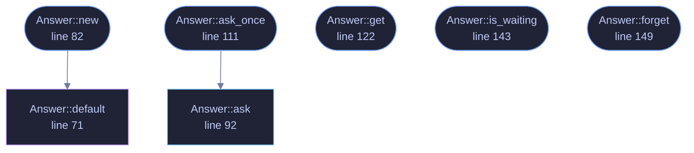

<!-- GENERATED by tools/docs/generate.py from the doc comments in the source. Do not edit: edit the .rs file and run the generator. -->


# `crates/veilvoice-gui/src/offthread.rs`

[[veilvoice-gui|Crate-veilvoice-gui]] &middot; 265 lines &middot; [read the source](https://github.com/tilas01/veilvoice/blob/main/crates/veilvoice-gui/src/offthread.rs)

## Contents

- [What this is for](#what-this-is-for)
- [The shape](#the-shape)
- [What it deliberately does not do](#what-it-deliberately-does-not-do)
- [Why this is not [crate::dialog::Pending]](#why-this-is-not-cratedialogpending)
  - [What calls what](#what-calls-what)
  - [Items](#items)

One answer, worked out somewhere that is not the thread drawing the window.

# What this is for

A panel often needs something only the machine can say: how much room is
free, which sound devices exist, whether a file is there. Each of those is
one line to write and none of them is quick. Written in the obvious place,
inside the function that draws the panel, that line runs **once per frame**,
sixty times a second, for as long as the panel is on screen.

That is not a theoretical cost. `veilvoice_setup::space::free_bytes` spawns
`df` on Unix and `fsutil.exe` on Windows, so the setup tour's last card
forked a process per frame. `devices::list` enumerates the audio hardware,
which on Windows is a COM call measured in tens of milliseconds. See F-216.

# The shape

`Answer` holds one value that somebody else works out. The drawing
function asks for it once, draws whatever has arrived, and never waits:

```ignore
self.machine.ask_once(ui.ctx(), measure);   // spawns, returns at once
match self.machine.get() {
Some(machine) => draw(ui, machine),
None => ui.spinner(),                   // still being read
}
```

The thread with the news asks for the repaint, because it is the only thing
that knows there is any. That rule is why an untouched window draws nothing
at all, and a poller here would have quietly undone it.

# What it deliberately does not do

**It does not re-ask.** An answer is read once and kept, because the
questions it is for have answers that change rarely and are not worth a
process per frame to notice. Something that genuinely changes underfoot
asks again explicitly, by calling `Answer::ask`.

**It does not report the worker's death as an error.** A worker that
panicked drops its sender, and this then reads as "not waiting any more,
and the last answer still stands". A panel that showed a number goes on
showing the last true one rather than replacing it with a zero, which is
what `setup`'s companion probe already decided for itself and for the same
reason: an empty list reads as "you have none of these".

# Why this is not `crate::dialog::Pending`

`Pending` is the same shape for file dialogs and it stays separate, because
on macOS it must run its work **on** the drawing thread: `NSOpenPanel` can
be driven from nowhere else. A type whose whole promise is "not on the
drawing thread" cannot have a platform where that is false. The duplication
is fifteen lines and the alternative is a promise with an exception in it.

## What this file contains

265 lines defining **7 functions** (6 public), **1 type** and **0 constants**. Everything below is read out of the source, so it cannot disagree with the code.

**The types it owns.**

- `struct Answer` (line 62) -- One value, worked out off the drawing thread.

**What happens when it runs.** These are the ways in: public, and nothing else in this file calls them, so they are what an outside caller reaches first.

- `Answer<T>::new` (line 82) -- Nothing asked yet.
  - reaches: `default`
- `Answer<T>::ask_once` (line 111) -- Start the work, unless it has been started before.
  - reaches: `ask`
- `Answer<T>::get` (line 122) -- The answer, if there is one.
- `Answer<T>::is_waiting` (line 143) -- Whether the work is still running.
- `Answer<T>::forget` (line 149) -- Throw the answer away, so the next ask_once asks again.

## What calls what

_Colour key: **entry** -- a way in: public, and nothing in this file calls it; **api** -- public, and also used inside this file; **helper** -- private to this file._

<p align="center">
  
</p>

<details>
<summary>The same graph as Mermaid source</summary>



</details>

## Items

| Item | Line | Documentation |
|---|---:|---|
| `Answer` <sub>pub struct</sub> | [62](https://github.com/tilas01/veilvoice/blob/main/crates/veilvoice-gui/src/offthread.rs#L62) | One value, worked out off the drawing thread. |
| `Answer<T>::default` <sub>fn</sub> | [71](https://github.com/tilas01/veilvoice/blob/main/crates/veilvoice-gui/src/offthread.rs#L71) |  |
| `Answer<T>::new` <sub>pub fn</sub> | [82](https://github.com/tilas01/veilvoice/blob/main/crates/veilvoice-gui/src/offthread.rs#L82) | Nothing asked yet. |
| `Answer<T>::ask` <sub>pub fn</sub> | [92](https://github.com/tilas01/veilvoice/blob/main/crates/veilvoice-gui/src/offthread.rs#L92) | Start the work, replacing anything already in flight. |
| `Answer<T>::ask_once` <sub>pub fn</sub> | [111](https://github.com/tilas01/veilvoice/blob/main/crates/veilvoice-gui/src/offthread.rs#L111) | Start the work, unless it has been started before. |
| `Answer<T>::get` <sub>pub fn</sub> | [122](https://github.com/tilas01/veilvoice/blob/main/crates/veilvoice-gui/src/offthread.rs#L122) | The answer, if there is one. |
| `Answer<T>::is_waiting` <sub>pub fn</sub> | [143](https://github.com/tilas01/veilvoice/blob/main/crates/veilvoice-gui/src/offthread.rs#L143) | Whether the work is still running. |
| `Answer<T>::forget` <sub>pub fn</sub> | [149](https://github.com/tilas01/veilvoice/blob/main/crates/veilvoice-gui/src/offthread.rs#L149) | Throw the answer away, so the next ask_once asks again. |
