<!-- GENERATED by tools/docs/generate.py from the doc comments in the source. Do not edit: edit the .rs file and run the generator. -->

# `crates/veilvoice-gui/src/pace.rs`

[[veilvoice-gui|Crate-veilvoice-gui]] &middot; 509 lines &middot; [read the source](https://github.com/tilas01/veilvoice/blob/main/crates/veilvoice-gui/src/pace.rs)

## Contents

- [The number this replaces](#the-number-this-replaces)
- [What this does instead](#what-this-does-instead)
- [The display's rate is measured, not asked for](#the-displays-rate-is-measured-not-asked-for)
- [Dropped frames](#dropped-frames)
- [Realtime](#realtime)
  - [What calls what](#what-calls-what)
  - [Items](#items)

How often the window draws while something in it is moving, and what that
actually came to.

# The number this replaces

The animations ran at twenty frames a second by design. The mark in the
header carried its own constant, the busy path asked for a frame every
fifty milliseconds, and the veiling path every sixteen. Each was a
reasonable number on its own, and together they meant that on any display
somebody had bought in the last five years the window moved at a fraction
of the display's rate, with the busy path visibly juddering against the
mark beside it.

Sixteen milliseconds is the interesting one. It is the number everybody
writes for sixty a second, and it is wrong for a window that waits for the
display: a display at sixty draws every 16.67 ms, so a request for a frame
"no later than sixteen milliseconds from now" wakes the loop just after the
frame it could have joined and the drawing lands on the one after. That is
thirty a second, asked for as sixty, and it is where "forty frames a second
on a good machine" came from.

# What this does instead

While something is moving, the window asks for the next frame **now**, and
lets vsync decide when that is. Under vsync a frame cannot be drawn faster
than the display shows it, so this costs one frame per display refresh and
not one more, and the rate is the display's own, whatever it is. Somebody
who wants fewer frames than that, on a battery or a machine that struggles,
sets a target in Settings and the window asks for a frame every `1/target`
seconds instead, which is the old behaviour with the number chosen rather
than hard-coded. Idle still draws nothing; this only decides the spacing of
frames that were going to be drawn anyway.

# The display's rate is measured, not asked for

Neither `egui` nor `eframe` says what the display's refresh rate is. It can
be measured: a run of frames requested back to back under vsync settles at
the display's rate, and the median interval over the last thirty-two frames
is a number a single slow frame cannot move. That median, rounded and
clamped to 30..=1000, is what the About tab reports as the display and what
"match the display" means in Settings.

# Dropped frames

A frame that arrives more than one and a half times the expected interval
after the one before it is counted as dropped. The count is shown beside
the frame rate, and when more than a handful drop inside one second the
window says so in the header, with whether it is on software rendering,
because that is the first thing to check and the About tab is not where
somebody looks while it is happening.

# Realtime

`frame` runs once per drawn frame on the thread that draws. It allocates
nothing, locks nothing and prints nothing: the interval history is a fixed
ring, the median is taken over a copy of it on the stack, and the target
that other modules read is an atomic. The guard from roadmap item 126 reads this
file.

## What this file contains

509 lines defining **19 functions** (16 public), **2 types** and **9 constants**. Everything below is read out of the source, so it cannot disagree with the code.

**The types it owns.**

- `enum Target` (line 141) -- What a person chose in Settings.
- `struct Pace` (line 177) -- The measurement, kept across frames.

**What happens when it runs.** These are the ways in: public, and nothing else in this file calls them, so they are what an outside caller reaches first.

- `next_frame` (line 129) -- Ask for the next frame the way the current target wants it asked for.
- `Target::from_setting` (line 150) -- From the preference as stored: zero is the display.
- `Target::to_setting` (line 159) -- The preference to store.
- `Target::label` (line 167) -- The words Settings shows for it.
- `Pace::set_target` (line 226) -- Change the target, keeping what has been measured.
  - reaches: `publish`
- `Pace::target` (line 232) -- The target as chosen.
- `Pace::display_hz` (line 245) -- The display's rate as measured, if it has been.
- `Pace::fps` (line 250) -- Frames a second over the last whole second of drawing.
- `Pace::dropped_total` (line 255) -- Every frame counted as dropped since the window opened.
- `Pace::dropped_last_second` (line 260) -- Frames dropped in the last whole second.
- `Pace::is_dropping` (line 271) -- Whether frames are being dropped steadily enough to be worth saying.
- `Pace::dropping_seconds` (line 276) -- How many consecutive seconds have been dropping frames.
- `Pace::frame` (line 288) -- Record that a frame is being drawn at time, egui's clock in seconds.
  - reaches: `median_hz`, `publish`, `target_hz`
- `Pace::interval` (line 380) -- The interval animations currently pace by, for tests and the About tab.

## What calls what

_Colour key: **entry** -- a way in: public, and nothing in this file calls it; **api** -- public, and also used inside this file; **helper** -- private to this file._

  

The same graph as Mermaid source

```mermaid
%%{init: {"theme":"base","themeVariables":{"background":"#1a1b26","primaryColor":"#1f2335","primaryTextColor":"#c0caf5","primaryBorderColor":"#7aa2f7","secondaryColor":"#16161e","tertiaryColor":"#16161e","lineColor":"#737aa2","textColor":"#c0caf5","mainBkg":"#1f2335","nodeBorder":"#7aa2f7","clusterBkg":"#16161e","clusterBorder":"#2f3549","fontFamily":"ui-monospace, SFMono-Regular, Consolas, monospace","fontSize":"14px"}}}%%
flowchart TD
    n_next_frame(["next_frame<br/>line 129"])
    n_from_setting(["Target::from_setting<br/>line 150"])
    n_to_setting(["Target::to_setting<br/>line 159"])
    n_label(["Target::label<br/>line 167"])
    n_default["Pace::default<br/>line 198"]
    n_new["Pace::new<br/>line 205"]
    n_set_target(["Pace::set_target<br/>line 226"])
    n_target(["Pace::target<br/>line 232"])
    n_target_hz["Pace::target_hz<br/>line 237"]
    n_display_hz(["Pace::display_hz<br/>line 245"])
    n_fps(["Pace::fps<br/>line 250"])
    n_dropped_total(["Pace::dropped_total<br/>line 255"])
    n_dropped_last_second(["Pace::dropped_last_second<br/>line 260"])
    n_is_dropping(["Pace::is_dropping<br/>line 271"])
    n_dropping_seconds(["Pace::dropping_seconds<br/>line 276"])
    n_frame(["Pace::frame<br/>line 288"])
    n_median_hz["Pace::median_hz<br/>line 347"]
    n_publish["Pace::publish<br/>line 370"]
    n_interval(["Pace::interval<br/>line 380"])
    n_default --> n_new
    n_frame --> n_median_hz
    n_frame --> n_publish
    n_frame --> n_target_hz
    n_set_target --> n_publish
    click n_next_frame href "https://github.com/tilas01/veilvoice/blob/main/crates/veilvoice-gui/src/pace.rs#L129" "open the source"
    click n_from_setting href "https://github.com/tilas01/veilvoice/blob/main/crates/veilvoice-gui/src/pace.rs#L150" "open the source"
    click n_to_setting href "https://github.com/tilas01/veilvoice/blob/main/crates/veilvoice-gui/src/pace.rs#L159" "open the source"
    click n_label href "https://github.com/tilas01/veilvoice/blob/main/crates/veilvoice-gui/src/pace.rs#L167" "open the source"
    click n_default href "https://github.com/tilas01/veilvoice/blob/main/crates/veilvoice-gui/src/pace.rs#L198" "open the source"
    click n_new href "https://github.com/tilas01/veilvoice/blob/main/crates/veilvoice-gui/src/pace.rs#L205" "open the source"
    click n_set_target href "https://github.com/tilas01/veilvoice/blob/main/crates/veilvoice-gui/src/pace.rs#L226" "open the source"
    click n_target href "https://github.com/tilas01/veilvoice/blob/main/crates/veilvoice-gui/src/pace.rs#L232" "open the source"
    click n_target_hz href "https://github.com/tilas01/veilvoice/blob/main/crates/veilvoice-gui/src/pace.rs#L237" "open the source"
    click n_display_hz href "https://github.com/tilas01/veilvoice/blob/main/crates/veilvoice-gui/src/pace.rs#L245" "open the source"
    click n_fps href "https://github.com/tilas01/veilvoice/blob/main/crates/veilvoice-gui/src/pace.rs#L250" "open the source"
    click n_dropped_total href "https://github.com/tilas01/veilvoice/blob/main/crates/veilvoice-gui/src/pace.rs#L255" "open the source"
    click n_dropped_last_second href "https://github.com/tilas01/veilvoice/blob/main/crates/veilvoice-gui/src/pace.rs#L260" "open the source"
    click n_is_dropping href "https://github.com/tilas01/veilvoice/blob/main/crates/veilvoice-gui/src/pace.rs#L271" "open the source"
    click n_dropping_seconds href "https://github.com/tilas01/veilvoice/blob/main/crates/veilvoice-gui/src/pace.rs#L276" "open the source"
    click n_frame href "https://github.com/tilas01/veilvoice/blob/main/crates/veilvoice-gui/src/pace.rs#L288" "open the source"
    click n_median_hz href "https://github.com/tilas01/veilvoice/blob/main/crates/veilvoice-gui/src/pace.rs#L347" "open the source"
    click n_publish href "https://github.com/tilas01/veilvoice/blob/main/crates/veilvoice-gui/src/pace.rs#L370" "open the source"
    click n_interval href "https://github.com/tilas01/veilvoice/blob/main/crates/veilvoice-gui/src/pace.rs#L380" "open the source"
    classDef entry fill:#1f2335,stroke:#7aa2f7,color:#c0caf5
    class n_next_frame,n_from_setting,n_to_setting,n_label,n_set_target,n_target,n_display_hz,n_fps,n_dropped_total,n_dropped_last_second,n_is_dropping,n_dropping_seconds,n_frame,n_interval entry
    classDef api fill:#1f2335,stroke:#7dcfff,color:#c0caf5
    class n_new,n_target_hz api
    classDef helper fill:#1f2335,stroke:#bb9af7,color:#c0caf5
    class n_default,n_median_hz,n_publish helper
```

## Items

| Item | Line | Documentation |
|---|---:|---|
| `DISPLAY_FLOOR` pub const | [66](https://github.com/tilas01/veilvoice/blob/main/crates/veilvoice-gui/src/pace.rs#L66) | The lowest rate a display is believed to have. |
| `DISPLAY_CEILING` pub const | [81](https://github.com/tilas01/veilvoice/blob/main/crates/veilvoice-gui/src/pace.rs#L81) | The highest rate the window will run at, display or setting. |
| `ASSUMED` pub const | [84](https://github.com/tilas01/veilvoice/blob/main/crates/veilvoice-gui/src/pace.rs#L84) | The rate assumed until the display has been measured. |
| `TARGETS` pub const | [93](https://github.com/tilas01/veilvoice/blob/main/crates/veilvoice-gui/src/pace.rs#L93) | The targets Settings offers, besides "match the display". |
| `WINDOW` const | [98](https://github.com/tilas01/veilvoice/blob/main/crates/veilvoice-gui/src/pace.rs#L98) | How many intervals the median is taken over. |
| `DROPPED_AT` const | [101](https://github.com/tilas01/veilvoice/blob/main/crates/veilvoice-gui/src/pace.rs#L101) | A frame this much later than expected is a dropped one. |
| `NOTICE_AT` const | [104](https://github.com/tilas01/veilvoice/blob/main/crates/veilvoice-gui/src/pace.rs#L104) | More drops than this inside one second is worth saying out loud. |
| `INTERVAL_MICROS` static | [113](https://github.com/tilas01/veilvoice/blob/main/crates/veilvoice-gui/src/pace.rs#L113) | The interval every animation in the window paces itself by, in microseconds. |
| `ANIMATING` static | [122](https://github.com/tilas01/veilvoice/blob/main/crates/veilvoice-gui/src/pace.rs#L122) | Set by next_frame, read and cleared once per frame by Pace::frame. |
| `next_frame` pub fn | [129](https://github.com/tilas01/veilvoice/blob/main/crates/veilvoice-gui/src/pace.rs#L129) | Ask for the next frame the way the current target wants it asked for. |
| `Target` pub enum | [141](https://github.com/tilas01/veilvoice/blob/main/crates/veilvoice-gui/src/pace.rs#L141) | What a person chose in Settings. |
| `Target::from_setting` pub fn | [150](https://github.com/tilas01/veilvoice/blob/main/crates/veilvoice-gui/src/pace.rs#L150) | From the preference as stored: zero is the display. |
| `Target::to_setting` pub fn | [159](https://github.com/tilas01/veilvoice/blob/main/crates/veilvoice-gui/src/pace.rs#L159) | The preference to store. |
| `Target::label` pub fn | [167](https://github.com/tilas01/veilvoice/blob/main/crates/veilvoice-gui/src/pace.rs#L167) | The words Settings shows for it. |
| `Pace` pub struct | [177](https://github.com/tilas01/veilvoice/blob/main/crates/veilvoice-gui/src/pace.rs#L177) | The measurement, kept across frames. |
| `Pace::default` fn | [198](https://github.com/tilas01/veilvoice/blob/main/crates/veilvoice-gui/src/pace.rs#L198) |  |
| `Pace::new` pub fn | [205](https://github.com/tilas01/veilvoice/blob/main/crates/veilvoice-gui/src/pace.rs#L205) | A fresh measurement with this target. |
| `Pace::set_target` pub fn | [226](https://github.com/tilas01/veilvoice/blob/main/crates/veilvoice-gui/src/pace.rs#L226) | Change the target, keeping what has been measured. |
| `Pace::target` pub fn | [232](https://github.com/tilas01/veilvoice/blob/main/crates/veilvoice-gui/src/pace.rs#L232) | The target as chosen. |
| `Pace::target_hz` pub fn | [237](https://github.com/tilas01/veilvoice/blob/main/crates/veilvoice-gui/src/pace.rs#L237) | The rate the window is aiming at right now, in frames a second. |
| `Pace::display_hz` pub fn | [245](https://github.com/tilas01/veilvoice/blob/main/crates/veilvoice-gui/src/pace.rs#L245) | The display's rate as measured, if it has been. |
| `Pace::fps` pub fn | [250](https://github.com/tilas01/veilvoice/blob/main/crates/veilvoice-gui/src/pace.rs#L250) | Frames a second over the last whole second of drawing. |
| `Pace::dropped_total` pub fn | [255](https://github.com/tilas01/veilvoice/blob/main/crates/veilvoice-gui/src/pace.rs#L255) | Every frame counted as dropped since the window opened. |
| `Pace::dropped_last_second` pub fn | [260](https://github.com/tilas01/veilvoice/blob/main/crates/veilvoice-gui/src/pace.rs#L260) | Frames dropped in the last whole second. |
| `Pace::is_dropping` pub fn | [271](https://github.com/tilas01/veilvoice/blob/main/crates/veilvoice-gui/src/pace.rs#L271) | Whether frames are being dropped steadily enough to be worth saying. |
| `Pace::dropping_seconds` pub fn | [276](https://github.com/tilas01/veilvoice/blob/main/crates/veilvoice-gui/src/pace.rs#L276) | How many consecutive seconds have been dropping frames. |
| `Pace::frame` pub fn | [288](https://github.com/tilas01/veilvoice/blob/main/crates/veilvoice-gui/src/pace.rs#L288) | Record that a frame is being drawn at time, egui's clock in seconds. |
| `Pace::median_hz` fn | [347](https://github.com/tilas01/veilvoice/blob/main/crates/veilvoice-gui/src/pace.rs#L347) | The display's rate from the median interval, clamped to sense. |
| `Pace::publish` fn | [370](https://github.com/tilas01/veilvoice/blob/main/crates/veilvoice-gui/src/pace.rs#L370) | Tell the animations what to ask for. |
| `Pace::interval` pub fn | [380](https://github.com/tilas01/veilvoice/blob/main/crates/veilvoice-gui/src/pace.rs#L380) | The interval animations currently pace by, for tests and the About tab. |
