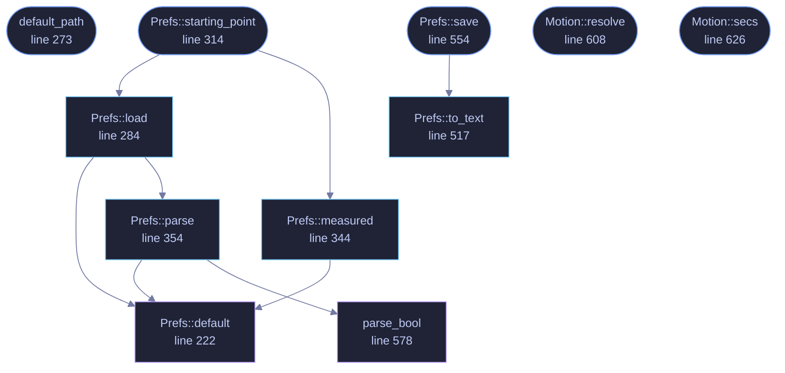

<!-- GENERATED by tools/docs/generate.py from the doc comments in the source. Do not edit: edit the .rs file and run the generator. -->

# `crates/veilvoice-gui/src/prefs.rs`

[[veilvoice-gui|Crate-veilvoice-gui]] &middot; 1012 lines &middot; [read the source](https://github.com/tilas01/veilvoice/blob/main/crates/veilvoice-gui/src/prefs.rs)

## Contents

- [Nothing here is secret, and nothing here is required](#nothing-here-is-secret-and-nothing-here-is-required)
- [The format](#the-format)
- [Animations](#animations)
- [Two kinds of default, and which one this file holds](#two-kinds-of-default-and-which-one-this-file-holds)
- [In plain words](#in-plain-words)
  - [What calls what](#what-calls-what)
  - [Items](#items)

What the user has chosen about how the app looks and moves.

# Nothing here is secret, and nothing here is required

Preferences are a convenience. Every field has a working default, a missing
file is not an error, and a corrupt one is not either -- it falls back to
the defaults and says so in the settings panel rather than refusing to
start. An app that will not open because its preferences file has a stray
byte in it has turned a cosmetic setting into an outage.

This is deliberately *not* written through
`veilvoice_crypto::privatefile`. That module exists for files whose
contents are sensitive, and using it here would blur a distinction worth
keeping: your choice of colour scheme is not a secret, and treating it like
one would make the real protections look like decoration.

# The format

One `key = value` per line, ASCII, with `#` comments -- readable and
editable with any text editor, for the same reason the integrity manifest
is a text format. No parser dependency, and no way for a malformed file to
do anything more interesting than be ignored.

# Animations

On by default, and switchable off in two places: the settings panel, and
the `VEILVOICE_NO_ANIMATION` environment variable, which wins over the file
so that a machine which struggles with them can be fixed without opening
the UI that is struggling.

The system's own "reduce motion" setting is honoured above both. Someone who
has told their operating system they do not want movement has already
answered this question, and a privacy tool asking again -- and defaulting to
yes -- would be ignoring them.

# Two kinds of default, and which one this file holds

**Roadmap item 170.** `Prefs::default` is the written-down starting
point: constants, chosen once, the same on every machine. It is what the
tests construct and what a build with nothing to ask falls back to.

`Prefs::starting_point` is the one a real first run takes, and it is not
the same thing. Where a value can be established by asking this machine, it
is asked. Which is not most of them: a theme, a notification style and a
vault folder are preferences and there is nothing to measure. The one that
can be measured is the drawing path, and `crate::probe` is where that
question is put. The other two the roadmap item names were already measured
and were not described that way: `frame_rate` of `0` means the display's own
rate, which `crate::pace` takes from the intervals between frames, and
whether anything animates is resolved against the system's reduce-motion
setting every frame by `Motion::resolve`.

The measurement happens once, on the run with no file to read, and is
written into the file with everything else. `Prefs::defaults_measured`
records that it happened, so the interface can say the machine was asked
rather than implying it.

# In plain words

What you have chosen about how VeilVoice looks and behaves, kept in a small
text file.

The first time it runs, the things that can be worked out from your computer
are worked out from your computer rather than guessed, and written down here
so it only has to look once. All of them are still settings.

Nothing in it is secret and nothing in it is required: delete the file and the
application opens with its defaults. You can read it and edit it by hand.

A setting this version does not recognise falls back to the default rather than
stopping the program, and where the safe direction matters, the default is the
one that keeps a protection on.

## What this file contains

1012 lines defining **11 functions** (9 public), **2 types** and **0 constants**. Everything below is read out of the source, so it cannot disagree with the code.

**The types it owns.**

- `struct Prefs` (line 79) -- Everything the user can choose about presentation.
- `struct Motion` (line 596) -- Whether movement is allowed, and how much.

**What happens when it runs.** These are the ways in: public, and nothing else in this file calls them, so they are what an outside caller reaches first.

- `default_path` (line 273) -- Where preferences live: beside the app lock, in this platform's config directory.
- `Prefs::starting_point` (line 314) -- The preferences to open with: the file if there is one, and otherwise a look at this machine.
  - reaches: `load`, `measured`, `default`, `parse`, `parse_bool`
- `Prefs::save` (line 554) -- Write preferences to path, creating the directory if needed.
  - reaches: `to_text`
- `Motion::resolve` (line 608) -- Resolve for this frame.
- `Motion::secs` (line 626) -- A duration scaled by whether motion is allowed.

## What calls what

_Colour key: **entry** -- a way in: public, and nothing in this file calls it; **api** -- public, and also used inside this file; **helper** -- private to this file._

  

The same graph as Mermaid source

## Items

| Item | Line | Documentation |
|---|---:|---|
| `Prefs` pub struct | [79](https://github.com/tilas01/veilvoice/blob/main/crates/veilvoice-gui/src/prefs.rs#L79) | Everything the user can choose about presentation. |
| `Prefs::default` fn | [222](https://github.com/tilas01/veilvoice/blob/main/crates/veilvoice-gui/src/prefs.rs#L222) |  |
| `default_path` pub fn | [273](https://github.com/tilas01/veilvoice/blob/main/crates/veilvoice-gui/src/prefs.rs#L273) | Where preferences live: beside the app lock, in this platform's config directory. |
| `Prefs::load` pub fn | [284](https://github.com/tilas01/veilvoice/blob/main/crates/veilvoice-gui/src/prefs.rs#L284) | Read preferences from path. |
| `Prefs::starting_point` pub fn | [314](https://github.com/tilas01/veilvoice/blob/main/crates/veilvoice-gui/src/prefs.rs#L314) | The preferences to open with: the file if there is one, and otherwise a look at this machine. |
| `Prefs::measured` pub fn | [344](https://github.com/tilas01/veilvoice/blob/main/crates/veilvoice-gui/src/prefs.rs#L344) | The starting point for a machine that has just been asked about itself. |
| `Prefs::parse` pub fn | [354](https://github.com/tilas01/veilvoice/blob/main/crates/veilvoice-gui/src/prefs.rs#L354) | Parse the key = value format. |
| `Prefs::to_text` pub fn | [517](https://github.com/tilas01/veilvoice/blob/main/crates/veilvoice-gui/src/prefs.rs#L517) | Serialise to the text format. |
| `Prefs::save` pub fn | [554](https://github.com/tilas01/veilvoice/blob/main/crates/veilvoice-gui/src/prefs.rs#L554) | Write preferences to path, creating the directory if needed. |
| `parse_bool` fn | [578](https://github.com/tilas01/veilvoice/blob/main/crates/veilvoice-gui/src/prefs.rs#L578) | One of the spellings people write for yes and no, as a bool. |
| `Motion` pub struct | [596](https://github.com/tilas01/veilvoice/blob/main/crates/veilvoice-gui/src/prefs.rs#L596) | Whether movement is allowed, and how much. |
| `Motion::resolve` pub fn | [608](https://github.com/tilas01/veilvoice/blob/main/crates/veilvoice-gui/src/prefs.rs#L608) | Resolve for this frame. |
| `Motion::secs` pub fn | [626](https://github.com/tilas01/veilvoice/blob/main/crates/veilvoice-gui/src/prefs.rs#L626) | A duration scaled by whether motion is allowed. |
