<!-- GENERATED by tools/docs/generate.py from the doc comments in the source. Do not edit: edit the .rs file and run the generator. -->

# `crates/veilvoice-gui/src/progress.rs`

[[veilvoice-gui|Crate-veilvoice-gui]] &middot; 345 lines &middot; [read the source](https://github.com/tilas01/veilvoice/blob/main/crates/veilvoice-gui/src/progress.rs)

## Contents

- [Why a bar is a claim](#why-a-bar-is-a-claim)
- [Why atomics rather than a channel](#why-atomics-rather-than-a-channel)
- [Where the repaint request lives](#where-the-repaint-request-lives)
- [What is deliberately left to roadmap item 169](#what-is-deliberately-left-to-roadmap-item-169)
- [In plain words](#in-plain-words)
  - [What calls what](#what-calls-what)
  - [Items](#items)

How far through a job is, in the two cases that exist: the ones that can
honestly say, and the ones that cannot.

# Why a bar is a claim

A progress bar is read as a promise about how much longer. Drawn over a job
whose length nobody knows it is a lie that gets worse the longer it is on
screen: it crawls to nine tenths, sits there, and the person watching learns
that this window's bars mean nothing. Roadmap item 167 says an estimate is
given **only where one can honestly be given**, and the example it gives is
the distinction this module is built on. Hashing a file of known length can
say how far through it is, because the total is a number the operating
system will tell you before the work starts. Deriving a key cannot: it is
one long computation with no countable middle, and the honest thing is to
say that rather than to draw something.

So `Reach` has two constructors and they are not interchangeable.
`Reach::counting` is for a job with a total, and draws a bar.
`Reach::unmeasurable` is for a job without one, takes the reason as an
argument, and draws a spinner with that reason beside it. There is no third
constructor that guesses.

# Why atomics rather than a channel

`crate::offthread::Answer` is the shape for **one** value that arrives
once. This is the other shape: a number that changes thousands of times
while the drawing thread reads it every frame. A channel would deliver
sixty thousand messages nobody wants, and a `Mutex` would be a lock the
drawing thread waits on while a worker holds it, which is the whole class of
defect roadmap item 167 exists to remove.

`Relaxed` is enough for all of it. Nothing here is ordered against anything
else: the worst a stale read can produce is a bar one frame behind, and a
bar one frame behind is what every bar is.

# Where the repaint request lives

In `strip`, not at the call sites. A window with nothing happening in it
stops drawing, so a counter that advanced would not be seen until somebody
moved the mouse, which is precisely what a frozen window looks like. Left to
the caller that would be one line to forget per panel, and a fix written at
the wrong scope is how F-210, F-216, F-219 and F-220 each happened.

# What is deliberately left to roadmap item 169

`strip` does not yet consult the reduce-motion setting, so the
no-estimate case spins for somebody who has asked their system for no
movement. That is roadmap item 169's subject, which is one indicator used
everywhere and a static statement in place of a moving one, and it will be
added here rather than beside it. The twelve other places that draw a bare
`ui.spinner()` are 169's sweep for the same reason.

# In plain words

This is the little indicator that says something is happening.

Where the program knows how much work there is, it shows how far through it
is. Where it does not know, it says so in a sentence instead of drawing a bar
that would be making it up.

## What this file contains

345 lines defining **9 functions** (9 public), **1 type** and **0 constants**. Everything below is read out of the source, so it cannot disagree with the code.

**The types it owns.**

- `struct Reach` (line 73) -- How far through one job is.

**What happens when it runs.** These are the ways in: public, and nothing else in this file calls them, so they are what an outside caller reaches first.

- `Reach::counting` (line 92) -- A job of total countable units.
- `Reach::unmeasurable` (line 105) -- A job whose length cannot be known, and the reason, which is shown.
- `Reach::advance` (line 114) -- Count by more units finished.
- `Reach::set_total` (line 121) -- Say what the total really is, for a job that could only count it once it had started.
- `Reach::fraction` (line 143) -- How far through, in 0, 1, or None where that cannot be said.
  - reaches: `done`, `total`
- `Reach::because` (line 152) -- The reason no estimate is given, for a job that cannot give one.
- `strip` (line 170) -- The indicator, beside the control that started the work.

## What calls what

_Colour key: **entry** -- a way in: public, and nothing in this file calls it; **api** -- public, and also used inside this file._

  

The same graph as Mermaid source

```mermaid
%%{init: {"theme":"base","themeVariables":{"background":"#1a1b26","primaryColor":"#1f2335","primaryTextColor":"#c0caf5","primaryBorderColor":"#7aa2f7","secondaryColor":"#16161e","tertiaryColor":"#16161e","lineColor":"#737aa2","textColor":"#c0caf5","mainBkg":"#1f2335","nodeBorder":"#7aa2f7","clusterBkg":"#16161e","clusterBorder":"#2f3549","fontFamily":"ui-monospace, SFMono-Regular, Consolas, monospace","fontSize":"14px"}}}%%
flowchart TD
    n_counting(["Reach::counting<br/>line 92"])
    n_unmeasurable(["Reach::unmeasurable<br/>line 105"])
    n_advance(["Reach::advance<br/>line 114"])
    n_set_total(["Reach::set_total<br/>line 121"])
    n_done["Reach::done<br/>line 128"]
    n_total["Reach::total<br/>line 133"]
    n_fraction(["Reach::fraction<br/>line 143"])
    n_because(["Reach::because<br/>line 152"])
    n_strip(["strip<br/>line 170"])
    n_fraction --> n_done
    n_fraction --> n_total
    click n_counting href "https://github.com/tilas01/veilvoice/blob/main/crates/veilvoice-gui/src/progress.rs#L92" "open the source"
    click n_unmeasurable href "https://github.com/tilas01/veilvoice/blob/main/crates/veilvoice-gui/src/progress.rs#L105" "open the source"
    click n_advance href "https://github.com/tilas01/veilvoice/blob/main/crates/veilvoice-gui/src/progress.rs#L114" "open the source"
    click n_set_total href "https://github.com/tilas01/veilvoice/blob/main/crates/veilvoice-gui/src/progress.rs#L121" "open the source"
    click n_done href "https://github.com/tilas01/veilvoice/blob/main/crates/veilvoice-gui/src/progress.rs#L128" "open the source"
    click n_total href "https://github.com/tilas01/veilvoice/blob/main/crates/veilvoice-gui/src/progress.rs#L133" "open the source"
    click n_fraction href "https://github.com/tilas01/veilvoice/blob/main/crates/veilvoice-gui/src/progress.rs#L143" "open the source"
    click n_because href "https://github.com/tilas01/veilvoice/blob/main/crates/veilvoice-gui/src/progress.rs#L152" "open the source"
    click n_strip href "https://github.com/tilas01/veilvoice/blob/main/crates/veilvoice-gui/src/progress.rs#L170" "open the source"
    classDef entry fill:#1f2335,stroke:#7aa2f7,color:#c0caf5
    class n_counting,n_unmeasurable,n_advance,n_set_total,n_fraction,n_because,n_strip entry
    classDef api fill:#1f2335,stroke:#7dcfff,color:#c0caf5
    class n_done,n_total api
```

## Items

| Item | Line | Documentation |
|---|---:|---|
| `Reach` pub struct | [73](https://github.com/tilas01/veilvoice/blob/main/crates/veilvoice-gui/src/progress.rs#L73) | How far through one job is. |
| `Reach::counting` pub fn | [92](https://github.com/tilas01/veilvoice/blob/main/crates/veilvoice-gui/src/progress.rs#L92) | A job of total countable units. |
| `Reach::unmeasurable` pub fn | [105](https://github.com/tilas01/veilvoice/blob/main/crates/veilvoice-gui/src/progress.rs#L105) | A job whose length cannot be known, and the reason, which is shown. |
| `Reach::advance` pub fn | [114](https://github.com/tilas01/veilvoice/blob/main/crates/veilvoice-gui/src/progress.rs#L114) | Count by more units finished. |
| `Reach::set_total` pub fn | [121](https://github.com/tilas01/veilvoice/blob/main/crates/veilvoice-gui/src/progress.rs#L121) | Say what the total really is, for a job that could only count it once it had started. |
| `Reach::done` pub fn | [128](https://github.com/tilas01/veilvoice/blob/main/crates/veilvoice-gui/src/progress.rs#L128) | Units finished so far. |
| `Reach::total` pub fn | [133](https://github.com/tilas01/veilvoice/blob/main/crates/veilvoice-gui/src/progress.rs#L133) | The whole job, or zero where there is no honest total. |
| `Reach::fraction` pub fn | [143](https://github.com/tilas01/veilvoice/blob/main/crates/veilvoice-gui/src/progress.rs#L143) | How far through, in 0, 1, or None where that cannot be said. |
| `Reach::because` pub fn | [152](https://github.com/tilas01/veilvoice/blob/main/crates/veilvoice-gui/src/progress.rs#L152) | The reason no estimate is given, for a job that cannot give one. |
| `strip` pub fn | [170](https://github.com/tilas01/veilvoice/blob/main/crates/veilvoice-gui/src/progress.rs#L170) | The indicator, beside the control that started the work. |
