<!-- GENERATED by tools/docs/generate.py from the doc comments in the source. Do not edit: edit the .rs file and run the generator. -->

# `crates/veilvoice-gui/src/settings.rs`

[[veilvoice-gui|Crate-veilvoice-gui]] &middot; 1056 lines &middot; [read the source](https://github.com/tilas01/veilvoice/blob/main/crates/veilvoice-gui/src/settings.rs)

## Contents

- [Why a menu rather than one long list](#why-a-menu-rather-than-one-long-list)
- [Every change applies immediately, and is saved immediately](#every-change-applies-immediately-and-is-saved-immediately)
- [What is deliberately not in here](#what-is-deliberately-not-in-here)
- [In plain words](#in-plain-words)
  - [What calls what](#what-calls-what)
  - [Items](#items)

The settings panel: a menu of pages, each a titled group of choices.

# Why a menu rather than one long list

There are three kinds of setting here and they answer different questions:
what the app *looks* like, how it *moves*, and what it does with the files
it writes. Stacked in one column they read as an undifferentiated wall of
tick boxes, and the one that matters most -- at-rest encryption -- ends up
looking exactly as important as the colour scheme. A menu with a page per
group keeps each question next to its own explanation.

# Every change applies immediately, and is saved immediately

There is no "apply" button and no "unsaved changes" state. Both are ways to
lose a choice silently. If saving fails the choice still applies for this
session and the panel says, in the panel, that it could not be remembered
and why -- rather than failing quietly and letting the setting reappear
wrong on the next launch.

# What is deliberately not in here

The app lock and the at-rest passphrase have their own tab and stay there.
A password field sitting between "animations" and "colour scheme" invites
being treated with the same weight, and it is not the same weight.

# In plain words

The settings, arranged as a short menu rather than one long list.

There are enough of them now that a single column meant scrolling past things
you were not looking for, and finding a setting is most of what anybody does in
a settings screen.

Each page is a titled group with a sentence saying what it covers, and every
choice applies as you make it and is remembered.

## What this file contains

1056 lines defining **27 functions** (18 public), **2 types** and **1 constant**. Everything below is read out of the source, so it cannot disagree with the code.

**The types it owns.**

- `enum Page` (line 46) -- Which page of the settings menu is showing.
- `struct Settings` (line 68) -- The settings tab's own state.

**What happens when it runs.** These are the ways in: public, and nothing else in this file calls them, so they are what an outside caller reaches first.

- `Settings::load` (line 112) -- Load preferences from this platform's config directory and apply the chosen theme to ctx.
- `Settings::needs_first_run` (line 143) -- Whether the first-run choice has still to be made.
- `Settings::save_error` (line 168) -- Whether the app should open in group mode, and a way to change it.
- `Settings::show_install_tab` (line 179) -- Whether the install tab should be offered at all.
- `Settings::hide_install_tab` (line 184) -- Whether the install tab is hidden by preference.
- `Settings::always_group` (line 198) -- Whether the app should open in group mode.
- `Settings::set_always_group` (line 245) -- Record whether the app should open in group mode.
  - reaches: `persist`
- `Settings::first_run_panel` (line 420) -- The first-run panel: offered once, with animation already on.
  - reaches: `persist`
- `Settings::tab` (line 480) -- The settings tab.
  - reaches: `appearance_page`, `interface_page`, `motion_page`, `storage_page`, `custom_palette_help`, `persist`, `section`, `swatches`, `failsafe`, `live_monitor`, `notify_style`, `set_failsafe`
- `Settings::theme_picker` (line 604) -- The colour scheme, as a compact control for the window header.
  - reaches: `persist`

## What calls what

_22 of 27 functions are drawn; the diagram is bounded at 22 so it stays readable._

_Colour key: **entry** -- a way in: public, and nothing in this file calls it; **api** -- public, and also used inside this file; **helper** -- private to this file._

  

The same graph as Mermaid source

```mermaid
%%{init: {"theme":"base","themeVariables":{"background":"#1a1b26","primaryColor":"#1f2335","primaryTextColor":"#c0caf5","primaryBorderColor":"#7aa2f7","secondaryColor":"#16161e","tertiaryColor":"#16161e","lineColor":"#737aa2","textColor":"#c0caf5","mainBkg":"#1f2335","nodeBorder":"#7aa2f7","clusterBkg":"#16161e","clusterBorder":"#2f3549","fontFamily":"ui-monospace, SFMono-Regular, Consolas, monospace","fontSize":"14px"}}}%%
flowchart TD
    n_load(["Settings::load<br/>line 112"])
    n_motion["Settings::motion<br/>line 138"]
    n_needs_first_run(["Settings::needs_first_run<br/>line 143"])
    n_persist["Settings::persist<br/>line 147"]
    n_set_hide_install_tab["Settings::set_hide_install_tab<br/>line 189"]
    n_failsafe["Settings::failsafe<br/>line 203"]
    n_set_failsafe["Settings::set_failsafe<br/>line 208"]
    n_notify_style["Settings::notify_style<br/>line 217"]
    n_set_notify_style["Settings::set_notify_style<br/>line 222"]
    n_live_monitor["Settings::live_monitor<br/>line 231"]
    n_set_live_monitor["Settings::set_live_monitor<br/>line 236"]
    n_set_always_group(["Settings::set_always_group<br/>line 245"])
    n_interface_page["Settings::interface_page<br/>line 254"]
    n_first_run_panel(["Settings::first_run_panel<br/>line 420"])
    n_tab(["Settings::tab<br/>line 480"])
    n_custom_palette_help["Settings::custom_palette_help<br/>line 534"]
    n_theme_picker(["Settings::theme_picker<br/>line 604"])
    n_appearance_page["Settings::appearance_page<br/>line 628"]
    n_motion_page["Settings::motion_page<br/>line 665"]
    n_storage_page["Settings::storage_page<br/>line 740"]
    n_section["section<br/>line 801"]
    n_swatches["swatches<br/>line 809"]
    n_appearance_page --> n_custom_palette_help
    n_appearance_page --> n_persist
    n_appearance_page --> n_section
    n_appearance_page --> n_swatches
    n_first_run_panel --> n_persist
    n_interface_page --> n_failsafe
    n_interface_page --> n_live_monitor
    n_interface_page --> n_notify_style
    n_interface_page --> n_section
    n_interface_page --> n_set_failsafe
    n_interface_page --> n_set_hide_install_tab
    n_interface_page --> n_set_live_monitor
    n_interface_page --> n_set_notify_style
    n_motion_page --> n_motion
    n_motion_page --> n_persist
    n_motion_page --> n_section
    n_set_always_group --> n_persist
    n_set_failsafe --> n_failsafe
    n_set_failsafe --> n_persist
    n_set_hide_install_tab --> n_persist
    n_set_live_monitor --> n_live_monitor
    n_set_live_monitor --> n_persist
    n_set_notify_style --> n_notify_style
    n_set_notify_style --> n_persist
    n_storage_page --> n_persist
    n_storage_page --> n_section
    n_tab --> n_appearance_page
    n_tab --> n_interface_page
    n_tab --> n_motion_page
    n_tab --> n_storage_page
    n_theme_picker --> n_persist
    click n_load href "https://github.com/tilas01/veilvoice/blob/main/crates/veilvoice-gui/src/settings.rs#L112" "open the source"
    click n_motion href "https://github.com/tilas01/veilvoice/blob/main/crates/veilvoice-gui/src/settings.rs#L138" "open the source"
    click n_needs_first_run href "https://github.com/tilas01/veilvoice/blob/main/crates/veilvoice-gui/src/settings.rs#L143" "open the source"
    click n_persist href "https://github.com/tilas01/veilvoice/blob/main/crates/veilvoice-gui/src/settings.rs#L147" "open the source"
    click n_set_hide_install_tab href "https://github.com/tilas01/veilvoice/blob/main/crates/veilvoice-gui/src/settings.rs#L189" "open the source"
    click n_failsafe href "https://github.com/tilas01/veilvoice/blob/main/crates/veilvoice-gui/src/settings.rs#L203" "open the source"
    click n_set_failsafe href "https://github.com/tilas01/veilvoice/blob/main/crates/veilvoice-gui/src/settings.rs#L208" "open the source"
    click n_notify_style href "https://github.com/tilas01/veilvoice/blob/main/crates/veilvoice-gui/src/settings.rs#L217" "open the source"
    click n_set_notify_style href "https://github.com/tilas01/veilvoice/blob/main/crates/veilvoice-gui/src/settings.rs#L222" "open the source"
    click n_live_monitor href "https://github.com/tilas01/veilvoice/blob/main/crates/veilvoice-gui/src/settings.rs#L231" "open the source"
    click n_set_live_monitor href "https://github.com/tilas01/veilvoice/blob/main/crates/veilvoice-gui/src/settings.rs#L236" "open the source"
    click n_set_always_group href "https://github.com/tilas01/veilvoice/blob/main/crates/veilvoice-gui/src/settings.rs#L245" "open the source"
    click n_interface_page href "https://github.com/tilas01/veilvoice/blob/main/crates/veilvoice-gui/src/settings.rs#L254" "open the source"
    click n_first_run_panel href "https://github.com/tilas01/veilvoice/blob/main/crates/veilvoice-gui/src/settings.rs#L420" "open the source"
    click n_tab href "https://github.com/tilas01/veilvoice/blob/main/crates/veilvoice-gui/src/settings.rs#L480" "open the source"
    click n_custom_palette_help href "https://github.com/tilas01/veilvoice/blob/main/crates/veilvoice-gui/src/settings.rs#L534" "open the source"
    click n_theme_picker href "https://github.com/tilas01/veilvoice/blob/main/crates/veilvoice-gui/src/settings.rs#L604" "open the source"
    click n_appearance_page href "https://github.com/tilas01/veilvoice/blob/main/crates/veilvoice-gui/src/settings.rs#L628" "open the source"
    click n_motion_page href "https://github.com/tilas01/veilvoice/blob/main/crates/veilvoice-gui/src/settings.rs#L665" "open the source"
    click n_storage_page href "https://github.com/tilas01/veilvoice/blob/main/crates/veilvoice-gui/src/settings.rs#L740" "open the source"
    click n_section href "https://github.com/tilas01/veilvoice/blob/main/crates/veilvoice-gui/src/settings.rs#L801" "open the source"
    click n_swatches href "https://github.com/tilas01/veilvoice/blob/main/crates/veilvoice-gui/src/settings.rs#L809" "open the source"
    classDef entry fill:#1f2335,stroke:#7aa2f7,color:#c0caf5
    class n_load,n_needs_first_run,n_set_always_group,n_first_run_panel,n_tab,n_theme_picker entry
    classDef api fill:#1f2335,stroke:#7dcfff,color:#c0caf5
    class n_motion,n_set_hide_install_tab,n_failsafe,n_set_failsafe,n_notify_style,n_set_notify_style,n_live_monitor,n_set_live_monitor api
    classDef helper fill:#1f2335,stroke:#bb9af7,color:#c0caf5
    class n_persist,n_interface_page,n_custom_palette_help,n_appearance_page,n_motion_page,n_storage_page,n_section,n_swatches helper
```

## Items

| Item | Line | Documentation |
|---|---:|---|
| `Page` pub enum | [46](https://github.com/tilas01/veilvoice/blob/main/crates/veilvoice-gui/src/settings.rs#L46) | Which page of the settings menu is showing. |
| `Page::ALL` pub const | [59](https://github.com/tilas01/veilvoice/blob/main/crates/veilvoice-gui/src/settings.rs#L59) | Every page, in menu order, with its label and one-line summary. |
| `Settings` pub struct | [68](https://github.com/tilas01/veilvoice/blob/main/crates/veilvoice-gui/src/settings.rs#L68) | The settings tab's own state. |
| `Settings::default` fn | [93](https://github.com/tilas01/veilvoice/blob/main/crates/veilvoice-gui/src/settings.rs#L93) |  |
| `Settings::load` pub fn | [112](https://github.com/tilas01/veilvoice/blob/main/crates/veilvoice-gui/src/settings.rs#L112) | Load preferences from this platform's config directory and apply the chosen theme to ctx. |
| `Settings::motion` pub fn | [138](https://github.com/tilas01/veilvoice/blob/main/crates/veilvoice-gui/src/settings.rs#L138) | How much movement is allowed this frame. |
| `Settings::needs_first_run` pub fn | [143](https://github.com/tilas01/veilvoice/blob/main/crates/veilvoice-gui/src/settings.rs#L143) | Whether the first-run choice has still to be made. |
| `Settings::persist` fn | [147](https://github.com/tilas01/veilvoice/blob/main/crates/veilvoice-gui/src/settings.rs#L147) |  |
| `Settings::save_error` pub fn | [168](https://github.com/tilas01/veilvoice/blob/main/crates/veilvoice-gui/src/settings.rs#L168) | Whether the app should open in group mode, and a way to change it. |
| `Settings::show_install_tab` pub fn | [179](https://github.com/tilas01/veilvoice/blob/main/crates/veilvoice-gui/src/settings.rs#L179) | Whether the install tab should be offered at all. |
| `Settings::hide_install_tab` pub fn | [184](https://github.com/tilas01/veilvoice/blob/main/crates/veilvoice-gui/src/settings.rs#L184) | Whether the install tab is hidden by preference. |
| `Settings::set_hide_install_tab` pub fn | [189](https://github.com/tilas01/veilvoice/blob/main/crates/veilvoice-gui/src/settings.rs#L189) | Record whether to hide the install tab on a portable copy. |
| `Settings::always_group` pub fn | [198](https://github.com/tilas01/veilvoice/blob/main/crates/veilvoice-gui/src/settings.rs#L198) | Whether the app should open in group mode. |
| `Settings::failsafe` pub fn | [203](https://github.com/tilas01/veilvoice/blob/main/crates/veilvoice-gui/src/settings.rs#L203) | The Failsafe posture in force. |
| `Settings::set_failsafe` pub fn | [208](https://github.com/tilas01/veilvoice/blob/main/crates/veilvoice-gui/src/settings.rs#L208) | Record the Failsafe posture. |
| `Settings::notify_style` pub fn | [217](https://github.com/tilas01/veilvoice/blob/main/crates/veilvoice-gui/src/settings.rs#L217) | How notifications should be shown. |
| `Settings::set_notify_style` pub fn | [222](https://github.com/tilas01/veilvoice/blob/main/crates/veilvoice-gui/src/settings.rs#L222) | Record how notifications should be shown. |
| `Settings::live_monitor` pub fn | [231](https://github.com/tilas01/veilvoice/blob/main/crates/veilvoice-gui/src/settings.rs#L231) | Where the live monitor sits, or whether it is shown. |
| `Settings::set_live_monitor` pub fn | [236](https://github.com/tilas01/veilvoice/blob/main/crates/veilvoice-gui/src/settings.rs#L236) | Record where the live monitor sits. |
| `Settings::set_always_group` pub fn | [245](https://github.com/tilas01/veilvoice/blob/main/crates/veilvoice-gui/src/settings.rs#L245) | Record whether the app should open in group mode. |
| `Settings::interface_page` fn | [254](https://github.com/tilas01/veilvoice/blob/main/crates/veilvoice-gui/src/settings.rs#L254) | Which tabs the window offers. |
| `Settings::first_run_panel` pub fn | [420](https://github.com/tilas01/veilvoice/blob/main/crates/veilvoice-gui/src/settings.rs#L420) | The first-run panel: offered once, with animation already on. |
| `Settings::tab` pub fn | [480](https://github.com/tilas01/veilvoice/blob/main/crates/veilvoice-gui/src/settings.rs#L480) | The settings tab. |
| `Settings::custom_palette_help` fn | [534](https://github.com/tilas01/veilvoice/blob/main/crates/veilvoice-gui/src/settings.rs#L534) | Explain where custom palettes go, and say what was refused and why. |
| `Settings::theme_picker` pub fn | [604](https://github.com/tilas01/veilvoice/blob/main/crates/veilvoice-gui/src/settings.rs#L604) | The colour scheme, as a compact control for the window header. |
| `Settings::appearance_page` fn | [628](https://github.com/tilas01/veilvoice/blob/main/crates/veilvoice-gui/src/settings.rs#L628) |  |
| `Settings::motion_page` fn | [665](https://github.com/tilas01/veilvoice/blob/main/crates/veilvoice-gui/src/settings.rs#L665) |  |
| `Settings::storage_page` fn | [740](https://github.com/tilas01/veilvoice/blob/main/crates/veilvoice-gui/src/settings.rs#L740) |  |
| `section` fn | [801](https://github.com/tilas01/veilvoice/blob/main/crates/veilvoice-gui/src/settings.rs#L801) | A titled group with a one-line explanation under it. |
| `swatches` fn | [809](https://github.com/tilas01/veilvoice/blob/main/crates/veilvoice-gui/src/settings.rs#L809) | The active palette, as a row of swatches, so the choice can be seen rather than only read. |
