<!-- GENERATED by tools/docs/generate.py from the doc comments in the source. Do not edit: edit the .rs file and run the generator. -->

# `crates/veilvoice-gui/src/settings.rs`

[[veilvoice-gui|Crate-veilvoice-gui]] &middot; 733 lines &middot; [read the source](https://github.com/tilas01/veilvoice/blob/main/crates/veilvoice-gui/src/settings.rs)

## Contents

- [Why a menu rather than one long list](#why-a-menu-rather-than-one-long-list)
- [Every change applies immediately, and is saved immediately](#every-change-applies-immediately-and-is-saved-immediately)
- [What is deliberately not in here](#what-is-deliberately-not-in-here)
  - [What calls what](#what-calls-what)
  - [Items](#items)

The settings panel: a menu of pages, each a titled group of choices.

# Why a menu rather than one long list

There are three kinds of setting here and they answer different questions:
what the app *looks* like, how it *moves*, and what it does with the files
it writes. Stacked in one column they read as an undifferentiated wall of
tick boxes, and the one that matters most -- at-rest encryption -- ends up
looking exactly as important as the colour scheme. A menu with a page per
group keeps each question next to its own explanation.

# Every change applies immediately, and is saved immediately

There is no "apply" button and no "unsaved changes" state. Both are ways to
lose a choice silently. If saving fails the choice still applies for this
session and the panel says, in the panel, that it could not be remembered
and why -- rather than failing quietly and letting the setting reappear
wrong on the next launch.

# What is deliberately not in here

The app lock and the at-rest passphrase have their own tab and stay there.
A password field sitting between "animations" and "colour scheme" invites
being treated with the same weight, and it is not the same weight.

## What this file contains

733 lines defining **16 functions** (8 public), **2 types** and **1 constant**. Everything below is read out of the source, so it cannot disagree with the code.

**The types it owns.**

- `enum Page` (line 35) -- Which page of the settings menu is showing.
- `struct Settings` (line 54) -- The settings tab's own state.

**What happens when it runs.** These are the ways in: public, and nothing else in this file calls them, so they are what an outside caller reaches first.

- `Settings::load` (line 98) -- Load preferences from this platform's config directory and apply the chosen theme to ctx.
- `Settings::needs_first_run` (line 129) -- Whether the first-run choice has still to be made.
- `Settings::save_error` (line 154) -- Whether the app should open in group mode, and a way to change it.
- `Settings::always_group` (line 159) -- Whether the app should open in group mode.
- `Settings::set_always_group` (line 164) -- Record whether the app should open in group mode.
  - reaches: `persist`
- `Settings::first_run_panel` (line 177) -- The first-run panel: offered once, with animation already on.
  - reaches: `persist`
- `Settings::tab` (line 237) -- The settings tab.
  - reaches: `appearance_page`, `motion_page`, `storage_page`, `custom_palette_help`, `persist`, `section`, `swatches`, `motion`

## What calls what

_Colour key: **entry** -- a way in: public, and nothing in this file calls it; **api** -- public, and also used inside this file; **helper** -- private to this file._

  

The same graph as Mermaid source

```mermaid
%%{init: {"theme":"base","themeVariables":{"background":"#1a1b26","primaryColor":"#1f2335","primaryTextColor":"#c0caf5","primaryBorderColor":"#7aa2f7","secondaryColor":"#16161e","tertiaryColor":"#16161e","lineColor":"#737aa2","textColor":"#c0caf5","mainBkg":"#1f2335","nodeBorder":"#7aa2f7","clusterBkg":"#16161e","clusterBorder":"#2f3549","fontFamily":"ui-monospace, SFMono-Regular, Consolas, monospace","fontSize":"14px"}}}%%
flowchart TD
    n_default["Settings::default<br/>line 79"]
    n_load(["Settings::load<br/>line 98"])
    n_motion["Settings::motion<br/>line 124"]
    n_needs_first_run(["Settings::needs_first_run<br/>line 129"])
    n_persist["Settings::persist<br/>line 133"]
    n_save_error(["Settings::save_error<br/>line 154"])
    n_always_group(["Settings::always_group<br/>line 159"])
    n_set_always_group(["Settings::set_always_group<br/>line 164"])
    n_first_run_panel(["Settings::first_run_panel<br/>line 177"])
    n_tab(["Settings::tab<br/>line 237"])
    n_custom_palette_help["Settings::custom_palette_help<br/>line 290"]
    n_appearance_page["Settings::appearance_page<br/>line 353"]
    n_motion_page["Settings::motion_page<br/>line 390"]
    n_storage_page["Settings::storage_page<br/>line 465"]
    n_section["section<br/>line 526"]
    n_swatches["swatches<br/>line 534"]
    n_appearance_page --> n_custom_palette_help
    n_appearance_page --> n_persist
    n_appearance_page --> n_section
    n_appearance_page --> n_swatches
    n_first_run_panel --> n_persist
    n_motion_page --> n_motion
    n_motion_page --> n_persist
    n_motion_page --> n_section
    n_set_always_group --> n_persist
    n_storage_page --> n_persist
    n_storage_page --> n_section
    n_tab --> n_appearance_page
    n_tab --> n_motion_page
    n_tab --> n_storage_page
    click n_default href "https://github.com/tilas01/veilvoice/blob/main/crates/veilvoice-gui/src/settings.rs#L79" "open the source"
    click n_load href "https://github.com/tilas01/veilvoice/blob/main/crates/veilvoice-gui/src/settings.rs#L98" "open the source"
    click n_motion href "https://github.com/tilas01/veilvoice/blob/main/crates/veilvoice-gui/src/settings.rs#L124" "open the source"
    click n_needs_first_run href "https://github.com/tilas01/veilvoice/blob/main/crates/veilvoice-gui/src/settings.rs#L129" "open the source"
    click n_persist href "https://github.com/tilas01/veilvoice/blob/main/crates/veilvoice-gui/src/settings.rs#L133" "open the source"
    click n_save_error href "https://github.com/tilas01/veilvoice/blob/main/crates/veilvoice-gui/src/settings.rs#L154" "open the source"
    click n_always_group href "https://github.com/tilas01/veilvoice/blob/main/crates/veilvoice-gui/src/settings.rs#L159" "open the source"
    click n_set_always_group href "https://github.com/tilas01/veilvoice/blob/main/crates/veilvoice-gui/src/settings.rs#L164" "open the source"
    click n_first_run_panel href "https://github.com/tilas01/veilvoice/blob/main/crates/veilvoice-gui/src/settings.rs#L177" "open the source"
    click n_tab href "https://github.com/tilas01/veilvoice/blob/main/crates/veilvoice-gui/src/settings.rs#L237" "open the source"
    click n_custom_palette_help href "https://github.com/tilas01/veilvoice/blob/main/crates/veilvoice-gui/src/settings.rs#L290" "open the source"
    click n_appearance_page href "https://github.com/tilas01/veilvoice/blob/main/crates/veilvoice-gui/src/settings.rs#L353" "open the source"
    click n_motion_page href "https://github.com/tilas01/veilvoice/blob/main/crates/veilvoice-gui/src/settings.rs#L390" "open the source"
    click n_storage_page href "https://github.com/tilas01/veilvoice/blob/main/crates/veilvoice-gui/src/settings.rs#L465" "open the source"
    click n_section href "https://github.com/tilas01/veilvoice/blob/main/crates/veilvoice-gui/src/settings.rs#L526" "open the source"
    click n_swatches href "https://github.com/tilas01/veilvoice/blob/main/crates/veilvoice-gui/src/settings.rs#L534" "open the source"
    classDef entry fill:#1f2335,stroke:#7aa2f7,color:#c0caf5
    class n_load,n_needs_first_run,n_save_error,n_always_group,n_set_always_group,n_first_run_panel,n_tab entry
    classDef api fill:#1f2335,stroke:#7dcfff,color:#c0caf5
    class n_motion api
    classDef helper fill:#1f2335,stroke:#bb9af7,color:#c0caf5
    class n_default,n_persist,n_custom_palette_help,n_appearance_page,n_motion_page,n_storage_page,n_section,n_swatches helper
```

## Items

| Item | Line | Documentation |
|---|---:|---|
| `Page` pub enum | [35](https://github.com/tilas01/veilvoice/blob/main/crates/veilvoice-gui/src/settings.rs#L35) | Which page of the settings menu is showing. |
| `Page::ALL` pub const | [46](https://github.com/tilas01/veilvoice/blob/main/crates/veilvoice-gui/src/settings.rs#L46) | Every page, in menu order, with its label and one-line summary. |
| `Settings` pub struct | [54](https://github.com/tilas01/veilvoice/blob/main/crates/veilvoice-gui/src/settings.rs#L54) | The settings tab's own state. |
| `Settings::default` fn | [79](https://github.com/tilas01/veilvoice/blob/main/crates/veilvoice-gui/src/settings.rs#L79) |  |
| `Settings::load` pub fn | [98](https://github.com/tilas01/veilvoice/blob/main/crates/veilvoice-gui/src/settings.rs#L98) | Load preferences from this platform's config directory and apply the chosen theme to ctx. |
| `Settings::motion` pub fn | [124](https://github.com/tilas01/veilvoice/blob/main/crates/veilvoice-gui/src/settings.rs#L124) | How much movement is allowed this frame. |
| `Settings::needs_first_run` pub fn | [129](https://github.com/tilas01/veilvoice/blob/main/crates/veilvoice-gui/src/settings.rs#L129) | Whether the first-run choice has still to be made. |
| `Settings::persist` fn | [133](https://github.com/tilas01/veilvoice/blob/main/crates/veilvoice-gui/src/settings.rs#L133) |  |
| `Settings::save_error` pub fn | [154](https://github.com/tilas01/veilvoice/blob/main/crates/veilvoice-gui/src/settings.rs#L154) | Whether the app should open in group mode, and a way to change it. |
| `Settings::always_group` pub fn | [159](https://github.com/tilas01/veilvoice/blob/main/crates/veilvoice-gui/src/settings.rs#L159) | Whether the app should open in group mode. |
| `Settings::set_always_group` pub fn | [164](https://github.com/tilas01/veilvoice/blob/main/crates/veilvoice-gui/src/settings.rs#L164) | Record whether the app should open in group mode. |
| `Settings::first_run_panel` pub fn | [177](https://github.com/tilas01/veilvoice/blob/main/crates/veilvoice-gui/src/settings.rs#L177) | The first-run panel: offered once, with animation already on. |
| `Settings::tab` pub fn | [237](https://github.com/tilas01/veilvoice/blob/main/crates/veilvoice-gui/src/settings.rs#L237) | The settings tab. |
| `Settings::custom_palette_help` fn | [290](https://github.com/tilas01/veilvoice/blob/main/crates/veilvoice-gui/src/settings.rs#L290) | Explain where custom palettes go, and say what was refused and why. |
| `Settings::appearance_page` fn | [353](https://github.com/tilas01/veilvoice/blob/main/crates/veilvoice-gui/src/settings.rs#L353) |  |
| `Settings::motion_page` fn | [390](https://github.com/tilas01/veilvoice/blob/main/crates/veilvoice-gui/src/settings.rs#L390) |  |
| `Settings::storage_page` fn | [465](https://github.com/tilas01/veilvoice/blob/main/crates/veilvoice-gui/src/settings.rs#L465) |  |
| `section` fn | [526](https://github.com/tilas01/veilvoice/blob/main/crates/veilvoice-gui/src/settings.rs#L526) | A titled group with a one-line explanation under it. |
| `swatches` fn | [534](https://github.com/tilas01/veilvoice/blob/main/crates/veilvoice-gui/src/settings.rs#L534) | The active palette, as a row of swatches, so the choice can be seen rather than only read. |
