<!-- GENERATED by tools/docs/generate.py from the doc comments in the source. Do not edit: edit the .rs file and run the generator. -->

# `crates/veilvoice-gui/src/settings.rs`

[[veilvoice-gui|Crate-veilvoice-gui]] &middot; 1424 lines &middot; [read the source](https://github.com/tilas01/veilvoice/blob/main/crates/veilvoice-gui/src/settings.rs)

## Contents

- [Why a menu rather than one long list](#why-a-menu-rather-than-one-long-list)
- [Every change applies immediately, and is saved immediately](#every-change-applies-immediately-and-is-saved-immediately)
- [What is deliberately not in here](#what-is-deliberately-not-in-here)
- [In plain words](#in-plain-words)
  - [What calls what](#what-calls-what)
  - [Items](#items)

The settings panel: a menu of pages, each a titled group of choices.

# Why a menu rather than one long list

There are three kinds of setting here and they answer different questions:
what the app *looks* like, how it *moves*, and what it does with the files
it writes. Stacked in one column they read as an undifferentiated wall of
tick boxes, and the one that matters most -- at-rest encryption -- ends up
looking exactly as important as the colour scheme. A menu with a page per
group keeps each question next to its own explanation.

# Every change applies immediately, and is saved immediately

There is no "apply" button and no "unsaved changes" state. Both are ways to
lose a choice silently. If saving fails the choice still applies for this
session and the panel says, in the panel, that it could not be remembered
and why -- rather than failing quietly and letting the setting reappear
wrong on the next launch.

# What is deliberately not in here

The app lock and the at-rest passphrase have their own tab and stay there.
A password field sitting between "animations" and "colour scheme" invites
being treated with the same weight, and it is not the same weight.

# In plain words

The settings, arranged as a short menu rather than one long list.

There are enough of them now that a single column meant scrolling past things
you were not looking for, and finding a setting is most of what anybody does in
a settings screen.

Each page is a titled group with a sentence saying what it covers, and every
choice applies as you make it and is remembered.

## What this file contains

1424 lines defining **43 functions** (33 public), **2 types** and **1 constant**. Everything below is read out of the source, so it cannot disagree with the code.

**The types it owns.**

- `enum Page` (line 46) -- Which page of the settings menu is showing.
- `struct Settings` (line 71) -- The settings tab's own state.

**What happens when it runs.** These are the ways in: public, and nothing else in this file calls them, so they are what an outside caller reaches first.

- `Settings::load` (line 121) -- Load preferences from this platform's config directory and apply the chosen theme to ctx.
- `Settings::needs_first_run` (line 154) -- Whether the first-run choice has still to be made.
- `Settings::save_error` (line 179) -- Whether the app should open in group mode, and a way to change it.
- `Settings::show_install_tab` (line 190) -- Whether the install tab should be offered at all.
- `Settings::hide_install_tab` (line 195) -- Whether the install tab is hidden by preference.
- `Settings::acceleration` (line 213) -- Whether the window asks the platform for a hardware-drawn context.
- `Settings::show_frame_rate` (line 242) -- Whether the header carries a live frame-rate readout.
- `Settings::always_group` (line 247) -- Whether the app should open in group mode.
- `Settings::seal_with_app_lock` (line 276) -- Whether every recording is sealed with the app-lock passphrase.
- `Settings::destination` (line 281) -- The remembered encrypted destination, rebuilt from the settings file.
- `Settings::set_destination` (line 290) -- Remember a destination, including the answer to the hidden question.
  - reaches: `persist`
- `Settings::set_always_group` (line 349) -- Record whether the app should open in group mode.
  - reaches: `persist`
- `Settings::set_seal_with_app_lock` (line 363) -- Remember, or stop remembering, that recordings are sealed with the app-lock passphrase.
  - reaches: `persist`
- `Settings::toured_tabs` (line 578) -- The tabs the tour has already covered.
- `Settings::mark_toured` (line 589) -- Record that the tour has covered these tabs, and save.
  - reaches: `persist`
- `Settings::first_run_appearance` (line 603) -- The first-run panel: offered once, with animation already on.
  - reaches: `persist`
- `Settings::first_run_autolock` (line 630) -- The autolock switch and delay, for the first-run setup to place.
  - reaches: `persist`
- `Settings::finish_first_run` (line 658) -- Mark the first run answered.
  - reaches: `persist`
- `Settings::tab` (line 665) -- The settings tab.
  - reaches: `appearance_page`, `interface_page`, `motion_page`, `security_page`, `storage_page`, `custom_palette_help`, `persist`, `section`, `swatches`, `failsafe`, `live_monitor`, `notify_style`
- `Settings::theme_picker` (line 794) -- The colour scheme, as a compact control for the window header.
  - reaches: `persist`

## What calls what

_22 of 43 functions are drawn; the diagram is bounded at 22 so it stays readable._

_Colour key: **entry** -- a way in: public, and nothing in this file calls it; **api** -- public, and also used inside this file._

  

The same graph as Mermaid source

```mermaid
%%{init: {"theme":"base","themeVariables":{"background":"#1a1b26","primaryColor":"#1f2335","primaryTextColor":"#c0caf5","primaryBorderColor":"#7aa2f7","secondaryColor":"#16161e","tertiaryColor":"#16161e","lineColor":"#737aa2","textColor":"#c0caf5","mainBkg":"#1f2335","nodeBorder":"#7aa2f7","clusterBkg":"#16161e","clusterBorder":"#2f3549","fontFamily":"ui-monospace, SFMono-Regular, Consolas, monospace","fontSize":"14px"}}}%%
flowchart TD
    n_motion["Settings::motion<br/>line 149"]
    n_set_hide_install_tab["Settings::set_hide_install_tab<br/>line 200"]
    n_set_acceleration["Settings::set_acceleration<br/>line 218"]
    n_frame_target["Settings::frame_target<br/>line 227"]
    n_set_frame_target["Settings::set_frame_target<br/>line 232"]
    n_autolock["Settings::autolock<br/>line 252"]
    n_set_autolock["Settings::set_autolock<br/>line 263"]
    n_set_destination(["Settings::set_destination<br/>line 290"])
    n_failsafe["Settings::failsafe<br/>line 307"]
    n_set_failsafe["Settings::set_failsafe<br/>line 312"]
    n_notify_style["Settings::notify_style<br/>line 321"]
    n_set_notify_style["Settings::set_notify_style<br/>line 326"]
    n_live_monitor["Settings::live_monitor<br/>line 335"]
    n_set_live_monitor["Settings::set_live_monitor<br/>line 340"]
    n_set_always_group(["Settings::set_always_group<br/>line 349"])
    n_set_seal_with_app_lock(["Settings::<br/>set_seal_with_app_lock<br/>line 363"])
    n_mark_toured(["Settings::mark_toured<br/>line 589"])
    n_first_run_appearance(["Settings::first_run_appearance<br/>line 603"])
    n_first_run_autolock(["Settings::first_run_autolock<br/>line 630"])
    n_finish_first_run(["Settings::finish_first_run<br/>line 658"])
    n_tab(["Settings::tab<br/>line 665"])
    n_theme_picker(["Settings::theme_picker<br/>line 794"])
    n_set_autolock --> n_autolock
    n_set_failsafe --> n_failsafe
    n_set_live_monitor --> n_live_monitor
    n_set_notify_style --> n_notify_style
    click n_motion href "https://github.com/tilas01/veilvoice/blob/main/crates/veilvoice-gui/src/settings.rs#L149" "open the source"
    click n_set_hide_install_tab href "https://github.com/tilas01/veilvoice/blob/main/crates/veilvoice-gui/src/settings.rs#L200" "open the source"
    click n_set_acceleration href "https://github.com/tilas01/veilvoice/blob/main/crates/veilvoice-gui/src/settings.rs#L218" "open the source"
    click n_frame_target href "https://github.com/tilas01/veilvoice/blob/main/crates/veilvoice-gui/src/settings.rs#L227" "open the source"
    click n_set_frame_target href "https://github.com/tilas01/veilvoice/blob/main/crates/veilvoice-gui/src/settings.rs#L232" "open the source"
    click n_autolock href "https://github.com/tilas01/veilvoice/blob/main/crates/veilvoice-gui/src/settings.rs#L252" "open the source"
    click n_set_autolock href "https://github.com/tilas01/veilvoice/blob/main/crates/veilvoice-gui/src/settings.rs#L263" "open the source"
    click n_set_destination href "https://github.com/tilas01/veilvoice/blob/main/crates/veilvoice-gui/src/settings.rs#L290" "open the source"
    click n_failsafe href "https://github.com/tilas01/veilvoice/blob/main/crates/veilvoice-gui/src/settings.rs#L307" "open the source"
    click n_set_failsafe href "https://github.com/tilas01/veilvoice/blob/main/crates/veilvoice-gui/src/settings.rs#L312" "open the source"
    click n_notify_style href "https://github.com/tilas01/veilvoice/blob/main/crates/veilvoice-gui/src/settings.rs#L321" "open the source"
    click n_set_notify_style href "https://github.com/tilas01/veilvoice/blob/main/crates/veilvoice-gui/src/settings.rs#L326" "open the source"
    click n_live_monitor href "https://github.com/tilas01/veilvoice/blob/main/crates/veilvoice-gui/src/settings.rs#L335" "open the source"
    click n_set_live_monitor href "https://github.com/tilas01/veilvoice/blob/main/crates/veilvoice-gui/src/settings.rs#L340" "open the source"
    click n_set_always_group href "https://github.com/tilas01/veilvoice/blob/main/crates/veilvoice-gui/src/settings.rs#L349" "open the source"
    click n_set_seal_with_app_lock href "https://github.com/tilas01/veilvoice/blob/main/crates/veilvoice-gui/src/settings.rs#L363" "open the source"
    click n_mark_toured href "https://github.com/tilas01/veilvoice/blob/main/crates/veilvoice-gui/src/settings.rs#L589" "open the source"
    click n_first_run_appearance href "https://github.com/tilas01/veilvoice/blob/main/crates/veilvoice-gui/src/settings.rs#L603" "open the source"
    click n_first_run_autolock href "https://github.com/tilas01/veilvoice/blob/main/crates/veilvoice-gui/src/settings.rs#L630" "open the source"
    click n_finish_first_run href "https://github.com/tilas01/veilvoice/blob/main/crates/veilvoice-gui/src/settings.rs#L658" "open the source"
    click n_tab href "https://github.com/tilas01/veilvoice/blob/main/crates/veilvoice-gui/src/settings.rs#L665" "open the source"
    click n_theme_picker href "https://github.com/tilas01/veilvoice/blob/main/crates/veilvoice-gui/src/settings.rs#L794" "open the source"
    classDef entry fill:#1f2335,stroke:#7aa2f7,color:#c0caf5
    class n_set_destination,n_set_always_group,n_set_seal_with_app_lock,n_mark_toured,n_first_run_appearance,n_first_run_autolock,n_finish_first_run,n_tab,n_theme_picker entry
    classDef api fill:#1f2335,stroke:#7dcfff,color:#c0caf5
    class n_motion,n_set_hide_install_tab,n_set_acceleration,n_frame_target,n_set_frame_target,n_autolock,n_set_autolock,n_failsafe,n_set_failsafe,n_notify_style,n_set_notify_style,n_live_monitor,n_set_live_monitor api
```

## Items

| Item | Line | Documentation |
|---|---:|---|
| `Page` pub enum | [46](https://github.com/tilas01/veilvoice/blob/main/crates/veilvoice-gui/src/settings.rs#L46) | Which page of the settings menu is showing. |
| `Page::ALL` pub const | [61](https://github.com/tilas01/veilvoice/blob/main/crates/veilvoice-gui/src/settings.rs#L61) | Every page, in menu order, with its label and one-line summary. |
| `Settings` pub struct | [71](https://github.com/tilas01/veilvoice/blob/main/crates/veilvoice-gui/src/settings.rs#L71) | The settings tab's own state. |
| `Settings::default` fn | [100](https://github.com/tilas01/veilvoice/blob/main/crates/veilvoice-gui/src/settings.rs#L100) |  |
| `Settings::load` pub fn | [121](https://github.com/tilas01/veilvoice/blob/main/crates/veilvoice-gui/src/settings.rs#L121) | Load preferences from this platform's config directory and apply the chosen theme to ctx. |
| `Settings::motion` pub fn | [149](https://github.com/tilas01/veilvoice/blob/main/crates/veilvoice-gui/src/settings.rs#L149) | How much movement is allowed this frame. |
| `Settings::needs_first_run` pub fn | [154](https://github.com/tilas01/veilvoice/blob/main/crates/veilvoice-gui/src/settings.rs#L154) | Whether the first-run choice has still to be made. |
| `Settings::persist` fn | [158](https://github.com/tilas01/veilvoice/blob/main/crates/veilvoice-gui/src/settings.rs#L158) |  |
| `Settings::save_error` pub fn | [179](https://github.com/tilas01/veilvoice/blob/main/crates/veilvoice-gui/src/settings.rs#L179) | Whether the app should open in group mode, and a way to change it. |
| `Settings::show_install_tab` pub fn | [190](https://github.com/tilas01/veilvoice/blob/main/crates/veilvoice-gui/src/settings.rs#L190) | Whether the install tab should be offered at all. |
| `Settings::hide_install_tab` pub fn | [195](https://github.com/tilas01/veilvoice/blob/main/crates/veilvoice-gui/src/settings.rs#L195) | Whether the install tab is hidden by preference. |
| `Settings::set_hide_install_tab` pub fn | [200](https://github.com/tilas01/veilvoice/blob/main/crates/veilvoice-gui/src/settings.rs#L200) | Record whether to hide the install tab on a portable copy. |
| `Settings::acceleration` pub fn | [213](https://github.com/tilas01/veilvoice/blob/main/crates/veilvoice-gui/src/settings.rs#L213) | Whether the window asks the platform for a hardware-drawn context. |
| `Settings::set_acceleration` pub fn | [218](https://github.com/tilas01/veilvoice/blob/main/crates/veilvoice-gui/src/settings.rs#L218) | Record whether to ask for acceleration. |
| `Settings::frame_target` pub fn | [227](https://github.com/tilas01/veilvoice/blob/main/crates/veilvoice-gui/src/settings.rs#L227) | How often the window draws while something in it is moving. |
| `Settings::set_frame_target` pub fn | [232](https://github.com/tilas01/veilvoice/blob/main/crates/veilvoice-gui/src/settings.rs#L232) | Record a new frame-rate target. |
| `Settings::show_frame_rate` pub fn | [242](https://github.com/tilas01/veilvoice/blob/main/crates/veilvoice-gui/src/settings.rs#L242) | Whether the header carries a live frame-rate readout. |
| `Settings::always_group` pub fn | [247](https://github.com/tilas01/veilvoice/blob/main/crates/veilvoice-gui/src/settings.rs#L247) | Whether the app should open in group mode. |
| `Settings::autolock` pub fn | [252](https://github.com/tilas01/veilvoice/blob/main/crates/veilvoice-gui/src/settings.rs#L252) | How the autolock is configured, brought into range. |
| `Settings::set_autolock` pub fn | [263](https://github.com/tilas01/veilvoice/blob/main/crates/veilvoice-gui/src/settings.rs#L263) | Remember an autolock setting. |
| `Settings::seal_with_app_lock` pub fn | [276](https://github.com/tilas01/veilvoice/blob/main/crates/veilvoice-gui/src/settings.rs#L276) | Whether every recording is sealed with the app-lock passphrase. |
| `Settings::destination` pub fn | [281](https://github.com/tilas01/veilvoice/blob/main/crates/veilvoice-gui/src/settings.rs#L281) | The remembered encrypted destination, rebuilt from the settings file. |
| `Settings::set_destination` pub fn | [290](https://github.com/tilas01/veilvoice/blob/main/crates/veilvoice-gui/src/settings.rs#L290) | Remember a destination, including the answer to the hidden question. |
| `Settings::failsafe` pub fn | [307](https://github.com/tilas01/veilvoice/blob/main/crates/veilvoice-gui/src/settings.rs#L307) | The Failsafe posture in force. |
| `Settings::set_failsafe` pub fn | [312](https://github.com/tilas01/veilvoice/blob/main/crates/veilvoice-gui/src/settings.rs#L312) | Record the Failsafe posture. |
| `Settings::notify_style` pub fn | [321](https://github.com/tilas01/veilvoice/blob/main/crates/veilvoice-gui/src/settings.rs#L321) | How notifications should be shown. |
| `Settings::set_notify_style` pub fn | [326](https://github.com/tilas01/veilvoice/blob/main/crates/veilvoice-gui/src/settings.rs#L326) | Record how notifications should be shown. |
| `Settings::live_monitor` pub fn | [335](https://github.com/tilas01/veilvoice/blob/main/crates/veilvoice-gui/src/settings.rs#L335) | Where the live monitor sits, or whether it is shown. |
| `Settings::set_live_monitor` pub fn | [340](https://github.com/tilas01/veilvoice/blob/main/crates/veilvoice-gui/src/settings.rs#L340) | Record where the live monitor sits. |
| `Settings::set_always_group` pub fn | [349](https://github.com/tilas01/veilvoice/blob/main/crates/veilvoice-gui/src/settings.rs#L349) | Record whether the app should open in group mode. |
| `Settings::set_seal_with_app_lock` pub fn | [363](https://github.com/tilas01/veilvoice/blob/main/crates/veilvoice-gui/src/settings.rs#L363) | Remember, or stop remembering, that recordings are sealed with the app-lock passphrase. |
| `Settings::interface_page` fn | [372](https://github.com/tilas01/veilvoice/blob/main/crates/veilvoice-gui/src/settings.rs#L372) | Which tabs the window offers. |
| `Settings::toured_tabs` pub fn | [578](https://github.com/tilas01/veilvoice/blob/main/crates/veilvoice-gui/src/settings.rs#L578) | The tabs the tour has already covered. |
| `Settings::mark_toured` pub fn | [589](https://github.com/tilas01/veilvoice/blob/main/crates/veilvoice-gui/src/settings.rs#L589) | Record that the tour has covered these tabs, and save. |
| `Settings::first_run_appearance` pub fn | [603](https://github.com/tilas01/veilvoice/blob/main/crates/veilvoice-gui/src/settings.rs#L603) | The first-run panel: offered once, with animation already on. |
| `Settings::first_run_autolock` pub fn | [630](https://github.com/tilas01/veilvoice/blob/main/crates/veilvoice-gui/src/settings.rs#L630) | The autolock switch and delay, for the first-run setup to place. |
| `Settings::finish_first_run` pub fn | [658](https://github.com/tilas01/veilvoice/blob/main/crates/veilvoice-gui/src/settings.rs#L658) | Mark the first run answered. |
| `Settings::tab` pub fn | [665](https://github.com/tilas01/veilvoice/blob/main/crates/veilvoice-gui/src/settings.rs#L665) | The settings tab. |
| `Settings::custom_palette_help` fn | [720](https://github.com/tilas01/veilvoice/blob/main/crates/veilvoice-gui/src/settings.rs#L720) | Explain where custom palettes go, and say what was refused and why. |
| `Settings::theme_picker` pub fn | [794](https://github.com/tilas01/veilvoice/blob/main/crates/veilvoice-gui/src/settings.rs#L794) | The colour scheme, as a compact control for the window header. |
| `Settings::appearance_page` fn | [819](https://github.com/tilas01/veilvoice/blob/main/crates/veilvoice-gui/src/settings.rs#L819) |  |
| `Settings::motion_page` fn | [856](https://github.com/tilas01/veilvoice/blob/main/crates/veilvoice-gui/src/settings.rs#L856) |  |
| `Settings::security_page` fn | [993](https://github.com/tilas01/veilvoice/blob/main/crates/veilvoice-gui/src/settings.rs#L993) | Marker 92. |
| `Settings::storage_page` fn | [1092](https://github.com/tilas01/veilvoice/blob/main/crates/veilvoice-gui/src/settings.rs#L1092) |  |
| `section` fn | [1153](https://github.com/tilas01/veilvoice/blob/main/crates/veilvoice-gui/src/settings.rs#L1153) | A titled group with a one-line explanation under it. |
| `swatches` fn | [1161](https://github.com/tilas01/veilvoice/blob/main/crates/veilvoice-gui/src/settings.rs#L1161) | The active palette, as a row of swatches, so the choice can be seen rather than only read. |
