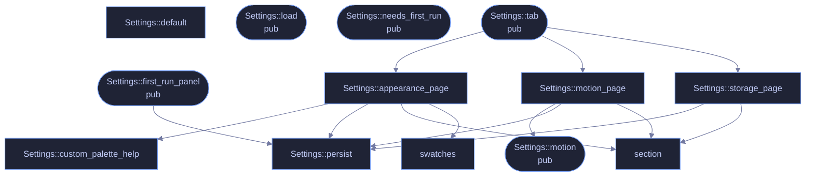

<!-- GENERATED by tools/docs/generate.py from the doc comments in the source. Do not edit: edit the .rs file and run the generator. -->

# `crates/veilvoice-gui/src/settings.rs`

[[veilvoice-gui|Crate-veilvoice-gui]] &middot; 706 lines &middot; [read the source](https://github.com/tilas01/veilvoice/blob/main/crates/veilvoice-gui/src/settings.rs)

## Contents

- [Why a menu rather than one long list](#why-a-menu-rather-than-one-long-list)
- [Every change applies immediately, and is saved immediately](#every-change-applies-immediately-and-is-saved-immediately)
- [What is deliberately not in here](#what-is-deliberately-not-in-here)
  - [What calls what](#what-calls-what)
  - [Items](#items)

The settings panel: a menu of pages, each a titled group of choices.

# Why a menu rather than one long list

There are three kinds of setting here and they answer different questions:
what the app *looks* like, how it *moves*, and what it does with the files
it writes. Stacked in one column they read as an undifferentiated wall of
tick boxes, and the one that matters most -- at-rest encryption -- ends up
looking exactly as important as the colour scheme. A menu with a page per
group keeps each question next to its own explanation.

# Every change applies immediately, and is saved immediately

There is no "apply" button and no "unsaved changes" state. Both are ways to
lose a choice silently. If saving fails the choice still applies for this
session and the panel says, in the panel, that it could not be remembered
and why -- rather than failing quietly and letting the setting reappear
wrong on the next launch.

# What is deliberately not in here

The app lock and the at-rest passphrase have their own tab and stay there.
A password field sitting between "animations" and "colour scheme" invites
being treated with the same weight, and it is not the same weight.

## What calls what

## Items

| Item | Line | Documentation |
|---|---:|---|
| `Page` pub enum | [35](https://github.com/tilas01/veilvoice/blob/main/crates/veilvoice-gui/src/settings.rs#L35) | Which page of the settings menu is showing. |
| `Page::ALL` pub const | [46](https://github.com/tilas01/veilvoice/blob/main/crates/veilvoice-gui/src/settings.rs#L46) | Every page, in menu order, with its label and one-line summary. |
| `Settings` pub struct | [54](https://github.com/tilas01/veilvoice/blob/main/crates/veilvoice-gui/src/settings.rs#L54) | The settings tab's own state. |
| `Settings::default` fn | [79](https://github.com/tilas01/veilvoice/blob/main/crates/veilvoice-gui/src/settings.rs#L79) |  |
| `Settings::load` pub fn | [98](https://github.com/tilas01/veilvoice/blob/main/crates/veilvoice-gui/src/settings.rs#L98) | Load preferences from this platform's config directory and apply the chosen theme to ctx. |
| `Settings::motion` pub fn | [124](https://github.com/tilas01/veilvoice/blob/main/crates/veilvoice-gui/src/settings.rs#L124) | How much movement is allowed this frame. |
| `Settings::needs_first_run` pub fn | [129](https://github.com/tilas01/veilvoice/blob/main/crates/veilvoice-gui/src/settings.rs#L129) | Whether the first-run choice has still to be made. |
| `Settings::persist` fn | [133](https://github.com/tilas01/veilvoice/blob/main/crates/veilvoice-gui/src/settings.rs#L133) |  |
| `Settings::first_run_panel` pub fn | [151](https://github.com/tilas01/veilvoice/blob/main/crates/veilvoice-gui/src/settings.rs#L151) | The first-run panel: offered once, with animation already on. |
| `Settings::tab` pub fn | [211](https://github.com/tilas01/veilvoice/blob/main/crates/veilvoice-gui/src/settings.rs#L211) | The settings tab. |
| `Settings::custom_palette_help` fn | [264](https://github.com/tilas01/veilvoice/blob/main/crates/veilvoice-gui/src/settings.rs#L264) | Explain where custom palettes go, and say what was refused and why. |
| `Settings::appearance_page` fn | [327](https://github.com/tilas01/veilvoice/blob/main/crates/veilvoice-gui/src/settings.rs#L327) |  |
| `Settings::motion_page` fn | [364](https://github.com/tilas01/veilvoice/blob/main/crates/veilvoice-gui/src/settings.rs#L364) |  |
| `Settings::storage_page` fn | [439](https://github.com/tilas01/veilvoice/blob/main/crates/veilvoice-gui/src/settings.rs#L439) |  |
| `section` fn | [500](https://github.com/tilas01/veilvoice/blob/main/crates/veilvoice-gui/src/settings.rs#L500) | A titled group with a one-line explanation under it. |
| `swatches` fn | [508](https://github.com/tilas01/veilvoice/blob/main/crates/veilvoice-gui/src/settings.rs#L508) | The active palette, as a row of swatches, so the choice can be seen rather than only read. |
