<!-- GENERATED by tools/docs/generate.py from the doc comments in the source. Do not edit: edit the .rs file and run the generator. -->

# `crates/veilvoice-gui/src/setup.rs`

[[veilvoice-gui|Crate-veilvoice-gui]] &middot; 707 lines &middot; [read the source](https://github.com/tilas01/veilvoice/blob/main/crates/veilvoice-gui/src/setup.rs)

## Contents

- [Portable is the default, and this tab says so first](#portable-is-the-default-and-this-tab-says-so-first)
- [Nothing is ticked, because there is nothing to tick](#nothing-is-ticked-because-there-is-nothing-to-tick)
- [Nothing slow runs on the UI thread](#nothing-slow-runs-on-the-ui-thread)
  - [What calls what](#what-calls-what)
  - [Items](#items)

The setup tab: install this copy, undo that, and the optional companions.

This is the graphical front end to `veilvoice_setup`, and it is a *front
end* in the strict sense — it holds no installation logic of its own. Every
change to the machine goes through the same functions `veilvoice install`
calls, so the careful part (editing `PATH`, which is the one operation here
that can damage a machine) has one implementation and one set of tests.

# Portable is the default, and this tab says so first

The screen opens by telling the user what they already have: a portable
copy that needs nothing, or an installed one. Installing is offered as a
convenience with an exact list of what it will change, not as a step
somebody has to complete before the program is usable. A privacy tool that
implies it must be installed has trained its user badly.

# Nothing is ticked, because there is nothing to tick

The companions are not a checklist with defaults. Each is a row that states
what the software is, who wrote it and under what licence, whether it was
found on this machine, and a single button that does one thing to one named
program. There is no "install recommended extras", because that is the
control through which unwanted software historically arrived.

Where the answer is a proprietary driver the button opens the vendor's page
and nothing else; where it needs root the command is shown and not run.
Both of those refusals live in `veilvoice_setup::companions`, not here, so
that a second front end cannot be more permissive than this one.

# Nothing slow runs on the UI thread

Copying binaries, editing the registry and running a package manager all
take real time — a package manager can take minutes. Each runs on a worker
and reports back through an `std::sync::mpsc` channel, exactly as the file
job in `crate::VeilVoiceApp` does, so the window keeps painting and the
progress strip keeps moving.

The strip honours the reduced-motion decision like everything else: with
motion off it is a static bar and a word, not a frozen animation.

## What this file contains

707 lines defining **13 functions** (4 public), **3 types** and **0 constants**. Everything below is read out of the source, so it cannot disagree with the code.

**The types it owns.**

- `struct Done` (line 49) -- What a worker finished doing: lines to show, and whether it went well.
- `struct Row` (line 55) -- One companion as this tab needs it: the facts, plus what was found.
- `struct Setup` (line 62) -- The setup tab's state.

**What happens when it runs.** These are the ways in: public, and nothing else in this file calls them, so they are what an outside caller reaches first.

- `Setup::is_busy` (line 94) -- True while a worker is running, so the app can keep repainting.
- `Setup::tab` (line 132) -- Draw the tab.
  - reaches: `companion_rows`, `install_controls`, `poll`, `where_this_copy_lives`, `detect_all`, `start`, `install_changes`, `progress`, `field`

## What calls what

_Colour key: **entry** -- a way in: public, and nothing in this file calls it; **api** -- public, and also used inside this file; **helper** -- private to this file._

```mermaid
%%{init: {"theme":"base","themeVariables":{"background":"#1a1b26","primaryColor":"#1f2335","primaryTextColor":"#c0caf5","primaryBorderColor":"#7aa2f7","secondaryColor":"#16161e","tertiaryColor":"#16161e","lineColor":"#737aa2","textColor":"#c0caf5","mainBkg":"#1f2335","nodeBorder":"#7aa2f7","clusterBkg":"#16161e","clusterBorder":"#2f3549","fontFamily":"ui-monospace, SFMono-Regular, Consolas, monospace","fontSize":"14px"}}}%%
flowchart TD
    n_default["Setup::default<br/>line 75"]
    n_new["Setup::new<br/>line 82"]
    n_is_busy(["Setup::is_busy<br/>line 94"])
    n_poll["Setup::poll<br/>line 102"]
    n_tab(["Setup::tab<br/>line 132"])
    n_where_this_copy_lives["Setup::where_this_copy_lives<br/>line 155"]
    n_install_controls["Setup::install_controls<br/>line 221"]
    n_start["Setup::start<br/>line 326"]
    n_progress["Setup::progress<br/>line 350"]
    n_companion_rows["Setup::companion_rows<br/>line 390"]
    n_detect_all["detect_all<br/>line 547"]
    n_install_changes["install_changes<br/>line 563"]
    n_field["field<br/>line 575"]
    n_companion_rows --> n_detect_all
    n_companion_rows --> n_start
    n_default --> n_new
    n_install_controls --> n_install_changes
    n_install_controls --> n_progress
    n_install_controls --> n_start
    n_new --> n_detect_all
    n_poll --> n_detect_all
    n_tab --> n_companion_rows
    n_tab --> n_install_controls
    n_tab --> n_poll
    n_tab --> n_where_this_copy_lives
    n_where_this_copy_lives --> n_field
    click n_default href "https://github.com/tilas01/veilvoice/blob/main/crates/veilvoice-gui/src/setup.rs#L75" "open the source"
    click n_new href "https://github.com/tilas01/veilvoice/blob/main/crates/veilvoice-gui/src/setup.rs#L82" "open the source"
    click n_is_busy href "https://github.com/tilas01/veilvoice/blob/main/crates/veilvoice-gui/src/setup.rs#L94" "open the source"
    click n_poll href "https://github.com/tilas01/veilvoice/blob/main/crates/veilvoice-gui/src/setup.rs#L102" "open the source"
    click n_tab href "https://github.com/tilas01/veilvoice/blob/main/crates/veilvoice-gui/src/setup.rs#L132" "open the source"
    click n_where_this_copy_lives href "https://github.com/tilas01/veilvoice/blob/main/crates/veilvoice-gui/src/setup.rs#L155" "open the source"
    click n_install_controls href "https://github.com/tilas01/veilvoice/blob/main/crates/veilvoice-gui/src/setup.rs#L221" "open the source"
    click n_start href "https://github.com/tilas01/veilvoice/blob/main/crates/veilvoice-gui/src/setup.rs#L326" "open the source"
    click n_progress href "https://github.com/tilas01/veilvoice/blob/main/crates/veilvoice-gui/src/setup.rs#L350" "open the source"
    click n_companion_rows href "https://github.com/tilas01/veilvoice/blob/main/crates/veilvoice-gui/src/setup.rs#L390" "open the source"
    click n_detect_all href "https://github.com/tilas01/veilvoice/blob/main/crates/veilvoice-gui/src/setup.rs#L547" "open the source"
    click n_install_changes href "https://github.com/tilas01/veilvoice/blob/main/crates/veilvoice-gui/src/setup.rs#L563" "open the source"
    click n_field href "https://github.com/tilas01/veilvoice/blob/main/crates/veilvoice-gui/src/setup.rs#L575" "open the source"
    classDef entry fill:#1f2335,stroke:#7aa2f7,color:#c0caf5
    class n_is_busy,n_tab entry
    classDef api fill:#1f2335,stroke:#7dcfff,color:#c0caf5
    class n_new,n_poll api
    classDef helper fill:#1f2335,stroke:#bb9af7,color:#c0caf5
    class n_default,n_where_this_copy_lives,n_install_controls,n_start,n_progress,n_companion_rows,n_detect_all,n_install_changes,n_field helper
```

## Items

| Item | Line | Documentation |
|---|---:|---|
| `Done` struct | [49](https://github.com/tilas01/veilvoice/blob/main/crates/veilvoice-gui/src/setup.rs#L49) | What a worker finished doing: lines to show, and whether it went well. |
| `Row` struct | [55](https://github.com/tilas01/veilvoice/blob/main/crates/veilvoice-gui/src/setup.rs#L55) | One companion as this tab needs it: the facts, plus what was found. |
| `Setup` pub struct | [62](https://github.com/tilas01/veilvoice/blob/main/crates/veilvoice-gui/src/setup.rs#L62) | The setup tab's state. |
| `Setup::default` fn | [75](https://github.com/tilas01/veilvoice/blob/main/crates/veilvoice-gui/src/setup.rs#L75) |  |
| `Setup::new` pub fn | [82](https://github.com/tilas01/veilvoice/blob/main/crates/veilvoice-gui/src/setup.rs#L82) | Read the machine's current state. |
| `Setup::is_busy` pub fn | [94](https://github.com/tilas01/veilvoice/blob/main/crates/veilvoice-gui/src/setup.rs#L94) | True while a worker is running, so the app can keep repainting. |
| `Setup::poll` pub fn | [102](https://github.com/tilas01/veilvoice/blob/main/crates/veilvoice-gui/src/setup.rs#L102) | Drain the worker channel. |
| `Setup::tab` pub fn | [132](https://github.com/tilas01/veilvoice/blob/main/crates/veilvoice-gui/src/setup.rs#L132) | Draw the tab. |
| `Setup::where_this_copy_lives` fn | [155](https://github.com/tilas01/veilvoice/blob/main/crates/veilvoice-gui/src/setup.rs#L155) |  |
| `Setup::install_controls` fn | [221](https://github.com/tilas01/veilvoice/blob/main/crates/veilvoice-gui/src/setup.rs#L221) |  |
| `Setup::start` fn | [326](https://github.com/tilas01/veilvoice/blob/main/crates/veilvoice-gui/src/setup.rs#L326) | Start a worker, and remember what it is doing so the strip can say. |
| `Setup::progress` fn | [350](https://github.com/tilas01/veilvoice/blob/main/crates/veilvoice-gui/src/setup.rs#L350) | The progress strip: a travelling highlight, or a plain bar when motion is off. |
| `Setup::companion_rows` fn | [390](https://github.com/tilas01/veilvoice/blob/main/crates/veilvoice-gui/src/setup.rs#L390) |  |
| `detect_all` fn | [547](https://github.com/tilas01/veilvoice/blob/main/crates/veilvoice-gui/src/setup.rs#L547) | Probe for every companion that applies to this platform. |
| `install_changes` fn | [563](https://github.com/tilas01/veilvoice/blob/main/crates/veilvoice-gui/src/setup.rs#L563) | Exactly what an install changes, in the order it changes it. |
| `field` fn | [575](https://github.com/tilas01/veilvoice/blob/main/crates/veilvoice-gui/src/setup.rs#L575) |  |
