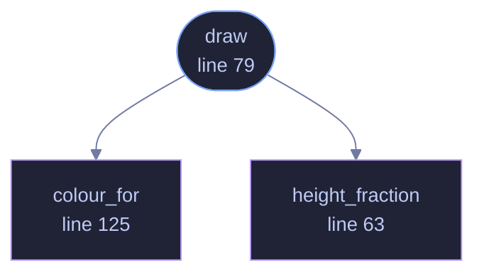

<!-- GENERATED by tools/docs/generate.py from the doc comments in the source. Do not edit: edit the .rs file and run the generator. -->

# `crates/veilvoice-gui/src/soundbar.rs`

[[veilvoice-gui|Crate-veilvoice-gui]] &middot; 360 lines &middot; [read the source](https://github.com/tilas01/veilvoice/blob/main/crates/veilvoice-gui/src/soundbar.rs)

## Contents

- [The same mark as the website](#the-same-mark-as-the-website)
- [Why it is drawn rather than rendered from a GIF](#why-it-is-drawn-rather-than-rendered-from-a-gif)
- [Cost when it is switched off](#cost-when-it-is-switched-off)
- [In plain words](#in-plain-words)
  - [What calls what](#what-calls-what)
  - [Items](#items)

The animated mark: a row of bars that rise and fall.

# The same mark as the website

`website/index.html` draws this in CSS as `.veil` -- a row of ``s with
`@keyframes pulse` taking each between 16% and 82% of the height over
1.9 seconds, each with its own delay so the row ripples rather than pumping
in unison. The left half is drawn in the accent colour and the right half in
the "veiled" secondary, which is the product in one picture and matches the
icon.

This is that, in egui, with the same period, the same height range and the
same delays. Two front-ends showing visibly different marks would be worse
than one showing none.

# Why it is drawn rather than rendered from a GIF

An animated image would be a committed binary blob, and this project's
artwork is generated from source precisely so that nothing in the repository
has to be taken on trust. Sixty lines of shape drawing is auditable; a GIF
is not.

# Cost when it is switched off

With motion disabled the bars are drawn once, at rest, and **no repaint is
requested**. That is the part that matters: an "off" switch that still
schedules a frame every 16 ms has turned the animation off visually and left
the battery cost behind. The caller decides by passing a `Motion`, and the
only way to animate is to ask for it.

# In plain words

The little row of bars in the corner that rises and falls.

It is the same mark the website uses, drawn rather than loaded as a picture, so
it takes the colours of whichever scheme you have chosen.

It stops moving if your system is set to reduce motion. That setting is a
request from somebody who has a reason for making it, and animation that
ignores it is animation that makes an application unusable for them.

## What this file contains

360 lines defining **3 functions** (1 public), **0 types** and **4 constants**. Everything below is read out of the source, so it cannot disagree with the code.

**What happens when it runs.** These are the ways in: public, and nothing else in this file calls them, so they are what an outside caller reaches first.

- `draw` (line 79) -- Draw the mark at size, returning the response so it can carry a tooltip.
  - reaches: `colour_for`, `height_fraction`

## What calls what

_Colour key: **entry** -- a way in: public, and nothing in this file calls it; **helper** -- private to this file._

  

The same graph as Mermaid source

## Items

| Item | Line | Documentation |
|---|---:|---|
| `PERIOD` const | [48](https://github.com/tilas01/veilvoice/blob/main/crates/veilvoice-gui/src/soundbar.rs#L48) | Seconds for one full rise and fall. |
| `DELAYS` const | [53](https://github.com/tilas01/veilvoice/blob/main/crates/veilvoice-gui/src/soundbar.rs#L53) | Per-bar phase offsets in seconds, matching the animation-delay values in website/index.html. |
| `MIN_FRACTION` const | [58](https://github.com/tilas01/veilvoice/blob/main/crates/veilvoice-gui/src/soundbar.rs#L58) | Height as a fraction of the available box, matching 16% and 82%. |
| `MAX_FRACTION` const | [59](https://github.com/tilas01/veilvoice/blob/main/crates/veilvoice-gui/src/soundbar.rs#L59) |  |
| `height_fraction` fn | [63](https://github.com/tilas01/veilvoice/blob/main/crates/veilvoice-gui/src/soundbar.rs#L63) | How far along its cycle a bar is, in 0..=1, eased the way CSS ease-in-out eases. |
| `draw` pub fn | [79](https://github.com/tilas01/veilvoice/blob/main/crates/veilvoice-gui/src/soundbar.rs#L79) | Draw the mark at size, returning the response so it can carry a tooltip. |
| `colour_for` fn | [125](https://github.com/tilas01/veilvoice/blob/main/crates/veilvoice-gui/src/soundbar.rs#L125) | The left half in the accent colour, the right in the veiled secondary -- the same split the website and the icon use. |
