<!-- GENERATED by tools/docs/generate.py from the doc comments in the source. Do not edit: edit the .rs file and run the generator. -->

# `crates/veilvoice-gui/src/storage.rs`

[[veilvoice-gui|Crate-veilvoice-gui]] &middot; 611 lines &middot; [read the source](https://github.com/tilas01/veilvoice/blob/main/crates/veilvoice-gui/src/storage.rs)

## Contents

- [A destination, not a mode](#a-destination-not-a-mode)
- [Why a chosen destination can still be refused](#why-a-chosen-destination-can-still-be-refused)
- [Marker 84: detection will fail, and that is planned for](#marker-84-detection-will-fail-and-that-is-planned-for)
- [In plain words](#in-plain-words)
  - [What calls what](#what-calls-what)
  - [Items](#items)

Where veiled recordings are written, and the encrypted volume that may hold
them.

**Markers 82, 83 and 84.** `veilvoice_setup::volumes` finds what is
mounted; this decides what to do about it, remembers the answer, and refuses
to write anywhere the user has not confirmed.

# A destination, not a mode

With no destination chosen, a veiled recording lands beside the file it came
from, which is what VeilVoice has always done. With one chosen, it lands in
that directory instead, under the same name. That is the whole of the
feature: the encryption belongs entirely to Cryptomator or VeraCrypt, and
nothing here adds any of its own or claims to.

# Why a chosen destination can still be refused

Because of VeraCrypt's hidden volumes, and the refusal is the point rather
than an inconvenience. `veilvoice_setup::volumes::Hidden` carries the
whole argument; the short version is that writing into the outer volume of
a container that has a hidden one can destroy the hidden data, nothing can
tell the two apart from outside, and so the only safe behaviour is to ask
the person who knows and to write nothing until they have answered.

A destination whose question is unanswered is *not* silently downgraded to
writing beside the source. It blocks the job and says why. Falling back
quietly would put a veiled recording somewhere unencrypted while its owner
believed it was in a vault, which is the exact failure this exists to
prevent.

# Marker 84: detection will fail, and that is planned for

Portable installs, custom mount points, a platform neither tool supports.
The answer is not a silent fallback: it is a directory the user picks by
hand, a declaration of what kind of volume it is, and the same confirmation
before anything is written. A hand-picked destination is treated exactly
like a detected one, including the hidden-volume question.

# In plain words

Lets you send every veiled recording straight into a Cryptomator or
VeraCrypt folder, instead of leaving it next to the original.

If VeilVoice cannot find your folders it asks you to point at one. Either
way it asks, once, whether a VeraCrypt container has a hidden volume in it,
and will not write anything until you answer, because writing into the
wrong half of one of those can destroy what is hidden inside.

## What this file contains

611 lines defining **21 functions** (18 public), **2 types** and **0 constants**. Everything below is read out of the source, so it cannot disagree with the code.

**The types it owns.**

- `struct Destination` (line 55) -- The chosen place for veiled output, if there is one.
- `struct Storage` (line 165) -- Everything the window shows about encrypted storage.

**What happens when it runs.** These are the ways in: public, and nothing else in this file calls them, so they are what an outside caller reaches first.

- `Destination::from_prefs` (line 66) -- Rebuild a destination from what was written to the settings file.
  - reaches: `default`, `hidden_from_key`
- `Destination::to_prefs` (line 83) -- The three strings the settings file keeps.
  - reaches: `hidden_key`
- `Destination::ready` (line 98) -- Whether a job may start.
- `Destination::blocked` (line 103) -- Why a job may not start, for the button's tooltip.
- `Destination::place` (line 113) -- Where a recording should be written, given where it would have gone.
- `Destination::still_mounted` (line 133) -- Whether the volume is still mounted, judged against mounts.
- `Storage::refresh` (line 205) -- Look again at what is installed and mounted.
- `Storage::found` (line 218) -- What was found at the last refresh.
- `Storage::found_nothing` (line 224) -- Whether anything was found at all, which decides whether marker 84's guided path is the main offer or the fallback.
- `Storage::present` (line 229) -- Whether the chosen folder was there when this was last refreshed.
- `Storage::take_hand_picked` (line 234) -- Take a folder the user picked by hand, if the picker has answered.
- `Storage::pick_by_hand` (line 244) -- Start the folder picker for marker 84's guided path.
- `Storage::choose` (line 250) -- Choose one of the detected volumes.
- `Storage::clear` (line 258) -- Go back to writing beside the source file.
- `Storage::answer_hidden` (line 264) -- Answer the hidden-volume question for the chosen destination.
- `Storage::hand_picked_tool` (line 271) -- Which tool a hand-picked folder is being declared as.
- `Storage::presence` (line 276) -- Whether either tool was detected, for the guided text.
- `panel` (line 285) -- The encrypted-storage panel, drawn on the security tab.

## What calls what

_Colour key: **entry** -- a way in: public, and nothing in this file calls it; **helper** -- private to this file._

  

The same graph as Mermaid source

```mermaid
%%{init: {"theme":"base","themeVariables":{"background":"#1a1b26","primaryColor":"#1f2335","primaryTextColor":"#c0caf5","primaryBorderColor":"#7aa2f7","secondaryColor":"#16161e","tertiaryColor":"#16161e","lineColor":"#737aa2","textColor":"#c0caf5","mainBkg":"#1f2335","nodeBorder":"#7aa2f7","clusterBkg":"#16161e","clusterBorder":"#2f3549","fontFamily":"ui-monospace, SFMono-Regular, Consolas, monospace","fontSize":"14px"}}}%%
flowchart TD
    n_from_prefs(["Destination::from_prefs<br/>line 66"])
    n_to_prefs(["Destination::to_prefs<br/>line 83"])
    n_ready(["Destination::ready<br/>line 98"])
    n_blocked(["Destination::blocked<br/>line 103"])
    n_place(["Destination::place<br/>line 113"])
    n_still_mounted(["Destination::still_mounted<br/>line 133"])
    n_hidden_key["hidden_key<br/>line 141"]
    n_hidden_from_key["hidden_from_key<br/>line 155"]
    n_default["Storage::default<br/>line 187"]
    n_refresh(["Storage::refresh<br/>line 205"])
    n_found(["Storage::found<br/>line 218"])
    n_found_nothing(["Storage::found_nothing<br/>line 224"])
    n_present(["Storage::present<br/>line 229"])
    n_take_hand_picked(["Storage::take_hand_picked<br/>line 234"])
    n_pick_by_hand(["Storage::pick_by_hand<br/>line 244"])
    n_choose(["Storage::choose<br/>line 250"])
    n_clear(["Storage::clear<br/>line 258"])
    n_answer_hidden(["Storage::answer_hidden<br/>line 264"])
    n_hand_picked_tool(["Storage::hand_picked_tool<br/>line 271"])
    n_presence(["Storage::presence<br/>line 276"])
    n_panel(["panel<br/>line 285"])
    n_from_prefs --> n_default
    n_from_prefs --> n_hidden_from_key
    n_to_prefs --> n_hidden_key
    click n_from_prefs href "https://github.com/tilas01/veilvoice/blob/main/crates/veilvoice-gui/src/storage.rs#L66" "open the source"
    click n_to_prefs href "https://github.com/tilas01/veilvoice/blob/main/crates/veilvoice-gui/src/storage.rs#L83" "open the source"
    click n_ready href "https://github.com/tilas01/veilvoice/blob/main/crates/veilvoice-gui/src/storage.rs#L98" "open the source"
    click n_blocked href "https://github.com/tilas01/veilvoice/blob/main/crates/veilvoice-gui/src/storage.rs#L103" "open the source"
    click n_place href "https://github.com/tilas01/veilvoice/blob/main/crates/veilvoice-gui/src/storage.rs#L113" "open the source"
    click n_still_mounted href "https://github.com/tilas01/veilvoice/blob/main/crates/veilvoice-gui/src/storage.rs#L133" "open the source"
    click n_hidden_key href "https://github.com/tilas01/veilvoice/blob/main/crates/veilvoice-gui/src/storage.rs#L141" "open the source"
    click n_hidden_from_key href "https://github.com/tilas01/veilvoice/blob/main/crates/veilvoice-gui/src/storage.rs#L155" "open the source"
    click n_default href "https://github.com/tilas01/veilvoice/blob/main/crates/veilvoice-gui/src/storage.rs#L187" "open the source"
    click n_refresh href "https://github.com/tilas01/veilvoice/blob/main/crates/veilvoice-gui/src/storage.rs#L205" "open the source"
    click n_found href "https://github.com/tilas01/veilvoice/blob/main/crates/veilvoice-gui/src/storage.rs#L218" "open the source"
    click n_found_nothing href "https://github.com/tilas01/veilvoice/blob/main/crates/veilvoice-gui/src/storage.rs#L224" "open the source"
    click n_present href "https://github.com/tilas01/veilvoice/blob/main/crates/veilvoice-gui/src/storage.rs#L229" "open the source"
    click n_take_hand_picked href "https://github.com/tilas01/veilvoice/blob/main/crates/veilvoice-gui/src/storage.rs#L234" "open the source"
    click n_pick_by_hand href "https://github.com/tilas01/veilvoice/blob/main/crates/veilvoice-gui/src/storage.rs#L244" "open the source"
    click n_choose href "https://github.com/tilas01/veilvoice/blob/main/crates/veilvoice-gui/src/storage.rs#L250" "open the source"
    click n_clear href "https://github.com/tilas01/veilvoice/blob/main/crates/veilvoice-gui/src/storage.rs#L258" "open the source"
    click n_answer_hidden href "https://github.com/tilas01/veilvoice/blob/main/crates/veilvoice-gui/src/storage.rs#L264" "open the source"
    click n_hand_picked_tool href "https://github.com/tilas01/veilvoice/blob/main/crates/veilvoice-gui/src/storage.rs#L271" "open the source"
    click n_presence href "https://github.com/tilas01/veilvoice/blob/main/crates/veilvoice-gui/src/storage.rs#L276" "open the source"
    click n_panel href "https://github.com/tilas01/veilvoice/blob/main/crates/veilvoice-gui/src/storage.rs#L285" "open the source"
    classDef entry fill:#1f2335,stroke:#7aa2f7,color:#c0caf5
    class n_from_prefs,n_to_prefs,n_ready,n_blocked,n_place,n_still_mounted,n_refresh,n_found,n_found_nothing,n_present,n_take_hand_picked,n_pick_by_hand,n_choose,n_clear,n_answer_hidden,n_hand_picked_tool,n_presence,n_panel entry
    classDef helper fill:#1f2335,stroke:#bb9af7,color:#c0caf5
    class n_hidden_key,n_hidden_from_key,n_default helper
```

## Items

| Item | Line | Documentation |
|---|---:|---|
| `Destination` pub struct | [55](https://github.com/tilas01/veilvoice/blob/main/crates/veilvoice-gui/src/storage.rs#L55) | The chosen place for veiled output, if there is one. |
| `Destination::from_prefs` pub fn | [66](https://github.com/tilas01/veilvoice/blob/main/crates/veilvoice-gui/src/storage.rs#L66) | Rebuild a destination from what was written to the settings file. |
| `Destination::to_prefs` pub fn | [83](https://github.com/tilas01/veilvoice/blob/main/crates/veilvoice-gui/src/storage.rs#L83) | The three strings the settings file keeps. |
| `Destination::ready` pub fn | [98](https://github.com/tilas01/veilvoice/blob/main/crates/veilvoice-gui/src/storage.rs#L98) | Whether a job may start. |
| `Destination::blocked` pub fn | [103](https://github.com/tilas01/veilvoice/blob/main/crates/veilvoice-gui/src/storage.rs#L103) | Why a job may not start, for the button's tooltip. |
| `Destination::place` pub fn | [113](https://github.com/tilas01/veilvoice/blob/main/crates/veilvoice-gui/src/storage.rs#L113) | Where a recording should be written, given where it would have gone. |
| `Destination::still_mounted` pub fn | [133](https://github.com/tilas01/veilvoice/blob/main/crates/veilvoice-gui/src/storage.rs#L133) | Whether the volume is still mounted, judged against mounts. |
| `hidden_key` fn | [141](https://github.com/tilas01/veilvoice/blob/main/crates/veilvoice-gui/src/storage.rs#L141) | Stable settings-file spellings for Hidden. |
| `hidden_from_key` fn | [155](https://github.com/tilas01/veilvoice/blob/main/crates/veilvoice-gui/src/storage.rs#L155) | The reverse, defaulting to unanswered. |
| `Storage` pub struct | [165](https://github.com/tilas01/veilvoice/blob/main/crates/veilvoice-gui/src/storage.rs#L165) | Everything the window shows about encrypted storage. |
| `Storage::default` fn | [187](https://github.com/tilas01/veilvoice/blob/main/crates/veilvoice-gui/src/storage.rs#L187) |  |
| `Storage::refresh` pub fn | [205](https://github.com/tilas01/veilvoice/blob/main/crates/veilvoice-gui/src/storage.rs#L205) | Look again at what is installed and mounted. |
| `Storage::found` pub fn | [218](https://github.com/tilas01/veilvoice/blob/main/crates/veilvoice-gui/src/storage.rs#L218) | What was found at the last refresh. |
| `Storage::found_nothing` pub fn | [224](https://github.com/tilas01/veilvoice/blob/main/crates/veilvoice-gui/src/storage.rs#L224) | Whether anything was found at all, which decides whether marker 84's guided path is the main offer or the fallback. |
| `Storage::present` pub fn | [229](https://github.com/tilas01/veilvoice/blob/main/crates/veilvoice-gui/src/storage.rs#L229) | Whether the chosen folder was there when this was last refreshed. |
| `Storage::take_hand_picked` pub fn | [234](https://github.com/tilas01/veilvoice/blob/main/crates/veilvoice-gui/src/storage.rs#L234) | Take a folder the user picked by hand, if the picker has answered. |
| `Storage::pick_by_hand` pub fn | [244](https://github.com/tilas01/veilvoice/blob/main/crates/veilvoice-gui/src/storage.rs#L244) | Start the folder picker for marker 84's guided path. |
| `Storage::choose` pub fn | [250](https://github.com/tilas01/veilvoice/blob/main/crates/veilvoice-gui/src/storage.rs#L250) | Choose one of the detected volumes. |
| `Storage::clear` pub fn | [258](https://github.com/tilas01/veilvoice/blob/main/crates/veilvoice-gui/src/storage.rs#L258) | Go back to writing beside the source file. |
| `Storage::answer_hidden` pub fn | [264](https://github.com/tilas01/veilvoice/blob/main/crates/veilvoice-gui/src/storage.rs#L264) | Answer the hidden-volume question for the chosen destination. |
| `Storage::hand_picked_tool` pub fn | [271](https://github.com/tilas01/veilvoice/blob/main/crates/veilvoice-gui/src/storage.rs#L271) | Which tool a hand-picked folder is being declared as. |
| `Storage::presence` pub fn | [276](https://github.com/tilas01/veilvoice/blob/main/crates/veilvoice-gui/src/storage.rs#L276) | Whether either tool was detected, for the guided text. |
| `panel` pub fn | [285](https://github.com/tilas01/veilvoice/blob/main/crates/veilvoice-gui/src/storage.rs#L285) | The encrypted-storage panel, drawn on the security tab. |
