<!-- GENERATED by tools/docs/generate.py from the doc comments in the source. Do not edit: edit the .rs file and run the generator. -->

# `crates/veilvoice-gui/src/studio.rs`

[[veilvoice-gui|Crate-veilvoice-gui]] &middot; 1860 lines &middot; [read the source](https://github.com/tilas01/veilvoice/blob/main/crates/veilvoice-gui/src/studio.rs)

## Contents

- [Two tabs, one vault](#two-tabs-one-vault)
- [Marker 130: this is also where veiling as it runs happens](#marker-130-this-is-also-where-veiling-as-it-runs-happens)
- [The vault needs both passphrases, and asks for both here](#the-vault-needs-both-passphrases-and-asks-for-both-here)
- [What is recorded is what comes out, unless it was asked to be otherwise](#what-is-recorded-is-what-comes-out-unless-it-was-asked-to-be-otherwise)
- [In plain words](#in-plain-words)
  - [What calls what](#what-calls-what)
  - [Items](#items)

The Recording Studio and the Recording Browser.

# Two tabs, one vault

The Studio records; the Browser is what is in the vault afterwards. They are
one module because they are one vault, and a vault opened in two places is
two chances to get the unlocking wrong.

# Marker 130: this is also where veiling as it runs happens

Live scramble was a tab of its own, and it did not need to be. The Studio
has always recorded through the same `veilvoice_audio::LiveSession` that
tab ran, with the same engine and the same routing, so the two screens were
one act performed in two rooms: pick the devices over there, come here,
press record.

Two sessions was the part that was actually wrong. Veiling on one tab and
recording on the other opened the same microphone twice, and on the
platforms that allow that at all the second stream gets a copy of the input
nobody asked for. `Studio::start_session` is the only starter now, and a
test reads this crate's source and fails if a second one appears.

The voice half of the tab is drawn by the window rather than here, because
the device lists and the engine settings belong to the window. What lives
in this module is the session those controls drive, and everything about
the vault.

**The voice half works with the vault shut.** Veiling a call has never
needed a recording vault, and making somebody set one up before they could
disguise their voice on a call would be a worse program than the one that
had two tabs.

# The vault needs both passphrases, and asks for both here

`veilvoice_crypto::studio::StudioKey` is derived from the app lock **and**
the at-rest passphrase, and from neither alone. That is the whole point of
it: a laptop stolen while VeilVoice is unlocked opens nothing, because the
at-rest passphrase was never typed.

So this tab asks for both, every time, rather than reaching into whatever
the rest of the application happens to be holding. That is a deliberate
inconvenience:

- The app-lock secret is only kept for the session when
[`Sealing::AppLock`](crate::security::Sealing::AppLock) is chosen. Reading
it when it happens to be there, and prompting when it is not, would make
the vault's strength depend on an unrelated setting, and nobody would
know which they had.
- Prompting for both, always, is the only version of this whose security is
the same on every run.

Neither passphrase is stored. Both typing buffers are wiped the moment the
key is derived, and the derived key lives in page-locked memory for as long
as the vault is open. Locking the window closes the vault.

# What is recorded is what comes out, unless it was asked to be otherwise

The Studio records through
`veilvoice_audio::LiveSession::start_recording`,
which is the same path the command line uses, so the samples that reach the
recorder are the **veiled** ones. That is the default and it is what
`Keep::Veiled` means.

**Marker 131** adds the other two. The microphone can be kept as well, or
instead, and the reasoning for allowing it at all is on `Keep`: refusing
would not stop somebody who needs the real recording, it would move them to
a phone on the table, which is a plaintext file on a device with none of
this. What matters is that it is asked for rather than arrived at.

So it is a choice made **before** the button, never remembered between runs,
reset when the window locks, and stated in the same words the plaintext path
uses. The default is the safe one, and every path that has not been asked
for the microphone passes `None` where it would go.

Each recording is assembled inside a `veilvoice_crypto::Secret` and handed
straight to the vault to be sealed. Neither is ever a plain file, not even
briefly: an unveiled take is a recording of a real voice, and it is sealed
exactly as strongly as a veiled one.

# In plain words

Record here, and what you record is kept locked up. Opening the cupboard
needs both of your passwords at once, every time, which is what makes it
worth having.

What gets recorded is the disguised voice. You can ask for your real one as
well, or instead, and the screen tells you what that means before you start:
anybody who can open the cupboard can then hear who was talking.

## What this file contains

1860 lines defining **52 functions** (25 public), **6 types** and **0 constants**. Everything below is read out of the source, so it cannot disagree with the code.

**The types it owns.**

- `enum Phase` (line 126) -- What the Studio is doing.
- `struct Setup` (line 143) -- What a live session was started with.
- `struct Studio` (line 162) -- The Studio and the Browser.
- `enum Keep` (line 1568) -- Which side of the engine a take keeps.
- `enum Render` (line 1636) -- What a take is to be turned into.
- `enum Act` (line 1704) -- Something a browser row asked for.

**What happens when it runs.** These are the ways in: public, and nothing else in this file calls them, so they are what an outside caller reaches first.

- `Studio::is_open` (line 244) -- Whether the vault is open.
- `Studio::is_veiling` (line 261) -- Whether the veiled voice is going out.
- `Studio::levels` (line 272) -- The smoothed levels, for the monitor strip and for this tab.
- `Studio::trouble` (line 282) -- What the audio path last reported about itself, and whether it is new.
- `Studio::intruders` (line 289) -- The programs that took the microphone while this take has been running.
- `Studio::note_microphone_holders` (line 304) -- Record which programs are holding the microphone right now.
- `Studio::tick` (line 321) -- Read the session's counters, once a frame, and move the levels on.
  - reaches: `is_recording`
- `Studio::start_veiling` (line 351) -- Start veiling, keeping nothing.
  - reaches: `start_session`
- `Studio::close` (line 385) -- Shut the vault and forget the key.
  - reaches: `stop_veiling`, `finish_take`, `is_recording`, `counted_interruptions`, `store_take`, `length`
- `Studio::tab` (line 1016) -- The take half of the Recording Studio tab.
  - reaches: `is_previewing`, `keep_form`, `length`, `phase`, `say`, `shut_panel`, `start_take`, `stop_take`, `take_form`, `is_recording`, `unlock`, `start_session`
- `Studio::browser` (line 1108) -- The Recording Browser tab.
  - reaches: `apply`, `counted`, `decoy_panel`, `export`, `length`, `made_on`, `say`, `shut_panel`, `size`, `play`, `refresh`, `make_decoys`
- `Keep::wants_veiled` (line 1580) -- Whether the veiled voice is kept.
- `Keep::wants_plain` (line 1588) -- Whether the real voice is kept.
- `Keep::label` (line 1593) -- What this is called where it is chosen.
- `Keep::cost` (line 1607) -- What it costs, in the words the plaintext path uses.

## What calls what

_22 of 52 functions are drawn; the diagram is bounded at 22 so it stays readable._

_Colour key: **entry** -- a way in: public, and nothing in this file calls it; **api** -- public, and also used inside this file; **helper** -- private to this file._

  

The same graph as Mermaid source

```mermaid
%%{init: {"theme":"base","themeVariables":{"background":"#1a1b26","primaryColor":"#1f2335","primaryTextColor":"#c0caf5","primaryBorderColor":"#7aa2f7","secondaryColor":"#16161e","tertiaryColor":"#16161e","lineColor":"#737aa2","textColor":"#c0caf5","mainBkg":"#1f2335","nodeBorder":"#7aa2f7","clusterBkg":"#16161e","clusterBorder":"#2f3549","fontFamily":"ui-monospace, SFMono-Regular, Consolas, monospace","fontSize":"14px"}}}%%
flowchart TD
    n_into_secret["into_secret<br/>line 104"]
    n_default_dir["default_dir<br/>line 120"]
    n_is_recording["Studio::is_recording<br/>line 256"]
    n_is_previewing["Studio::is_previewing<br/>line 267"]
    n_tick(["Studio::tick<br/>line 321"])
    n_phase["Studio::phase<br/>line 338"]
    n_start_veiling(["Studio::start_veiling<br/>line 351"])
    n_stop_veiling["Studio::stop_veiling<br/>line 368"]
    n_close(["Studio::close<br/>line 385"])
    n_unlock["Studio::unlock<br/>line 412"]
    n_measure["Studio::measure<br/>line 477"]
    n_make_decoys["Studio::make_decoys<br/>line 490"]
    n_start_take["Studio::start_take<br/>line 534"]
    n_start_session["Studio::start_session<br/>line 560"]
    n_tab(["Studio::tab<br/>line 1016"])
    n_browser(["Studio::browser<br/>line 1108"])
    n_counted_interruptions["counted_interruptions<br/>line 1723"]
    n_counted_decoys["counted_decoys<br/>line 1732"]
    n_counted["counted<br/>line 1741"]
    n_made_on["made_on<br/>line 1754"]
    n_length["length<br/>line 1843"]
    n_size["size<br/>line 1849"]
    n_browser --> n_counted
    n_browser --> n_length
    n_browser --> n_made_on
    n_browser --> n_size
    n_close --> n_stop_veiling
    n_make_decoys --> n_counted_decoys
    n_make_decoys --> n_measure
    n_phase --> n_is_recording
    n_start_take --> n_start_session
    n_start_veiling --> n_start_session
    n_stop_veiling --> n_is_recording
    n_tab --> n_is_previewing
    n_tab --> n_length
    n_tab --> n_phase
    n_tab --> n_start_take
    n_tick --> n_is_recording
    n_unlock --> n_default_dir
    n_unlock --> n_into_secret
    n_unlock --> n_measure
    click n_into_secret href "https://github.com/tilas01/veilvoice/blob/main/crates/veilvoice-gui/src/studio.rs#L104" "open the source"
    click n_default_dir href "https://github.com/tilas01/veilvoice/blob/main/crates/veilvoice-gui/src/studio.rs#L120" "open the source"
    click n_is_recording href "https://github.com/tilas01/veilvoice/blob/main/crates/veilvoice-gui/src/studio.rs#L256" "open the source"
    click n_is_previewing href "https://github.com/tilas01/veilvoice/blob/main/crates/veilvoice-gui/src/studio.rs#L267" "open the source"
    click n_tick href "https://github.com/tilas01/veilvoice/blob/main/crates/veilvoice-gui/src/studio.rs#L321" "open the source"
    click n_phase href "https://github.com/tilas01/veilvoice/blob/main/crates/veilvoice-gui/src/studio.rs#L338" "open the source"
    click n_start_veiling href "https://github.com/tilas01/veilvoice/blob/main/crates/veilvoice-gui/src/studio.rs#L351" "open the source"
    click n_stop_veiling href "https://github.com/tilas01/veilvoice/blob/main/crates/veilvoice-gui/src/studio.rs#L368" "open the source"
    click n_close href "https://github.com/tilas01/veilvoice/blob/main/crates/veilvoice-gui/src/studio.rs#L385" "open the source"
    click n_unlock href "https://github.com/tilas01/veilvoice/blob/main/crates/veilvoice-gui/src/studio.rs#L412" "open the source"
    click n_measure href "https://github.com/tilas01/veilvoice/blob/main/crates/veilvoice-gui/src/studio.rs#L477" "open the source"
    click n_make_decoys href "https://github.com/tilas01/veilvoice/blob/main/crates/veilvoice-gui/src/studio.rs#L490" "open the source"
    click n_start_take href "https://github.com/tilas01/veilvoice/blob/main/crates/veilvoice-gui/src/studio.rs#L534" "open the source"
    click n_start_session href "https://github.com/tilas01/veilvoice/blob/main/crates/veilvoice-gui/src/studio.rs#L560" "open the source"
    click n_tab href "https://github.com/tilas01/veilvoice/blob/main/crates/veilvoice-gui/src/studio.rs#L1016" "open the source"
    click n_browser href "https://github.com/tilas01/veilvoice/blob/main/crates/veilvoice-gui/src/studio.rs#L1108" "open the source"
    click n_counted_interruptions href "https://github.com/tilas01/veilvoice/blob/main/crates/veilvoice-gui/src/studio.rs#L1723" "open the source"
    click n_counted_decoys href "https://github.com/tilas01/veilvoice/blob/main/crates/veilvoice-gui/src/studio.rs#L1732" "open the source"
    click n_counted href "https://github.com/tilas01/veilvoice/blob/main/crates/veilvoice-gui/src/studio.rs#L1741" "open the source"
    click n_made_on href "https://github.com/tilas01/veilvoice/blob/main/crates/veilvoice-gui/src/studio.rs#L1754" "open the source"
    click n_length href "https://github.com/tilas01/veilvoice/blob/main/crates/veilvoice-gui/src/studio.rs#L1843" "open the source"
    click n_size href "https://github.com/tilas01/veilvoice/blob/main/crates/veilvoice-gui/src/studio.rs#L1849" "open the source"
    classDef entry fill:#1f2335,stroke:#7aa2f7,color:#c0caf5
    class n_tick,n_start_veiling,n_close,n_tab,n_browser entry
    classDef api fill:#1f2335,stroke:#7dcfff,color:#c0caf5
    class n_default_dir,n_is_recording,n_is_previewing,n_stop_veiling,n_counted_interruptions,n_counted_decoys,n_counted,n_made_on,n_length,n_size api
    classDef helper fill:#1f2335,stroke:#bb9af7,color:#c0caf5
    class n_into_secret,n_phase,n_unlock,n_measure,n_make_decoys,n_start_take,n_start_session helper
```

## Items

| Item | Line | Documentation |
|---|---:|---|
| `into_secret` fn | [104](https://github.com/tilas01/veilvoice/blob/main/crates/veilvoice-gui/src/studio.rs#L104) | Move a typed passphrase into page-locked storage and wipe the buffer. |
| `default_dir` pub fn | [120](https://github.com/tilas01/veilvoice/blob/main/crates/veilvoice-gui/src/studio.rs#L120) | Where the vaults live: beside the lock file, in this platform's config directory. |
| `Phase` enum | [126](https://github.com/tilas01/veilvoice/blob/main/crates/veilvoice-gui/src/studio.rs#L126) | What the Studio is doing. |
| `Setup` struct | [143](https://github.com/tilas01/veilvoice/blob/main/crates/veilvoice-gui/src/studio.rs#L143) | What a live session was started with. |
| `Studio` pub struct | [162](https://github.com/tilas01/veilvoice/blob/main/crates/veilvoice-gui/src/studio.rs#L162) | The Studio and the Browser. |
| `Studio::is_open` pub fn | [244](https://github.com/tilas01/veilvoice/blob/main/crates/veilvoice-gui/src/studio.rs#L244) | Whether the vault is open. |
| `Studio::is_recording` pub fn | [256](https://github.com/tilas01/veilvoice/blob/main/crates/veilvoice-gui/src/studio.rs#L256) | Whether a take is being kept. |
| `Studio::is_veiling` pub fn | [261](https://github.com/tilas01/veilvoice/blob/main/crates/veilvoice-gui/src/studio.rs#L261) | Whether the veiled voice is going out. |
| `Studio::is_previewing` pub fn | [267](https://github.com/tilas01/veilvoice/blob/main/crates/veilvoice-gui/src/studio.rs#L267) | Whether what is going out is a preview to this machine's own output rather than to the chosen one. |
| `Studio::levels` pub fn | [272](https://github.com/tilas01/veilvoice/blob/main/crates/veilvoice-gui/src/studio.rs#L272) | The smoothed levels, for the monitor strip and for this tab. |
| `Studio::trouble` pub fn | [282](https://github.com/tilas01/veilvoice/blob/main/crates/veilvoice-gui/src/studio.rs#L282) | What the audio path last reported about itself, and whether it is new. |
| `Studio::intruders` pub fn | [289](https://github.com/tilas01/veilvoice/blob/main/crates/veilvoice-gui/src/studio.rs#L289) | The programs that took the microphone while this take has been running. |
| `Studio::note_microphone_holders` pub fn | [304](https://github.com/tilas01/veilvoice/blob/main/crates/veilvoice-gui/src/studio.rs#L304) | Record which programs are holding the microphone right now. |
| `Studio::tick` pub fn | [321](https://github.com/tilas01/veilvoice/blob/main/crates/veilvoice-gui/src/studio.rs#L321) | Read the session's counters, once a frame, and move the levels on. |
| `Studio::phase` fn | [338](https://github.com/tilas01/veilvoice/blob/main/crates/veilvoice-gui/src/studio.rs#L338) | What phase the take half of the tab is in. |
| `Studio::start_veiling` pub fn | [351](https://github.com/tilas01/veilvoice/blob/main/crates/veilvoice-gui/src/studio.rs#L351) | Start veiling, keeping nothing. |
| `Studio::stop_veiling` pub fn | [368](https://github.com/tilas01/veilvoice/blob/main/crates/veilvoice-gui/src/studio.rs#L368) | Stop the audio. |
| `Studio::close` pub fn | [385](https://github.com/tilas01/veilvoice/blob/main/crates/veilvoice-gui/src/studio.rs#L385) | Shut the vault and forget the key. |
| `Studio::unlock` fn | [412](https://github.com/tilas01/veilvoice/blob/main/crates/veilvoice-gui/src/studio.rs#L412) | Derive the key from both entries and open the vault. |
| `Studio::measure` fn | [477](https://github.com/tilas01/veilvoice/blob/main/crates/veilvoice-gui/src/studio.rs#L477) | Read the folder the vaults are in: how much room is free, and how many vaults are already there. |
| `Studio::make_decoys` fn | [490](https://github.com/tilas01/veilvoice/blob/main/crates/veilvoice-gui/src/studio.rs#L490) | Make count decoys beside the open vault. |
| `Studio::start_take` fn | [534](https://github.com/tilas01/veilvoice/blob/main/crates/veilvoice-gui/src/studio.rs#L534) | Start recording into the vault's holding area. |
| `Studio::start_session` fn | [560](https://github.com/tilas01/veilvoice/blob/main/crates/veilvoice-gui/src/studio.rs#L560) | Start, or restart, the live session setup describes. |
| `Studio::stop_take` fn | [627](https://github.com/tilas01/veilvoice/blob/main/crates/veilvoice-gui/src/studio.rs#L627) | Stop keeping, seal what was captured, and carry on veiling. |
| `Studio::finish_take` fn | [639](https://github.com/tilas01/veilvoice/blob/main/crates/veilvoice-gui/src/studio.rs#L639) | Stop recording and seal what was captured into the vault. |
| `Studio::store_take` fn | [728](https://github.com/tilas01/veilvoice/blob/main/crates/veilvoice-gui/src/studio.rs#L728) | Seal one recorder's audio into the vault under name. |
| `Studio::play` fn | [797](https://github.com/tilas01/veilvoice/blob/main/crates/veilvoice-gui/src/studio.rs#L797) | Play a take, straight out of the vault and out of locked memory. |
| `Studio::export` fn | [843](https://github.com/tilas01/veilvoice/blob/main/crates/veilvoice-gui/src/studio.rs#L843) | Turn a take into a page, a video, or both, in into. |
| `Studio::write_page` fn | [951](https://github.com/tilas01/veilvoice/blob/main/crates/veilvoice-gui/src/studio.rs#L951) | The player page, its subtitles, and the drawing they sit in. |
| `Studio::refresh` fn | [994](https://github.com/tilas01/veilvoice/blob/main/crates/veilvoice-gui/src/studio.rs#L994) | Re-read the listing from the vault. |
| `Studio::tab` pub fn | [1016](https://github.com/tilas01/veilvoice/blob/main/crates/veilvoice-gui/src/studio.rs#L1016) | The take half of the Recording Studio tab. |
| `Studio::browser` pub fn | [1108](https://github.com/tilas01/veilvoice/blob/main/crates/veilvoice-gui/src/studio.rs#L1108) | The Recording Browser tab. |
| `Studio::decoy_panel` fn | [1335](https://github.com/tilas01/veilvoice/blob/main/crates/veilvoice-gui/src/studio.rs#L1335) | The decoy panel, under the listing. |
| `Studio::shut_panel` fn | [1354](https://github.com/tilas01/veilvoice/blob/main/crates/veilvoice-gui/src/studio.rs#L1354) | The panel shown while the vault is shut, in both tabs. |
| `Studio::take_form` fn | [1414](https://github.com/tilas01/veilvoice/blob/main/crates/veilvoice-gui/src/studio.rs#L1414) | The name field for the next take. |
| `Studio::keep_form` fn | [1445](https://github.com/tilas01/veilvoice/blob/main/crates/veilvoice-gui/src/studio.rs#L1445) | Which side of the engine to keep, asked before anything starts. |
| `Studio::say` fn | [1475](https://github.com/tilas01/veilvoice/blob/main/crates/veilvoice-gui/src/studio.rs#L1475) | Show the last message, if there is one. |
| `Studio::apply` fn | [1486](https://github.com/tilas01/veilvoice/blob/main/crates/veilvoice-gui/src/studio.rs#L1486) | Carry out a row action. |
| `Keep` pub enum | [1568](https://github.com/tilas01/veilvoice/blob/main/crates/veilvoice-gui/src/studio.rs#L1568) | Which side of the engine a take keeps. |
| `Keep::wants_veiled` pub fn | [1580](https://github.com/tilas01/veilvoice/blob/main/crates/veilvoice-gui/src/studio.rs#L1580) | Whether the veiled voice is kept. |
| `Keep::wants_plain` pub fn | [1588](https://github.com/tilas01/veilvoice/blob/main/crates/veilvoice-gui/src/studio.rs#L1588) | Whether the real voice is kept. |
| `Keep::label` pub fn | [1593](https://github.com/tilas01/veilvoice/blob/main/crates/veilvoice-gui/src/studio.rs#L1593) | What this is called where it is chosen. |
| `Keep::cost` pub fn | [1607](https://github.com/tilas01/veilvoice/blob/main/crates/veilvoice-gui/src/studio.rs#L1607) | What it costs, in the words the plaintext path uses. |
| `Render` pub enum | [1636](https://github.com/tilas01/veilvoice/blob/main/crates/veilvoice-gui/src/studio.rs#L1636) | What a take is to be turned into. |
| `Render::wants_page` fn | [1646](https://github.com/tilas01/veilvoice/blob/main/crates/veilvoice-gui/src/studio.rs#L1646) |  |
| `Render::wants_video` fn | [1650](https://github.com/tilas01/veilvoice/blob/main/crates/veilvoice-gui/src/studio.rs#L1650) |  |
| `wav_shape` fn | [1661](https://github.com/tilas01/veilvoice/blob/main/crates/veilvoice-gui/src/studio.rs#L1661) | The sample rate and frame count a canonical WAV header states. |
| `plan_for` fn | [1685](https://github.com/tilas01/veilvoice/blob/main/crates/veilvoice-gui/src/studio.rs#L1685) | A one-speaker plan spanning a take. |
| `Act` enum | [1704](https://github.com/tilas01/veilvoice/blob/main/crates/veilvoice-gui/src/studio.rs#L1704) | Something a browser row asked for. |
| `counted_interruptions` pub fn | [1723](https://github.com/tilas01/veilvoice/blob/main/crates/veilvoice-gui/src/studio.rs#L1723) | "one interruption" or "three interruptions". |
| `counted_decoys` pub fn | [1732](https://github.com/tilas01/veilvoice/blob/main/crates/veilvoice-gui/src/studio.rs#L1732) | "One decoy" or "four decoys", so the interface does not say "1 decoys". |
| `counted` pub fn | [1741](https://github.com/tilas01/veilvoice/blob/main/crates/veilvoice-gui/src/studio.rs#L1741) | "One recording" or "four recordings", so the interface does not say "1 recordings". |
| `made_on` pub fn | [1754](https://github.com/tilas01/veilvoice/blob/main/crates/veilvoice-gui/src/studio.rs#L1754) | A Unix time as a date somebody reads. |
| `pcm16` fn | [1778](https://github.com/tilas01/veilvoice/blob/main/crates/veilvoice-gui/src/studio.rs#L1778) | Sixteen-bit PCM from a WAV, as the waveform drawer wants it. |
| `safe_stem` fn | [1793](https://github.com/tilas01/veilvoice/blob/main/crates/veilvoice-gui/src/studio.rs#L1793) | A file name built from what somebody called a recording. |
| `run_ffmpeg` fn | [1816](https://github.com/tilas01/veilvoice/blob/main/crates/veilvoice-gui/src/studio.rs#L1816) | Run ffmpeg to put the audio in a video with a black picture. |
| `length` pub fn | [1843](https://github.com/tilas01/veilvoice/blob/main/crates/veilvoice-gui/src/studio.rs#L1843) | A length in seconds, as m:ss, for somewhere a person reads. |
| `size` pub fn | [1849](https://github.com/tilas01/veilvoice/blob/main/crates/veilvoice-gui/src/studio.rs#L1849) | A size in bytes, rounded to something a person can compare. |
