<!-- GENERATED by tools/docs/generate.py from the doc comments in the source. Do not edit: edit the .rs file and run the generator. -->

# `crates/veilvoice-gui/src/studio.rs`

[[veilvoice-gui|Crate-veilvoice-gui]] &middot; 1563 lines &middot; [read the source](https://github.com/tilas01/veilvoice/blob/main/crates/veilvoice-gui/src/studio.rs)

## Contents

- [Two tabs, one vault](#two-tabs-one-vault)
- [The vault needs both passphrases, and asks for both here](#the-vault-needs-both-passphrases-and-asks-for-both-here)
- [What is recorded is what comes out, unless it was asked to be otherwise](#what-is-recorded-is-what-comes-out-unless-it-was-asked-to-be-otherwise)
- [In plain words](#in-plain-words)
  - [What calls what](#what-calls-what)
  - [Items](#items)

The Recording Studio and the Recording Browser.

# Two tabs, one vault

The Studio records; the Browser is what is in the vault afterwards. They are
one module because they are one vault, and a vault opened in two places is
two chances to get the unlocking wrong.

# The vault needs both passphrases, and asks for both here

`veilvoice_crypto::studio::StudioKey` is derived from the app lock **and**
the at-rest passphrase, and from neither alone. That is the whole point of
it: a laptop stolen while VeilVoice is unlocked opens nothing, because the
at-rest passphrase was never typed.

So this tab asks for both, every time, rather than reaching into whatever
the rest of the application happens to be holding. That is a deliberate
inconvenience:

- The app-lock secret is only kept for the session when
[`Sealing::AppLock`](crate::security::Sealing::AppLock) is chosen. Reading
it when it happens to be there, and prompting when it is not, would make
the vault's strength depend on an unrelated setting, and nobody would
know which they had.
- Prompting for both, always, is the only version of this whose security is
the same on every run.

Neither passphrase is stored. Both typing buffers are wiped the moment the
key is derived, and the derived key lives in page-locked memory for as long
as the vault is open. Locking the window closes the vault.

# What is recorded is what comes out, unless it was asked to be otherwise

The Studio records through
`veilvoice_audio::LiveSession::start_recording`,
which is the same path the command line uses, so the samples that reach the
recorder are the **veiled** ones. That is the default and it is what
`Keep::Veiled` means.

**Marker 131** adds the other two. The microphone can be kept as well, or
instead, and the reasoning for allowing it at all is on `Keep`: refusing
would not stop somebody who needs the real recording, it would move them to
a phone on the table, which is a plaintext file on a device with none of
this. What matters is that it is asked for rather than arrived at.

So it is a choice made **before** the button, never remembered between runs,
reset when the window locks, and stated in the same words the plaintext path
uses. The default is the safe one, and every path that has not been asked
for the microphone passes `None` where it would go.

Each recording is assembled inside a `veilvoice_crypto::Secret` and handed
straight to the vault to be sealed. Neither is ever a plain file, not even
briefly: an unveiled take is a recording of a real voice, and it is sealed
exactly as strongly as a veiled one.

# In plain words

Record here, and what you record is kept locked up. Opening the cupboard
needs both of your passwords at once, every time, which is what makes it
worth having.

What gets recorded is the disguised voice. You can ask for your real one as
well, or instead, and the screen tells you what that means before you start:
anybody who can open the cupboard can then hear who was talking.

## What this file contains

1563 lines defining **40 functions** (15 public), **5 types** and **0 constants**. Everything below is read out of the source, so it cannot disagree with the code.

**The types it owns.**

- `enum Phase` (line 102) -- What the Studio is doing.
- `struct Studio` (line 118) -- The Studio and the Browser.
- `enum Keep` (line 1285) -- Which side of the engine a take keeps.
- `enum Render` (line 1353) -- What a take is to be turned into.
- `enum Act` (line 1421) -- Something a browser row asked for.

**What happens when it runs.** These are the ways in: public, and nothing else in this file calls them, so they are what an outside caller reaches first.

- `Studio::is_open` (line 184) -- Whether the vault is open.
- `Studio::is_recording` (line 192) -- Whether a recording is running.
- `Studio::close` (line 211) -- Shut the vault and forget the key.
  - reaches: `finish_take`, `store_take`, `length`
- `Studio::tab` (line 745) -- The Recording Studio tab.
  - reaches: `finish_take`, `keep_form`, `length`, `phase`, `say`, `shut_panel`, `start_take`, `take_form`, `store_take`, `unlock`, `default_dir`, `into_secret`
- `Studio::browser` (line 825) -- The Recording Browser tab.
  - reaches: `apply`, `counted`, `decoy_panel`, `export`, `length`, `made_on`, `say`, `shut_panel`, `size`, `play`, `refresh`, `make_decoys`
- `Keep::wants_veiled` (line 1297) -- Whether the veiled voice is kept.
- `Keep::wants_plain` (line 1305) -- Whether the real voice is kept.
- `Keep::label` (line 1310) -- What this is called where it is chosen.
- `Keep::cost` (line 1324) -- What it costs, in the words the plaintext path uses.

## What calls what

_22 of 40 functions are drawn; the diagram is bounded at 22 so it stays readable._

_Colour key: **entry** -- a way in: public, and nothing in this file calls it; **api** -- public, and also used inside this file; **helper** -- private to this file._

  

The same graph as Mermaid source

```mermaid
%%{init: {"theme":"base","themeVariables":{"background":"#1a1b26","primaryColor":"#1f2335","primaryTextColor":"#c0caf5","primaryBorderColor":"#7aa2f7","secondaryColor":"#16161e","tertiaryColor":"#16161e","lineColor":"#737aa2","textColor":"#c0caf5","mainBkg":"#1f2335","nodeBorder":"#7aa2f7","clusterBkg":"#16161e","clusterBorder":"#2f3549","fontFamily":"ui-monospace, SFMono-Regular, Consolas, monospace","fontSize":"14px"}}}%%
flowchart TD
    n_into_secret["into_secret<br/>line 80"]
    n_default_dir["default_dir<br/>line 96"]
    n_phase["Studio::phase<br/>line 197"]
    n_close(["Studio::close<br/>line 211"])
    n_unlock["Studio::unlock<br/>line 239"]
    n_measure["Studio::measure<br/>line 304"]
    n_make_decoys["Studio::make_decoys<br/>line 317"]
    n_start_take["Studio::start_take<br/>line 361"]
    n_finish_take["Studio::finish_take<br/>line 414"]
    n_store_take["Studio::store_take<br/>line 463"]
    n_play["Studio::play<br/>line 532"]
    n_export["Studio::export<br/>line 578"]
    n_write_page["Studio::write_page<br/>line 686"]
    n_refresh["Studio::refresh<br/>line 729"]
    n_tab(["Studio::tab<br/>line 745"])
    n_browser(["Studio::browser<br/>line 825"])
    n_decoy_panel["Studio::decoy_panel<br/>line 1052"]
    n_counted_decoys["counted_decoys<br/>line 1435"]
    n_counted["counted<br/>line 1444"]
    n_made_on["made_on<br/>line 1457"]
    n_length["length<br/>line 1546"]
    n_size["size<br/>line 1552"]
    n_browser --> n_counted
    n_browser --> n_decoy_panel
    n_browser --> n_export
    n_browser --> n_length
    n_browser --> n_made_on
    n_browser --> n_size
    n_close --> n_finish_take
    n_decoy_panel --> n_make_decoys
    n_export --> n_write_page
    n_finish_take --> n_store_take
    n_make_decoys --> n_counted_decoys
    n_make_decoys --> n_measure
    n_store_take --> n_length
    n_tab --> n_finish_take
    n_tab --> n_length
    n_tab --> n_phase
    n_tab --> n_start_take
    n_unlock --> n_default_dir
    n_unlock --> n_into_secret
    n_unlock --> n_measure
    click n_into_secret href "https://github.com/tilas01/veilvoice/blob/main/crates/veilvoice-gui/src/studio.rs#L80" "open the source"
    click n_default_dir href "https://github.com/tilas01/veilvoice/blob/main/crates/veilvoice-gui/src/studio.rs#L96" "open the source"
    click n_phase href "https://github.com/tilas01/veilvoice/blob/main/crates/veilvoice-gui/src/studio.rs#L197" "open the source"
    click n_close href "https://github.com/tilas01/veilvoice/blob/main/crates/veilvoice-gui/src/studio.rs#L211" "open the source"
    click n_unlock href "https://github.com/tilas01/veilvoice/blob/main/crates/veilvoice-gui/src/studio.rs#L239" "open the source"
    click n_measure href "https://github.com/tilas01/veilvoice/blob/main/crates/veilvoice-gui/src/studio.rs#L304" "open the source"
    click n_make_decoys href "https://github.com/tilas01/veilvoice/blob/main/crates/veilvoice-gui/src/studio.rs#L317" "open the source"
    click n_start_take href "https://github.com/tilas01/veilvoice/blob/main/crates/veilvoice-gui/src/studio.rs#L361" "open the source"
    click n_finish_take href "https://github.com/tilas01/veilvoice/blob/main/crates/veilvoice-gui/src/studio.rs#L414" "open the source"
    click n_store_take href "https://github.com/tilas01/veilvoice/blob/main/crates/veilvoice-gui/src/studio.rs#L463" "open the source"
    click n_play href "https://github.com/tilas01/veilvoice/blob/main/crates/veilvoice-gui/src/studio.rs#L532" "open the source"
    click n_export href "https://github.com/tilas01/veilvoice/blob/main/crates/veilvoice-gui/src/studio.rs#L578" "open the source"
    click n_write_page href "https://github.com/tilas01/veilvoice/blob/main/crates/veilvoice-gui/src/studio.rs#L686" "open the source"
    click n_refresh href "https://github.com/tilas01/veilvoice/blob/main/crates/veilvoice-gui/src/studio.rs#L729" "open the source"
    click n_tab href "https://github.com/tilas01/veilvoice/blob/main/crates/veilvoice-gui/src/studio.rs#L745" "open the source"
    click n_browser href "https://github.com/tilas01/veilvoice/blob/main/crates/veilvoice-gui/src/studio.rs#L825" "open the source"
    click n_decoy_panel href "https://github.com/tilas01/veilvoice/blob/main/crates/veilvoice-gui/src/studio.rs#L1052" "open the source"
    click n_counted_decoys href "https://github.com/tilas01/veilvoice/blob/main/crates/veilvoice-gui/src/studio.rs#L1435" "open the source"
    click n_counted href "https://github.com/tilas01/veilvoice/blob/main/crates/veilvoice-gui/src/studio.rs#L1444" "open the source"
    click n_made_on href "https://github.com/tilas01/veilvoice/blob/main/crates/veilvoice-gui/src/studio.rs#L1457" "open the source"
    click n_length href "https://github.com/tilas01/veilvoice/blob/main/crates/veilvoice-gui/src/studio.rs#L1546" "open the source"
    click n_size href "https://github.com/tilas01/veilvoice/blob/main/crates/veilvoice-gui/src/studio.rs#L1552" "open the source"
    classDef entry fill:#1f2335,stroke:#7aa2f7,color:#c0caf5
    class n_close,n_tab,n_browser entry
    classDef api fill:#1f2335,stroke:#7dcfff,color:#c0caf5
    class n_default_dir,n_counted_decoys,n_counted,n_made_on,n_length,n_size api
    classDef helper fill:#1f2335,stroke:#bb9af7,color:#c0caf5
    class n_into_secret,n_phase,n_unlock,n_measure,n_make_decoys,n_start_take,n_finish_take,n_store_take,n_play,n_export,n_write_page,n_refresh,n_decoy_panel helper
```

## Items

| Item | Line | Documentation |
|---|---:|---|
| `into_secret` fn | [80](https://github.com/tilas01/veilvoice/blob/main/crates/veilvoice-gui/src/studio.rs#L80) | Move a typed passphrase into page-locked storage and wipe the buffer. |
| `default_dir` pub fn | [96](https://github.com/tilas01/veilvoice/blob/main/crates/veilvoice-gui/src/studio.rs#L96) | Where the vaults live: beside the lock file, in this platform's config directory. |
| `Phase` enum | [102](https://github.com/tilas01/veilvoice/blob/main/crates/veilvoice-gui/src/studio.rs#L102) | What the Studio is doing. |
| `Studio` pub struct | [118](https://github.com/tilas01/veilvoice/blob/main/crates/veilvoice-gui/src/studio.rs#L118) | The Studio and the Browser. |
| `Studio::is_open` pub fn | [184](https://github.com/tilas01/veilvoice/blob/main/crates/veilvoice-gui/src/studio.rs#L184) | Whether the vault is open. |
| `Studio::is_recording` pub fn | [192](https://github.com/tilas01/veilvoice/blob/main/crates/veilvoice-gui/src/studio.rs#L192) | Whether a recording is running. |
| `Studio::phase` fn | [197](https://github.com/tilas01/veilvoice/blob/main/crates/veilvoice-gui/src/studio.rs#L197) | What phase the tab is in. |
| `Studio::close` pub fn | [211](https://github.com/tilas01/veilvoice/blob/main/crates/veilvoice-gui/src/studio.rs#L211) | Shut the vault and forget the key. |
| `Studio::unlock` fn | [239](https://github.com/tilas01/veilvoice/blob/main/crates/veilvoice-gui/src/studio.rs#L239) | Derive the key from both entries and open the vault. |
| `Studio::measure` fn | [304](https://github.com/tilas01/veilvoice/blob/main/crates/veilvoice-gui/src/studio.rs#L304) | Read the folder the vaults are in: how much room is free, and how many vaults are already there. |
| `Studio::make_decoys` fn | [317](https://github.com/tilas01/veilvoice/blob/main/crates/veilvoice-gui/src/studio.rs#L317) | Make count decoys beside the open vault. |
| `Studio::start_take` fn | [361](https://github.com/tilas01/veilvoice/blob/main/crates/veilvoice-gui/src/studio.rs#L361) | Start recording into the vault's holding area. |
| `Studio::finish_take` fn | [414](https://github.com/tilas01/veilvoice/blob/main/crates/veilvoice-gui/src/studio.rs#L414) | Stop recording and seal what was captured into the vault. |
| `Studio::store_take` fn | [463](https://github.com/tilas01/veilvoice/blob/main/crates/veilvoice-gui/src/studio.rs#L463) | Seal one recorder's audio into the vault under name. |
| `Studio::play` fn | [532](https://github.com/tilas01/veilvoice/blob/main/crates/veilvoice-gui/src/studio.rs#L532) | Play a take, straight out of the vault and out of locked memory. |
| `Studio::export` fn | [578](https://github.com/tilas01/veilvoice/blob/main/crates/veilvoice-gui/src/studio.rs#L578) | Turn a take into a page, a video, or both, in into. |
| `Studio::write_page` fn | [686](https://github.com/tilas01/veilvoice/blob/main/crates/veilvoice-gui/src/studio.rs#L686) | The player page, its subtitles, and the drawing they sit in. |
| `Studio::refresh` fn | [729](https://github.com/tilas01/veilvoice/blob/main/crates/veilvoice-gui/src/studio.rs#L729) | Re-read the listing from the vault. |
| `Studio::tab` pub fn | [745](https://github.com/tilas01/veilvoice/blob/main/crates/veilvoice-gui/src/studio.rs#L745) | The Recording Studio tab. |
| `Studio::browser` pub fn | [825](https://github.com/tilas01/veilvoice/blob/main/crates/veilvoice-gui/src/studio.rs#L825) | The Recording Browser tab. |
| `Studio::decoy_panel` fn | [1052](https://github.com/tilas01/veilvoice/blob/main/crates/veilvoice-gui/src/studio.rs#L1052) | The decoy panel, under the listing. |
| `Studio::shut_panel` fn | [1071](https://github.com/tilas01/veilvoice/blob/main/crates/veilvoice-gui/src/studio.rs#L1071) | The panel shown while the vault is shut, in both tabs. |
| `Studio::take_form` fn | [1131](https://github.com/tilas01/veilvoice/blob/main/crates/veilvoice-gui/src/studio.rs#L1131) | The name field for the next take. |
| `Studio::keep_form` fn | [1162](https://github.com/tilas01/veilvoice/blob/main/crates/veilvoice-gui/src/studio.rs#L1162) | Which side of the engine to keep, asked before anything starts. |
| `Studio::say` fn | [1192](https://github.com/tilas01/veilvoice/blob/main/crates/veilvoice-gui/src/studio.rs#L1192) | Show the last message, if there is one. |
| `Studio::apply` fn | [1203](https://github.com/tilas01/veilvoice/blob/main/crates/veilvoice-gui/src/studio.rs#L1203) | Carry out a row action. |
| `Keep` pub enum | [1285](https://github.com/tilas01/veilvoice/blob/main/crates/veilvoice-gui/src/studio.rs#L1285) | Which side of the engine a take keeps. |
| `Keep::wants_veiled` pub fn | [1297](https://github.com/tilas01/veilvoice/blob/main/crates/veilvoice-gui/src/studio.rs#L1297) | Whether the veiled voice is kept. |
| `Keep::wants_plain` pub fn | [1305](https://github.com/tilas01/veilvoice/blob/main/crates/veilvoice-gui/src/studio.rs#L1305) | Whether the real voice is kept. |
| `Keep::label` pub fn | [1310](https://github.com/tilas01/veilvoice/blob/main/crates/veilvoice-gui/src/studio.rs#L1310) | What this is called where it is chosen. |
| `Keep::cost` pub fn | [1324](https://github.com/tilas01/veilvoice/blob/main/crates/veilvoice-gui/src/studio.rs#L1324) | What it costs, in the words the plaintext path uses. |
| `Render` pub enum | [1353](https://github.com/tilas01/veilvoice/blob/main/crates/veilvoice-gui/src/studio.rs#L1353) | What a take is to be turned into. |
| `Render::wants_page` fn | [1363](https://github.com/tilas01/veilvoice/blob/main/crates/veilvoice-gui/src/studio.rs#L1363) |  |
| `Render::wants_video` fn | [1367](https://github.com/tilas01/veilvoice/blob/main/crates/veilvoice-gui/src/studio.rs#L1367) |  |
| `wav_shape` fn | [1378](https://github.com/tilas01/veilvoice/blob/main/crates/veilvoice-gui/src/studio.rs#L1378) | The sample rate and frame count a canonical WAV header states. |
| `plan_for` fn | [1402](https://github.com/tilas01/veilvoice/blob/main/crates/veilvoice-gui/src/studio.rs#L1402) | A one-speaker plan spanning a take. |
| `Act` enum | [1421](https://github.com/tilas01/veilvoice/blob/main/crates/veilvoice-gui/src/studio.rs#L1421) | Something a browser row asked for. |
| `counted_decoys` pub fn | [1435](https://github.com/tilas01/veilvoice/blob/main/crates/veilvoice-gui/src/studio.rs#L1435) | "One decoy" or "four decoys", so the interface does not say "1 decoys". |
| `counted` pub fn | [1444](https://github.com/tilas01/veilvoice/blob/main/crates/veilvoice-gui/src/studio.rs#L1444) | "One recording" or "four recordings", so the interface does not say "1 recordings". |
| `made_on` pub fn | [1457](https://github.com/tilas01/veilvoice/blob/main/crates/veilvoice-gui/src/studio.rs#L1457) | A Unix time as a date somebody reads. |
| `pcm16` fn | [1481](https://github.com/tilas01/veilvoice/blob/main/crates/veilvoice-gui/src/studio.rs#L1481) | Sixteen-bit PCM from a WAV, as the waveform drawer wants it. |
| `safe_stem` fn | [1496](https://github.com/tilas01/veilvoice/blob/main/crates/veilvoice-gui/src/studio.rs#L1496) | A file name built from what somebody called a recording. |
| `run_ffmpeg` fn | [1519](https://github.com/tilas01/veilvoice/blob/main/crates/veilvoice-gui/src/studio.rs#L1519) | Run ffmpeg to put the audio in a video with a black picture. |
| `length` pub fn | [1546](https://github.com/tilas01/veilvoice/blob/main/crates/veilvoice-gui/src/studio.rs#L1546) | A length in seconds, as m:ss, for somewhere a person reads. |
| `size` pub fn | [1552](https://github.com/tilas01/veilvoice/blob/main/crates/veilvoice-gui/src/studio.rs#L1552) | A size in bytes, rounded to something a person can compare. |
