<!-- GENERATED by tools/docs/generate.py from the doc comments in the source. Do not edit: edit the .rs file and run the generator. -->

# `crates/veilvoice-gui/src/tour.rs`

[[veilvoice-gui|Crate-veilvoice-gui]] &middot; 579 lines &middot; [read the source](https://github.com/tilas01/veilvoice/blob/main/crates/veilvoice-gui/src/tour.rs)

## Contents

- [What it is for](#what-it-is-for)
- [Why it comes back after an upgrade](#why-it-comes-back-after-an-upgrade)
- [Portable or installed](#portable-or-installed)
- [It is drawn over the window, not instead of it](#it-is-drawn-over-the-window-not-instead-of-it)
- [It can be asked for again](#it-can-be-asked-for-again)
  - [What calls what](#what-calls-what)
  - [Items](#items)

The short tour on a first run, and after an upgrade.

# What it is for

The window has nine tabs and nothing said what any of them were. Somebody
opening this for the first time met a tab strip and had to guess, and two
of the nine, Monitor and Lock, are not what their names suggest to a person
who has not read the documentation.

So: one card per tab, one sentence each, skippable at any point, and gone
for good once seen. It is not a walkthrough with arrows pointing at
controls. It is the paragraph a person would have read in a manual, offered
at the moment they would have wanted it, and it takes about twenty seconds.

# Why it comes back after an upgrade

Only as far as the tabs that are new. A tour that replays in full on every
upgrade is a tour people learn to skip, and one that never comes back means
a tab added in a later release is never introduced to anybody who was
already a user.

What is stored is the list of tabs that were toured, not a "seen" flag and
not the version number. A flag cannot answer the question an upgrade asks,
and the version can only answer it indirectly: comparing versions tells you
*that* something changed, and the tab list tells you *what*, which is the
thing being shown. It also means a release that adds no tab shows nobody
anything, which is the common case and the right behaviour for it.

# Portable or installed

The last card says which one this copy is, in those words, because it is
the question behind "where did my settings go" and "why is it not in my
menu". It is a statement rather than a prompt: `Install` is a tab, the
decision is made there, and a tour is a bad place to ask somebody to commit
to anything.

# It is drawn over the window, not instead of it

**Roadmap item 171.** This used to replace the whole body of the window:
`update` drew the card and returned, so the tabs it was describing were not
on screen while it described them. A card saying what the Monitor tab is
for, with no Monitor tab visible anywhere, is a paragraph from a manual
rather than a tour of anything.

Now it is an `egui::Modal`: the window draws normally underneath, dimmed,
and the card sits over it. The reader can see the tab strip the card is
talking about. The backdrop takes the clicks, so nothing behind it can be
pressed by accident, and the tab strip is drawn disabled as well so that it
looks as unavailable as it is.

**Escape closes it and a click on the shade does not.** Those are usually
the same gesture on a modal, and they should not be here: a modal asks a
question and clicking away from it means "not now", where a tour is
something somebody is stepping through, and a misjudged click halfway along
should not throw away the half they have not seen. Escape is deliberate and
the buttons are deliberate. A stray click is not.

# It can be asked for again

Settings, under Interface. The stored tab list decides whether the tour
*offers* itself; it has nothing to say about whether somebody may ask for
it, and before this there was no way to ask. Somebody who skipped it on the
day they installed VeilVoice had no route back to it at all, which made the
skip button a permanent decision taken in the first thirty seconds.

A person asking gets every card, including the ones they have seen, because
"show me that again" is not a question about which tabs are new.

## What this file contains

579 lines defining **8 functions** (7 public), **2 types** and **3 constants**. Everything below is read out of the source, so it cannot disagree with the code.

**The types it owns.**

- `struct Tour` (line 173) -- Where the tour is up to.
- `enum Step` (line 353) -- What a frame of the card asked for.

**What happens when it runs.** These are the ways in: public, and nothing else in this file calls them, so they are what an outside caller reaches first.

- `all_keys` (line 181) -- Every tab key the tour knows, for storing once it has run.
- `Tour::start_new_only` (line 196) -- Start it showing only the cards whose tabs are not in known.
- `Tour::running` (line 211) -- Whether the tour is on screen.
- `Tour::restart` (line 228) -- Start it again from the beginning, because somebody asked.
  - reaches: `start`
- `Tour::overlay` (line 241) -- Draw the current card over the window.
  - reaches: `stop`, `this_copy`

## What calls what

_Colour key: **entry** -- a way in: public, and nothing in this file calls it; **api** -- public, and also used inside this file; **helper** -- private to this file._

  

The same graph as Mermaid source

```mermaid
%%{init: {"theme":"base","themeVariables":{"background":"#1a1b26","primaryColor":"#1f2335","primaryTextColor":"#c0caf5","primaryBorderColor":"#7aa2f7","secondaryColor":"#16161e","tertiaryColor":"#16161e","lineColor":"#737aa2","textColor":"#c0caf5","mainBkg":"#1f2335","nodeBorder":"#7aa2f7","clusterBkg":"#16161e","clusterBorder":"#2f3549","fontFamily":"ui-monospace, SFMono-Regular, Consolas, monospace","fontSize":"14px"}}}%%
flowchart TD
    n_all_keys(["all_keys<br/>line 181"])
    n_start["Tour::start<br/>line 187"]
    n_start_new_only(["Tour::start_new_only<br/>line 196"])
    n_running(["Tour::running<br/>line 211"])
    n_stop["Tour::stop<br/>line 216"]
    n_restart(["Tour::restart<br/>line 228"])
    n_overlay(["Tour::overlay<br/>line 241"])
    n_this_copy["this_copy<br/>line 367"]
    n_overlay --> n_stop
    n_overlay --> n_this_copy
    n_restart --> n_start
    click n_all_keys href "https://github.com/tilas01/veilvoice/blob/main/crates/veilvoice-gui/src/tour.rs#L181" "open the source"
    click n_start href "https://github.com/tilas01/veilvoice/blob/main/crates/veilvoice-gui/src/tour.rs#L187" "open the source"
    click n_start_new_only href "https://github.com/tilas01/veilvoice/blob/main/crates/veilvoice-gui/src/tour.rs#L196" "open the source"
    click n_running href "https://github.com/tilas01/veilvoice/blob/main/crates/veilvoice-gui/src/tour.rs#L211" "open the source"
    click n_stop href "https://github.com/tilas01/veilvoice/blob/main/crates/veilvoice-gui/src/tour.rs#L216" "open the source"
    click n_restart href "https://github.com/tilas01/veilvoice/blob/main/crates/veilvoice-gui/src/tour.rs#L228" "open the source"
    click n_overlay href "https://github.com/tilas01/veilvoice/blob/main/crates/veilvoice-gui/src/tour.rs#L241" "open the source"
    click n_this_copy href "https://github.com/tilas01/veilvoice/blob/main/crates/veilvoice-gui/src/tour.rs#L367" "open the source"
    classDef entry fill:#1f2335,stroke:#7aa2f7,color:#c0caf5
    class n_all_keys,n_start_new_only,n_running,n_restart,n_overlay entry
    classDef api fill:#1f2335,stroke:#7dcfff,color:#c0caf5
    class n_start,n_stop api
    classDef helper fill:#1f2335,stroke:#bb9af7,color:#c0caf5
    class n_this_copy helper
```

## Items

| Item | Line | Documentation |
|---|---:|---|
| `CARD_WIDTH` const | [80](https://github.com/tilas01/veilvoice/blob/main/crates/veilvoice-gui/src/tour.rs#L80) | How wide the card is allowed to get. |
| `CARD_HEIGHT_SHARE` const | [90](https://github.com/tilas01/veilvoice/blob/main/crates/veilvoice-gui/src/tour.rs#L90) | How much of the window's height the card may occupy before its text scrolls. |
| `CARDS` pub const | [97](https://github.com/tilas01/veilvoice/blob/main/crates/veilvoice-gui/src/tour.rs#L97) | One card: the tab it is about, and what that tab is for. |
| `Tour` pub struct | [173](https://github.com/tilas01/veilvoice/blob/main/crates/veilvoice-gui/src/tour.rs#L173) | Where the tour is up to. |
| `all_keys` pub fn | [181](https://github.com/tilas01/veilvoice/blob/main/crates/veilvoice-gui/src/tour.rs#L181) | Every tab key the tour knows, for storing once it has run. |
| `Tour::start` pub fn | [187](https://github.com/tilas01/veilvoice/blob/main/crates/veilvoice-gui/src/tour.rs#L187) | Start the tour from the beginning, showing every card. |
| `Tour::start_new_only` pub fn | [196](https://github.com/tilas01/veilvoice/blob/main/crates/veilvoice-gui/src/tour.rs#L196) | Start it showing only the cards whose tabs are not in known. |
| `Tour::running` pub fn | [211](https://github.com/tilas01/veilvoice/blob/main/crates/veilvoice-gui/src/tour.rs#L211) | Whether the tour is on screen. |
| `Tour::stop` pub fn | [216](https://github.com/tilas01/veilvoice/blob/main/crates/veilvoice-gui/src/tour.rs#L216) | Stop it. |
| `Tour::restart` pub fn | [228](https://github.com/tilas01/veilvoice/blob/main/crates/veilvoice-gui/src/tour.rs#L228) | Start it again from the beginning, because somebody asked. |
| `Tour::overlay` pub fn | [241](https://github.com/tilas01/veilvoice/blob/main/crates/veilvoice-gui/src/tour.rs#L241) | Draw the current card over the window. |
| `Step` enum | [353](https://github.com/tilas01/veilvoice/blob/main/crates/veilvoice-gui/src/tour.rs#L353) | What a frame of the card asked for. |
| `this_copy` fn | [367](https://github.com/tilas01/veilvoice/blob/main/crates/veilvoice-gui/src/tour.rs#L367) | The closing paragraph on the last card: which kind of copy this is. |
