<!-- GENERATED by tools/docs/generate.py from the doc comments in the source. Do not edit: edit the .rs file and run the generator. -->

# `crates/veilvoice-gui/src/tour.rs`

[[veilvoice-gui|Crate-veilvoice-gui]] &middot; 1237 lines &middot; [read the source](https://github.com/tilas01/veilvoice/blob/main/crates/veilvoice-gui/src/tour.rs)

## Contents

- [What it is for](#what-it-is-for)
- [It sets the application up as well as describing it](#it-sets-the-application-up-as-well-as-describing-it)
- [Why it comes back after an upgrade](#why-it-comes-back-after-an-upgrade)
- [Portable or installed](#portable-or-installed)
- [It is drawn over the window, not instead of it](#it-is-drawn-over-the-window-not-instead-of-it)
- [It can be asked for again](#it-can-be-asked-for-again)
  - [What calls what](#what-calls-what)
  - [Items](#items)

The short walkthrough on a first run, and after an upgrade.

# What it is for

The window has nine tabs and nothing said what any of them were. Somebody
opening this for the first time met a tab strip and had to guess, and two
of the nine, Monitor and Lock, are not what their names suggest to a person
who has not read the documentation.

So: a short stop on each, one sentence each, skippable at any point, and
gone for good once seen. It is the paragraph a person would have read in a
manual, offered at the moment they would have wanted it.

# It sets the application up as well as describing it

**Roadmap item 171.** Describing the tabs was all it did, and the things
worth deciding in the first minute of using VeilVoice -- a password on the
window, what happens to recordings as they are written, whether this copy
is installed -- were on tabs somebody had to go and find. A walkthrough
that says "there is a Lock tab" and stops there has told somebody where the
decision is rather than letting them take it.

The setup stops come first, before the descriptions of the tabs, because a
passphrase is a decision and a tab is a paragraph: somebody who reads four
sentences and closes the window should have been offered the decisions
first. See `Stage` for the order and `Already` for what is left out.

**It offers rather than acts, where acting is a commitment.** A password is
set here, because setting one is the whole point of asking and it can be
changed on the Lock tab afterwards. Installing this copy is not: it writes
to somewhere permanent, the Install tab says what it will write, and the
most a walkthrough does is put somebody in front of it. That is what
`Outcome::Finished` carries back.

**It adapts rather than asking twice.** A stop with nothing left to offer
is dropped before the walkthrough starts rather than shown greyed out: a
walkthrough whose steps are mostly already answered teaches people to press
next without reading, which is how the one that mattered gets missed.

# Why it comes back after an upgrade

Only as far as what is new. A tour that replays in full on every upgrade is
a tour people learn to skip, and one that never comes back means something
added in a later release is never introduced to anybody who was already a
user.

What is stored is the list of stops that were shown, not a "seen" flag and
not the version number. A flag cannot answer the question an upgrade asks,
and the version can only answer it indirectly: comparing versions tells you
*that* something changed, and the list tells you *what*, which is the thing
being shown. It also means a release that adds nothing shows nobody
anything, which is the common case and the right behaviour for it.

That list is also what carries the setup to the people who most need it.
Somebody who has had VeilVoice installed for a year has every tab key
stored and none of the setup ones, because the setup stops did not exist
when they last toured. They are exactly the person who has never been
offered an app lock, so the next launch offers them the setup, once, and
not one word about the tabs they have been using all year.

# Portable or installed

One of the stops says which one this copy is, in those words, because it is
the question behind "where did my settings go" and "why is it not in my
menu".

# It is drawn over the window, not instead of it

**Roadmap item 171.** This used to replace the whole body of the window:
`update` drew the card and returned, so the tabs it was describing were not
on screen while it described them. A card saying what the Monitor tab is
for, with no Monitor tab visible anywhere, is a paragraph from a manual
rather than a tour of anything.

Now it is an `egui::Modal`: the window draws normally underneath, dimmed,
and the card sits over it. The reader can see the tab strip the card is
talking about. The backdrop takes the clicks, so nothing behind it can be
pressed by accident, and the tab strip is drawn disabled as well so that it
looks as unavailable as it is.

**Escape closes it and a click on the shade does not.** Those are usually
the same gesture on a modal, and they should not be here: a modal asks a
question and clicking away from it means "not now", where a tour is
something somebody is stepping through, and a misjudged click halfway along
should not throw away the half they have not seen. Escape is deliberate and
the buttons are deliberate. A stray click is not.

**A passphrase typed here does not outlive the card it was typed into.**
Every way out of a stop wipes the fields, including the ways that did not
use them, because the field holds what somebody typed whether or not they
pressed the button.

# It can be asked for again

Settings, under Interface. The stored list decides whether the walkthrough
*offers* itself; it has nothing to say about whether somebody may ask for
it, and before this there was no way to ask. Somebody who skipped it on the
day they installed VeilVoice had no route back to it at all, which made the
skip button a permanent decision taken in the first thirty seconds.

A person asking gets every stop that applies, including the ones they have
seen, because "show me that again" is not a question about what is new.

## What this file contains

1237 lines defining **20 functions** (9 public), **5 types** and **3 constants**. Everything below is read out of the source, so it cannot disagree with the code.

**The types it owns.**

- `enum Stage` (line 214) -- One stop on the walkthrough.
- `struct Already` (line 281) -- What is already true, so the tour can leave out what it would only repeat.
- `struct Tour` (line 310) -- Where the tour is up to.
- `enum Outcome` (line 635) -- What the window should do once the tour is out of the way.
- `enum Press` (line 826) -- What a frame of the card asked for.

**What happens when it runs.** These are the ways in: public, and nothing else in this file calls them, so they are what an outside caller reaches first.

- `Stage::key` (line 239) -- The name this stop is remembered by.
- `all_keys` (line 332) -- Every stop's name, for storing once the tour has run.
  - reaches: `stages`
- `Tour::start_new_only` (line 361) -- Start it showing only the stops that are not in known.
  - reaches: `stages`
- `Tour::running` (line 378) -- Whether the tour is on screen.
- `Tour::restart` (line 411) -- Start it again from the beginning, because somebody asked.
  - reaches: `start`, `stages`
- `Tour::overlay` (line 426) -- Draw the current stop over the window.
  - reaches: `body`, `finished`, `stop`, `wipe`, `app_lock`, `at_rest`, `decoy`, `heading`, `install`, `settings_headings`, `secret`

## What calls what

_Colour key: **entry** -- a way in: public, and nothing in this file calls it; **api** -- public, and also used inside this file; **helper** -- private to this file._

  

The same graph as Mermaid source

```mermaid
%%{init: {"theme":"base","themeVariables":{"background":"#1a1b26","primaryColor":"#1f2335","primaryTextColor":"#c0caf5","primaryBorderColor":"#7aa2f7","secondaryColor":"#16161e","tertiaryColor":"#16161e","lineColor":"#737aa2","textColor":"#c0caf5","mainBkg":"#1f2335","nodeBorder":"#7aa2f7","clusterBkg":"#16161e","clusterBorder":"#2f3549","fontFamily":"ui-monospace, SFMono-Regular, Consolas, monospace","fontSize":"14px"}}}%%
flowchart TD
    n_key(["Stage::key<br/>line 239"])
    n_applies["Stage::applies<br/>line 257"]
    n_stages["stages<br/>line 296"]
    n_all_keys(["all_keys<br/>line 332"])
    n_start["Tour::start<br/>line 338"]
    n_start_new_only(["Tour::start_new_only<br/>line 361"])
    n_running(["Tour::running<br/>line 378"])
    n_stop["Tour::stop<br/>line 383"]
    n_wipe["Tour::wipe<br/>line 395"]
    n_restart(["Tour::restart<br/>line 411"])
    n_overlay(["Tour::overlay<br/>line 426"])
    n_body["Tour::body<br/>line 539"]
    n_app_lock["Tour::app_lock<br/>line 569"]
    n_finished["Outcome::finished<br/>line 652"]
    n_at_rest["at_rest<br/>line 663"]
    n_decoy["decoy<br/>line 713"]
    n_install["install<br/>line 732"]
    n_settings_headings["settings_headings<br/>line 786"]
    n_heading["heading<br/>line 802"]
    n_secret["secret<br/>line 808"]
    n_all_keys --> n_stages
    n_app_lock --> n_heading
    n_app_lock --> n_secret
    n_at_rest --> n_heading
    n_body --> n_app_lock
    n_body --> n_at_rest
    n_body --> n_decoy
    n_body --> n_heading
    n_body --> n_install
    n_body --> n_settings_headings
    n_decoy --> n_heading
    n_install --> n_heading
    n_overlay --> n_body
    n_overlay --> n_finished
    n_overlay --> n_stop
    n_overlay --> n_wipe
    n_restart --> n_start
    n_settings_headings --> n_heading
    n_start --> n_stages
    n_start_new_only --> n_stages
    n_stop --> n_wipe
    click n_key href "https://github.com/tilas01/veilvoice/blob/main/crates/veilvoice-gui/src/tour.rs#L239" "open the source"
    click n_applies href "https://github.com/tilas01/veilvoice/blob/main/crates/veilvoice-gui/src/tour.rs#L257" "open the source"
    click n_stages href "https://github.com/tilas01/veilvoice/blob/main/crates/veilvoice-gui/src/tour.rs#L296" "open the source"
    click n_all_keys href "https://github.com/tilas01/veilvoice/blob/main/crates/veilvoice-gui/src/tour.rs#L332" "open the source"
    click n_start href "https://github.com/tilas01/veilvoice/blob/main/crates/veilvoice-gui/src/tour.rs#L338" "open the source"
    click n_start_new_only href "https://github.com/tilas01/veilvoice/blob/main/crates/veilvoice-gui/src/tour.rs#L361" "open the source"
    click n_running href "https://github.com/tilas01/veilvoice/blob/main/crates/veilvoice-gui/src/tour.rs#L378" "open the source"
    click n_stop href "https://github.com/tilas01/veilvoice/blob/main/crates/veilvoice-gui/src/tour.rs#L383" "open the source"
    click n_wipe href "https://github.com/tilas01/veilvoice/blob/main/crates/veilvoice-gui/src/tour.rs#L395" "open the source"
    click n_restart href "https://github.com/tilas01/veilvoice/blob/main/crates/veilvoice-gui/src/tour.rs#L411" "open the source"
    click n_overlay href "https://github.com/tilas01/veilvoice/blob/main/crates/veilvoice-gui/src/tour.rs#L426" "open the source"
    click n_body href "https://github.com/tilas01/veilvoice/blob/main/crates/veilvoice-gui/src/tour.rs#L539" "open the source"
    click n_app_lock href "https://github.com/tilas01/veilvoice/blob/main/crates/veilvoice-gui/src/tour.rs#L569" "open the source"
    click n_finished href "https://github.com/tilas01/veilvoice/blob/main/crates/veilvoice-gui/src/tour.rs#L652" "open the source"
    click n_at_rest href "https://github.com/tilas01/veilvoice/blob/main/crates/veilvoice-gui/src/tour.rs#L663" "open the source"
    click n_decoy href "https://github.com/tilas01/veilvoice/blob/main/crates/veilvoice-gui/src/tour.rs#L713" "open the source"
    click n_install href "https://github.com/tilas01/veilvoice/blob/main/crates/veilvoice-gui/src/tour.rs#L732" "open the source"
    click n_settings_headings href "https://github.com/tilas01/veilvoice/blob/main/crates/veilvoice-gui/src/tour.rs#L786" "open the source"
    click n_heading href "https://github.com/tilas01/veilvoice/blob/main/crates/veilvoice-gui/src/tour.rs#L802" "open the source"
    click n_secret href "https://github.com/tilas01/veilvoice/blob/main/crates/veilvoice-gui/src/tour.rs#L808" "open the source"
    classDef entry fill:#1f2335,stroke:#7aa2f7,color:#c0caf5
    class n_key,n_all_keys,n_start_new_only,n_running,n_restart,n_overlay entry
    classDef api fill:#1f2335,stroke:#7dcfff,color:#c0caf5
    class n_stages,n_start,n_stop api
    classDef helper fill:#1f2335,stroke:#bb9af7,color:#c0caf5
    class n_applies,n_wipe,n_body,n_app_lock,n_finished,n_at_rest,n_decoy,n_install,n_settings_headings,n_heading,n_secret helper
```

## Items

| Item | Line | Documentation |
|---|---:|---|
| `CARD_WIDTH` const | [115](https://github.com/tilas01/veilvoice/blob/main/crates/veilvoice-gui/src/tour.rs#L115) | How wide the card is allowed to get. |
| `CARD_HEIGHT_SHARE` const | [125](https://github.com/tilas01/veilvoice/blob/main/crates/veilvoice-gui/src/tour.rs#L125) | How much of the window's height the card may occupy before its text scrolls. |
| `CARDS` pub const | [132](https://github.com/tilas01/veilvoice/blob/main/crates/veilvoice-gui/src/tour.rs#L132) | One card: the tab it is about, and what that tab is for. |
| `Stage` pub enum | [214](https://github.com/tilas01/veilvoice/blob/main/crates/veilvoice-gui/src/tour.rs#L214) | One stop on the walkthrough. |
| `Stage::key` pub fn | [239](https://github.com/tilas01/veilvoice/blob/main/crates/veilvoice-gui/src/tour.rs#L239) | The name this stop is remembered by. |
| `Stage::applies` fn | [257](https://github.com/tilas01/veilvoice/blob/main/crates/veilvoice-gui/src/tour.rs#L257) | Whether this stop has anything to say, given what is already set up. |
| `Already` pub struct | [281](https://github.com/tilas01/veilvoice/blob/main/crates/veilvoice-gui/src/tour.rs#L281) | What is already true, so the tour can leave out what it would only repeat. |
| `stages` pub fn | [296](https://github.com/tilas01/veilvoice/blob/main/crates/veilvoice-gui/src/tour.rs#L296) | Every stop, in the order a reader meets them. |
| `Tour` pub struct | [310](https://github.com/tilas01/veilvoice/blob/main/crates/veilvoice-gui/src/tour.rs#L310) | Where the tour is up to. |
| `all_keys` pub fn | [332](https://github.com/tilas01/veilvoice/blob/main/crates/veilvoice-gui/src/tour.rs#L332) | Every stop's name, for storing once the tour has run. |
| `Tour::start` pub fn | [338](https://github.com/tilas01/veilvoice/blob/main/crates/veilvoice-gui/src/tour.rs#L338) | Start the tour from the beginning, showing every stop that applies. |
| `Tour::start_new_only` pub fn | [361](https://github.com/tilas01/veilvoice/blob/main/crates/veilvoice-gui/src/tour.rs#L361) | Start it showing only the stops that are not in known. |
| `Tour::running` pub fn | [378](https://github.com/tilas01/veilvoice/blob/main/crates/veilvoice-gui/src/tour.rs#L378) | Whether the tour is on screen. |
| `Tour::stop` pub fn | [383](https://github.com/tilas01/veilvoice/blob/main/crates/veilvoice-gui/src/tour.rs#L383) | Stop it, and wipe anything typed into it. |
| `Tour::wipe` fn | [395](https://github.com/tilas01/veilvoice/blob/main/crates/veilvoice-gui/src/tour.rs#L395) | Clear the typed passphrase fields. |
| `Tour::restart` pub fn | [411](https://github.com/tilas01/veilvoice/blob/main/crates/veilvoice-gui/src/tour.rs#L411) | Start it again from the beginning, because somebody asked. |
| `Tour::overlay` pub fn | [426](https://github.com/tilas01/veilvoice/blob/main/crates/veilvoice-gui/src/tour.rs#L426) | Draw the current stop over the window. |
| `Tour::body` fn | [539](https://github.com/tilas01/veilvoice/blob/main/crates/veilvoice-gui/src/tour.rs#L539) | What one stop says, and what it offers. |
| `Tour::app_lock` fn | [569](https://github.com/tilas01/veilvoice/blob/main/crates/veilvoice-gui/src/tour.rs#L569) | The app lock, offered to somebody who has not set one. |
| `Outcome` pub enum | [635](https://github.com/tilas01/veilvoice/blob/main/crates/veilvoice-gui/src/tour.rs#L635) | What the window should do once the tour is out of the way. |
| `Outcome::finished` fn | [652](https://github.com/tilas01/veilvoice/blob/main/crates/veilvoice-gui/src/tour.rs#L652) | Finished, with nowhere in particular to go. |
| `at_rest` fn | [663](https://github.com/tilas01/veilvoice/blob/main/crates/veilvoice-gui/src/tour.rs#L663) | At-rest encryption: on, and what that means. |
| `decoy` fn | [713](https://github.com/tilas01/veilvoice/blob/main/crates/veilvoice-gui/src/tour.rs#L713) | The decoy passphrase: what it is, and what it is not. |
| `install` fn | [732](https://github.com/tilas01/veilvoice/blob/main/crates/veilvoice-gui/src/tour.rs#L732) | Installed or portable, and the offer that follows from it. |
| `settings_headings` fn | [786](https://github.com/tilas01/veilvoice/blob/main/crates/veilvoice-gui/src/tour.rs#L786) | Every heading in Settings, and what it covers. |
| `heading` fn | [802](https://github.com/tilas01/veilvoice/blob/main/crates/veilvoice-gui/src/tour.rs#L802) | A stop's title. |
| `secret` fn | [808](https://github.com/tilas01/veilvoice/blob/main/crates/veilvoice-gui/src/tour.rs#L808) | A password field. |
| `Press` enum | [826](https://github.com/tilas01/veilvoice/blob/main/crates/veilvoice-gui/src/tour.rs#L826) | What a frame of the card asked for. |
