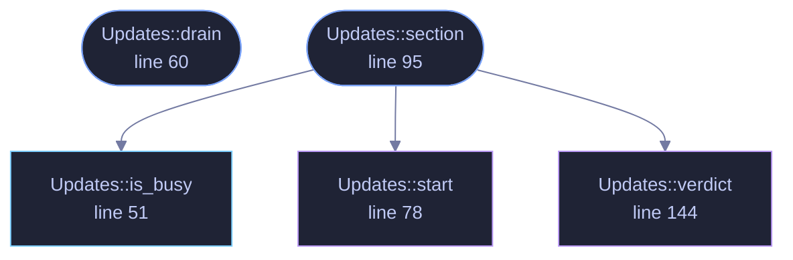

<!-- GENERATED by tools/docs/generate.py from the doc comments in the source. Do not edit: edit the .rs file and run the generator. -->

# `crates/veilvoice-gui/src/updates.rs`

[[veilvoice-gui|Crate-veilvoice-gui]] &middot; 246 lines &middot; [read the source](https://github.com/tilas01/veilvoice/blob/main/crates/veilvoice-gui/src/updates.rs)

## Contents

- [It runs on a thread, and the window never waits for it](#it-runs-on-a-thread-and-the-window-never-waits-for-it)
- [Nothing here is automatic](#nothing-here-is-automatic)
- [In plain words](#in-plain-words)
  - [What calls what](#what-calls-what)
  - [Items](#items)

The manual update check, as the window shows it.

`veilvoice_update` does the asking and states what the answer is worth.
This is the button, the spinner and the result — and the rule that the
button is the only thing that ever starts it.

# It runs on a thread, and the window never waits for it

The check runs a subprocess and waits for a network round trip. On a captive
portal that is the full ten-second timeout. `update()` may read, paint and
*start* work; it may never wait for any — locked decision 15, and the reason
this application was reported as freezing every couple of seconds once
already. So the button spawns a thread, the thread sends one message down a
channel, and the window drains that channel once a frame and moves on.

# Nothing here is automatic

There is no timer, no check at startup, and no "check again" on a schedule.
`Updates` holds no clock. The only path into `veilvoice_update::check` is
a click, and a test asserts the state a freshly built panel is in.

# In plain words

The update check, as a button you press.

VeilVoice never checks on its own and never contacts anything unless you ask.
An update check that runs by itself is a message to somebody else's server
saying that this copy exists and is running now.

When you do press it, it compares your version against the newest published one
and tells you what it found, including that the answer only tells you what a
release page says.

## What this file contains

246 lines defining **5 functions** (3 public), **1 type** and **0 constants**. Everything below is read out of the source, so it cannot disagree with the code.

**The types it owns.**

- `struct Updates` (line 42) -- The panel's state.

**What happens when it runs.** These are the ways in: public, and nothing else in this file calls them, so they are what an outside caller reaches first.

- `Updates::drain` (line 60) -- Take the worker's answer if it has one.
- `Updates::section` (line 95) -- The whole section, as it appears under "about".
  - reaches: `is_busy`, `start`, `verdict`

## What calls what

_Colour key: **entry** -- a way in: public, and nothing in this file calls it; **api** -- public, and also used inside this file; **helper** -- private to this file._

  

The same graph as Mermaid source

## Items

| Item | Line | Documentation |
|---|---:|---|
| `Updates` pub struct | [42](https://github.com/tilas01/veilvoice/blob/main/crates/veilvoice-gui/src/updates.rs#L42) | The panel's state. |
| `Updates::is_busy` pub fn | [51](https://github.com/tilas01/veilvoice/blob/main/crates/veilvoice-gui/src/updates.rs#L51) | Whether a check is running, so the app knows to keep repainting. |
| `Updates::drain` pub fn | [60](https://github.com/tilas01/veilvoice/blob/main/crates/veilvoice-gui/src/updates.rs#L60) | Take the worker's answer if it has one. |
| `Updates::start` fn | [78](https://github.com/tilas01/veilvoice/blob/main/crates/veilvoice-gui/src/updates.rs#L78) | Start a check. |
| `Updates::section` pub fn | [95](https://github.com/tilas01/veilvoice/blob/main/crates/veilvoice-gui/src/updates.rs#L95) | The whole section, as it appears under "about". |
| `Updates::verdict` fn | [144](https://github.com/tilas01/veilvoice/blob/main/crates/veilvoice-gui/src/updates.rs#L144) | The answer itself, in the colour it deserves. |
