<!-- GENERATED by tools/docs/generate.py from the doc comments in the source. Do not edit: edit the .rs file and run the generator. -->

# `crates/veilvoice-gui/src/verify.rs`

[[veilvoice-gui|Crate-veilvoice-gui]] &middot; 1739 lines &middot; [read the source](https://github.com/tilas01/veilvoice/blob/main/crates/veilvoice-gui/src/verify.rs)

## Contents

- [Why this exists here rather than in the verifier](#why-this-exists-here-rather-than-in-the-verifier)
- [Three files, and the tab says so before it is given any](#three-files-and-the-tab-says-so-before-it-is-given-any)
- [Roadmap item 97: one press, three answers](#roadmap-item-97-one-press-three-answers)
- [Nothing here downloads anything](#nothing-here-downloads-anything)
- [In plain words](#in-plain-words)
  - [What calls what](#what-calls-what)
  - [Items](#items)

The verify tab: drop a download on the window and be told what it is.

# Why this exists here rather than in the verifier

The ask was drag-and-drop verification. There were two ways to have it:
link `eframe` into `veilvoice-verify`, or move the checking out of that
binary so both front ends call the same code.

The portable verifier is the one program in this project whose *smallness*
is a feature: it is what somebody downloads before they trust anything
else here, and a 1.5 MB single file is part of why it is checkable at all.
Putting a GUI toolkit in it would have cost that for a convenience the
desktop application was already the right place for. So the arithmetic
moved to `veilvoice_verify::check` and this is a second caller, not a second
implementation.

# Three files, and the tab says so before it is given any

Verifying needs the download, the `SHA256SUMS` and the `SHA256SUMS.asc`.
Dropping one file on a window and getting a verdict would be a lie, and an
interface that discovers the other two are missing *after* the drop teaches
people that verification is fiddly rather than that it needs three things.
All three slots are visible from the start, and a drop fills whichever one
the file's name says it is.

# Roadmap item 97: one press, three answers

The tab used to answer one question, and it was not the question somebody
actually has. "Is this zip the published one" is a step; "is the program I
am about to run the published one" is the thing they want to know, and it
was being left to the command line.

So one press now checks the archive against the signed hash list, then every
file extracted out of that archive against the signed contents list the
release publishes beside it, and then runs the GnuPG on this machine over
the same signature and shows what it said. Three answers, one button, and
each one drawn separately so a pass on one is never mistaken for a pass on
another.

Two things are deliberately **not** failures. A release that published no
contents list -- everything before v0.1.15 -- simply has no such row, rather
than a warning about a file that was never meant to be there. And a GnuPG
that cannot run on this machine is drawn in the quiet colour: it is a fact
about the computer and says nothing whatever about the download.

# Nothing here downloads anything

Not even the key: it is compiled in, and its fingerprint is checked against
a constant a reader can compare with the README. `veilvoice-verify` is
still the tool for fetching a release, because it is the one that can be
checked before it is run.

# In plain words

Drop a download on the window and be told whether it is genuine.

It checks the signature over the list of hashes first, and only then compares
your file against that list. That order matters: a list of hashes that has not
been checked is just some numbers somebody sent you.

Drop the downloaded archive and the hash list and signature sitting beside it
are picked up on their own. Nothing is downloaded and nothing leaves the
machine.

One press checks the zip, then every file you unzipped out of it, and then
asks your own GnuPG the same question and shows you its answer.

## What this file contains

1739 lines defining **25 functions** (7 public), **5 types** and **5 constants**. Everything below is read out of the source, so it cannot disagree with the code.

**The types it owns.**

- `enum Slot` (line 79) -- Which of the three files a dropped path is.
- `struct Report` (line 114) -- Everything one press of check found out.
- `struct Contents` (line 127) -- What the extracted folder turned out to hold.
- `struct Gnupg` (line 142) -- What this machine's GnuPG said.
- `struct Verify` (line 160) -- The tab's state.

**What happens when it runs.** These are the ways in: public, and nothing else in this file calls them, so they are what an outside caller reaches first.

- `Verify::wants_repaint` (line 265) -- Whether the window has to keep drawing for this panel's sake.
- `Verify::drain` (line 270) -- Take the worker's answer if it has one.
- `Verify::take_dropped` (line 362) -- Read what the window was given this frame.
  - reaches: `accept`, `fill_from_beside`, `slot_for`
- `Verify::tab` (line 380) -- The whole tab.
  - reaches: `body`, `checker_section`, `drop_target`, `found_beside`, `gnupg_section`, `is_busy`, `slot_row`, `start`, `verdict`, `copyable_command`, `poll_survey`, `start_survey`

## What calls what

_22 of 25 functions are drawn; the diagram is bounded at 22 so it stays readable._

_Colour key: **entry** -- a way in: public, and nothing in this file calls it; **api** -- public, and also used inside this file; **helper** -- private to this file._

  

The same graph as Mermaid source

```mermaid
%%{init: {"theme":"base","themeVariables":{"background":"#1a1b26","primaryColor":"#1f2335","primaryTextColor":"#c0caf5","primaryBorderColor":"#7aa2f7","secondaryColor":"#16161e","tertiaryColor":"#16161e","lineColor":"#737aa2","textColor":"#c0caf5","mainBkg":"#1f2335","nodeBorder":"#7aa2f7","clusterBkg":"#16161e","clusterBorder":"#2f3549","fontFamily":"ui-monospace, SFMono-Regular, Consolas, monospace","fontSize":"14px"}}}%%
flowchart TD
    n_slot_for["slot_for<br/>line 92"]
    n_is_busy["Verify::is_busy<br/>line 255"]
    n_accept["Verify::accept<br/>line 291"]
    n_fill_from_beside["Verify::fill_from_beside<br/>line 321"]
    n_found_beside["Verify::found_beside<br/>line 343"]
    n_take_dropped(["Verify::take_dropped<br/>line 362"])
    n_tab(["Verify::tab<br/>line 380"])
    n_body["Verify::body<br/>line 392"]
    n_drop_target["Verify::drop_target<br/>line 538"]
    n_slot_row["Verify::slot_row<br/>line 574"]
    n_gnupg_section["Verify::gnupg_section<br/>line 637"]
    n_start_survey["Verify::start_survey<br/>line 761"]
    n_poll_survey["Verify::poll_survey<br/>line 782"]
    n_checker_section["Verify::checker_section<br/>line 800"]
    n_copyable_command["Verify::copyable_command<br/>line 922"]
    n_verdict["Verify::verdict<br/>line 934"]
    n_contents_verdict["Verify::contents_verdict<br/>line 945"]
    n_gnupg_verdict["Verify::gnupg_verdict<br/>line 992"]
    n_archive_verdict["Verify::archive_verdict<br/>line 1030"]
    n_start["Verify::start<br/>line 1089"]
    n_examine["examine<br/>line 1112"]
    n_examine_contents["examine_contents<br/>line 1146"]
    n_accept --> n_fill_from_beside
    n_accept --> n_slot_for
    n_body --> n_checker_section
    n_body --> n_drop_target
    n_body --> n_found_beside
    n_body --> n_gnupg_section
    n_body --> n_is_busy
    n_body --> n_slot_row
    n_body --> n_start
    n_body --> n_verdict
    n_checker_section --> n_copyable_command
    n_checker_section --> n_poll_survey
    n_checker_section --> n_start_survey
    n_examine --> n_examine_contents
    n_start --> n_examine
    n_tab --> n_body
    n_take_dropped --> n_accept
    n_verdict --> n_archive_verdict
    n_verdict --> n_contents_verdict
    n_verdict --> n_gnupg_verdict
    click n_slot_for href "https://github.com/tilas01/veilvoice/blob/main/crates/veilvoice-gui/src/verify.rs#L92" "open the source"
    click n_is_busy href "https://github.com/tilas01/veilvoice/blob/main/crates/veilvoice-gui/src/verify.rs#L255" "open the source"
    click n_accept href "https://github.com/tilas01/veilvoice/blob/main/crates/veilvoice-gui/src/verify.rs#L291" "open the source"
    click n_fill_from_beside href "https://github.com/tilas01/veilvoice/blob/main/crates/veilvoice-gui/src/verify.rs#L321" "open the source"
    click n_found_beside href "https://github.com/tilas01/veilvoice/blob/main/crates/veilvoice-gui/src/verify.rs#L343" "open the source"
    click n_take_dropped href "https://github.com/tilas01/veilvoice/blob/main/crates/veilvoice-gui/src/verify.rs#L362" "open the source"
    click n_tab href "https://github.com/tilas01/veilvoice/blob/main/crates/veilvoice-gui/src/verify.rs#L380" "open the source"
    click n_body href "https://github.com/tilas01/veilvoice/blob/main/crates/veilvoice-gui/src/verify.rs#L392" "open the source"
    click n_drop_target href "https://github.com/tilas01/veilvoice/blob/main/crates/veilvoice-gui/src/verify.rs#L538" "open the source"
    click n_slot_row href "https://github.com/tilas01/veilvoice/blob/main/crates/veilvoice-gui/src/verify.rs#L574" "open the source"
    click n_gnupg_section href "https://github.com/tilas01/veilvoice/blob/main/crates/veilvoice-gui/src/verify.rs#L637" "open the source"
    click n_start_survey href "https://github.com/tilas01/veilvoice/blob/main/crates/veilvoice-gui/src/verify.rs#L761" "open the source"
    click n_poll_survey href "https://github.com/tilas01/veilvoice/blob/main/crates/veilvoice-gui/src/verify.rs#L782" "open the source"
    click n_checker_section href "https://github.com/tilas01/veilvoice/blob/main/crates/veilvoice-gui/src/verify.rs#L800" "open the source"
    click n_copyable_command href "https://github.com/tilas01/veilvoice/blob/main/crates/veilvoice-gui/src/verify.rs#L922" "open the source"
    click n_verdict href "https://github.com/tilas01/veilvoice/blob/main/crates/veilvoice-gui/src/verify.rs#L934" "open the source"
    click n_contents_verdict href "https://github.com/tilas01/veilvoice/blob/main/crates/veilvoice-gui/src/verify.rs#L945" "open the source"
    click n_gnupg_verdict href "https://github.com/tilas01/veilvoice/blob/main/crates/veilvoice-gui/src/verify.rs#L992" "open the source"
    click n_archive_verdict href "https://github.com/tilas01/veilvoice/blob/main/crates/veilvoice-gui/src/verify.rs#L1030" "open the source"
    click n_start href "https://github.com/tilas01/veilvoice/blob/main/crates/veilvoice-gui/src/verify.rs#L1089" "open the source"
    click n_examine href "https://github.com/tilas01/veilvoice/blob/main/crates/veilvoice-gui/src/verify.rs#L1112" "open the source"
    click n_examine_contents href "https://github.com/tilas01/veilvoice/blob/main/crates/veilvoice-gui/src/verify.rs#L1146" "open the source"
    classDef entry fill:#1f2335,stroke:#7aa2f7,color:#c0caf5
    class n_take_dropped,n_tab entry
    classDef api fill:#1f2335,stroke:#7dcfff,color:#c0caf5
    class n_is_busy,n_accept,n_found_beside api
    classDef helper fill:#1f2335,stroke:#bb9af7,color:#c0caf5
    class n_slot_for,n_fill_from_beside,n_body,n_drop_target,n_slot_row,n_gnupg_section,n_start_survey,n_poll_survey,n_checker_section,n_copyable_command,n_verdict,n_contents_verdict,n_gnupg_verdict,n_archive_verdict,n_start,n_examine,n_examine_contents helper
```

## Items

| Item | Line | Documentation |
|---|---:|---|
| `Slot` enum | [79](https://github.com/tilas01/veilvoice/blob/main/crates/veilvoice-gui/src/verify.rs#L79) | Which of the three files a dropped path is. |
| `slot_for` fn | [92](https://github.com/tilas01/veilvoice/blob/main/crates/veilvoice-gui/src/verify.rs#L92) | Work out what a dropped file is from its name. |
| `Report` pub struct | [114](https://github.com/tilas01/veilvoice/blob/main/crates/veilvoice-gui/src/verify.rs#L114) | Everything one press of check found out. |
| `Contents` pub struct | [127](https://github.com/tilas01/veilvoice/blob/main/crates/veilvoice-gui/src/verify.rs#L127) | What the extracted folder turned out to hold. |
| `Gnupg` pub struct | [142](https://github.com/tilas01/veilvoice/blob/main/crates/veilvoice-gui/src/verify.rs#L142) | What this machine's GnuPG said. |
| `Verify` pub struct | [160](https://github.com/tilas01/veilvoice/blob/main/crates/veilvoice-gui/src/verify.rs#L160) | The tab's state. |
| `COPIED_FOR` const | [229](https://github.com/tilas01/veilvoice/blob/main/crates/veilvoice-gui/src/verify.rs#L229) | How long the copy button says "copied", in seconds. |
| `RELEASES_PAGE` const | [235](https://github.com/tilas01/veilvoice/blob/main/crates/veilvoice-gui/src/verify.rs#L235) | Where every release, and the files published beside it, actually are. |
| `SIGNING_KEY_IN_REPO` const | [239](https://github.com/tilas01/veilvoice/blob/main/crates/veilvoice-gui/src/verify.rs#L239) | The signing key, in the repository as well as in each release, so it can be fetched from somewhere other than the release being checked. |
| `SLOT_LABEL_WIDTH` const | [244](https://github.com/tilas01/veilvoice/blob/main/crates/veilvoice-gui/src/verify.rs#L244) | The width the slot labels are given, so the file names beside them start level. |
| `SLOT_NAME_WIDTH` const | [251](https://github.com/tilas01/veilvoice/blob/main/crates/veilvoice-gui/src/verify.rs#L251) | The width the file name is given, so the three choose… buttons land at one x whatever is in the slots. |
| `Verify::is_busy` pub fn | [255](https://github.com/tilas01/veilvoice/blob/main/crates/veilvoice-gui/src/verify.rs#L255) | Whether a check is running, so the app keeps repainting. |
| `Verify::wants_repaint` pub fn | [265](https://github.com/tilas01/veilvoice/blob/main/crates/veilvoice-gui/src/verify.rs#L265) | Whether the window has to keep drawing for this panel's sake. |
| `Verify::drain` pub fn | [270](https://github.com/tilas01/veilvoice/blob/main/crates/veilvoice-gui/src/verify.rs#L270) | Take the worker's answer if it has one. |
| `Verify::accept` pub fn | [291](https://github.com/tilas01/veilvoice/blob/main/crates/veilvoice-gui/src/verify.rs#L291) | Put a dropped or chosen file into the slot its name says it belongs in. |
| `Verify::fill_from_beside` fn | [321](https://github.com/tilas01/veilvoice/blob/main/crates/veilvoice-gui/src/verify.rs#L321) | Fill the empty slots from the folder this file came from. |
| `Verify::found_beside` pub fn | [343](https://github.com/tilas01/veilvoice/blob/main/crates/veilvoice-gui/src/verify.rs#L343) | Which slots were filled in by looking rather than by being chosen. |
| `Verify::take_dropped` pub fn | [362](https://github.com/tilas01/veilvoice/blob/main/crates/veilvoice-gui/src/verify.rs#L362) | Read what the window was given this frame. |
| `Verify::tab` pub fn | [380](https://github.com/tilas01/veilvoice/blob/main/crates/veilvoice-gui/src/verify.rs#L380) | The whole tab. |
| `Verify::body` fn | [392](https://github.com/tilas01/veilvoice/blob/main/crates/veilvoice-gui/src/verify.rs#L392) | The tab itself, drawn under whatever heading the caller has already put up. |
| `Verify::drop_target` fn | [538](https://github.com/tilas01/veilvoice/blob/main/crates/veilvoice-gui/src/verify.rs#L538) | The rectangle that lights up while files are over the window. |
| `Verify::slot_row` fn | [574](https://github.com/tilas01/veilvoice/blob/main/crates/veilvoice-gui/src/verify.rs#L574) | One file slot: what it is, what is in it, and a way to change it. |
| `Verify::gnupg_section` fn | [637](https://github.com/tilas01/veilvoice/blob/main/crates/veilvoice-gui/src/verify.rs#L637) | Roadmap item 90. |
| `Verify::start_survey` fn | [761](https://github.com/tilas01/veilvoice/blob/main/crates/veilvoice-gui/src/verify.rs#L761) | Which implementation checks the signature, and the choice behind it. |
| `Verify::poll_survey` fn | [782](https://github.com/tilas01/veilvoice/blob/main/crates/veilvoice-gui/src/verify.rs#L782) | Take the result if it has arrived, without ever waiting for it. |
| `Verify::checker_section` fn | [800](https://github.com/tilas01/veilvoice/blob/main/crates/veilvoice-gui/src/verify.rs#L800) | The part of the tab about GnuPG: whether this machine has it, and what that means for the answer. |
| `Verify::copyable_command` fn | [922](https://github.com/tilas01/veilvoice/blob/main/crates/veilvoice-gui/src/verify.rs#L922) | One command, shown as it would be typed, with a button that copies it and says it did. |
| `Verify::verdict` fn | [934](https://github.com/tilas01/veilvoice/blob/main/crates/veilvoice-gui/src/verify.rs#L934) | The answer, in the colour it deserves. |
| `Verify::contents_verdict` fn | [945](https://github.com/tilas01/veilvoice/blob/main/crates/veilvoice-gui/src/verify.rs#L945) | Roadmap item 97. |
| `Verify::gnupg_verdict` fn | [992](https://github.com/tilas01/veilvoice/blob/main/crates/veilvoice-gui/src/verify.rs#L992) | Roadmap item 97. |
| `Verify::archive_verdict` fn | [1030](https://github.com/tilas01/veilvoice/blob/main/crates/veilvoice-gui/src/verify.rs#L1030) | The archive against the signed hash list. |
| `Verify::start` fn | [1089](https://github.com/tilas01/veilvoice/blob/main/crates/veilvoice-gui/src/verify.rs#L1089) | Run the check on a thread of its own. |
| `examine` fn | [1112](https://github.com/tilas01/veilvoice/blob/main/crates/veilvoice-gui/src/verify.rs#L1112) | The whole check, off the drawing thread. |
| `examine_contents` fn | [1146](https://github.com/tilas01/veilvoice/blob/main/crates/veilvoice-gui/src/verify.rs#L1146) | Roadmap item 97. |
| `examine_gnupg` fn | [1243](https://github.com/tilas01/veilvoice/blob/main/crates/veilvoice-gui/src/verify.rs#L1243) | Roadmap item 97. |
