<!-- GENERATED by tools/docs/generate.py from the doc comments in the source. Do not edit: edit the .rs file and run the generator. -->

# `crates/veilvoice-gui/src/watchfeed.rs`

[[veilvoice-gui|Crate-veilvoice-gui]] &middot; 368 lines &middot; [read the source](https://github.com/tilas01/veilvoice/blob/main/crates/veilvoice-gui/src/watchfeed.rs)

## Contents

- [Why this file exists](#why-this-file-exists)
- [One thread for the life of the window](#one-thread-for-the-life-of-the-window)
- [It stops when the window does](#it-stops-when-the-window-does)
  - [What calls what](#what-calls-what)
  - [Items](#items)

The device monitor, moved off the thread that paints.

# Why this file exists

The monitor used to be polled straight from `update`, which is the
user-interface thread. Asking the operating system which applications hold
the microphone is not free — on Windows it means running `reg.exe`, and on
Linux it means walking `/proc` — and anything that costs tens of
milliseconds is several frames.

The shipped v0.1.12 did it the expensive way as well as in the wrong place:
two subprocesses per application — 68 of them on the machine this was found
on, costing at least 449 ms measured — every two seconds, on the thread that
draws. The window froze repeatedly. `veilvoice-watch` now costs two
subprocesses whatever is installed, and this file makes sure the remaining
cost never lands on a frame.

**Both halves were needed.** A cheap scan on the painting thread is still a
scan on the painting thread: it would be a stutter rather than a freeze, on
a machine slower than the one it was tested on, and it would come back.

# One thread for the life of the window

Not one per poll. Spawning a thread every two seconds to do 45 ms of work is
most of a thread's lifetime spent being created, and it would put the
monitor's own state — which is what makes "started" and "stopped" different
from "is using" — somewhere it has to be moved back and forth.

So the worker owns the `veilvoice_watch::Monitor` and keeps it. It polls,
sends, sleeps, repeats. The window drains whatever has arrived once a frame
and never waits.

# It stops when the window does

Nothing tells the thread to exit. When the window closes the receiver is
dropped, the next `send` fails, and the loop ends — which is the whole
shutdown protocol and needs no flag, no channel back and no chance of
hanging on exit waiting for a sleep to finish.

## What this file contains

368 lines defining **11 functions** (10 public), **2 types** and **2 constants**. Everything below is read out of the source, so it cannot disagree with the code.

**The types it owns.**

- `struct Update` (line 50) -- One look at the machine.
- `struct WatchFeed` (line 60) -- The window's end of the monitor.

**What happens when it runs.** These are the ways in: public, and nothing else in this file calls them, so they are what an outside caller reaches first.

- `WatchFeed::start` (line 102) -- Start watching, on a thread of its own.
  - reaches: `idle`
- `WatchFeed::unseen` (line 150) -- Alerts that have arrived and not yet been shown as a notification.
- `WatchFeed::has_unseen` (line 155) -- Whether anything is waiting to be shown.
- `WatchFeed::drain` (line 163) -- Take whatever has arrived.
- `WatchFeed::active` (line 208) -- What is holding a device right now.
- `WatchFeed::log` (line 213) -- What has started and stopped, oldest first.
- `WatchFeed::error` (line 218) -- Why the monitor is not answering, if it is not.
- `WatchFeed::support` (line 223) -- What this platform can detect at all.
- `WatchFeed::is_watching` (line 228) -- Whether there is a worker running.

## What calls what

_Colour key: **entry** -- a way in: public, and nothing in this file calls it; **api** -- public, and also used inside this file; **helper** -- private to this file._

  

The same graph as Mermaid source

```mermaid
%%{init: {"theme":"base","themeVariables":{"background":"#1a1b26","primaryColor":"#1f2335","primaryTextColor":"#c0caf5","primaryBorderColor":"#7aa2f7","secondaryColor":"#16161e","tertiaryColor":"#16161e","lineColor":"#737aa2","textColor":"#c0caf5","mainBkg":"#1f2335","nodeBorder":"#7aa2f7","clusterBkg":"#16161e","clusterBorder":"#2f3549","fontFamily":"ui-monospace, SFMono-Regular, Consolas, monospace","fontSize":"14px"}}}%%
flowchart TD
    n_default["WatchFeed::default<br/>line 78"]
    n_idle["WatchFeed::idle<br/>line 86"]
    n_start(["WatchFeed::start<br/>line 102"])
    n_unseen(["WatchFeed::unseen<br/>line 150"])
    n_has_unseen(["WatchFeed::has_unseen<br/>line 155"])
    n_drain(["WatchFeed::drain<br/>line 163"])
    n_active(["WatchFeed::active<br/>line 208"])
    n_log(["WatchFeed::log<br/>line 213"])
    n_error(["WatchFeed::error<br/>line 218"])
    n_support(["WatchFeed::support<br/>line 223"])
    n_is_watching(["WatchFeed::is_watching<br/>line 228"])
    n_default --> n_idle
    n_start --> n_idle
    click n_default href "https://github.com/tilas01/veilvoice/blob/main/crates/veilvoice-gui/src/watchfeed.rs#L78" "open the source"
    click n_idle href "https://github.com/tilas01/veilvoice/blob/main/crates/veilvoice-gui/src/watchfeed.rs#L86" "open the source"
    click n_start href "https://github.com/tilas01/veilvoice/blob/main/crates/veilvoice-gui/src/watchfeed.rs#L102" "open the source"
    click n_unseen href "https://github.com/tilas01/veilvoice/blob/main/crates/veilvoice-gui/src/watchfeed.rs#L150" "open the source"
    click n_has_unseen href "https://github.com/tilas01/veilvoice/blob/main/crates/veilvoice-gui/src/watchfeed.rs#L155" "open the source"
    click n_drain href "https://github.com/tilas01/veilvoice/blob/main/crates/veilvoice-gui/src/watchfeed.rs#L163" "open the source"
    click n_active href "https://github.com/tilas01/veilvoice/blob/main/crates/veilvoice-gui/src/watchfeed.rs#L208" "open the source"
    click n_log href "https://github.com/tilas01/veilvoice/blob/main/crates/veilvoice-gui/src/watchfeed.rs#L213" "open the source"
    click n_error href "https://github.com/tilas01/veilvoice/blob/main/crates/veilvoice-gui/src/watchfeed.rs#L218" "open the source"
    click n_support href "https://github.com/tilas01/veilvoice/blob/main/crates/veilvoice-gui/src/watchfeed.rs#L223" "open the source"
    click n_is_watching href "https://github.com/tilas01/veilvoice/blob/main/crates/veilvoice-gui/src/watchfeed.rs#L228" "open the source"
    classDef entry fill:#1f2335,stroke:#7aa2f7,color:#c0caf5
    class n_start,n_unseen,n_has_unseen,n_drain,n_active,n_log,n_error,n_support,n_is_watching entry
    classDef api fill:#1f2335,stroke:#7dcfff,color:#c0caf5
    class n_idle api
    classDef helper fill:#1f2335,stroke:#bb9af7,color:#c0caf5
    class n_default helper
```

## Items

| Item | Line | Documentation |
|---|---:|---|
| `EVERY` const | [47](https://github.com/tilas01/veilvoice/blob/main/crates/veilvoice-gui/src/watchfeed.rs#L47) | How often to look. |
| `Update` pub struct | [50](https://github.com/tilas01/veilvoice/blob/main/crates/veilvoice-gui/src/watchfeed.rs#L50) | One look at the machine. |
| `WatchFeed` pub struct | [60](https://github.com/tilas01/veilvoice/blob/main/crates/veilvoice-gui/src/watchfeed.rs#L60) | The window's end of the monitor. |
| `MOST_ALERTS` const | [75](https://github.com/tilas01/veilvoice/blob/main/crates/veilvoice-gui/src/watchfeed.rs#L75) | A log that grows without bound is a memory leak with a user interface. |
| `WatchFeed::default` fn | [78](https://github.com/tilas01/veilvoice/blob/main/crates/veilvoice-gui/src/watchfeed.rs#L78) |  |
| `WatchFeed::idle` pub fn | [86](https://github.com/tilas01/veilvoice/blob/main/crates/veilvoice-gui/src/watchfeed.rs#L86) | A feed that watches nothing. |
| `WatchFeed::start` pub fn | [102](https://github.com/tilas01/veilvoice/blob/main/crates/veilvoice-gui/src/watchfeed.rs#L102) | Start watching, on a thread of its own. |
| `WatchFeed::unseen` pub fn | [150](https://github.com/tilas01/veilvoice/blob/main/crates/veilvoice-gui/src/watchfeed.rs#L150) | Alerts that have arrived and not yet been shown as a notification. |
| `WatchFeed::has_unseen` pub fn | [155](https://github.com/tilas01/veilvoice/blob/main/crates/veilvoice-gui/src/watchfeed.rs#L155) | Whether anything is waiting to be shown. |
| `WatchFeed::drain` pub fn | [163](https://github.com/tilas01/veilvoice/blob/main/crates/veilvoice-gui/src/watchfeed.rs#L163) | Take whatever has arrived. |
| `WatchFeed::active` pub fn | [208](https://github.com/tilas01/veilvoice/blob/main/crates/veilvoice-gui/src/watchfeed.rs#L208) | What is holding a device right now. |
| `WatchFeed::log` pub fn | [213](https://github.com/tilas01/veilvoice/blob/main/crates/veilvoice-gui/src/watchfeed.rs#L213) | What has started and stopped, oldest first. |
| `WatchFeed::error` pub fn | [218](https://github.com/tilas01/veilvoice/blob/main/crates/veilvoice-gui/src/watchfeed.rs#L218) | Why the monitor is not answering, if it is not. |
| `WatchFeed::support` pub fn | [223](https://github.com/tilas01/veilvoice/blob/main/crates/veilvoice-gui/src/watchfeed.rs#L223) | What this platform can detect at all. |
| `WatchFeed::is_watching` pub fn | [228](https://github.com/tilas01/veilvoice/blob/main/crates/veilvoice-gui/src/watchfeed.rs#L228) | Whether there is a worker running. |
