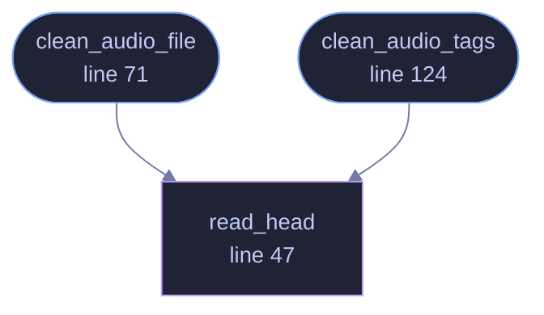

<!-- GENERATED by tools/docs/generate.py from the doc comments in the source. Do not edit: edit the .rs file and run the generator. -->

# `crates/veilvoice-meta/src/audio.rs`

[[veilvoice-meta|Crate-veilvoice-meta]] &middot; 268 lines &middot; [read the source](https://github.com/tilas01/veilvoice/blob/main/crates/veilvoice-meta/src/audio.rs)

## Contents

- [What tags give away](#what-tags-give-away)
- [Removal, or plausible replacement](#removal-or-plausible-replacement)
- [The gap lofty cannot close](#the-gap-lofty-cannot-close)
  - [What calls what](#what-calls-what)
  - [Items](#items)

Audio tag removal and replacement.

Tags are handled through `lofty`, which understands ID3v1/ID3v2, Vorbis
comments, MP4 atoms and APE, so one code path covers every format VeilVoice
imports. Only the tag blocks are rewritten — the audio stream is never
re-encoded, so cleaning a file is lossless.

# What tags give away

Far more than a title. Recording software writes its own name and version;
phones write a device model; some encoders write a timestamp, and a few write
a serial number or a user name taken from the account that made the file.
None of that is audible, all of it survives de-identification untouched, and
any of it can identify a speaker whose *voice* no longer does.

Stripping the voiceprint and leaving the tags would be a complete failure
wearing the appearance of success, which is why this crate exists and why
the CLI cleans by default.

# Removal, or plausible replacement

`crate::Policy` chooses between deleting tags outright and writing bland
ones. Both are legitimate: an empty tag block is itself a signal that a file
has been processed, and in some situations looking ordinary matters more
than being empty.

# The gap `lofty` cannot close

`lofty` understands ID3v1/ID3v2, Vorbis comments, MP4 atoms and APE through
one interface -- but **it cannot remove an ID3v2 block from a WAV file**. A
WAV is a RIFF container and an ID3 chunk inside one is a chunk, not a tag, so
the tag library does not see it. That is what `crate::wav` is for: a
chunk-level cleaner that walks the RIFF structure directly. Without it,
cleaning a WAV reported success and left the identifying block in place.

## What this file contains

268 lines defining **3 functions** (2 public), **0 types** and **1 constant**. Everything below is read out of the source, so it cannot disagree with the code.

**What happens when it runs.** These are the ways in: public, and nothing else in this file calls them, so they are what an outside caller reaches first.

- `clean_audio_file` (line 71) -- Strip or replace the tags of an audio file, in place.
  - reaches: `read_head`
- `clean_audio_tags` (line 124) -- Report which tag blocks a file carries, without modifying it.
  - reaches: `read_head`

## What calls what

_Colour key: **entry** -- a way in: public, and nothing in this file calls it; **helper** -- private to this file._

## Items

| Item | Line | Documentation |
|---|---:|---|
| `read_head` fn | [47](https://github.com/tilas01/veilvoice/blob/main/crates/veilvoice-meta/src/audio.rs#L47) | Read just enough of a file to identify its container. |
| `REALISTIC` const | [61](https://github.com/tilas01/veilvoice/blob/main/crates/veilvoice-meta/src/audio.rs#L61) | Tags written in Policy::Realistic mode. |
| `clean_audio_file` pub fn | [71](https://github.com/tilas01/veilvoice/blob/main/crates/veilvoice-meta/src/audio.rs#L71) | Strip or replace the tags of an audio file, in place. |
| `clean_audio_tags` pub fn | [124](https://github.com/tilas01/veilvoice/blob/main/crates/veilvoice-meta/src/audio.rs#L124) | Report which tag blocks a file carries, without modifying it. |
