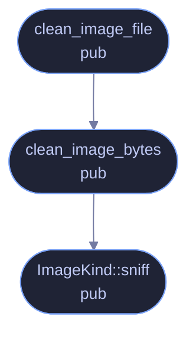

<!-- GENERATED by tools/docs/generate.py from the doc comments in the source. Do not edit: edit the .rs file and run the generator. -->

# `crates/veilvoice-meta/src/image.rs`

[[veilvoice-meta|Crate-veilvoice-meta]] &middot; 202 lines &middot; [read the source](https://github.com/tilas01/veilvoice/blob/main/crates/veilvoice-meta/src/image.rs)

## Contents

- [What calls what](#what-calls-what)
- [Items](#items)

Image EXIF/GPS removal.

Images are handled at the container level with `img-parts`: the EXIF and XMP
segments are dropped and the compressed pixel data is copied through
untouched. Nothing is re-encoded, so cleaning is lossless and cannot
introduce visible artefacts.

GPS coordinates are the reason this matters most. A single holiday snapshot
attached to an otherwise anonymous message can place someone within a few
metres, and no amount of voice processing helps with that.

## What calls what

## Items

| Item | Line | Documentation |
|---|---:|---|
| `ImageKind` pub enum | [19](https://github.com/tilas01/veilvoice/blob/main/crates/veilvoice-meta/src/image.rs#L19) | Image container formats this crate can clean. |
| `ImageKind::sniff` pub fn | [33](https://github.com/tilas01/veilvoice/blob/main/crates/veilvoice-meta/src/image.rs#L33) | Identify a format from its magic bytes. |
| `clean_image_bytes` pub fn | [49](https://github.com/tilas01/veilvoice/blob/main/crates/veilvoice-meta/src/image.rs#L49) | Strip identifying metadata from encoded image bytes. |
| `clean_image_file` pub fn | [86](https://github.com/tilas01/veilvoice/blob/main/crates/veilvoice-meta/src/image.rs#L86) | Strip identifying metadata from an image file, in place. |
