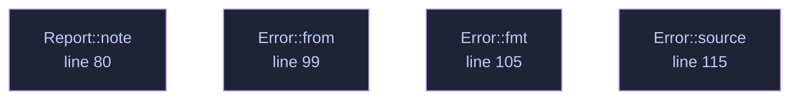

<!-- GENERATED by tools/docs/generate.py from the doc comments in the source. Do not edit: edit the .rs file and run the generator. -->

# `crates/veilvoice-meta/src/lib.rs`

[[veilvoice-meta|Crate-veilvoice-meta]] &middot; 121 lines &middot; [read the source](https://github.com/tilas01/veilvoice/blob/main/crates/veilvoice-meta/src/lib.rs)

## Contents

  - [Why this exists](#why-this-exists)
  - [Strip versus spoof](#strip-versus-spoof)
  - [What this crate cannot do](#what-this-crate-cannot-do)
- [In plain words](#in-plain-words)
  - [What calls what](#what-calls-what)
  - [Items](#items)

Strip or spoof the identifying metadata that rides along with media files.

## Why this exists

De-identifying a voice accomplishes nothing if the file still says who
recorded it. A phone recording routinely carries the device model, the
recording software, a precise timestamp and — for images — GPS coordinates
accurate to a few metres. That is often a far easier way to identify someone
than analysing their voice, and it survives every DSP transform because it
is not in the audio at all.

## Strip versus spoof

Removing every tag is not always the least conspicuous choice. A file with
*no* metadata whatsoever is itself a signal: it says the sender was trying to
hide something, and it stands out in a set of otherwise ordinary files.
`Policy` therefore offers two approaches:

- `Policy::Strip` — remove everything. Best when the file is expected to
be sanitised anyway, or when any false statement would be worse than an
obvious absence.
- `Policy::Realistic` — replace the tags with plausible, non-identifying
values so the file looks unremarkable rather than scrubbed.

## What this crate cannot do

It removes *container* metadata. It cannot remove information encoded in the
media itself: a photograph still shows the room it was taken in, and audio
still carries its room acoustics and background noise. Nor does it touch
filesystem timestamps or the filename, both of which are outside the file —
callers that care must handle those separately.

# In plain words

This strips the hidden labels off a file.

Photographs and recordings carry information you never typed: where the picture
was taken, which phone or microphone made it, what the file was called before,
sometimes a name. Removing the sound of a voice and leaving that behind would
be pointless, so this takes it out -- not by blanking the fields, but by
removing the parts of the file that hold them.

## What this file contains

121 lines defining **4 functions** (0 public), **3 types** and **1 constant**. Everything below is read out of the source, so it cannot disagree with the code.

**The types it owns.**

- `enum Policy` (line 61) -- How aggressively to rewrite metadata.
- `struct Report` (line 72) -- What changed in a single file.
- `enum Error` (line 89) -- Everything that can go wrong in this crate.

## What calls what

_Colour key: **helper** -- private to this file._

  

The same graph as Mermaid source

## Items

| Item | Line | Documentation |
|---|---:|---|
| `VERSION` pub const | [57](https://github.com/tilas01/veilvoice/blob/main/crates/veilvoice-meta/src/lib.rs#L57) | Crate version string, surfaced in the About panel. |
| `Policy` pub enum | [61](https://github.com/tilas01/veilvoice/blob/main/crates/veilvoice-meta/src/lib.rs#L61) | How aggressively to rewrite metadata. |
| `Report` pub struct | [72](https://github.com/tilas01/veilvoice/blob/main/crates/veilvoice-meta/src/lib.rs#L72) | What changed in a single file. |
| `Report::note` fn | [80](https://github.com/tilas01/veilvoice/blob/main/crates/veilvoice-meta/src/lib.rs#L80) |  |
| `Error` pub enum | [89](https://github.com/tilas01/veilvoice/blob/main/crates/veilvoice-meta/src/lib.rs#L89) | Everything that can go wrong in this crate. |
| `Error::from` fn | [99](https://github.com/tilas01/veilvoice/blob/main/crates/veilvoice-meta/src/lib.rs#L99) |  |
| `Error::fmt` fn | [105](https://github.com/tilas01/veilvoice/blob/main/crates/veilvoice-meta/src/lib.rs#L105) |  |
| `Error::source` fn | [115](https://github.com/tilas01/veilvoice/blob/main/crates/veilvoice-meta/src/lib.rs#L115) |  |
