<!-- GENERATED by tools/docs/generate.py from the doc comments in the source. Do not edit: edit the .rs file and run the generator. -->

# `crates/veilvoice-meta/tests/wav_fuzz.rs`

[[veilvoice-meta|Crate-veilvoice-meta]] &middot; 291 lines &middot; [read the source](https://github.com/tilas01/veilvoice/blob/main/crates/veilvoice-meta/tests/wav_fuzz.rs)

## Contents

- [What calls what](#what-calls-what)
- [Items](#items)

Randomised robustness testing for the RIFF chunk walker.

`clean_wav_bytes` exists because `lofty` cannot remove ID3v2 from a WAV, so
VeilVoice walks the chunk list itself. That means it parses a container
somebody else produced, with every length field under their control — the
textbook setting for an overrun or a loop that never ends.

The properties asserted, for any input at all:

1. **It returns.** No panic, and no unbounded loop: every iteration must
advance `pos`, whatever the chunk sizes claim.
2. **A success is a valid WAV.** If it hands back bytes, those bytes must
parse as RIFF/WAVE with a length field that matches what was written —
it is not permitted to emit something the next tool chokes on.
3. **It never invents audio.** Output length is bounded by input length.

Set `VEILVOICE_FUZZ_ROUNDS` to run it longer than the default.

## What this file contains

291 lines defining **15 functions** (0 public), **1 type** and **0 constants**. Everything below is read out of the source, so it cannot disagree with the code.

**The types it owns.**

- `struct Rng` (line 22)

## What calls what

_Colour key: **helper** -- private to this file._

  

The same graph as Mermaid source

```mermaid
%%{init: {"theme":"base","themeVariables":{"background":"#1a1b26","primaryColor":"#1f2335","primaryTextColor":"#c0caf5","primaryBorderColor":"#7aa2f7","secondaryColor":"#16161e","tertiaryColor":"#16161e","lineColor":"#737aa2","textColor":"#c0caf5","mainBkg":"#1f2335","nodeBorder":"#7aa2f7","clusterBkg":"#16161e","clusterBorder":"#2f3549","fontFamily":"ui-monospace, SFMono-Regular, Consolas, monospace","fontSize":"14px"}}}%%
flowchart TD
    n_new["Rng::new<br/>line 25"]
    n_next_u32["Rng::next_u32<br/>line 28"]
    n_below["Rng::below<br/>line 34"]
    n_byte["Rng::byte<br/>line 41"]
    n_rounds["rounds<br/>line 46"]
    n_seed_wav["seed_wav<br/>line 54"]
    n_mutate["mutate<br/>line 86"]
    n_check_output["check_output<br/>line 160"]
    n_the_chunk_walker_survives_hostile_input["the_chunk_walker_survives_hos…<br/>line 184"]
    n_the_realistic_policy_survives_hostile_input["the_realistic_policy_survives…<br/>line 200"]
    n_pure_noise_is_rejected_or_handled["pure_noise_is_rejected_or_han…<br/>line 216"]
    n_cleaning_is_idempotent["cleaning_is_idempotent<br/>line 230"]
    n_every_truncation_of_a_valid_file_is_handled["every_truncation_of_a_valid_f…<br/>line 242"]
    n_a_riff_size_of_u32_max_does_not_overflow_the_length_arithmetic["a_riff_size_of_u32_max_does_n…<br/>line 257"]
    n_zero_sized_chunks_do_not_stall_the_walker["zero_sized_chunks_do_not_stal…<br/>line 274"]
    n_a_riff_size_of_u32_max_does_not_overflow_the_length_arithmetic --> n_check_output
    n_a_riff_size_of_u32_max_does_not_overflow_the_length_arithmetic --> n_seed_wav
    n_below --> n_next_u32
    n_byte --> n_next_u32
    n_cleaning_is_idempotent --> n_seed_wav
    n_every_truncation_of_a_valid_file_is_handled --> n_check_output
    n_every_truncation_of_a_valid_file_is_handled --> n_seed_wav
    n_pure_noise_is_rejected_or_handled --> n_check_output
    n_pure_noise_is_rejected_or_handled --> n_new
    n_pure_noise_is_rejected_or_handled --> n_rounds
    n_the_chunk_walker_survives_hostile_input --> n_check_output
    n_the_chunk_walker_survives_hostile_input --> n_mutate
    n_the_chunk_walker_survives_hostile_input --> n_new
    n_the_chunk_walker_survives_hostile_input --> n_rounds
    n_the_chunk_walker_survives_hostile_input --> n_seed_wav
    n_the_realistic_policy_survives_hostile_input --> n_check_output
    n_the_realistic_policy_survives_hostile_input --> n_mutate
    n_the_realistic_policy_survives_hostile_input --> n_new
    n_the_realistic_policy_survives_hostile_input --> n_rounds
    n_the_realistic_policy_survives_hostile_input --> n_seed_wav
    n_zero_sized_chunks_do_not_stall_the_walker --> n_check_output
    click n_new href "https://github.com/tilas01/veilvoice/blob/main/crates/veilvoice-meta/tests/wav_fuzz.rs#L25" "open the source"
    click n_next_u32 href "https://github.com/tilas01/veilvoice/blob/main/crates/veilvoice-meta/tests/wav_fuzz.rs#L28" "open the source"
    click n_below href "https://github.com/tilas01/veilvoice/blob/main/crates/veilvoice-meta/tests/wav_fuzz.rs#L34" "open the source"
    click n_byte href "https://github.com/tilas01/veilvoice/blob/main/crates/veilvoice-meta/tests/wav_fuzz.rs#L41" "open the source"
    click n_rounds href "https://github.com/tilas01/veilvoice/blob/main/crates/veilvoice-meta/tests/wav_fuzz.rs#L46" "open the source"
    click n_seed_wav href "https://github.com/tilas01/veilvoice/blob/main/crates/veilvoice-meta/tests/wav_fuzz.rs#L54" "open the source"
    click n_mutate href "https://github.com/tilas01/veilvoice/blob/main/crates/veilvoice-meta/tests/wav_fuzz.rs#L86" "open the source"
    click n_check_output href "https://github.com/tilas01/veilvoice/blob/main/crates/veilvoice-meta/tests/wav_fuzz.rs#L160" "open the source"
    click n_the_chunk_walker_survives_hostile_input href "https://github.com/tilas01/veilvoice/blob/main/crates/veilvoice-meta/tests/wav_fuzz.rs#L184" "open the source"
    click n_the_realistic_policy_survives_hostile_input href "https://github.com/tilas01/veilvoice/blob/main/crates/veilvoice-meta/tests/wav_fuzz.rs#L200" "open the source"
    click n_pure_noise_is_rejected_or_handled href "https://github.com/tilas01/veilvoice/blob/main/crates/veilvoice-meta/tests/wav_fuzz.rs#L216" "open the source"
    click n_cleaning_is_idempotent href "https://github.com/tilas01/veilvoice/blob/main/crates/veilvoice-meta/tests/wav_fuzz.rs#L230" "open the source"
    click n_every_truncation_of_a_valid_file_is_handled href "https://github.com/tilas01/veilvoice/blob/main/crates/veilvoice-meta/tests/wav_fuzz.rs#L242" "open the source"
    click n_a_riff_size_of_u32_max_does_not_overflow_the_length_arithmetic href "https://github.com/tilas01/veilvoice/blob/main/crates/veilvoice-meta/tests/wav_fuzz.rs#L257" "open the source"
    click n_zero_sized_chunks_do_not_stall_the_walker href "https://github.com/tilas01/veilvoice/blob/main/crates/veilvoice-meta/tests/wav_fuzz.rs#L274" "open the source"
    classDef helper fill:#1f2335,stroke:#bb9af7,color:#c0caf5
    class n_new,n_next_u32,n_below,n_byte,n_rounds,n_seed_wav,n_mutate,n_check_output,n_the_chunk_walker_survives_hostile_input,n_the_realistic_policy_survives_hostile_input,n_pure_noise_is_rejected_or_handled,n_cleaning_is_idempotent,n_every_truncation_of_a_valid_file_is_handled,n_a_riff_size_of_u32_max_does_not_overflow_the_length_arithmetic,n_zero_sized_chunks_do_not_stall_the_walker helper
```

## Items

| Item | Line | Documentation |
|---|---:|---|
| `Rng` struct | [22](https://github.com/tilas01/veilvoice/blob/main/crates/veilvoice-meta/tests/wav_fuzz.rs#L22) |  |
| `Rng::new` fn | [25](https://github.com/tilas01/veilvoice/blob/main/crates/veilvoice-meta/tests/wav_fuzz.rs#L25) |  |
| `Rng::next_u32` fn | [28](https://github.com/tilas01/veilvoice/blob/main/crates/veilvoice-meta/tests/wav_fuzz.rs#L28) |  |
| `Rng::below` fn | [34](https://github.com/tilas01/veilvoice/blob/main/crates/veilvoice-meta/tests/wav_fuzz.rs#L34) |  |
| `Rng::byte` fn | [41](https://github.com/tilas01/veilvoice/blob/main/crates/veilvoice-meta/tests/wav_fuzz.rs#L41) |  |
| `rounds` fn | [46](https://github.com/tilas01/veilvoice/blob/main/crates/veilvoice-meta/tests/wav_fuzz.rs#L46) |  |
| `seed_wav` fn | [54](https://github.com/tilas01/veilvoice/blob/main/crates/veilvoice-meta/tests/wav_fuzz.rs#L54) | A minimal but genuinely valid WAV to mutate from. |
| `mutate` fn | [86](https://github.com/tilas01/veilvoice/blob/main/crates/veilvoice-meta/tests/wav_fuzz.rs#L86) | Mutations aimed at the chunk walker specifically: the interesting bytes are the 32-bit sizes, so a fifth of the rounds corrupt one deliberately. |
| `check_output` fn | [160](https://github.com/tilas01/veilvoice/blob/main/crates/veilvoice-meta/tests/wav_fuzz.rs#L160) |  |
| `the_chunk_walker_survives_hostile_input` fn | [184](https://github.com/tilas01/veilvoice/blob/main/crates/veilvoice-meta/tests/wav_fuzz.rs#L184) |  |
| `the_realistic_policy_survives_hostile_input` fn | [200](https://github.com/tilas01/veilvoice/blob/main/crates/veilvoice-meta/tests/wav_fuzz.rs#L200) | Policy::Realistic appends a chunk of its own, which is the one path that can make the output larger than the input. |
| `pure_noise_is_rejected_or_handled` fn | [216](https://github.com/tilas01/veilvoice/blob/main/crates/veilvoice-meta/tests/wav_fuzz.rs#L216) |  |
| `cleaning_is_idempotent` fn | [230](https://github.com/tilas01/veilvoice/blob/main/crates/veilvoice-meta/tests/wav_fuzz.rs#L230) | A cleaned file must clean again to itself. |
| `every_truncation_of_a_valid_file_is_handled` fn | [242](https://github.com/tilas01/veilvoice/blob/main/crates/veilvoice-meta/tests/wav_fuzz.rs#L242) | Every truncation of a valid file, which is what a partial download or an interrupted recording actually looks like. |
| `a_riff_size_of_u32_max_does_not_overflow_the_length_arithmetic` fn | [257](https://github.com/tilas01/veilvoice/blob/main/crates/veilvoice-meta/tests/wav_fuzz.rs#L257) | The RIFF size field is a u32 widened to usize and then had 8 added to it. |
| `zero_sized_chunks_do_not_stall_the_walker` fn | [274](https://github.com/tilas01/veilvoice/blob/main/crates/veilvoice-meta/tests/wav_fuzz.rs#L274) | A chunk that declares a size of zero must still advance the walker. |
