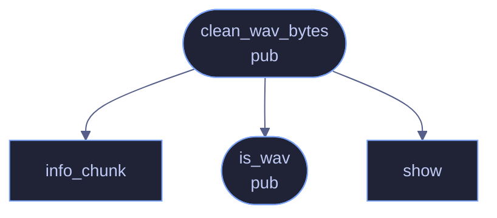

# `crates/veilvoice-meta/src/wav.rs`

[[veilvoice-meta|Crate-veilvoice-meta]] &middot; 332 lines &middot; [read the source](https://github.com/tilas01/veilvoice/blob/main/crates/veilvoice-meta/src/wav.rs)

## Contents

- [Why WAV gets its own path](#why-wav-gets-its-own-path)
- [Whitelist, not blacklist](#whitelist-not-blacklist)
  - [What calls what](#what-calls-what)
  - [Items](#items)

Chunk-level RIFF/WAVE metadata removal.

# Why WAV gets its own path

`lofty` handles tags in every other container, but it cannot remove an
ID3v2 block from a WAV file — the attempt fails with an encoding error and
the tag stays put. Silently leaving metadata in place is exactly the failure
this crate exists to prevent, and WAV is the format VeilVoice writes itself,
so it gets a direct implementation rather than a caveat.

# Whitelist, not blacklist

A RIFF file is a flat list of chunks, and metadata hides in a lot of them:
`LIST`/`INFO` (artist, software, comments), `id3 ` and `ID3 `, `bext`
(broadcast extension — originator, date, even a coding history), `iXML`,
`_PMX` (XMP), `axml`, `cart`. Enumerating those would leave every chunk
nobody thought of, and new ones keep being invented.

So this keeps only the chunks needed to decode the audio and drops
everything else. Anything unrecognised is discarded by default, which is the
right bias for a privacy tool: the worst case is a lost non-essential chunk,
not a leaked identity.

## What calls what

## Items

| Item | Line | Documentation |
|---|---:|---|
| `KEEP` const | [28](https://github.com/tilas01/veilvoice/blob/main/crates/veilvoice-meta/src/wav.rs#L28) | Chunks required to interpret the audio. |
| `REALISTIC_INFO` const | [35](https://github.com/tilas01/veilvoice/blob/main/crates/veilvoice-meta/src/wav.rs#L35) | Tags written in Policy::Realistic mode, as LIST/INFO sub-chunks. |
| `is_wav` pub fn | [42](https://github.com/tilas01/veilvoice/blob/main/crates/veilvoice-meta/src/wav.rs#L42) | Whether bytes looks like a RIFF/WAVE file. |
| `clean_wav_bytes` pub fn | [47](https://github.com/tilas01/veilvoice/blob/main/crates/veilvoice-meta/src/wav.rs#L47) | Rewrite a WAV, keeping only the chunks needed to decode it. |
| `info_chunk` fn | [131](https://github.com/tilas01/veilvoice/blob/main/crates/veilvoice-meta/src/wav.rs#L131) | Build a bland LIST/INFO chunk. |
| `show` fn | [150](https://github.com/tilas01/veilvoice/blob/main/crates/veilvoice-meta/src/wav.rs#L150) |  |
