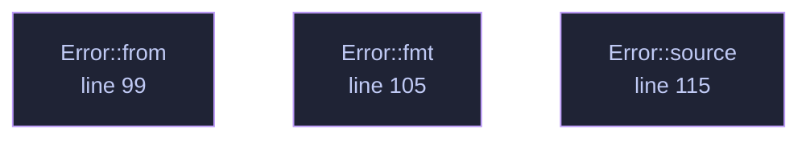

<!-- GENERATED by tools/docs/generate.py from the doc comments in the source. Do not edit: edit the .rs file and run the generator. -->

# `crates/veilvoice-policy/src/lib.rs`

[[veilvoice-policy|Crate-veilvoice-policy]] &middot; 156 lines &middot; [read the source](https://github.com/tilas01/veilvoice/blob/main/crates/veilvoice-policy/src/lib.rs)

## Contents

- [The design decision this crate turns on](#the-design-decision-this-crate-turns-on)
- [What the seal is for, and what it is not](#what-the-seal-is-for-and-what-it-is-not)
- [Reading a policy costs nothing](#reading-a-policy-costs-nothing)
- [What calls what](#what-calls-what)
- [Items](#items)

Settings somebody else decided, sealed so they cannot be edited without a
passphrase — and, more importantly, built so that editing them without one
buys nothing worth having.

## The design decision this crate turns on

A policy file has an obvious problem. To *apply* a policy at every launch,
the program has to be able to read it at every launch. If reading it needs a
passphrase, the user types one every time, and if it does not, then anybody
who can write the file can rewrite the policy.

The usual answers are a privileged daemon holding the key, or a key hidden
in the binary, and neither is honest here: this project needs no privileges,
and a key in a binary anybody can download is not a key.

So the constraint is moved into the shape of the data. **A requirement can
only make VeilVoice stricter.** There is no requirement that turns
encryption off, none that lowers the de-identification floor, none that
disables the app lock — and there is no room in `Requirement` to express
one, because every variant is a tightening and the type has no other kind.

Then somebody who edits the plain policy file without the passphrase can do
exactly one thing: make this machine's VeilVoice **more** restrictive than
its owner asked for. That is a nuisance, and it is not a privacy failure —
which is the failure this project exists to avoid. The passphrase-sealed
copy is what proves the policy is the one the administrator wrote; the
shape of the type is what makes the answer survive the seal not having been
checked yet.

## What the seal is for, and what it is not

`Policy::seal` uses the same container as everything else here — Argon2id
over the passphrase, X25519 with ML-KEM-768 for the hybrid modes,
XChaCha20-Poly1305 for the contents. `verify` opens the sealed copy and
compares it against the plain one, which is how anybody with the passphrase
establishes that the policy in force is the policy that was written.

It is **not** enforcement. Anything with write access to VeilVoice's own
executable can replace VeilVoice, and no file it reads can prevent that.
Anything running as the user can delete the policy entirely. What a sealed
policy gives is a policy that cannot be *quietly rewritten into something
weaker*, and that is a smaller claim than "enforced" on purpose. See
`SCOPE`.

Detecting deletion is `veilvoice-guard`'s job, not this one's: put the
policy files in a tamper manifest and the removal shows up there.

## Reading a policy costs nothing

`Policy::load` reads the plain file and applies it. It never asks for a
passphrase, never blocks, and reports the seal as `Verification::Unchecked`
rather than pretending to have looked. A front end that wants the stronger
statement calls `verify` when it has a passphrase to offer.

## What this file contains

156 lines defining **4 functions** (0 public), **1 type** and **2 constants**. Everything below is read out of the source, so it cannot disagree with the code.

**The types it owns.**

- `enum Error` (line 83) -- Everything that can go wrong in this crate.

## What calls what

_Colour key: **helper** -- private to this file._

## Items

| Item | Line | Documentation |
|---|---:|---|
| `VERSION` pub const | [65](https://github.com/tilas01/veilvoice/blob/main/crates/veilvoice-policy/src/lib.rs#L65) | Crate version string, surfaced in the About panel. |
| `SCOPE` pub const | [71](https://github.com/tilas01/veilvoice/blob/main/crates/veilvoice-policy/src/lib.rs#L71) | What a sealed policy is worth, in the words a front end should show. |
| `Error` pub enum | [83](https://github.com/tilas01/veilvoice/blob/main/crates/veilvoice-policy/src/lib.rs#L83) | Everything that can go wrong in this crate. |
| `Error::from` fn | [93](https://github.com/tilas01/veilvoice/blob/main/crates/veilvoice-policy/src/lib.rs#L93) |  |
| `Error::from` fn | [99](https://github.com/tilas01/veilvoice/blob/main/crates/veilvoice-policy/src/lib.rs#L99) |  |
| `Error::fmt` fn | [105](https://github.com/tilas01/veilvoice/blob/main/crates/veilvoice-policy/src/lib.rs#L105) |  |
| `Error::source` fn | [115](https://github.com/tilas01/veilvoice/blob/main/crates/veilvoice-policy/src/lib.rs#L115) |  |
