<!-- GENERATED by tools/docs/generate.py from the doc comments in the source. Do not edit: edit the .rs file and run the generator. -->


# `crates/veilvoice-policy/src/policy.rs`

[[veilvoice-policy|Crate-veilvoice-policy]] &middot; 922 lines &middot; [read the source](https://github.com/tilas01/veilvoice/blob/main/crates/veilvoice-policy/src/policy.rs)

## Contents

- [Every requirement tightens, and there is nowhere to write one that does not](#every-requirement-tightens-and-there-is-nowhere-to-write-one-that-does-not)
- [Format](#format)
- [In plain words](#in-plain-words)
  - [What calls what](#what-calls-what)
  - [Items](#items)

The policy itself: what can be required, and what requiring it does.

# Every requirement tightens, and there is nowhere to write one that does not

`Requirement` has five variants and all five move VeilVoice in the same
direction. There is no `AllowPlaintext`, no `MaximumIntensity`, no
`SkipMetadataCleaning`. That is not an oversight to be filled in later; it
is the property the whole crate rests on, and
`Posture::is_at_least_as_strict_as` exists so a test can hold it.

Anybody adding a variant should read `crate`'s documentation first. A
loosening variant does not merely add a feature — it removes the reason the
plain file can be read without a passphrase.

# Format

Text, one requirement per line, for the same reason the tamper manifest is
text: the point of the file is to be readable by the person it constrains.

```text
VEILPOLICY1
note  Set by the IT department. Ask before changing.
require  encrypt-recordings
require  clean-metadata
require  minimum-intensity  80
```

The floor is a whole number of hundredths, not a decimal. A policy has to
compare equal to its own sealed copy, and a value that reads back as
0.7999999 would make `crate::verify` report `Differs` for ever.

An unknown `require` keyword is an **error**, not a line to skip. A policy
written by a newer build says something this one cannot honour, and quietly
honouring the rest would leave the machine less restricted than the person
who wrote it believes. Refusing says so.

# In plain words

A way to say "these settings must always be on", so that they cannot be turned
off later by accident.

Everything here only ever tightens. There is deliberately no way to write a
rule that makes VeilVoice do less, because a settings file that could weaken
the program would be the first thing worth attacking.

If a rule and a control disagree, the rule wins and the window shows you the
value that will actually be used, rather than one that quietly changes when you
press the button.

## What this file contains

922 lines defining **25 functions** (23 public), **4 types** and **3 constants**. Everything below is read out of the source, so it cannot disagree with the code.

**The types it owns.**

- `enum Requirement` (line 69) -- One thing a policy can insist on.
- `struct Posture` (line 137) -- The settings a policy can reach, as a front end holds them.
- `struct Policy` (line 194) -- A set of requirements, and an optional note from whoever wrote them.
- `enum Verification` (line 473) -- What is known about the seal on a policy.

**What happens when it runs.** These are the ways in: public, and nothing else in this file calls them, so they are what an outside caller reaches first.

- `Requirement::keyword` (line 88) -- The keyword this is written as.
- `Requirement::describe` (line 103) -- What this means, in the words a front end should show beside the control it has taken away.
- `Posture::most_permissive` (line 169) -- The most permissive arrangement the controls can reach.
- `Posture::is_at_least_as_strict_as` (line 183) -- Whether self is at least as strict as other in every dimension.
- `Policy::require` (line 209) -- Add a requirement.
- `Policy::with_note` (line 226) -- Set the note shown beside every control the policy has fixed.
- `Policy::note` (line 243) -- The note, if there is one.
- `Policy::is_empty` (line 248) -- Whether anything at all is required.
- `Policy::len` (line 253) -- How many requirements there are.
- `Policy::requirements` (line 258) -- The requirements, in a stable order.
- `Policy::constrain` (line 283) -- Apply the policy to a posture.
  - reaches: `minimum_intensity`, `requires`
- `Policy::save` (line 415) -- Write the plain policy into dir, and the sealed copy beside it.
  - reaches: `seal`, `to_text`
- `Verification::describe` (line 493) -- One line for a front end.
- `Verification::wants_attention` (line 518) -- Whether this is a state somebody should look at.
- `verify` (line 530) -- Check the plain policy in dir against its sealed copy.
  - reaches: `load`, `open_sealed`, `parse`, `new`, `requirement_from`, `default`

## What calls what

_22 of 24 functions are drawn; the diagram is bounded at 22 so it stays readable._

_Colour key: **entry** -- a way in: public, and nothing in this file calls it; **api** -- public, and also used inside this file; **helper** -- private to this file._

<p align="center">
  
</p>

<details>
<summary>The same graph as Mermaid source</summary>



</details>

```mermaid
%%{init: {"theme":"base","themeVariables":{"background":"#1a1b26","primaryColor":"#1f2335","primaryTextColor":"#c0caf5","primaryBorderColor":"#7aa2f7","secondaryColor":"#16161e","tertiaryColor":"#16161e","lineColor":"#737aa2","textColor":"#c0caf5","mainBkg":"#1f2335","nodeBorder":"#7aa2f7","clusterBkg":"#16161e","clusterBorder":"#2f3549","fontFamily":"ui-monospace, SFMono-Regular, Consolas, monospace","fontSize":"14px"}}}%%
flowchart TD
    n_keyword(["Requirement::keyword<br/>line 88"])
    n_describe(["Requirement::describe<br/>line 103"])
    n_default["Posture::default<br/>line 152"]
    n_most_permissive(["Posture::most_permissive<br/>line 169"])
    n_is_at_least_as_strict_as(["Posture::<br/>is_at_least_as_strict_as<br/>line 183"])
    n_new["Policy::new<br/>line 204"]
    n_require(["Policy::require<br/>line 209"])
    n_with_note(["Policy::with_note<br/>line 226"])
    n_note(["Policy::note<br/>line 243"])
    n_is_empty(["Policy::is_empty<br/>line 248"])
    n_len(["Policy::len<br/>line 253"])
    n_requires["Policy::requires<br/>line 263"]
    n_minimum_intensity["Policy::minimum_intensity<br/>line 268"]
    n_constrain(["Policy::constrain<br/>line 283"])
    n_to_text["Policy::to_text<br/>line 304"]
    n_parse["Policy::parse<br/>line 330"]
    n_seal["Policy::seal<br/>line 376"]
    n_open_sealed["Policy::open_sealed<br/>line 398"]
    n_save(["Policy::save<br/>line 415"])
    n_load["Policy::load<br/>line 432"]
    n_requirement_from["requirement_from<br/>line 441"]
    n_verify(["verify<br/>line 530"])
    n_constrain --> n_minimum_intensity
    n_constrain --> n_requires
    n_load --> n_parse
    n_new --> n_default
    n_open_sealed --> n_parse
    n_parse --> n_new
    n_parse --> n_requirement_from
    n_save --> n_seal
    n_save --> n_to_text
    n_seal --> n_to_text
    n_verify --> n_load
    n_verify --> n_open_sealed
    click n_keyword href "https://github.com/tilas01/veilvoice/blob/main/crates/veilvoice-policy/src/policy.rs#L88" "open the source"
    click n_describe href "https://github.com/tilas01/veilvoice/blob/main/crates/veilvoice-policy/src/policy.rs#L103" "open the source"
    click n_default href "https://github.com/tilas01/veilvoice/blob/main/crates/veilvoice-policy/src/policy.rs#L152" "open the source"
    click n_most_permissive href "https://github.com/tilas01/veilvoice/blob/main/crates/veilvoice-policy/src/policy.rs#L169" "open the source"
    click n_is_at_least_as_strict_as href "https://github.com/tilas01/veilvoice/blob/main/crates/veilvoice-policy/src/policy.rs#L183" "open the source"
    click n_new href "https://github.com/tilas01/veilvoice/blob/main/crates/veilvoice-policy/src/policy.rs#L204" "open the source"
    click n_require href "https://github.com/tilas01/veilvoice/blob/main/crates/veilvoice-policy/src/policy.rs#L209" "open the source"
    click n_with_note href "https://github.com/tilas01/veilvoice/blob/main/crates/veilvoice-policy/src/policy.rs#L226" "open the source"
    click n_note href "https://github.com/tilas01/veilvoice/blob/main/crates/veilvoice-policy/src/policy.rs#L243" "open the source"
    click n_is_empty href "https://github.com/tilas01/veilvoice/blob/main/crates/veilvoice-policy/src/policy.rs#L248" "open the source"
    click n_len href "https://github.com/tilas01/veilvoice/blob/main/crates/veilvoice-policy/src/policy.rs#L253" "open the source"
    click n_requires href "https://github.com/tilas01/veilvoice/blob/main/crates/veilvoice-policy/src/policy.rs#L263" "open the source"
    click n_minimum_intensity href "https://github.com/tilas01/veilvoice/blob/main/crates/veilvoice-policy/src/policy.rs#L268" "open the source"
    click n_constrain href "https://github.com/tilas01/veilvoice/blob/main/crates/veilvoice-policy/src/policy.rs#L283" "open the source"
    click n_to_text href "https://github.com/tilas01/veilvoice/blob/main/crates/veilvoice-policy/src/policy.rs#L304" "open the source"
    click n_parse href "https://github.com/tilas01/veilvoice/blob/main/crates/veilvoice-policy/src/policy.rs#L330" "open the source"
    click n_seal href "https://github.com/tilas01/veilvoice/blob/main/crates/veilvoice-policy/src/policy.rs#L376" "open the source"
    click n_open_sealed href "https://github.com/tilas01/veilvoice/blob/main/crates/veilvoice-policy/src/policy.rs#L398" "open the source"
    click n_save href "https://github.com/tilas01/veilvoice/blob/main/crates/veilvoice-policy/src/policy.rs#L415" "open the source"
    click n_load href "https://github.com/tilas01/veilvoice/blob/main/crates/veilvoice-policy/src/policy.rs#L432" "open the source"
    click n_requirement_from href "https://github.com/tilas01/veilvoice/blob/main/crates/veilvoice-policy/src/policy.rs#L441" "open the source"
    click n_verify href "https://github.com/tilas01/veilvoice/blob/main/crates/veilvoice-policy/src/policy.rs#L530" "open the source"
    classDef entry fill:#1f2335,stroke:#7aa2f7,color:#c0caf5
    class n_keyword,n_describe,n_most_permissive,n_is_at_least_as_strict_as,n_require,n_with_note,n_note,n_is_empty,n_len,n_constrain,n_save,n_verify entry
    classDef api fill:#1f2335,stroke:#7dcfff,color:#c0caf5
    class n_new,n_requires,n_minimum_intensity,n_to_text,n_parse,n_seal,n_open_sealed,n_load api
    classDef helper fill:#1f2335,stroke:#bb9af7,color:#c0caf5
    class n_default,n_requirement_from helper
```

## Items

| Item | Line | Documentation |
|---|---:|---|
| `MAGIC` <sub>const</sub> | [56](https://github.com/tilas01/veilvoice/blob/main/crates/veilvoice-policy/src/policy.rs#L56) | Magic first line. |
| `PLAIN_FILE` <sub>pub const</sub> | [59](https://github.com/tilas01/veilvoice/blob/main/crates/veilvoice-policy/src/policy.rs#L59) | The plain policy, read at every launch and needing no passphrase. |
| `SEALED_FILE` <sub>pub const</sub> | [63](https://github.com/tilas01/veilvoice/blob/main/crates/veilvoice-policy/src/policy.rs#L63) | The same policy sealed under a passphrase, for proving the plain one is what was written. |
| `Requirement` <sub>pub enum</sub> | [69](https://github.com/tilas01/veilvoice/blob/main/crates/veilvoice-policy/src/policy.rs#L69) | One thing a policy can insist on. |
| `Requirement::keyword` <sub>pub fn</sub> | [88](https://github.com/tilas01/veilvoice/blob/main/crates/veilvoice-policy/src/policy.rs#L88) | The keyword this is written as. |
| `Requirement::describe` <sub>pub fn</sub> | [103](https://github.com/tilas01/veilvoice/blob/main/crates/veilvoice-policy/src/policy.rs#L103) | What this means, in the words a front end should show beside the control it has taken away. |
| `Posture` <sub>pub struct</sub> | [137](https://github.com/tilas01/veilvoice/blob/main/crates/veilvoice-policy/src/policy.rs#L137) | The settings a policy can reach, as a front end holds them. |
| `Posture::default` <sub>fn</sub> | [152](https://github.com/tilas01/veilvoice/blob/main/crates/veilvoice-policy/src/policy.rs#L152) | VeilVoice's own defaults, which are the strict ones. |
| `Posture::most_permissive` <sub>pub fn</sub> | [169](https://github.com/tilas01/veilvoice/blob/main/crates/veilvoice-policy/src/policy.rs#L169) | The most permissive arrangement the controls can reach. |
| `Posture::is_at_least_as_strict_as` <sub>pub fn</sub> | [183](https://github.com/tilas01/veilvoice/blob/main/crates/veilvoice-policy/src/policy.rs#L183) | Whether self is at least as strict as other in every dimension. |
| `Policy` <sub>pub struct</sub> | [194](https://github.com/tilas01/veilvoice/blob/main/crates/veilvoice-policy/src/policy.rs#L194) | A set of requirements, and an optional note from whoever wrote them. |
| `Policy::new` <sub>pub fn</sub> | [204](https://github.com/tilas01/veilvoice/blob/main/crates/veilvoice-policy/src/policy.rs#L204) | A policy that requires nothing. |
| `Policy::require` <sub>pub fn</sub> | [209](https://github.com/tilas01/veilvoice/blob/main/crates/veilvoice-policy/src/policy.rs#L209) | Add a requirement. |
| `Policy::with_note` <sub>pub fn</sub> | [226](https://github.com/tilas01/veilvoice/blob/main/crates/veilvoice-policy/src/policy.rs#L226) | Set the note shown beside every control the policy has fixed. |
| `Policy::note` <sub>pub fn</sub> | [243](https://github.com/tilas01/veilvoice/blob/main/crates/veilvoice-policy/src/policy.rs#L243) | The note, if there is one. |
| `Policy::is_empty` <sub>pub fn</sub> | [248](https://github.com/tilas01/veilvoice/blob/main/crates/veilvoice-policy/src/policy.rs#L248) | Whether anything at all is required. |
| `Policy::len` <sub>pub fn</sub> | [253](https://github.com/tilas01/veilvoice/blob/main/crates/veilvoice-policy/src/policy.rs#L253) | How many requirements there are. |
| `Policy::requirements` <sub>pub fn</sub> | [258](https://github.com/tilas01/veilvoice/blob/main/crates/veilvoice-policy/src/policy.rs#L258) | The requirements, in a stable order. |
| `Policy::requires` <sub>pub fn</sub> | [263](https://github.com/tilas01/veilvoice/blob/main/crates/veilvoice-policy/src/policy.rs#L263) | Whether a particular requirement is in force. |
| `Policy::minimum_intensity` <sub>pub fn</sub> | [268](https://github.com/tilas01/veilvoice/blob/main/crates/veilvoice-policy/src/policy.rs#L268) | The intensity floor, or 0.0 when none is set. |
| `Policy::constrain` <sub>pub fn</sub> | [283](https://github.com/tilas01/veilvoice/blob/main/crates/veilvoice-policy/src/policy.rs#L283) | Apply the policy to a posture. |
| `Policy::to_text` <sub>pub fn</sub> | [304](https://github.com/tilas01/veilvoice/blob/main/crates/veilvoice-policy/src/policy.rs#L304) | Serialise to the text format described at the top of this module. |
| `Policy::parse` <sub>pub fn</sub> | [330](https://github.com/tilas01/veilvoice/blob/main/crates/veilvoice-policy/src/policy.rs#L330) | Parse the text format. |
| `Policy::seal` <sub>pub fn</sub> | [376](https://github.com/tilas01/veilvoice/blob/main/crates/veilvoice-policy/src/policy.rs#L376) | Seal the policy under a passphrase. |
| `Policy::open_sealed` <sub>pub fn</sub> | [398](https://github.com/tilas01/veilvoice/blob/main/crates/veilvoice-policy/src/policy.rs#L398) | Open a policy sealed by Policy::seal. |
| `Policy::save` <sub>pub fn</sub> | [415](https://github.com/tilas01/veilvoice/blob/main/crates/veilvoice-policy/src/policy.rs#L415) | Write the plain policy into dir, and the sealed copy beside it. |
| `Policy::load` <sub>pub fn</sub> | [432](https://github.com/tilas01/veilvoice/blob/main/crates/veilvoice-policy/src/policy.rs#L432) | Read the plain policy from dir. |
| `requirement_from` <sub>fn</sub> | [441](https://github.com/tilas01/veilvoice/blob/main/crates/veilvoice-policy/src/policy.rs#L441) |  |
| `Verification` <sub>pub enum</sub> | [473](https://github.com/tilas01/veilvoice/blob/main/crates/veilvoice-policy/src/policy.rs#L473) | What is known about the seal on a policy. |
| `Verification::describe` <sub>pub fn</sub> | [493](https://github.com/tilas01/veilvoice/blob/main/crates/veilvoice-policy/src/policy.rs#L493) | One line for a front end. |
| `Verification::wants_attention` <sub>pub fn</sub> | [518](https://github.com/tilas01/veilvoice/blob/main/crates/veilvoice-policy/src/policy.rs#L518) | Whether this is a state somebody should look at. |
| `verify` <sub>pub fn</sub> | [530](https://github.com/tilas01/veilvoice/blob/main/crates/veilvoice-policy/src/policy.rs#L530) | Check the plain policy in dir against its sealed copy. |
