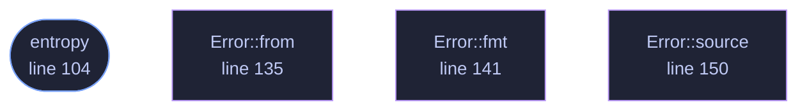

<!-- GENERATED by tools/docs/generate.py from the doc comments in the source. Do not edit: edit the .rs file and run the generator. -->

# `crates/veilvoice-sentry/src/lib.rs`

[[veilvoice-sentry|Crate-veilvoice-sentry]] &middot; 247 lines &middot; [read the source](https://github.com/tilas01/veilvoice/blob/main/crates/veilvoice-sentry/src/lib.rs)

## Contents

  - [The word this crate does not use](#the-word-this-crate-does-not-use)
  - [The two signals, and what each is worth](#the-two-signals-and-what-each-is-worth)
  - [What it cannot tell you: who](#what-it-cannot-tell-you-who)
  - [Entropy is a hint and never evidence](#entropy-is-a-hint-and-never-evidence)
- [In plain words](#in-plain-words)
  - [What calls what](#what-calls-what)
  - [Items](#items)

An early warning that something is going through your files: decoy files
that should never change, and a measure of how fast a directory tree is
changing.

## The word this crate does not use

It does not **prevent** anything. By the time a canary has been encrypted,
whatever encrypted it has already been running for some number of seconds
and has already reached some number of real files. What this buys is the
difference between finding out now and finding out when you next open a
document, which is a real difference, and it is the whole of what is on
offer. See `SCOPE`.

Stopping a process mid-run needs an interposition point in the kernel:
`fanotify` with `FAN_OPEN_PERM` on Linux, a filesystem minifilter on
Windows. The Windows one requires a code-signing identity issued to a
verified legal entity, which this project does not have and will not get,
because it is published under a pseudonym on purpose. `ROADMAP.md` records that as
a decision rather than an omission.

## The two signals, and what each is worth

**`canary`, decoy files that should never change.** A file nothing
legitimately touches is a clean signal: if its contents differ from what
was planted, something walked the directory and wrote to everything it
found. Very few false positives, and one enormous hole: it only fires if
the attacker *reaches* it. Something that encrypts only `.docx` under one
folder will never see a canary planted anywhere else, and this crate cannot
tell you that it did not fire because nothing happened.

**`rate`, how much of a tree changed and how fast.** No blind spot, and
far weaker evidence: a restore from backup, importing a camera card, a
compiler, or a synchronisation client catching up all look exactly like a
mass rewrite, because they are one. `rate::Churn` therefore reports
numbers and a `rate::Concern` level against a threshold **you** set. It
never reports "ransomware", because it does not know that and neither does
anything else that only counts files.

Used together they are worth more than either: a canary hit *and* a high
churn rate at the same moment is a much stronger statement than either
alone. That is a judgement for the front end to present, not for this crate
to make on the user's behalf.

## What it cannot tell you: who

Nothing here names a process. Attribution needs system auditing that is
normally switched off, and it lives in `veilvoice-guard` rather than here.
`veilvoice_guard::who_touched` takes a path and usually, honestly, answers
that it does not know. This crate deliberately does not depend on that one:
a project that wants canaries should not have to take a cryptography stack
with them.

## Entropy is a hint and never evidence

`entropy` measures Shannon entropy in bits per byte, and encrypted data
sits near 8.0. So does a JPEG, a `.zip`, a video, and this project's own
`.veil` container. High entropy is only meaningful for a file whose
contents this crate *planted* and therefore knows should have been prose.
It is used for exactly that and nothing else.

# In plain words

This watches for the pattern ransomware makes.

It leaves a few files lying around that nothing has any reason to touch, and it
counts how fast files in a folder are being rewritten. Something quietly
encrypting your documents trips both.

It is a warning, not a defence. It notices; it does not stop anything, and it
can be fooled by anything patient enough to go slowly.

## What this file contains

247 lines defining **4 functions** (1 public), **1 type** and **2 constants**. Everything below is read out of the source, so it cannot disagree with the code.

**The types it owns.**

- `enum Error` (line 127) -- Everything that can go wrong in this crate.

**What happens when it runs.** These are the ways in: public, and nothing else in this file calls them, so they are what an outside caller reaches first.

- `entropy` (line 104) -- Shannon entropy of bytes, in bits per byte, from 0.0 to 8.0.

## What calls what

_Colour key: **entry** -- a way in: public, and nothing in this file calls it; **helper** -- private to this file._

  

The same graph as Mermaid source

## Items

| Item | Line | Documentation |
|---|---:|---|
| `VERSION` pub const | [81](https://github.com/tilas01/veilvoice/blob/main/crates/veilvoice-sentry/src/lib.rs#L81) | Crate version string, surfaced in the About panel. |
| `SCOPE` pub const | [87](https://github.com/tilas01/veilvoice/blob/main/crates/veilvoice-sentry/src/lib.rs#L87) | What this crate is worth, in the words a front end should show. |
| `entropy` pub fn | [104](https://github.com/tilas01/veilvoice/blob/main/crates/veilvoice-sentry/src/lib.rs#L104) | Shannon entropy of bytes, in bits per byte, from 0.0 to 8.0. |
| `Error` pub enum | [127](https://github.com/tilas01/veilvoice/blob/main/crates/veilvoice-sentry/src/lib.rs#L127) | Everything that can go wrong in this crate. |
| `Error::from` fn | [135](https://github.com/tilas01/veilvoice/blob/main/crates/veilvoice-sentry/src/lib.rs#L135) |  |
| `Error::fmt` fn | [141](https://github.com/tilas01/veilvoice/blob/main/crates/veilvoice-sentry/src/lib.rs#L141) |  |
| `Error::source` fn | [150](https://github.com/tilas01/veilvoice/blob/main/crates/veilvoice-sentry/src/lib.rs#L150) |  |
