<!-- GENERATED by tools/docs/generate.py from the doc comments in the source. Do not edit: edit the .rs file and run the generator. -->

# `crates/veilvoice-setup/src/companions.rs`

[[veilvoice-setup|Crate-veilvoice-setup]] &middot; 1024 lines &middot; [read the source](https://github.com/tilas01/veilvoice/blob/main/crates/veilvoice-setup/src/companions.rs)

## Contents

- [Three rules, and none of them relaxes](#three-rules-and-none-of-them-relaxes)
- [Detection is a probe, and says when it could not tell](#detection-is-a-probe-and-says-when-it-could-not-tell)
- [In plain words](#in-plain-words)
  - [What calls what](#what-calls-what)
  - [Items](#items)

Optional third-party software, detected rather than assumed.

Four programs make VeilVoice easier to live with and none of them is part
of VeilVoice. A virtual audio cable is what lets live mode feed a veiled
microphone into a video call; an audio editor is how most people trim a
recording before veiling it. This module says which are already on the
machine, who makes each one, under what licence, and, for the ones that
are not, exactly what command would install it.

# Three rules, and none of them relaxes

**Nothing is installed without an explicit yes.** There are no checkboxes
here to leave ticked. `Companion::offer` produces a command; running it
is a separate deliberate act by the caller, on one named program at a time.

**VeilVoice never runs somebody else's installer.** Where the software is
proprietary or ships as a driver, and VB-CABLE is both, the offer is to open
the vendor's page, not to fetch and execute an unverified binary. This
project's front page is about verifying what you run; downloading a signed
release, checking its signature, and then silently running an unchecked
third-party `.exe` from the same program would be a strange thing to do
with that reputation.

**Privilege is reported, never requested.** A system package manager needs
root, and a graphical program cannot honestly collect a `sudo` password.
`Offer::Command` carries a `needs_privilege` flag, `run` refuses any
command that sets it, and a front end shows such a command rather than
pretending to run it.

# Detection is a probe, and says when it could not tell

`Presence` has three states, not two. "I looked in the places this
software installs itself and found nothing" and "I could not read the place
I wanted to look" are different answers, and reporting the second as the
first is how a tool ends up offering to install something that is already
there. Every probe here is a file-system or `PATH` lookup: no subprocess,
no registry sweep, and nothing that takes long enough to need a spinner.

The probes look where each program installs itself by default. Somebody who
has put Audacity somewhere unusual will be told it was not detected, which
is exactly what the words say: `Presence::NotDetected` is not a claim
that the software is absent from the machine.

# In plain words

Optional extra software that makes VeilVoice easier to live with, none of which
is part of VeilVoice.

Each one is looked for rather than assumed, and each is described first: what
it is, who makes it, what licence it has and why VeilVoice mentions it at all.
Nothing is installed without an explicit yes, and the exact command is shown
before the question.

## What this file contains

1024 lines defining **24 functions** (10 public), **3 types** and **2 constants**. Everything below is read out of the source, so it cannot disagree with the code.

**The types it owns.**

- `enum Presence` (line 59) -- What a probe found.
- `enum Offer` (line 92) -- What VeilVoice can offer to do about a companion that is not there.
- `struct Companion` (line 150) -- One piece of optional third-party software.

**What happens when it runs.** These are the ways in: public, and nothing else in this file calls them, so they are what an outside caller reaches first.

- `Presence::is_present` (line 76) -- True only for Presence::Present.
- `Presence::describe` (line 81) -- A short line for a user interface, in the project's usual register.
- `Offer::is_runnable` (line 124) -- True when a front end may run this itself.
- `Offer::command_line` (line 136) -- The command as a single line, for showing or copying.
- `Companion::detect` (line 169) -- Look for it, without changing anything.
  - reaches: `detect_audacity`, `detect_blackhole`, `detect_ffmpeg`, `detect_gnupg`, `detect_pipewire`, `detect_vb_cable`, `env_path`, `first_existing`, `on_path`
- `Companion::offer` (line 182) -- What could be done about it on this platform.
  - reaches: `audacity_offer`, `brew`, `ffmpeg_offer`, `gnupg_offer`, `on_path`, `unix_package`
- `for_this_platform` (line 307) -- The companions that mean anything on the platform this is running on.
- `by_key` (line 314) -- Find one by Companion::key.
- `run` (line 324) -- Run an offer, and return what it printed.
- `open_page` (line 365) -- Open a companion's own page in the user's browser.

## What calls what

_22 of 24 functions are drawn; the diagram is bounded at 22 so it stays readable._

_Colour key: **entry** -- a way in: public, and nothing in this file calls it; **helper** -- private to this file._

  

The same graph as Mermaid source

```mermaid
%%{init: {"theme":"base","themeVariables":{"background":"#1a1b26","primaryColor":"#1f2335","primaryTextColor":"#c0caf5","primaryBorderColor":"#7aa2f7","secondaryColor":"#16161e","tertiaryColor":"#16161e","lineColor":"#737aa2","textColor":"#c0caf5","mainBkg":"#1f2335","nodeBorder":"#7aa2f7","clusterBkg":"#16161e","clusterBorder":"#2f3549","fontFamily":"ui-monospace, SFMono-Regular, Consolas, monospace","fontSize":"14px"}}}%%
flowchart TD
    n_is_present(["Presence::is_present<br/>line 76"])
    n_describe(["Presence::describe<br/>line 81"])
    n_is_runnable(["Offer::is_runnable<br/>line 124"])
    n_command_line(["Offer::command_line<br/>line 136"])
    n_detect(["Companion::detect<br/>line 169"])
    n_offer(["Companion::offer<br/>line 182"])
    n_for_this_platform(["for_this_platform<br/>line 307"])
    n_by_key(["by_key<br/>line 314"])
    n_on_path["on_path<br/>line 400"]
    n_first_existing["first_existing<br/>line 419"]
    n_env_path["env_path<br/>line 423"]
    n_detect_vb_cable["detect_vb_cable<br/>line 436"]
    n_detect_blackhole["detect_blackhole<br/>line 459"]
    n_detect_pipewire["detect_pipewire<br/>line 481"]
    n_detect_audacity["detect_audacity<br/>line 492"]
    n_unix_package["unix_package<br/>line 528"]
    n_detect_ffmpeg["detect_ffmpeg<br/>line 554"]
    n_ffmpeg_offer["ffmpeg_offer<br/>line 562"]
    n_brew["brew<br/>line 594"]
    n_detect_gnupg["detect_gnupg<br/>line 625"]
    n_gnupg_offer["gnupg_offer<br/>line 640"]
    n_audacity_offer["audacity_offer<br/>line 671"]
    n_audacity_offer --> n_brew
    n_audacity_offer --> n_on_path
    n_audacity_offer --> n_unix_package
    n_brew --> n_on_path
    n_detect --> n_detect_audacity
    n_detect --> n_detect_blackhole
    n_detect --> n_detect_ffmpeg
    n_detect --> n_detect_gnupg
    n_detect --> n_detect_pipewire
    n_detect --> n_detect_vb_cable
    n_detect_audacity --> n_env_path
    n_detect_audacity --> n_first_existing
    n_detect_audacity --> n_on_path
    n_detect_ffmpeg --> n_on_path
    n_detect_gnupg --> n_on_path
    n_detect_pipewire --> n_on_path
    n_detect_vb_cable --> n_env_path
    n_ffmpeg_offer --> n_brew
    n_ffmpeg_offer --> n_on_path
    n_ffmpeg_offer --> n_unix_package
    n_gnupg_offer --> n_brew
    n_gnupg_offer --> n_on_path
    n_gnupg_offer --> n_unix_package
    n_offer --> n_audacity_offer
    n_offer --> n_brew
    n_offer --> n_ffmpeg_offer
    n_offer --> n_gnupg_offer
    n_unix_package --> n_on_path
    click n_is_present href "https://github.com/tilas01/veilvoice/blob/main/crates/veilvoice-setup/src/companions.rs#L76" "open the source"
    click n_describe href "https://github.com/tilas01/veilvoice/blob/main/crates/veilvoice-setup/src/companions.rs#L81" "open the source"
    click n_is_runnable href "https://github.com/tilas01/veilvoice/blob/main/crates/veilvoice-setup/src/companions.rs#L124" "open the source"
    click n_command_line href "https://github.com/tilas01/veilvoice/blob/main/crates/veilvoice-setup/src/companions.rs#L136" "open the source"
    click n_detect href "https://github.com/tilas01/veilvoice/blob/main/crates/veilvoice-setup/src/companions.rs#L169" "open the source"
    click n_offer href "https://github.com/tilas01/veilvoice/blob/main/crates/veilvoice-setup/src/companions.rs#L182" "open the source"
    click n_for_this_platform href "https://github.com/tilas01/veilvoice/blob/main/crates/veilvoice-setup/src/companions.rs#L307" "open the source"
    click n_by_key href "https://github.com/tilas01/veilvoice/blob/main/crates/veilvoice-setup/src/companions.rs#L314" "open the source"
    click n_on_path href "https://github.com/tilas01/veilvoice/blob/main/crates/veilvoice-setup/src/companions.rs#L400" "open the source"
    click n_first_existing href "https://github.com/tilas01/veilvoice/blob/main/crates/veilvoice-setup/src/companions.rs#L419" "open the source"
    click n_env_path href "https://github.com/tilas01/veilvoice/blob/main/crates/veilvoice-setup/src/companions.rs#L423" "open the source"
    click n_detect_vb_cable href "https://github.com/tilas01/veilvoice/blob/main/crates/veilvoice-setup/src/companions.rs#L436" "open the source"
    click n_detect_blackhole href "https://github.com/tilas01/veilvoice/blob/main/crates/veilvoice-setup/src/companions.rs#L459" "open the source"
    click n_detect_pipewire href "https://github.com/tilas01/veilvoice/blob/main/crates/veilvoice-setup/src/companions.rs#L481" "open the source"
    click n_detect_audacity href "https://github.com/tilas01/veilvoice/blob/main/crates/veilvoice-setup/src/companions.rs#L492" "open the source"
    click n_unix_package href "https://github.com/tilas01/veilvoice/blob/main/crates/veilvoice-setup/src/companions.rs#L528" "open the source"
    click n_detect_ffmpeg href "https://github.com/tilas01/veilvoice/blob/main/crates/veilvoice-setup/src/companions.rs#L554" "open the source"
    click n_ffmpeg_offer href "https://github.com/tilas01/veilvoice/blob/main/crates/veilvoice-setup/src/companions.rs#L562" "open the source"
    click n_brew href "https://github.com/tilas01/veilvoice/blob/main/crates/veilvoice-setup/src/companions.rs#L594" "open the source"
    click n_detect_gnupg href "https://github.com/tilas01/veilvoice/blob/main/crates/veilvoice-setup/src/companions.rs#L625" "open the source"
    click n_gnupg_offer href "https://github.com/tilas01/veilvoice/blob/main/crates/veilvoice-setup/src/companions.rs#L640" "open the source"
    click n_audacity_offer href "https://github.com/tilas01/veilvoice/blob/main/crates/veilvoice-setup/src/companions.rs#L671" "open the source"
    classDef entry fill:#1f2335,stroke:#7aa2f7,color:#c0caf5
    class n_is_present,n_describe,n_is_runnable,n_command_line,n_detect,n_offer,n_for_this_platform,n_by_key entry
    classDef helper fill:#1f2335,stroke:#bb9af7,color:#c0caf5
    class n_on_path,n_first_existing,n_env_path,n_detect_vb_cable,n_detect_blackhole,n_detect_pipewire,n_detect_audacity,n_unix_package,n_detect_ffmpeg,n_ffmpeg_offer,n_brew,n_detect_gnupg,n_gnupg_offer,n_audacity_offer helper
```

## Items

| Item | Line | Documentation |
|---|---:|---|
| `Presence` pub enum | [59](https://github.com/tilas01/veilvoice/blob/main/crates/veilvoice-setup/src/companions.rs#L59) | What a probe found. |
| `Presence::is_present` pub fn | [76](https://github.com/tilas01/veilvoice/blob/main/crates/veilvoice-setup/src/companions.rs#L76) | True only for Presence::Present. |
| `Presence::describe` pub fn | [81](https://github.com/tilas01/veilvoice/blob/main/crates/veilvoice-setup/src/companions.rs#L81) | A short line for a user interface, in the project's usual register. |
| `Offer` pub enum | [92](https://github.com/tilas01/veilvoice/blob/main/crates/veilvoice-setup/src/companions.rs#L92) | What VeilVoice can offer to do about a companion that is not there. |
| `Offer::is_runnable` pub fn | [124](https://github.com/tilas01/veilvoice/blob/main/crates/veilvoice-setup/src/companions.rs#L124) | True when a front end may run this itself. |
| `Offer::command_line` pub fn | [136](https://github.com/tilas01/veilvoice/blob/main/crates/veilvoice-setup/src/companions.rs#L136) | The command as a single line, for showing or copying. |
| `Companion` pub struct | [150](https://github.com/tilas01/veilvoice/blob/main/crates/veilvoice-setup/src/companions.rs#L150) | One piece of optional third-party software. |
| `Companion::detect` pub fn | [169](https://github.com/tilas01/veilvoice/blob/main/crates/veilvoice-setup/src/companions.rs#L169) | Look for it, without changing anything. |
| `Companion::offer` pub fn | [182](https://github.com/tilas01/veilvoice/blob/main/crates/veilvoice-setup/src/companions.rs#L182) | What could be done about it on this platform. |
| `ALL` pub const | [228](https://github.com/tilas01/veilvoice/blob/main/crates/veilvoice-setup/src/companions.rs#L228) | Every companion this project knows about, in the order a front end should show them. |
| `for_this_platform` pub fn | [307](https://github.com/tilas01/veilvoice/blob/main/crates/veilvoice-setup/src/companions.rs#L307) | The companions that mean anything on the platform this is running on. |
| `by_key` pub fn | [314](https://github.com/tilas01/veilvoice/blob/main/crates/veilvoice-setup/src/companions.rs#L314) | Find one by Companion::key. |
| `run` pub fn | [324](https://github.com/tilas01/veilvoice/blob/main/crates/veilvoice-setup/src/companions.rs#L324) | Run an offer, and return what it printed. |
| `open_page` pub fn | [365](https://github.com/tilas01/veilvoice/blob/main/crates/veilvoice-setup/src/companions.rs#L365) | Open a companion's own page in the user's browser. |
| `on_path` fn | [400](https://github.com/tilas01/veilvoice/blob/main/crates/veilvoice-setup/src/companions.rs#L400) | Is stem an executable on this process's PATH? |
| `first_existing` fn | [419](https://github.com/tilas01/veilvoice/blob/main/crates/veilvoice-setup/src/companions.rs#L419) | The first of candidates that exists. |
| `env_path` fn | [423](https://github.com/tilas01/veilvoice/blob/main/crates/veilvoice-setup/src/companions.rs#L423) |  |
| `detect_vb_cable` fn | [436](https://github.com/tilas01/veilvoice/blob/main/crates/veilvoice-setup/src/companions.rs#L436) | VB-CABLE installs an audio driver, and a driver is a file in a directory any user can read. |
| `detect_blackhole` fn | [459](https://github.com/tilas01/veilvoice/blob/main/crates/veilvoice-setup/src/companions.rs#L459) | BlackHole is a HAL plug-in, and those live in exactly one place. |
| `detect_pipewire` fn | [481](https://github.com/tilas01/veilvoice/blob/main/crates/veilvoice-setup/src/companions.rs#L481) | PipeWire is running or it is not, and pw-cli beside it is the sign that the userspace tools are installed. |
| `detect_audacity` fn | [492](https://github.com/tilas01/veilvoice/blob/main/crates/veilvoice-setup/src/companions.rs#L492) | Audacity is on PATH on Unix and in one of three directories on Windows. |
| `unix_package` fn | [528](https://github.com/tilas01/veilvoice/blob/main/crates/veilvoice-setup/src/companions.rs#L528) | The install command for package from whichever Unix package manager is here. |
| `detect_ffmpeg` fn | [554](https://github.com/tilas01/veilvoice/blob/main/crates/veilvoice-setup/src/companions.rs#L554) | ffmpeg, which is on PATH or is not. |
| `ffmpeg_offer` fn | [562](https://github.com/tilas01/veilvoice/blob/main/crates/veilvoice-setup/src/companions.rs#L562) | How ffmpeg would be installed here. |
| `brew` fn | [594](https://github.com/tilas01/veilvoice/blob/main/crates/veilvoice-setup/src/companions.rs#L594) |  |
| `detect_gnupg` fn | [625](https://github.com/tilas01/veilvoice/blob/main/crates/veilvoice-setup/src/companions.rs#L625) | The route to Audacity differs per platform, and on Linux per distribution. |
| `gnupg_offer` fn | [640](https://github.com/tilas01/veilvoice/blob/main/crates/veilvoice-setup/src/companions.rs#L640) | How GnuPG would be installed here. |
| `audacity_offer` fn | [671](https://github.com/tilas01/veilvoice/blob/main/crates/veilvoice-setup/src/companions.rs#L671) |  |
| `UNIX_PACKAGE_MANAGERS` const | [704](https://github.com/tilas01/veilvoice/blob/main/crates/veilvoice-setup/src/companions.rs#L704) | Package managers, and the arguments that install one named package non-interactively. |
| `ffmpeg_tests` mod | [917](https://github.com/tilas01/veilvoice/blob/main/crates/veilvoice-setup/src/companions.rs#L917) |  |
