<!-- GENERATED by tools/docs/generate.py from the doc comments in the source. Do not edit: edit the .rs file and run the generator. -->

# `crates/veilvoice-setup/src/install.rs`

[[veilvoice-setup|Crate-veilvoice-setup]] &middot; 861 lines &middot; [read the source](https://github.com/tilas01/veilvoice/blob/main/crates/veilvoice-setup/src/install.rs)

## Contents

- [Portable is the default, and installing is the exception](#portable-is-the-default-and-installing-is-the-exception)
- [No administrator, and nothing outside the user's own account](#no-administrator-and-nothing-outside-the-users-own-account)
- [Every change is reversible, and uninstall reverses exactly these](#every-change-is-reversible-and-uninstall-reverses-exactly-these)
- [Why the registry through reg.exe](#why-the-registry-through-regexe)
- [In plain words](#in-plain-words)
  - [What calls what](#what-calls-what)
  - [Items](#items)

Put this program somewhere the system can find it.

Reached as `veilvoice install` on the command line and as the setup tab
in the desktop application. Both call the functions below; neither has a
copy of them. See the crate documentation for why that mattered enough to
move this file out of the binary it used to live in.

# Portable is the default, and installing is the exception

VeilVoice runs from wherever it is unpacked. Nothing has to be installed,
nothing is written outside the folder unless the user does something that
writes outside the folder, and deleting the folder removes it. That is the
posture this project has always had and it is not being given up.

This exists because "runs from anywhere" and "I would like to type
`veilvoice` in a terminal" are both reasonable, and the second needs three
things a portable folder cannot provide: a stable location, an entry on
`PATH`, and a way for the operating system to list and remove it.

# No administrator, and nothing outside the user's own account

Everything here is per-user: `%LOCALAPPDATA%` on Windows,
`~/.local` on everything else, and on Windows the `HKCU` registry rather
than `HKLM`. No elevation is requested, nothing is written to a system
directory, and no service is created.

That is a deliberate limit rather than an oversight. A per-user install can
be undone by the user who made it, needs no privilege to audit, and cannot
break anybody else's account. A machine-wide install would need
administrator rights, and the reason to ask for those has to be better than
"so the program is on everyone's PATH".

# Every change is reversible, and `uninstall` reverses exactly these

| What | Where | Undone by |
|---|---|---|
| The binaries | `<prefix>/VeilVoice` | removing that directory |
| `PATH` entry | `HKCU\Environment`, or a shell profile line | removing just that entry |
| Uninstall entry | `HKCU\...\Uninstall\VeilVoice` | deleting that key |

The `PATH` edit is the one that can damage something, so it is the one
handled most carefully: the existing value is read, the entry is appended
only if absent, and removal takes out that entry and nothing else. A tool
that overwrites `PATH` wholesale has broken a machine, and doing it during
an *uninstall* is worse -- that is the moment somebody is least inclined to
check.

# Why the registry through `reg.exe`

The same reason `veilvoice-watch` reads it that way: this workspace carries
`#![forbid(unsafe_code)]` in every crate, and the Win32 registry API needs
`unsafe` FFI. Shelling out to a system tool keeps that guarantee and costs a
subprocess on an operation that runs once. `reg.exe` is resolved by absolute
path -- resolving it by name would search the working directory first, which
is finding F-13.

# In plain words

Copies VeilVoice somewhere your system can find it, and adds that place to your
path so typing `veilvoice` works.

It installs for you alone and needs no administrator rights. It also registers
with the system's own list of installed programs, so removing it works the way
removing anything else does.

Running VeilVoice straight out of a folder is a perfectly good way to use it,
and the setup screen says so rather than treating portable as something
missing.

## What this file contains

861 lines defining **20 functions** (5 public), **2 types** and **2 constants**. Everything below is read out of the source, so it cannot disagree with the code.

**The types it owns.**

- `struct Status` (line 160) -- What an installation currently looks like.
- `enum UserPath` (line 316)

**What happens when it runs.** These are the ways in: public, and nothing else in this file calls them, so they are what an outside caller reaches first.

- `status` (line 185) -- Read the current state without changing anything.
  - reaches: `bin_dir`, `exe_name`, `path_contains`, `prefix`
- `install` (line 518) -- Install for this user.
  - reaches: `add_to_path`, `bin_dir`, `copy_programs`, `register_uninstall`, `read_user_path`, `reg_exe`, `prefix`, `exe_name`
- `uninstall` (line 547) -- Remove what install added.
  - reaches: `bin_dir`, `removable_prefix`, `remove_from_path`, `remove_programs`, `unregister_uninstall`, `prefix`, `read_user_path`, `reg_exe`, `exe_name`

## What calls what

_Colour key: **entry** -- a way in: public, and nothing in this file calls it; **api** -- public, and also used inside this file; **helper** -- private to this file._

  

The same graph as Mermaid source

```mermaid
%%{init: {"theme":"base","themeVariables":{"background":"#1a1b26","primaryColor":"#1f2335","primaryTextColor":"#c0caf5","primaryBorderColor":"#7aa2f7","secondaryColor":"#16161e","tertiaryColor":"#16161e","lineColor":"#737aa2","textColor":"#c0caf5","mainBkg":"#1f2335","nodeBorder":"#7aa2f7","clusterBkg":"#16161e","clusterBorder":"#2f3549","fontFamily":"ui-monospace, SFMono-Regular, Consolas, monospace","fontSize":"14px"}}}%%
flowchart TD
    n_reg_exe["reg_exe<br/>line 94"]
    n_prefix["prefix<br/>line 110"]
    n_bin_dir["bin_dir<br/>line 143"]
    n_status(["status<br/>line 185"])
    n_exe_name["exe_name<br/>line 209"]
    n_path_contains["path_contains<br/>line 223"]
    n_copy_programs["copy_programs<br/>line 231"]
    n_add_to_path["add_to_path<br/>line 274"]
    n_read_user_path["read_user_path<br/>line 336"]
    n_add_to_path["add_to_path<br/>line 385"]
    n_register_uninstall["register_uninstall<br/>line 395"]
    n_register_uninstall["register_uninstall<br/>line 436"]
    n_remove_from_path["remove_from_path<br/>line 447"]
    n_remove_from_path["remove_from_path<br/>line 493"]
    n_unregister_uninstall["unregister_uninstall<br/>line 503"]
    n_unregister_uninstall["unregister_uninstall<br/>line 513"]
    n_install(["install<br/>line 518"])
    n_uninstall(["uninstall<br/>line 547"])
    n_remove_programs["remove_programs<br/>line 620"]
    n_removable_prefix["removable_prefix<br/>line 658"]
    n_add_to_path --> n_read_user_path
    n_add_to_path --> n_reg_exe
    n_bin_dir --> n_prefix
    n_copy_programs --> n_exe_name
    n_install --> n_add_to_path
    n_install --> n_bin_dir
    n_install --> n_copy_programs
    n_install --> n_register_uninstall
    n_read_user_path --> n_reg_exe
    n_register_uninstall --> n_exe_name
    n_register_uninstall --> n_reg_exe
    n_removable_prefix --> n_bin_dir
    n_removable_prefix --> n_prefix
    n_remove_from_path --> n_read_user_path
    n_remove_from_path --> n_reg_exe
    n_remove_programs --> n_exe_name
    n_status --> n_bin_dir
    n_status --> n_exe_name
    n_status --> n_path_contains
    n_uninstall --> n_bin_dir
    n_uninstall --> n_removable_prefix
    n_uninstall --> n_remove_from_path
    n_uninstall --> n_remove_programs
    n_uninstall --> n_unregister_uninstall
    n_unregister_uninstall --> n_reg_exe
    click n_reg_exe href "https://github.com/tilas01/veilvoice/blob/main/crates/veilvoice-setup/src/install.rs#L94" "open the source"
    click n_prefix href "https://github.com/tilas01/veilvoice/blob/main/crates/veilvoice-setup/src/install.rs#L110" "open the source"
    click n_bin_dir href "https://github.com/tilas01/veilvoice/blob/main/crates/veilvoice-setup/src/install.rs#L143" "open the source"
    click n_status href "https://github.com/tilas01/veilvoice/blob/main/crates/veilvoice-setup/src/install.rs#L185" "open the source"
    click n_exe_name href "https://github.com/tilas01/veilvoice/blob/main/crates/veilvoice-setup/src/install.rs#L209" "open the source"
    click n_path_contains href "https://github.com/tilas01/veilvoice/blob/main/crates/veilvoice-setup/src/install.rs#L223" "open the source"
    click n_copy_programs href "https://github.com/tilas01/veilvoice/blob/main/crates/veilvoice-setup/src/install.rs#L231" "open the source"
    click n_add_to_path href "https://github.com/tilas01/veilvoice/blob/main/crates/veilvoice-setup/src/install.rs#L274" "open the source"
    click n_read_user_path href "https://github.com/tilas01/veilvoice/blob/main/crates/veilvoice-setup/src/install.rs#L336" "open the source"
    click n_add_to_path href "https://github.com/tilas01/veilvoice/blob/main/crates/veilvoice-setup/src/install.rs#L385" "open the source"
    click n_register_uninstall href "https://github.com/tilas01/veilvoice/blob/main/crates/veilvoice-setup/src/install.rs#L395" "open the source"
    click n_register_uninstall href "https://github.com/tilas01/veilvoice/blob/main/crates/veilvoice-setup/src/install.rs#L436" "open the source"
    click n_remove_from_path href "https://github.com/tilas01/veilvoice/blob/main/crates/veilvoice-setup/src/install.rs#L447" "open the source"
    click n_remove_from_path href "https://github.com/tilas01/veilvoice/blob/main/crates/veilvoice-setup/src/install.rs#L493" "open the source"
    click n_unregister_uninstall href "https://github.com/tilas01/veilvoice/blob/main/crates/veilvoice-setup/src/install.rs#L503" "open the source"
    click n_unregister_uninstall href "https://github.com/tilas01/veilvoice/blob/main/crates/veilvoice-setup/src/install.rs#L513" "open the source"
    click n_install href "https://github.com/tilas01/veilvoice/blob/main/crates/veilvoice-setup/src/install.rs#L518" "open the source"
    click n_uninstall href "https://github.com/tilas01/veilvoice/blob/main/crates/veilvoice-setup/src/install.rs#L547" "open the source"
    click n_remove_programs href "https://github.com/tilas01/veilvoice/blob/main/crates/veilvoice-setup/src/install.rs#L620" "open the source"
    click n_removable_prefix href "https://github.com/tilas01/veilvoice/blob/main/crates/veilvoice-setup/src/install.rs#L658" "open the source"
    classDef entry fill:#1f2335,stroke:#7aa2f7,color:#c0caf5
    class n_status,n_install,n_uninstall entry
    classDef api fill:#1f2335,stroke:#7dcfff,color:#c0caf5
    class n_prefix,n_bin_dir api
    classDef helper fill:#1f2335,stroke:#bb9af7,color:#c0caf5
    class n_reg_exe,n_exe_name,n_path_contains,n_copy_programs,n_add_to_path,n_read_user_path,n_add_to_path,n_register_uninstall,n_register_uninstall,n_remove_from_path,n_remove_from_path,n_unregister_uninstall,n_unregister_uninstall,n_remove_programs,n_removable_prefix helper
```

## Items

| Item | Line | Documentation |
|---|---:|---|
| `NAME` pub const | [78](https://github.com/tilas01/veilvoice/blob/main/crates/veilvoice-setup/src/install.rs#L78) | The name of the directory and the uninstall entry. |
| `PROGRAMS` const | [85](https://github.com/tilas01/veilvoice/blob/main/crates/veilvoice-setup/src/install.rs#L85) | Files that make up an installation, if they are beside the running binary. |
| `reg_exe` fn | [94](https://github.com/tilas01/veilvoice/blob/main/crates/veilvoice-setup/src/install.rs#L94) | reg.exe, by absolute path. |
| `prefix` pub fn | [110](https://github.com/tilas01/veilvoice/blob/main/crates/veilvoice-setup/src/install.rs#L110) | The directory VeilVoice owns on this machine, for this user only. |
| `bin_dir` pub fn | [143](https://github.com/tilas01/veilvoice/blob/main/crates/veilvoice-setup/src/install.rs#L143) | Where the binaries go, and therefore the directory PATH must contain. |
| `Status` pub struct | [160](https://github.com/tilas01/veilvoice/blob/main/crates/veilvoice-setup/src/install.rs#L160) | What an installation currently looks like. |
| `status` pub fn | [185](https://github.com/tilas01/veilvoice/blob/main/crates/veilvoice-setup/src/install.rs#L185) | Read the current state without changing anything. |
| `exe_name` fn | [209](https://github.com/tilas01/veilvoice/blob/main/crates/veilvoice-setup/src/install.rs#L209) | A program's file name on this platform. |
| `path_contains` fn | [223](https://github.com/tilas01/veilvoice/blob/main/crates/veilvoice-setup/src/install.rs#L223) | Is dir already on this user's PATH? |
| `copy_programs` fn | [231](https://github.com/tilas01/veilvoice/blob/main/crates/veilvoice-setup/src/install.rs#L231) | Copy the binaries into place. |
| `add_to_path` fn | [274](https://github.com/tilas01/veilvoice/blob/main/crates/veilvoice-setup/src/install.rs#L274) | Add dir to the user's PATH, if it is not there already. |
| `UserPath` enum | [316](https://github.com/tilas01/veilvoice/blob/main/crates/veilvoice-setup/src/install.rs#L316) |  |
| `read_user_path` fn | [336](https://github.com/tilas01/veilvoice/blob/main/crates/veilvoice-setup/src/install.rs#L336) | Read this user's PATH, distinguishing "not set" from "could not tell". |
| `add_to_path` fn | [385](https://github.com/tilas01/veilvoice/blob/main/crates/veilvoice-setup/src/install.rs#L385) | The Unix half: report that nothing was written, because nothing was. |
| `register_uninstall` fn | [395](https://github.com/tilas01/veilvoice/blob/main/crates/veilvoice-setup/src/install.rs#L395) | Register with Add/Remove Programs, so the system can list and remove it. |
| `register_uninstall` fn | [436](https://github.com/tilas01/veilvoice/blob/main/crates/veilvoice-setup/src/install.rs#L436) | The Unix half: nothing to register. |
| `remove_from_path` fn | [447](https://github.com/tilas01/veilvoice/blob/main/crates/veilvoice-setup/src/install.rs#L447) | Take this directory back out of the user's PATH, leaving the rest of it exactly as it was. |
| `remove_from_path` fn | [493](https://github.com/tilas01/veilvoice/blob/main/crates/veilvoice-setup/src/install.rs#L493) | The Unix half: nothing was written to a profile, so nothing is taken out. |
| `unregister_uninstall` fn | [503](https://github.com/tilas01/veilvoice/blob/main/crates/veilvoice-setup/src/install.rs#L503) | Take the Add/Remove Programs entry away again. |
| `unregister_uninstall` fn | [513](https://github.com/tilas01/veilvoice/blob/main/crates/veilvoice-setup/src/install.rs#L513) | The Unix half: nothing was registered, so nothing is unregistered. |
| `install` pub fn | [518](https://github.com/tilas01/veilvoice/blob/main/crates/veilvoice-setup/src/install.rs#L518) | Install for this user. |
| `uninstall` pub fn | [547](https://github.com/tilas01/veilvoice/blob/main/crates/veilvoice-setup/src/install.rs#L547) | Remove what install added. |
| `remove_programs` fn | [620](https://github.com/tilas01/veilvoice/blob/main/crates/veilvoice-setup/src/install.rs#L620) | Remove the programs install wrote, by name, and say which are still in use. |
| `removable_prefix` fn | [658](https://github.com/tilas01/veilvoice/blob/main/crates/veilvoice-setup/src/install.rs#L658) | prefix, but only when it is genuinely a directory VeilVoice made for itself. |
