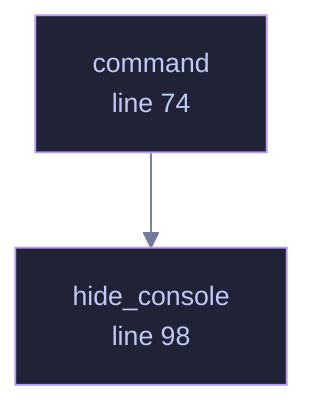

<!-- GENERATED by tools/docs/generate.py from the doc comments in the source. Do not edit: edit the .rs file and run the generator. -->

# `crates/veilvoice-setup/src/lib.rs`

[[veilvoice-setup|Crate-veilvoice-setup]] &middot; 153 lines &middot; [read the source](https://github.com/tilas01/veilvoice/blob/main/crates/veilvoice-setup/src/lib.rs)

## Contents

- [Why this is a library and not part of the command line](#why-this-is-a-library-and-not-part-of-the-command-line)
- [What it will not do](#what-it-will-not-do)
- [No unsafe, and therefore some subprocesses](#no-unsafe-and-therefore-some-subprocesses)
  - [What calls what](#what-calls-what)
  - [Items](#items)

Everything that puts VeilVoice on a machine, and everything that reports
what is already on it. Two modules: `install` does the per-user install
and its exact reversal, `companions` finds the optional third-party
software that live mode is easier with and says who makes each piece.

# Why this is a library and not part of the command line

It was part of the command line. `install.rs` lived inside the
`veilvoice-cli` **binary** crate, which meant the desktop application could
not call a single line of it — a binary crate has no consumers. The choice
was to reimplement the installer behind the graphical front end, or to move
the logic somewhere both front ends can reach. Reimplementing it would have
produced two programs that edit `PATH`, drifting apart at whatever rate
nobody noticed, and the `PATH` edit is the one operation here that can
damage a machine.

So this crate is the installer, and both front ends are front ends. The
command line calls `install::install`; so does the desktop app's setup
tab. There is one implementation of the careful part, and one set of tests
covering it.

# What it will not do

**It never runs somebody else's installer.** `companions` reports what is
present and prepares an exact command for what is not, and where that
command is "open the vendor's download page" it says so rather than
fetching and executing an unverified binary. A project whose entire subject
is verifying what you run has no business being casual about that.

**It never asks for administrator rights.** Everything `install` does is
inside the user's own account. Where a companion genuinely needs privilege
— a system package manager, an audio driver — that fact is reported and the
command is handed over rather than run, because a graphical program cannot
honestly collect a `sudo` password and this one does not try.

**Nothing is ticked by default.** There are no checkboxes at all: each
companion is a separate, deliberate action. The rule that predates this
crate — detect, say what it is and who makes it, act only on an explicit
yes — is unchanged by the interface getting prettier.

# No `unsafe`, and therefore some subprocesses

`#![forbid(unsafe_code)]` holds here as everywhere else in the workspace,
so the Windows registry is reached through `reg.exe` rather than the Win32
API. `command` wraps every spawn so that none of them flashes a console
window when the desktop application is the caller — the defect that shipped
in v0.1.10 — and a test reads this crate's own source to catch a spawn that
forgets.

## What this file contains

153 lines defining **3 functions** (0 public), **0 types** and **1 constant**. Everything below is read out of the source, so it cannot disagree with the code.

## What calls what

_Colour key: **helper** -- private to this file._

## Items

| Item | Line | Documentation |
|---|---:|---|
| `VERSION` pub const | [62](https://github.com/tilas01/veilvoice/blob/main/crates/veilvoice-setup/src/lib.rs#L62) | Crate version string, surfaced in the About panel. |
| `command` pub(crate) fn | [74](https://github.com/tilas01/veilvoice/blob/main/crates/veilvoice-setup/src/lib.rs#L74) | Spawn without a console window. |
| `hide_console` fn | [88](https://github.com/tilas01/veilvoice/blob/main/crates/veilvoice-setup/src/lib.rs#L88) | The Windows half of command. |
| `hide_console` fn | [98](https://github.com/tilas01/veilvoice/blob/main/crates/veilvoice-setup/src/lib.rs#L98) | The everywhere-else half of command: nothing to hide, and no console is created by spawning a process in the first place. |
