<!-- GENERATED by tools/docs/generate.py from the doc comments in the source. Do not edit: edit the .rs file and run the generator. -->

# `crates/veilvoice-setup/src/volumes.rs`

[[veilvoice-setup|Crate-veilvoice-setup]] &middot; 580 lines &middot; [read the source](https://github.com/tilas01/veilvoice/blob/main/crates/veilvoice-setup/src/volumes.rs)

## Contents

- [What this does, and the two things it deliberately does not](#what-this-does-and-the-two-things-it-deliberately-does-not)
- [By the time VeilVoice sees one, it is a directory](#by-the-time-veilvoice-sees-one-it-is-a-directory)
- [What it is worth, which is less than it sounds](#what-it-is-worth-which-is-less-than-it-sounds)
- [In plain words](#in-plain-words)
  - [What calls what](#what-calls-what)
  - [Items](#items)

Encrypted volumes this machine already has: Cryptomator and VeraCrypt.

# What this does, and the two things it deliberately does not

It **reads**. It finds whether either program is installed, and which of
their volumes are mounted right now, so VeilVoice can offer to write veiled
recordings into one instead of into a Downloads folder somebody meant to
clear out.

It does **not drive either program**. No launching, no mounting, no
unlocking, and it never sees a volume passphrase. Mounting somebody's
encrypted volume is their act, taken in the tool they chose, and a voice
de-identifier is not the program to be doing it for them. This is marker
39's rule about privilege in a second place: use what is already there, ask
for nothing.

It does **not decide whether a volume is hidden**. VeraCrypt's hidden
volumes exist so that somebody under compulsion can hand over one passphrase
and reveal an outer volume, and the two are indistinguishable from outside
*by design*. No amount of looking will tell them apart, so `Hidden` has an
`Unknown` state and it is the caller's job to ask rather than to guess. See
`Hidden` for why guessing wrong destroys data.

# By the time VeilVoice sees one, it is a directory

That is what makes this honest and small. A mounted Cryptomator vault and a
mounted VeraCrypt volume are both ordinary directories to anything that
writes a file. The encryption is entirely the other tool's, VeilVoice adds
none of its own here, and calling any of this "VeilVoice encryption" would
be the overclaim this project refuses.

# What it is worth, which is less than it sounds

A vault protects the file inside it. It does not protect the temporary file
an operating system wrote while the file was being produced, the swap or
hibernation image the kernel wrote, the thumbnail a file manager made, or
the recently-opened list a desktop keeps. Full-volume encryption is what
covers those. `DISK_ADVICE` is that sentence, single-sourced so the
command line and the window cannot drift into two different promises.

# In plain words

Notices whether you already have Cryptomator or VeraCrypt, and which of
their encrypted folders are open right now, so VeilVoice can offer to save
into one.

It never opens or closes them for you and never asks for their password.
It also cannot tell whether a VeraCrypt volume is the hidden one, because
nothing can, which is why VeilVoice asks you instead of assuming.

## What this file contains

580 lines defining **18 functions** (13 public), **3 types** and **2 constants**. Everything below is read out of the source, so it cannot disagree with the code.

**The types it owns.**

- `enum Tool` (line 68) -- One of the two tools this module knows about.
- `enum Hidden` (line 131) -- Whether a destination is, or might be, a VeraCrypt hidden volume.
- `struct Volume` (line 173) -- A mounted volume VeilVoice could write into.

**What happens when it runs.** These are the ways in: public, and nothing else in this file calls them, so they are what an outside caller reaches first.

- `Tool::name` (line 80) -- The name to print.
- `Tool::key` (line 88) -- A stable identifier, for a settings file.
- `Tool::from_key` (line 96) -- The tool with this key, if it is one.
- `Tool::home_page` (line 101) -- Where to read about it, for a user who has neither installed.
- `Hidden::safe_to_write` (line 152) -- Whether VeilVoice may write here.
- `Hidden::refusal` (line 157) -- Why writing is refused, in the words a user reads.
- `Volume::ready` (line 198) -- Whether VeilVoice may write here right now.
- `Volume::blocked` (line 206) -- Why it is not ready, if it is not.
- `installed` (line 219) -- Whether tool looks installed on this machine.
  - reaches: `candidates`, `on_path`
- `mounted` (line 283) -- Every mounted volume either tool is currently offering.
  - reaches: `from_mount_directories`, `from_proc_mounts`, `found`, `recognise`, `unescape_mount`
- `covers` (line 316) -- Whether path is inside one of mounts right now.

## What calls what

_Colour key: **entry** -- a way in: public, and nothing in this file calls it; **api** -- public, and also used inside this file; **helper** -- private to this file._

  

The same graph as Mermaid source

```mermaid
%%{init: {"theme":"base","themeVariables":{"background":"#1a1b26","primaryColor":"#1f2335","primaryTextColor":"#c0caf5","primaryBorderColor":"#7aa2f7","secondaryColor":"#16161e","tertiaryColor":"#16161e","lineColor":"#737aa2","textColor":"#c0caf5","mainBkg":"#1f2335","nodeBorder":"#7aa2f7","clusterBkg":"#16161e","clusterBorder":"#2f3549","fontFamily":"ui-monospace, SFMono-Regular, Consolas, monospace","fontSize":"14px"}}}%%
flowchart TD
    n_name(["Tool::name<br/>line 80"])
    n_key(["Tool::key<br/>line 88"])
    n_from_key(["Tool::from_key<br/>line 96"])
    n_home_page(["Tool::home_page<br/>line 101"])
    n_safe_to_write(["Hidden::safe_to_write<br/>line 152"])
    n_refusal(["Hidden::refusal<br/>line 157"])
    n_found["Volume::found<br/>line 184"]
    n_ready(["Volume::ready<br/>line 198"])
    n_blocked(["Volume::blocked<br/>line 206"])
    n_installed(["installed<br/>line 219"])
    n_candidates["candidates<br/>line 235"]
    n_on_path["on_path<br/>line 263"]
    n_mounted(["mounted<br/>line 283"])
    n_covers(["covers<br/>line 316"])
    n_from_proc_mounts["from_proc_mounts<br/>line 326"]
    n_recognise["recognise<br/>line 351"]
    n_unescape_mount["unescape_mount<br/>line 368"]
    n_from_mount_directories["from_mount_directories<br/>line 393"]
    n_from_mount_directories --> n_found
    n_from_proc_mounts --> n_found
    n_from_proc_mounts --> n_recognise
    n_from_proc_mounts --> n_unescape_mount
    n_installed --> n_candidates
    n_installed --> n_on_path
    n_mounted --> n_from_mount_directories
    n_mounted --> n_from_proc_mounts
    click n_name href "https://github.com/tilas01/veilvoice/blob/main/crates/veilvoice-setup/src/volumes.rs#L80" "open the source"
    click n_key href "https://github.com/tilas01/veilvoice/blob/main/crates/veilvoice-setup/src/volumes.rs#L88" "open the source"
    click n_from_key href "https://github.com/tilas01/veilvoice/blob/main/crates/veilvoice-setup/src/volumes.rs#L96" "open the source"
    click n_home_page href "https://github.com/tilas01/veilvoice/blob/main/crates/veilvoice-setup/src/volumes.rs#L101" "open the source"
    click n_safe_to_write href "https://github.com/tilas01/veilvoice/blob/main/crates/veilvoice-setup/src/volumes.rs#L152" "open the source"
    click n_refusal href "https://github.com/tilas01/veilvoice/blob/main/crates/veilvoice-setup/src/volumes.rs#L157" "open the source"
    click n_found href "https://github.com/tilas01/veilvoice/blob/main/crates/veilvoice-setup/src/volumes.rs#L184" "open the source"
    click n_ready href "https://github.com/tilas01/veilvoice/blob/main/crates/veilvoice-setup/src/volumes.rs#L198" "open the source"
    click n_blocked href "https://github.com/tilas01/veilvoice/blob/main/crates/veilvoice-setup/src/volumes.rs#L206" "open the source"
    click n_installed href "https://github.com/tilas01/veilvoice/blob/main/crates/veilvoice-setup/src/volumes.rs#L219" "open the source"
    click n_candidates href "https://github.com/tilas01/veilvoice/blob/main/crates/veilvoice-setup/src/volumes.rs#L235" "open the source"
    click n_on_path href "https://github.com/tilas01/veilvoice/blob/main/crates/veilvoice-setup/src/volumes.rs#L263" "open the source"
    click n_mounted href "https://github.com/tilas01/veilvoice/blob/main/crates/veilvoice-setup/src/volumes.rs#L283" "open the source"
    click n_covers href "https://github.com/tilas01/veilvoice/blob/main/crates/veilvoice-setup/src/volumes.rs#L316" "open the source"
    click n_from_proc_mounts href "https://github.com/tilas01/veilvoice/blob/main/crates/veilvoice-setup/src/volumes.rs#L326" "open the source"
    click n_recognise href "https://github.com/tilas01/veilvoice/blob/main/crates/veilvoice-setup/src/volumes.rs#L351" "open the source"
    click n_unescape_mount href "https://github.com/tilas01/veilvoice/blob/main/crates/veilvoice-setup/src/volumes.rs#L368" "open the source"
    click n_from_mount_directories href "https://github.com/tilas01/veilvoice/blob/main/crates/veilvoice-setup/src/volumes.rs#L393" "open the source"
    classDef entry fill:#1f2335,stroke:#7aa2f7,color:#c0caf5
    class n_name,n_key,n_from_key,n_home_page,n_safe_to_write,n_refusal,n_ready,n_blocked,n_installed,n_mounted,n_covers entry
    classDef api fill:#1f2335,stroke:#7dcfff,color:#c0caf5
    class n_found,n_from_proc_mounts api
    classDef helper fill:#1f2335,stroke:#bb9af7,color:#c0caf5
    class n_candidates,n_on_path,n_recognise,n_unescape_mount,n_from_mount_directories helper
```

## Items

| Item | Line | Documentation |
|---|---:|---|
| `DISK_ADVICE` pub const | [59](https://github.com/tilas01/veilvoice/blob/main/crates/veilvoice-setup/src/volumes.rs#L59) | What VeilVoice tells the user about the disk under the volume. |
| `Tool` pub enum | [68](https://github.com/tilas01/veilvoice/blob/main/crates/veilvoice-setup/src/volumes.rs#L68) | One of the two tools this module knows about. |
| `Tool::ALL` pub const | [77](https://github.com/tilas01/veilvoice/blob/main/crates/veilvoice-setup/src/volumes.rs#L77) | Every tool, in the order a user interface should offer them. |
| `Tool::name` pub fn | [80](https://github.com/tilas01/veilvoice/blob/main/crates/veilvoice-setup/src/volumes.rs#L80) | The name to print. |
| `Tool::key` pub fn | [88](https://github.com/tilas01/veilvoice/blob/main/crates/veilvoice-setup/src/volumes.rs#L88) | A stable identifier, for a settings file. |
| `Tool::from_key` pub fn | [96](https://github.com/tilas01/veilvoice/blob/main/crates/veilvoice-setup/src/volumes.rs#L96) | The tool with this key, if it is one. |
| `Tool::home_page` pub fn | [101](https://github.com/tilas01/veilvoice/blob/main/crates/veilvoice-setup/src/volumes.rs#L101) | Where to read about it, for a user who has neither installed. |
| `Hidden` pub enum | [131](https://github.com/tilas01/veilvoice/blob/main/crates/veilvoice-setup/src/volumes.rs#L131) | Whether a destination is, or might be, a VeraCrypt hidden volume. |
| `Hidden::safe_to_write` pub fn | [152](https://github.com/tilas01/veilvoice/blob/main/crates/veilvoice-setup/src/volumes.rs#L152) | Whether VeilVoice may write here. |
| `Hidden::refusal` pub fn | [157](https://github.com/tilas01/veilvoice/blob/main/crates/veilvoice-setup/src/volumes.rs#L157) | Why writing is refused, in the words a user reads. |
| `Volume` pub struct | [173](https://github.com/tilas01/veilvoice/blob/main/crates/veilvoice-setup/src/volumes.rs#L173) | A mounted volume VeilVoice could write into. |
| `Volume::found` pub fn | [184](https://github.com/tilas01/veilvoice/blob/main/crates/veilvoice-setup/src/volumes.rs#L184) | A volume found by probing, with its hidden state not yet asked. |
| `Volume::ready` pub fn | [198](https://github.com/tilas01/veilvoice/blob/main/crates/veilvoice-setup/src/volumes.rs#L198) | Whether VeilVoice may write here right now. |
| `Volume::blocked` pub fn | [206](https://github.com/tilas01/veilvoice/blob/main/crates/veilvoice-setup/src/volumes.rs#L206) | Why it is not ready, if it is not. |
| `installed` pub fn | [219](https://github.com/tilas01/veilvoice/blob/main/crates/veilvoice-setup/src/volumes.rs#L219) | Whether tool looks installed on this machine. |
| `candidates` fn | [235](https://github.com/tilas01/veilvoice/blob/main/crates/veilvoice-setup/src/volumes.rs#L235) | Where each tool installs itself, per platform. |
| `on_path` fn | [263](https://github.com/tilas01/veilvoice/blob/main/crates/veilvoice-setup/src/volumes.rs#L263) | The tool's command on PATH, if it is there under its usual name. |
| `mounted` pub fn | [283](https://github.com/tilas01/veilvoice/blob/main/crates/veilvoice-setup/src/volumes.rs#L283) | Every mounted volume either tool is currently offering. |
| `covers` pub fn | [316](https://github.com/tilas01/veilvoice/blob/main/crates/veilvoice-setup/src/volumes.rs#L316) | Whether path is inside one of mounts right now. |
| `from_proc_mounts` pub fn | [326](https://github.com/tilas01/veilvoice/blob/main/crates/veilvoice-setup/src/volumes.rs#L326) | Parse a Linux mount table into the volumes we recognise. |
| `recognise` fn | [351](https://github.com/tilas01/veilvoice/blob/main/crates/veilvoice-setup/src/volumes.rs#L351) | Which tool a mount belongs to, judged by where it is mounted and what mounted it. |
| `unescape_mount` fn | [368](https://github.com/tilas01/veilvoice/blob/main/crates/veilvoice-setup/src/volumes.rs#L368) | Undo the octal escaping /proc/mounts applies to a path. |
| `from_mount_directories` fn | [393](https://github.com/tilas01/veilvoice/blob/main/crates/veilvoice-setup/src/volumes.rs#L393) | Volumes found by looking in the directories each platform mounts into. |
