<!-- GENERATED by tools/docs/generate.py from the doc comments in the source. Do not edit: edit the .rs file and run the generator. -->

# `crates/veilvoice-update/examples/ask.rs`

[[veilvoice-update|Crate-veilvoice-update]] &middot; 26 lines &middot; [read the source](https://github.com/tilas01/veilvoice/blob/main/crates/veilvoice-update/examples/ask.rs)

## Contents

- [In plain words](#in-plain-words)
  - [What calls what](#what-calls-what)
  - [Items](#items)

Run the real check once, by hand.

`cargo run -p veilvoice-update --example ask`

Not a test: it reaches the network, and a test suite that does is a test
suite that fails on a train. This exists so the thing can be tried against
the real page before it is believed.

# In plain words

A short example of asking whether a newer version has been published.

It shows the same thing the application's button does, including that the
answer only tells you what a release page currently says.

## What this file contains

26 lines defining **1 function** (0 public), **0 types** and **0 constants**. Everything below is read out of the source, so it cannot disagree with the code.

## What calls what

_Colour key: **helper** -- private to this file._

  

The same graph as Mermaid source

```mermaid
%%{init: {"theme":"base","themeVariables":{"background":"#1a1b26","primaryColor":"#1f2335","primaryTextColor":"#c0caf5","primaryBorderColor":"#7aa2f7","secondaryColor":"#16161e","tertiaryColor":"#16161e","lineColor":"#737aa2","textColor":"#c0caf5","mainBkg":"#1f2335","nodeBorder":"#7aa2f7","clusterBkg":"#16161e","clusterBorder":"#2f3549","fontFamily":"ui-monospace, SFMono-Regular, Consolas, monospace","fontSize":"14px"}}}%%
flowchart TD
    n_main["main<br/>line 16"]
    click n_main href "https://github.com/tilas01/veilvoice/blob/main/crates/veilvoice-update/examples/ask.rs#L16" "open the source"
    classDef helper fill:#1f2335,stroke:#bb9af7,color:#c0caf5
    class n_main helper
```

## Items

| Item | Line | Documentation |
|---|---:|---|
| `main` fn | [16](https://github.com/tilas01/veilvoice/blob/main/crates/veilvoice-update/examples/ask.rs#L16) |  |
