<!-- GENERATED by tools/docs/generate.py from the doc comments in the source. Do not edit: edit the .rs file and run the generator. -->

# `crates/veilvoice-verify/src/builder.rs`

[[veilvoice-verify|Crate-veilvoice-verify]] &middot; 758 lines &middot; [read the source](https://github.com/tilas01/veilvoice/blob/main/crates/veilvoice-verify/src/builder.rs)

## Contents

- [The question this answers, and the one it does not](#the-question-this-answers-and-the-one-it-does-not)
- ["Builds for every operating system" means "builds for the one it is on"](#builds-for-every-operating-system-means-builds-for-the-one-it-is-on)
- [A difference is a finding, not an accusation](#a-difference-is-a-finding-not-an-accusation)
- [In plain words](#in-plain-words)
  - [What calls what](#what-calls-what)
  - [Items](#items)

Build VeilVoice here, and compare what came out against what was published.

# The question this answers, and the one it does not

`veilvoice-verify file` answers *is this download the one that was
published*. This answers the harder one: **is the published build the one
this source produces**. A signature says who made a file. Only a build says
what the file is made of.

It cannot answer it for anybody else. A build here proves something about
this platform and this machine, and that is exactly how a reproducible-build
claim is normally checked -- three machines give you three platforms
verified. It is a real answer rather than a pretended one.

# "Builds for every operating system" means "builds for the one it is on"

A build needs that platform's headers and linker. `veilvoice-cli` cannot be
compiled for Linux from Windows because `alsa-sys` needs ALSA's headers, and
a macOS build needs Apple's SDK, which Apple's licence does not allow to be
redistributed or run elsewhere. Every other crate cross-checks cleanly with
`--target`, and that is a *type check*, not a binary anybody should install.

So this builds VeilVoice for the machine it is on, and compares that against
the published build **for that platform**.

# A difference is a finding, not an accusation

Reproducibility is a property of the release, not of the checker. If a build
here and the published build differ, that is something to look into and
publish -- and this prints both hashes and the names of the differing files
rather than a verdict, because "not reproducible" has several causes and
most of them are boring: a different compiler version, a path baked into a
panic message, a timestamp. It exits `Status::NotReproducible`, which is
deliberately not the status that means tampering.

# In plain words

Anyone can sign a file. A signature tells you who put their name to
something; it does not tell you that the thing they signed was built from
the source code they published. This builds VeilVoice on your own computer,
from the source in front of you, and checks whether what comes out is
byte-for-byte the same as what was released.

If it is, you know the released program is the source code -- not because
anybody said so, but because you produced the same thing yourself.

If it is not, that is worth knowing and worth reporting, and it is usually
something dull rather than something sinister. So this shows you both
answers and which files differed, and leaves the conclusion to you.

## What this file contains

758 lines defining **14 functions** (13 public), **2 types** and **3 constants**. Everything below is read out of the source, so it cannot disagree with the code.

**The types it owns.**

- `struct Built` (line 73) -- What a build produced.
- `enum Compared` (line 313) -- How a built file compared against the published list.

**What happens when it runs.** These are the ways in: public, and nothing else in this file calls them, so they are what an outside caller reaches first.

- `looks_like_the_source` (line 88) -- Whether the source tree this is pointed at is really one.
- `pinned_toolchain` (line 120) -- The compiler version the source tree pins itself to.
- `host_triple` (line 133) -- The platform triple this build is for, as rustc names it.
- `build` (line 231) -- Run the release build.
  - reaches: `target_directory`, `json_string_field`
- `hash_what_was_built` (line 276) -- Hash every binary a release ships, from a directory a build left behind.
  - reaches: `with_platform_extension`
- `compare` (line 346) -- Compare a build against a hash list.
- `report_dependencies` (line 384) -- Report what a dependency check found.
- `install` (line 427) -- Run one install command, having been told yes.
- `agreed` (line 453) -- Ask, and take only an unambiguous yes.
- `status_for` (line 470) -- The status a comparison should exit with.
  - reaches: `all_matched`

## What calls what

_Colour key: **entry** -- a way in: public, and nothing in this file calls it; **api** -- public, and also used inside this file; **helper** -- private to this file._

  

The same graph as Mermaid source

```mermaid
%%{init: {"theme":"base","themeVariables":{"background":"#1a1b26","primaryColor":"#1f2335","primaryTextColor":"#c0caf5","primaryBorderColor":"#7aa2f7","secondaryColor":"#16161e","tertiaryColor":"#16161e","lineColor":"#737aa2","textColor":"#c0caf5","mainBkg":"#1f2335","nodeBorder":"#7aa2f7","clusterBkg":"#16161e","clusterBorder":"#2f3549","fontFamily":"ui-monospace, SFMono-Regular, Consolas, monospace","fontSize":"14px"}}}%%
flowchart TD
    n_looks_like_the_source(["looks_like_the_source<br/>line 88"])
    n_pinned_toolchain(["pinned_toolchain<br/>line 120"])
    n_host_triple(["host_triple<br/>line 133"])
    n_target_directory["target_directory<br/>line 162"]
    n_json_string_field["json_string_field<br/>line 193"]
    n_build(["build<br/>line 231"])
    n_hash_what_was_built(["hash_what_was_built<br/>line 276"])
    n_with_platform_extension["with_platform_extension<br/>line 303"]
    n_compare(["compare<br/>line 346"])
    n_all_matched["all_matched<br/>line 372"]
    n_report_dependencies(["report_dependencies<br/>line 384"])
    n_install(["install<br/>line 427"])
    n_agreed(["agreed<br/>line 453"])
    n_status_for(["status_for<br/>line 470"])
    n_build --> n_target_directory
    n_hash_what_was_built --> n_with_platform_extension
    n_status_for --> n_all_matched
    n_target_directory --> n_json_string_field
    click n_looks_like_the_source href "https://github.com/tilas01/veilvoice/blob/main/crates/veilvoice-verify/src/builder.rs#L88" "open the source"
    click n_pinned_toolchain href "https://github.com/tilas01/veilvoice/blob/main/crates/veilvoice-verify/src/builder.rs#L120" "open the source"
    click n_host_triple href "https://github.com/tilas01/veilvoice/blob/main/crates/veilvoice-verify/src/builder.rs#L133" "open the source"
    click n_target_directory href "https://github.com/tilas01/veilvoice/blob/main/crates/veilvoice-verify/src/builder.rs#L162" "open the source"
    click n_json_string_field href "https://github.com/tilas01/veilvoice/blob/main/crates/veilvoice-verify/src/builder.rs#L193" "open the source"
    click n_build href "https://github.com/tilas01/veilvoice/blob/main/crates/veilvoice-verify/src/builder.rs#L231" "open the source"
    click n_hash_what_was_built href "https://github.com/tilas01/veilvoice/blob/main/crates/veilvoice-verify/src/builder.rs#L276" "open the source"
    click n_with_platform_extension href "https://github.com/tilas01/veilvoice/blob/main/crates/veilvoice-verify/src/builder.rs#L303" "open the source"
    click n_compare href "https://github.com/tilas01/veilvoice/blob/main/crates/veilvoice-verify/src/builder.rs#L346" "open the source"
    click n_all_matched href "https://github.com/tilas01/veilvoice/blob/main/crates/veilvoice-verify/src/builder.rs#L372" "open the source"
    click n_report_dependencies href "https://github.com/tilas01/veilvoice/blob/main/crates/veilvoice-verify/src/builder.rs#L384" "open the source"
    click n_install href "https://github.com/tilas01/veilvoice/blob/main/crates/veilvoice-verify/src/builder.rs#L427" "open the source"
    click n_agreed href "https://github.com/tilas01/veilvoice/blob/main/crates/veilvoice-verify/src/builder.rs#L453" "open the source"
    click n_status_for href "https://github.com/tilas01/veilvoice/blob/main/crates/veilvoice-verify/src/builder.rs#L470" "open the source"
    classDef entry fill:#1f2335,stroke:#7aa2f7,color:#c0caf5
    class n_looks_like_the_source,n_pinned_toolchain,n_host_triple,n_build,n_hash_what_was_built,n_compare,n_report_dependencies,n_install,n_agreed,n_status_for entry
    classDef api fill:#1f2335,stroke:#7dcfff,color:#c0caf5
    class n_target_directory,n_with_platform_extension,n_all_matched api
    classDef helper fill:#1f2335,stroke:#bb9af7,color:#c0caf5
    class n_json_string_field helper
```

## Items

| Item | Line | Documentation |
|---|---:|---|
| `RELEASE_ARGS` pub const | [63](https://github.com/tilas01/veilvoice/blob/main/crates/veilvoice-verify/src/builder.rs#L63) | The profile a release is built with. |
| `RELEASE_DIR` pub const | [66](https://github.com/tilas01/veilvoice/blob/main/crates/veilvoice-verify/src/builder.rs#L66) | Where a release build leaves its binaries, relative to the target directory. |
| `SHIPPED` pub const | [69](https://github.com/tilas01/veilvoice/blob/main/crates/veilvoice-verify/src/builder.rs#L69) | The binaries a release publishes, without any platform extension. |
| `Built` pub struct | [73](https://github.com/tilas01/veilvoice/blob/main/crates/veilvoice-verify/src/builder.rs#L73) | What a build produced. |
| `looks_like_the_source` pub fn | [88](https://github.com/tilas01/veilvoice/blob/main/crates/veilvoice-verify/src/builder.rs#L88) | Whether the source tree this is pointed at is really one. |
| `pinned_toolchain` pub fn | [120](https://github.com/tilas01/veilvoice/blob/main/crates/veilvoice-verify/src/builder.rs#L120) | The compiler version the source tree pins itself to. |
| `host_triple` pub fn | [133](https://github.com/tilas01/veilvoice/blob/main/crates/veilvoice-verify/src/builder.rs#L133) | The platform triple this build is for, as rustc names it. |
| `target_directory` pub fn | [162](https://github.com/tilas01/veilvoice/blob/main/crates/veilvoice-verify/src/builder.rs#L162) | Where this workspace's build output actually goes. |
| `json_string_field` fn | [193](https://github.com/tilas01/veilvoice/blob/main/crates/veilvoice-verify/src/builder.rs#L193) | One top-level string out of cargo's JSON, without a JSON parser. |
| `build` pub fn | [231](https://github.com/tilas01/veilvoice/blob/main/crates/veilvoice-verify/src/builder.rs#L231) | Run the release build. |
| `hash_what_was_built` pub fn | [276](https://github.com/tilas01/veilvoice/blob/main/crates/veilvoice-verify/src/builder.rs#L276) | Hash every binary a release ships, from a directory a build left behind. |
| `with_platform_extension` pub fn | [303](https://github.com/tilas01/veilvoice/blob/main/crates/veilvoice-verify/src/builder.rs#L303) | A binary's name on this platform. |
| `Compared` pub enum | [313](https://github.com/tilas01/veilvoice/blob/main/crates/veilvoice-verify/src/builder.rs#L313) | How a built file compared against the published list. |
| `compare` pub fn | [346](https://github.com/tilas01/veilvoice/blob/main/crates/veilvoice-verify/src/builder.rs#L346) | Compare a build against a hash list. |
| `all_matched` pub fn | [372](https://github.com/tilas01/veilvoice/blob/main/crates/veilvoice-verify/src/builder.rs#L372) | Whether every file that could be compared matched. |
| `report_dependencies` pub fn | [384](https://github.com/tilas01/veilvoice/blob/main/crates/veilvoice-verify/src/builder.rs#L384) | Report what a dependency check found. |
| `install` pub fn | [427](https://github.com/tilas01/veilvoice/blob/main/crates/veilvoice-verify/src/builder.rs#L427) | Run one install command, having been told yes. |
| `agreed` pub fn | [453](https://github.com/tilas01/veilvoice/blob/main/crates/veilvoice-verify/src/builder.rs#L453) | Ask, and take only an unambiguous yes. |
| `status_for` pub fn | [470](https://github.com/tilas01/veilvoice/blob/main/crates/veilvoice-verify/src/builder.rs#L470) | The status a comparison should exit with. |
