<!-- GENERATED by tools/docs/generate.py from the doc comments in the source. Do not edit: edit the .rs file and run the generator. -->

# `crates/veilvoice-verify/src/deps.rs`

[[veilvoice-verify|Crate-veilvoice-verify]] &middot; 650 lines &middot; [read the source](https://github.com/tilas01/veilvoice/blob/main/crates/veilvoice-verify/src/deps.rs)

## Contents

- [The rule, which predates this module](#the-rule-which-predates-this-module)
- [Why there is a table at all](#why-there-is-a-table-at-all)
- [What "detected" means, and what it does not](#what-detected-means-and-what-it-does-not)
- [In plain words](#in-plain-words)
  - [What calls what](#what-calls-what)
  - [Items](#items)

What this machine needs before it can build VeilVoice, and who ships it.

# The rule, which predates this module

Installing a build dependency means running somebody else's package
manager, as root, on somebody else's machine. The companion setup already
makes that trade and it gets the same rule here: **detect what is there,
say what each thing is and who ships it, and install only on an explicit
yes.** Never silently, never ticked by default, and never as a side effect
of asking a question.

What it will not do is add a network client to VeilVoice. It shells out to
the tool the platform already has, exactly as the verifier does for
downloads, so the claim that this project's dependency graph contains no
HTTP client is unchanged and still checkable with `cargo tree`.

# Why there is a table at all

Almost all of VeilVoice is pure Rust and needs nothing but a compiler. The
exceptions are real and they are the reason a build fails on a fresh
machine with a message about a missing header rather than about a missing
package:

* **Linux**: `cpal` reaches ALSA through `alsa-sys`, which is a `-sys`
crate: it compiles against ALSA's C headers and asks `pkg-config` where
they are. Neither ships with a base install of most distributions.
* **macOS**: CoreAudio comes from Apple's SDK, which arrives with the
Xcode command line tools. Apple's licence does not permit redistributing
it, which is also why this tool cannot build a macOS binary anywhere else.
* **Windows**: the MSVC toolchain needs a linker, which comes with the
Visual Studio build tools.

Everything else -- the engine, the container format, the app lock, the
website generators -- has no system dependency at all.

# What "detected" means, and what it does not

`Need::detect` answers from what is on `PATH` and from `pkg-config`. That
is a real answer for a linker or a compiler and a *good* answer for a
library, but it is not a build. A machine can pass every probe here and
still fail to compile, and this module says so rather than promising
otherwise: the build in marker 55 is the only thing that actually knows.

# In plain words

Before you can build this program yourself, your computer needs a few
pieces: a Rust compiler, and -- on Linux and macOS -- one or two things
from your operating system that VeilVoice's sound handling is built on top
of. This works out which of those you already have and which you do not,
tells you exactly what each one is and who makes it, and offers to install
the missing ones **only if you say yes**.

It will never install anything on its own, and it does not download
anything itself -- it asks the software installer your system already came
with, so you can see exactly what is being run.

## What this file contains

650 lines defining **12 functions** (7 public), **3 types** and **1 constant**. Everything below is read out of the source, so it cannot disagree with the code.

**The types it owns.**

- `enum Presence` (line 62) -- Whether a dependency is here, missing, or unanswerable.
- `enum Route` (line 98) -- What could be done about a missing dependency, on this machine.
- `struct Need` (line 135) -- One thing a build needs.

**What happens when it runs.** These are the ways in: public, and nothing else in this file calls them, so they are what an outside caller reaches first.

- `Presence::is_satisfied` (line 80) -- Whether this counts as satisfied.
- `Presence::describe` (line 85) -- One line, for a report.
- `Route::command_line` (line 125) -- The command line, for showing before asking.
- `Need::detect` (line 198) -- Look for it.
  - reaches: `detect_alsa`, `detect_linker`, `program_version`, `which`
- `Need::route` (line 220) -- What could be done about it here.
  - reaches: `linux_package`, `which`
- `missing` (line 421) -- What is missing, split by whether a build stops without it.
  - reaches: `for_this_platform`

## What calls what

_Colour key: **entry** -- a way in: public, and nothing in this file calls it; **api** -- public, and also used inside this file; **helper** -- private to this file._

  

The same graph as Mermaid source

```mermaid
%%{init: {"theme":"base","themeVariables":{"background":"#1a1b26","primaryColor":"#1f2335","primaryTextColor":"#c0caf5","primaryBorderColor":"#7aa2f7","secondaryColor":"#16161e","tertiaryColor":"#16161e","lineColor":"#737aa2","textColor":"#c0caf5","mainBkg":"#1f2335","nodeBorder":"#7aa2f7","clusterBkg":"#16161e","clusterBorder":"#2f3549","fontFamily":"ui-monospace, SFMono-Regular, Consolas, monospace","fontSize":"14px"}}}%%
flowchart TD
    n_is_satisfied(["Presence::is_satisfied<br/>line 80"])
    n_describe(["Presence::describe<br/>line 85"])
    n_command_line(["Route::command_line<br/>line 125"])
    n_detect(["Need::detect<br/>line 198"])
    n_route(["Need::route<br/>line 220"])
    n_for_this_platform["for_this_platform<br/>line 282"]
    n_linux_package["linux_package<br/>line 293"]
    n_which["which<br/>line 327"]
    n_program_version["program_version<br/>line 350"]
    n_detect_linker["detect_linker<br/>line 361"]
    n_detect_alsa["detect_alsa<br/>line 391"]
    n_missing(["missing<br/>line 421"])
    n_detect --> n_detect_alsa
    n_detect --> n_detect_linker
    n_detect --> n_program_version
    n_detect_alsa --> n_which
    n_detect_linker --> n_which
    n_linux_package --> n_which
    n_missing --> n_for_this_platform
    n_route --> n_linux_package
    click n_is_satisfied href "https://github.com/tilas01/veilvoice/blob/main/crates/veilvoice-verify/src/deps.rs#L80" "open the source"
    click n_describe href "https://github.com/tilas01/veilvoice/blob/main/crates/veilvoice-verify/src/deps.rs#L85" "open the source"
    click n_command_line href "https://github.com/tilas01/veilvoice/blob/main/crates/veilvoice-verify/src/deps.rs#L125" "open the source"
    click n_detect href "https://github.com/tilas01/veilvoice/blob/main/crates/veilvoice-verify/src/deps.rs#L198" "open the source"
    click n_route href "https://github.com/tilas01/veilvoice/blob/main/crates/veilvoice-verify/src/deps.rs#L220" "open the source"
    click n_for_this_platform href "https://github.com/tilas01/veilvoice/blob/main/crates/veilvoice-verify/src/deps.rs#L282" "open the source"
    click n_linux_package href "https://github.com/tilas01/veilvoice/blob/main/crates/veilvoice-verify/src/deps.rs#L293" "open the source"
    click n_which href "https://github.com/tilas01/veilvoice/blob/main/crates/veilvoice-verify/src/deps.rs#L327" "open the source"
    click n_program_version href "https://github.com/tilas01/veilvoice/blob/main/crates/veilvoice-verify/src/deps.rs#L350" "open the source"
    click n_detect_linker href "https://github.com/tilas01/veilvoice/blob/main/crates/veilvoice-verify/src/deps.rs#L361" "open the source"
    click n_detect_alsa href "https://github.com/tilas01/veilvoice/blob/main/crates/veilvoice-verify/src/deps.rs#L391" "open the source"
    click n_missing href "https://github.com/tilas01/veilvoice/blob/main/crates/veilvoice-verify/src/deps.rs#L421" "open the source"
    classDef entry fill:#1f2335,stroke:#7aa2f7,color:#c0caf5
    class n_is_satisfied,n_describe,n_command_line,n_detect,n_route,n_missing entry
    classDef api fill:#1f2335,stroke:#7dcfff,color:#c0caf5
    class n_for_this_platform api
    classDef helper fill:#1f2335,stroke:#bb9af7,color:#c0caf5
    class n_linux_package,n_which,n_program_version,n_detect_linker,n_detect_alsa helper
```

## Items

| Item | Line | Documentation |
|---|---:|---|
| `Presence` pub enum | [62](https://github.com/tilas01/veilvoice/blob/main/crates/veilvoice-verify/src/deps.rs#L62) | Whether a dependency is here, missing, or unanswerable. |
| `Presence::is_satisfied` pub fn | [80](https://github.com/tilas01/veilvoice/blob/main/crates/veilvoice-verify/src/deps.rs#L80) | Whether this counts as satisfied. |
| `Presence::describe` pub fn | [85](https://github.com/tilas01/veilvoice/blob/main/crates/veilvoice-verify/src/deps.rs#L85) | One line, for a report. |
| `Route` pub enum | [98](https://github.com/tilas01/veilvoice/blob/main/crates/veilvoice-verify/src/deps.rs#L98) | What could be done about a missing dependency, on this machine. |
| `Route::command_line` pub fn | [125](https://github.com/tilas01/veilvoice/blob/main/crates/veilvoice-verify/src/deps.rs#L125) | The command line, for showing before asking. |
| `Need` pub struct | [135](https://github.com/tilas01/veilvoice/blob/main/crates/veilvoice-verify/src/deps.rs#L135) | One thing a build needs. |
| `ALL` pub const | [153](https://github.com/tilas01/veilvoice/blob/main/crates/veilvoice-verify/src/deps.rs#L153) | Everything a build can need, on every platform. |
| `Need::detect` pub fn | [198](https://github.com/tilas01/veilvoice/blob/main/crates/veilvoice-verify/src/deps.rs#L198) | Look for it. |
| `Need::route` pub fn | [220](https://github.com/tilas01/veilvoice/blob/main/crates/veilvoice-verify/src/deps.rs#L220) | What could be done about it here. |
| `for_this_platform` pub fn | [282](https://github.com/tilas01/veilvoice/blob/main/crates/veilvoice-verify/src/deps.rs#L282) | What this platform needs, in the order to report them. |
| `linux_package` fn | [293](https://github.com/tilas01/veilvoice/blob/main/crates/veilvoice-verify/src/deps.rs#L293) | A package under the three names the major families give it. |
| `which` fn | [327](https://github.com/tilas01/veilvoice/blob/main/crates/veilvoice-verify/src/deps.rs#L327) | Whether a program is on PATH, and where. |
| `program_version` fn | [350](https://github.com/tilas01/veilvoice/blob/main/crates/veilvoice-verify/src/deps.rs#L350) | The first line a program prints when asked its version. |
| `detect_linker` fn | [361](https://github.com/tilas01/veilvoice/blob/main/crates/veilvoice-verify/src/deps.rs#L361) | A linker, by whichever name this platform calls it. |
| `detect_alsa` fn | [391](https://github.com/tilas01/veilvoice/blob/main/crates/veilvoice-verify/src/deps.rs#L391) | ALSA's headers, through the tool the build script itself uses. |
| `missing` pub fn | [421](https://github.com/tilas01/veilvoice/blob/main/crates/veilvoice-verify/src/deps.rs#L421) | What is missing, split by whether a build stops without it. |
