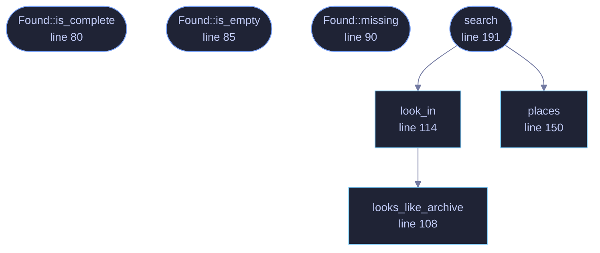

<!-- GENERATED by tools/docs/generate.py from the doc comments in the source. Do not edit: edit the .rs file and run the generator. -->

# `crates/veilvoice-verify/src/discover.rs`

[[veilvoice-verify|Crate-veilvoice-verify]] &middot; 364 lines &middot; [read the source](https://github.com/tilas01/veilvoice/blob/main/crates/veilvoice-verify/src/discover.rs)

## Contents

- [Why this exists](#why-this-exists)
- [Where it looks, and why in that order](#where-it-looks-and-why-in-that-order)
- [What counts as a release archive](#what-counts-as-a-release-archive)
- [In plain words](#in-plain-words)
  - [What calls what](#what-calls-what)
  - [Items](#items)

Finding a release to check, without being told where it is.

# Why this exists

Verifying a download used to require naming three files and knowing a tag.
That is fine for somebody who has already read the instructions and is
wrong for everybody else — and "everybody else" is precisely the population
a verifier exists to serve. Somebody who has just downloaded an archive and
wants to know whether it is the real one should be able to run this and be
told.

So: look in the obvious places, in an obvious order, and say what was found.
Nothing here downloads, nothing here guesses at a hash, and nothing here
reports "verified" on the strength of a filename.

# Where it looks, and why in that order

1. The directory given, if one was.
2. The current working directory — where somebody who has just `cd`-ed to
their downloads will be.
3. The directory the running binary is in — where somebody who unpacked the
archive and double-clicked the verifier inside it will be.
4. The usual download directories for the platform.

Each is searched one level deep only. A recursive walk of a home directory
is slow, surprising, and would let a verifier wander into places nobody
asked it to look at.

# What counts as a release archive

A file whose name starts `veilvoice-` and ends in one of the archive
extensions this project publishes. That is a **filename** test and it proves
nothing at all — it is how candidates are found, never how they are judged.
Every candidate still has to survive the signature and the hash, and a file
that merely looks the part fails exactly as loudly as one that does not.

# In plain words

Looks for a downloaded release to check, so you can double-click the verifier
and have it work.

It looks in the folder it is in, the current folder, and your Downloads and
Desktop. If it finds nothing it says exactly where it looked, rather than
reporting a failure that leaves you guessing.

## What this file contains

364 lines defining **7 functions** (7 public), **1 type** and **4 constants**. Everything below is read out of the source, so it cannot disagree with the code.

**The types it owns.**

- `struct Found` (line 65) -- What was found in one directory.

**What happens when it runs.** These are the ways in: public, and nothing else in this file calls them, so they are what an outside caller reaches first.

- `Found::is_complete` (line 80) -- Whether this directory holds everything needed to verify offline.
- `Found::is_empty` (line 85) -- Whether anything at all turned up.
- `Found::missing` (line 90) -- What is missing, in words, for a message to the user.
- `search` (line 191) -- Look everywhere worth looking and return the first directory that holds a complete, checkable set — or, failing that, everything that turned up.
  - reaches: `look_in`, `places`, `looks_like_archive`

## What calls what

_Colour key: **entry** -- a way in: public, and nothing in this file calls it; **api** -- public, and also used inside this file._

  

The same graph as Mermaid source

## Items

| Item | Line | Documentation |
|---|---:|---|
| `ARCHIVES` const | [50](https://github.com/tilas01/veilvoice/blob/main/crates/veilvoice-verify/src/discover.rs#L50) | The extensions this project publishes releases as. |
| `SUMS` pub const | [53](https://github.com/tilas01/veilvoice/blob/main/crates/veilvoice-verify/src/discover.rs#L53) | The names of the two files a signed release carries beside its archives. |
| `SUMS_SIG` pub const | [55](https://github.com/tilas01/veilvoice/blob/main/crates/veilvoice-verify/src/discover.rs#L55) | The detached signature over SUMS. |
| `CONTENTS` pub const | [61](https://github.com/tilas01/veilvoice/blob/main/crates/veilvoice-verify/src/discover.rs#L61) | The list of what is inside each archive, itself covered by SUMS. |
| `Found` pub struct | [65](https://github.com/tilas01/veilvoice/blob/main/crates/veilvoice-verify/src/discover.rs#L65) | What was found in one directory. |
| `Found::is_complete` pub fn | [80](https://github.com/tilas01/veilvoice/blob/main/crates/veilvoice-verify/src/discover.rs#L80) | Whether this directory holds everything needed to verify offline. |
| `Found::is_empty` pub fn | [85](https://github.com/tilas01/veilvoice/blob/main/crates/veilvoice-verify/src/discover.rs#L85) | Whether anything at all turned up. |
| `Found::missing` pub fn | [90](https://github.com/tilas01/veilvoice/blob/main/crates/veilvoice-verify/src/discover.rs#L90) | What is missing, in words, for a message to the user. |
| `looks_like_archive` pub fn | [108](https://github.com/tilas01/veilvoice/blob/main/crates/veilvoice-verify/src/discover.rs#L108) | Whether a filename looks like one of this project's release archives. |
| `look_in` pub fn | [114](https://github.com/tilas01/veilvoice/blob/main/crates/veilvoice-verify/src/discover.rs#L114) | Look in one directory, one level deep. |
| `places` pub fn | [150](https://github.com/tilas01/veilvoice/blob/main/crates/veilvoice-verify/src/discover.rs#L150) | Every place worth looking, in order, without duplicates. |
| `search` pub fn | [191](https://github.com/tilas01/veilvoice/blob/main/crates/veilvoice-verify/src/discover.rs#L191) | Look everywhere worth looking and return the first directory that holds a complete, checkable set — or, failing that, everything that turned up. |
