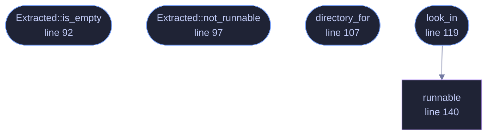

<!-- GENERATED by tools/docs/generate.py from the doc comments in the source. Do not edit: edit the .rs file and run the generator. -->

# `crates/veilvoice-verify/src/extracted.rs`

[[veilvoice-verify|Crate-veilvoice-verify]] &middot; 312 lines &middot; [read the source](https://github.com/tilas01/veilvoice/blob/main/crates/veilvoice-verify/src/extracted.rs)

## Contents

- [This used to be the honest limit, and it is not the limit any more](#this-used-to-be-the-honest-limit-and-it-is-not-the-limit-any-more)
- [GnuPG](#gnupg)
- [In plain words](#in-plain-words)
  - [What calls what](#what-calls-what)
  - [Items](#items)

What came out of the archive, and the GnuPG somebody already has.

**Marker 91.** Two halves of the same request: check the extracted copy as
well as the archive, and offer the check through GnuPG for anybody who would
rather trust their own tools than this binary.

# This used to be the honest limit, and it is not the limit any more

Worth reading before the code, because the module changed shape around it.

A release signs `SHA256SUMS`, and `SHA256SUMS` covers the **archives**. So
verifying `veilvoice-0.1.14-linux-x86_64.zip` proved that archive was the
one that was signed, and proved nothing at all about the folder sitting
beside it. The folder may predate the download, may have come out of a
different copy, may have been edited since. Nothing on disk records which
archive a directory was extracted from.

That was written here as a limit that could not be lifted, and it could not
be lifted **from this side**. It was lifted from the other one. A release
now also publishes `CONTENTS.sha256`, listing every file inside every
archive with its SHA-256, staged before `SHA256SUMS` is computed so that the
signature covers it too. `veilvoice_check::contents` reads it and `lib.rs`
checks the extracted folder against it, file by file, and reports anything
in that folder the release never published.

The lesson is worth keeping beside the code: "no signed list covers loose
files" was a true statement about the release format, and it was being
treated as a fact about the world. Publishing one more file changed it.

What is left here is the part no hash can answer. A file can be byte for
byte correct and still not start, because the tool that unpacked it dropped
the execute bit, and somebody in that position has a folder that looks
perfect and does nothing. That is what `look_in` and `Program::runnable`
are for, and they are still asked after every hash has matched.

Releases published before v0.1.15 carry no contents list, and for those the
old report and the old caveat are exactly what is printed, because they were
honest then and still are.

# GnuPG

VeilVoice checks the signature itself, with the key compiled into this
binary, so that somebody with no GnuPG installed is not stuck. That is a
convenience and it has an obvious circularity: the program telling you the
download is genuine is a program from the same download.

`gnupg_commands` is the answer to that. It prints the exact commands to
run with a GnuPG this project did not write, against a key fingerprint
published somewhere this project does not control. Anybody who wants the
independent check has it, spelled out, with nothing to work out.

# In plain words

Checks the folder you unzipped, as well as the zip.

From v0.1.15 a release publishes a signed list of everything inside each
archive, so every file in that folder is checked against it, and anything in
there that was not part of the release is named. For older releases, which
carry no such list, it can only tell you the programs are there and that
your system will run them, and it says so rather than implying more.

## What this file contains

312 lines defining **5 functions** (4 public), **2 types** and **1 constant**. Everything below is read out of the source, so it cannot disagree with the code.

**The types it owns.**

- `struct Program` (line 70) -- One program found in an extracted directory.
- `struct Extracted` (line 83) -- What an extracted directory turned out to hold.

**What happens when it runs.** These are the ways in: public, and nothing else in this file calls them, so they are what an outside caller reaches first.

- `Extracted::is_empty` (line 92) -- Whether anything was found at all.
- `Extracted::not_runnable` (line 97) -- The programs the operating system will not run.
- `directory_for` (line 107) -- The directory an archive would extract into, by this project's naming.
- `look_in` (line 119) -- Look in directory for the programs a release carries.
  - reaches: `runnable`

## What calls what

_Colour key: **entry** -- a way in: public, and nothing in this file calls it; **helper** -- private to this file._

  

The same graph as Mermaid source

## Items

| Item | Line | Documentation |
|---|---:|---|
| `PROGRAMS` pub const | [66](https://github.com/tilas01/veilvoice/blob/main/crates/veilvoice-verify/src/extracted.rs#L66) | The programs a release archive carries. |
| `Program` pub struct | [70](https://github.com/tilas01/veilvoice/blob/main/crates/veilvoice-verify/src/extracted.rs#L70) | One program found in an extracted directory. |
| `Extracted` pub struct | [83](https://github.com/tilas01/veilvoice/blob/main/crates/veilvoice-verify/src/extracted.rs#L83) | What an extracted directory turned out to hold. |
| `Extracted::is_empty` pub fn | [92](https://github.com/tilas01/veilvoice/blob/main/crates/veilvoice-verify/src/extracted.rs#L92) | Whether anything was found at all. |
| `Extracted::not_runnable` pub fn | [97](https://github.com/tilas01/veilvoice/blob/main/crates/veilvoice-verify/src/extracted.rs#L97) | The programs the operating system will not run. |
| `directory_for` pub fn | [107](https://github.com/tilas01/veilvoice/blob/main/crates/veilvoice-verify/src/extracted.rs#L107) | The directory an archive would extract into, by this project's naming. |
| `look_in` pub fn | [119](https://github.com/tilas01/veilvoice/blob/main/crates/veilvoice-verify/src/extracted.rs#L119) | Look in directory for the programs a release carries. |
| `runnable` fn | [140](https://github.com/tilas01/veilvoice/blob/main/crates/veilvoice-verify/src/extracted.rs#L140) | Whether the operating system will run this file. |
