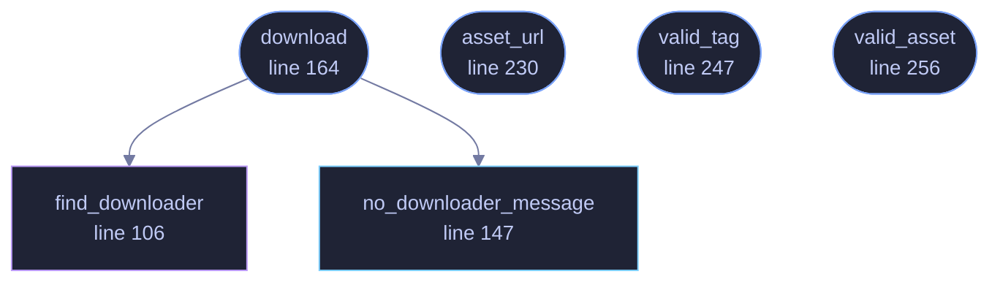

<!-- GENERATED by tools/docs/generate.py from the doc comments in the source. Do not edit: edit the .rs file and run the generator. -->

# `crates/veilvoice-verify/src/fetch.rs`

[[veilvoice-verify|Crate-veilvoice-verify]] &middot; 329 lines &middot; [read the source](https://github.com/tilas01/veilvoice/blob/main/crates/veilvoice-verify/src/fetch.rs)

## Contents

- [The constraint this is written around](#the-constraint-this-is-written-around)
- [What is deliberately not done here](#what-is-deliberately-not-done-here)
- [In plain words](#in-plain-words)
  - [What calls what](#what-calls-what)
  - [Items](#items)

Download a release, without putting an HTTP client in the dependency graph.

# The constraint this is written around

VeilVoice is **offline by construction**, and that is not a slogan: a CI job
fails the build if `reqwest`, `hyper`, `curl`, `ureq`, `tungstenite`,
`isahc` or `surf` appears anywhere in `cargo tree`. The claim on the front
page -- "no network code in the dependency graph" -- is one a reader can
check in ten seconds, and it is a large part of why this project is worth
trusting.

Fetching a release to check it is a genuinely useful thing for *this*
binary to do, and it is also the one thing that claim forbids. So the
download is done by **the tool the operating system already ships**, invoked
as a subprocess:

| Platform | Used | Already present because |
|---|---|---|
| Windows 10+ | `curl.exe` | shipped in `System32` since 2018 |
| macOS | `curl` | part of the base system |
| Linux, BSD | `curl`, else `wget` | one or the other is on essentially every install |

`cargo tree` stays exactly as clean as it was, the CI job that enforces it
is untouched, and nothing in the *library* crates gained the ability to talk
to anything. What changed is that one command-line tool, whose entire
purpose is checking downloads, can now also make one -- when asked, never on
its own.

This is the same pattern the rest of the project already uses for
platform work it will not link a dependency for: `veilvoice-watch` reads the
registry through `reg query`, and `veilvoice-guard` reads the event log
through `wevtutil`.

# What is deliberately not done here

**No downloader is resolved by bare name.** Finding `curl` by searching
`PATH` on Windows includes the current directory, so running this from a
folder containing a hostile `curl.exe` would run that instead -- finding
F-13, in the one program whose job is deciding whether a download is
genuine. Absolute paths are tried first, and a bare name is only ever a
last resort on platforms where the search order does not include the
working directory.

**Nothing is fetched implicitly.** A download happens because the user
passed a subcommand that says so. There is no update check, no telemetry,
and no "just in case" request.

**Only one host is ever contacted**, and it is compiled in. A URL cannot be
supplied on the command line, so this cannot be turned into a general
downloader by an argument.

# In plain words

Downloads a release, without VeilVoice containing any networking code.

It asks the tool your system already has to do the fetching. That is what keeps
a real promise the rest of the project makes: there is no HTTP client anywhere
in what VeilVoice is built from, which you can check yourself, and this is the
one command that touches the network at all.

## What this file contains

329 lines defining **6 functions** (5 public), **2 types** and **5 constants**. Everything below is read out of the source, so it cannot disagree with the code.

**The types it owns.**

- `struct Downloader` (line 85) -- Where a downloader was found, and what to call it.
- `enum Style` (line 91)

**What happens when it runs.** These are the ways in: public, and nothing else in this file calls them, so they are what an outside caller reaches first.

- `download` (line 164) -- Fetch one URL into into.
  - reaches: `find_downloader`, `no_downloader_message`
- `asset_url` (line 230) -- The URL of one file in one release.
- `valid_tag` (line 247) -- A release tag, rejected unless it looks like one.
- `valid_asset` (line 256) -- An asset filename, rejected unless it looks like one.

## What calls what

_Colour key: **entry** -- a way in: public, and nothing in this file calls it; **api** -- public, and also used inside this file; **helper** -- private to this file._

  

The same graph as Mermaid source

## Items

| Item | Line | Documentation |
|---|---:|---|
| `HOST` pub const | [71](https://github.com/tilas01/veilvoice/blob/main/crates/veilvoice-verify/src/fetch.rs#L71) | The only host this will ever talk to. |
| `REPO` pub const | [74](https://github.com/tilas01/veilvoice/blob/main/crates/veilvoice-verify/src/fetch.rs#L74) | The repository releases are fetched from. |
| `MAX_BYTES` pub const | [82](https://github.com/tilas01/veilvoice/blob/main/crates/veilvoice-verify/src/fetch.rs#L82) | The largest file this will accept. |
| `Downloader` struct | [85](https://github.com/tilas01/veilvoice/blob/main/crates/veilvoice-verify/src/fetch.rs#L85) | Where a downloader was found, and what to call it. |
| `Style` enum | [91](https://github.com/tilas01/veilvoice/blob/main/crates/veilvoice-verify/src/fetch.rs#L91) |  |
| `find_downloader` fn | [106](https://github.com/tilas01/veilvoice/blob/main/crates/veilvoice-verify/src/fetch.rs#L106) | Absolute paths first, and a bare name only where that is safe. |
| `no_downloader_message` pub fn | [147](https://github.com/tilas01/veilvoice/blob/main/crates/veilvoice-verify/src/fetch.rs#L147) | Say what could not be found, and what to do instead. |
| `download` pub fn | [164](https://github.com/tilas01/veilvoice/blob/main/crates/veilvoice-verify/src/fetch.rs#L164) | Fetch one URL into into. |
| `asset_url` pub fn | [230](https://github.com/tilas01/veilvoice/blob/main/crates/veilvoice-verify/src/fetch.rs#L230) | The URL of one file in one release. |
| `SUMS` pub const | [235](https://github.com/tilas01/veilvoice/blob/main/crates/veilvoice-verify/src/fetch.rs#L235) | The three files every release publishes for checking itself. |
| `SIGNATURE` pub const | [236](https://github.com/tilas01/veilvoice/blob/main/crates/veilvoice-verify/src/fetch.rs#L236) |  |
| `valid_tag` pub fn | [247](https://github.com/tilas01/veilvoice/blob/main/crates/veilvoice-verify/src/fetch.rs#L247) | A release tag, rejected unless it looks like one. |
| `valid_asset` pub fn | [256](https://github.com/tilas01/veilvoice/blob/main/crates/veilvoice-verify/src/fetch.rs#L256) | An asset filename, rejected unless it looks like one. |
