<!-- GENERATED by tools/docs/generate.py from the doc comments in the source. Do not edit: edit the .rs file and run the generator. -->

# `crates/veilvoice-verify/src/main.rs`

[[veilvoice-verify|Crate-veilvoice-verify]] &middot; 617 lines &middot; [read the source](https://github.com/tilas01/veilvoice/blob/main/crates/veilvoice-verify/src/main.rs)

## Contents

- [What this is for](#what-this-is-for)
- [The one thing it cannot embed](#the-one-thing-it-cannot-embed)
- [What it does not do](#what-it-does-not-do)
  - [What calls what](#what-calls-what)
  - [Items](#items)

The portable verifier: check a VeilVoice release without GnuPG installed.

# What this is for

Verifying a download by hand needs GnuPG and a SHA-256 tool. That is four
commands and two dependencies, and on Windows it is usually neither. This
is one binary that does the same checks with nothing else installed: the
signing key and its fingerprint are compiled into it.

# The one thing it cannot embed

It cannot carry the expected hash of the file it is checking. A file cannot
contain its own digest -- writing the digest in changes the file, which
changes the digest. So the hash has to come from outside, and there are
exactly two places it can come from. They prove **different things**, and
this tool is careful never to blur them:

**From the published `SHA256SUMS`** -- whose signature this tool checks
against the embedded key. A match proves the download is *intact*: it is
byte-for-byte the file that was published, not a corrupted or substituted
one. It says nothing about whether that file corresponds to the source,
because whoever published it produced both the file and the list.

**Typed in by hand, from a hash somebody else produced** by building the
same tagged source themselves. A match proves something strictly stronger:
that the published binary is what that source compiles to, on a machine
that is not the publisher's. That is *reproducibility*, and it is the only
check that does not ultimately rest on trusting whoever signed the release.

Most people want the first. The second is what makes the first worth
anything, and it needs somebody other than the author to have done a build.
`docs/REPRODUCIBLE_BUILDS.md` says how.

# What it does not do

It does not download anything -- this project has no network code and this
binary is not the exception. Fetch the files however you like; this reads
them from disk. It does not install anything, and it writes nothing.

## What calls what

```mermaid
%%{init: {"theme":"base","themeVariables":{"background":"#1a1b26","primaryColor":"#1f2335","primaryTextColor":"#c0caf5","primaryBorderColor":"#7aa2f7","secondaryColor":"#16161e","tertiaryColor":"#16161e","lineColor":"#737aa2","textColor":"#c0caf5","mainBkg":"#1f2335","nodeBorder":"#7aa2f7","clusterBkg":"#16161e","clusterBorder":"#2f3549","fontFamily":"ui-monospace, SFMono-Regular, Consolas, monospace","fontSize":"14px"}}}%%
flowchart TD
    n_good["good"]
    n_deny["deny"]
    n_embedded_key["embedded_key"]
    n_fingerprint_of["fingerprint_of"]
    n_sha256_file["sha256_file"]
    n_digests_match["digests_match"]
    n_digest_from_sums["digest_from_sums"]
    n_verify_detached["verify_detached"]
    n_read_text["read_text"]
    n_command_key["command_key"]
    n_command_sums["command_sums"]
    n_command_file_against_sums["command_file_against_sums"]
    n_command_file_against_hash["command_file_against_hash"]
    n_command_hash["command_hash"]
    n_take_value["take_value"]
    n_main["main"]
    n_command_file_against_hash --> n_deny
    n_command_file_against_hash --> n_digests_match
    n_command_file_against_hash --> n_good
    n_command_file_against_hash --> n_sha256_file
    n_command_file_against_sums --> n_deny
    n_command_file_against_sums --> n_digest_from_sums
    n_command_file_against_sums --> n_digests_match
    n_command_file_against_sums --> n_embedded_key
    n_command_file_against_sums --> n_good
    n_command_file_against_sums --> n_read_text
    n_command_file_against_sums --> n_sha256_file
    n_command_file_against_sums --> n_verify_detached
    n_command_hash --> n_deny
    n_command_hash --> n_sha256_file
    n_command_key --> n_deny
    n_command_key --> n_embedded_key
    n_command_key --> n_fingerprint_of
    n_command_sums --> n_deny
    n_command_sums --> n_embedded_key
    n_command_sums --> n_good
    n_command_sums --> n_read_text
    n_command_sums --> n_verify_detached
    n_embedded_key --> n_fingerprint_of
    n_main --> n_command_file_against_hash
    n_main --> n_command_file_against_sums
    n_main --> n_command_hash
    n_main --> n_command_key
    n_main --> n_command_sums
    n_main --> n_deny
    n_main --> n_take_value
```

## Items

| Item | Line | Documentation |
|---|---:|---|
| `PUBLIC_KEY` const | [57](https://github.com/tilas01/veilvoice/blob/main/crates/veilvoice-verify/src/main.rs#L57) | The signing key, compiled in. |
| `FINGERPRINT` const | [69](https://github.com/tilas01/veilvoice/blob/main/crates/veilvoice-verify/src/main.rs#L69) | The fingerprint, written out rather than derived. |
| `USAGE` const | [71](https://github.com/tilas01/veilvoice/blob/main/crates/veilvoice-verify/src/main.rs#L71) |  |
| `EXPLAIN` const | [100](https://github.com/tilas01/veilvoice/blob/main/crates/veilvoice-verify/src/main.rs#L100) |  |
| `good` fn | [147](https://github.com/tilas01/veilvoice/blob/main/crates/veilvoice-verify/src/main.rs#L147) |  |
| `deny` fn | [152](https://github.com/tilas01/veilvoice/blob/main/crates/veilvoice-verify/src/main.rs#L152) | Every refusal goes through here, so every refusal names the check. |
| `embedded_key` fn | [172](https://github.com/tilas01/veilvoice/blob/main/crates/veilvoice-verify/src/main.rs#L172) | Parse the embedded key and confirm its fingerprint is the expected one. |
| `fingerprint_of` fn | [185](https://github.com/tilas01/veilvoice/blob/main/crates/veilvoice-verify/src/main.rs#L185) |  |
| `sha256_file` fn | [202](https://github.com/tilas01/veilvoice/blob/main/crates/veilvoice-verify/src/main.rs#L202) | SHA-256 of a file, read in chunks. |
| `digests_match` fn | [231](https://github.com/tilas01/veilvoice/blob/main/crates/veilvoice-verify/src/main.rs#L231) | Compare two hex digests without caring about case or stray whitespace. |
| `digest_from_sums` fn | [241](https://github.com/tilas01/veilvoice/blob/main/crates/veilvoice-verify/src/main.rs#L241) | Find a file's line in a sha256sum-format list. |
| `verify_detached` fn | [264](https://github.com/tilas01/veilvoice/blob/main/crates/veilvoice-verify/src/main.rs#L264) | Verify a detached signature over data using the embedded key. |
| `read_text` fn | [286](https://github.com/tilas01/veilvoice/blob/main/crates/veilvoice-verify/src/main.rs#L286) |  |
| `command_key` fn | [290](https://github.com/tilas01/veilvoice/blob/main/crates/veilvoice-verify/src/main.rs#L290) |  |
| `command_sums` fn | [309](https://github.com/tilas01/veilvoice/blob/main/crates/veilvoice-verify/src/main.rs#L309) |  |
| `command_file_against_sums` fn | [347](https://github.com/tilas01/veilvoice/blob/main/crates/veilvoice-verify/src/main.rs#L347) |  |
| `command_file_against_hash` fn | [431](https://github.com/tilas01/veilvoice/blob/main/crates/veilvoice-verify/src/main.rs#L431) |  |
| `command_hash` fn | [483](https://github.com/tilas01/veilvoice/blob/main/crates/veilvoice-verify/src/main.rs#L483) |  |
| `take_value` fn | [500](https://github.com/tilas01/veilvoice/blob/main/crates/veilvoice-verify/src/main.rs#L500) |  |
| `main` fn | [506](https://github.com/tilas01/veilvoice/blob/main/crates/veilvoice-verify/src/main.rs#L506) |  |
