<!-- GENERATED by tools/docs/generate.py from the doc comments in the source. Do not edit: edit the .rs file and run the generator. -->

# `crates/veilvoice-video/src/accel.rs`

[[veilvoice-video|Crate-veilvoice-video]] &middot; 652 lines &middot; [read the source](https://github.com/tilas01/veilvoice/blob/main/crates/veilvoice-video/src/accel.rs)

## Contents

- [The honest answer about the audio engine, with the number](#the-honest-answer-about-the-audio-engine-with-the-number)
- [Where it genuinely helps, which is video](#where-it-genuinely-helps-which-is-video)
- [Detection asks the system, and can fail](#detection-asks-the-system-and-can-fail)
- [In plain words](#in-plain-words)
  - [What calls what](#what-calls-what)
  - [Items](#items)

What hardware this machine has, and the one place VeilVoice can use it.

# The honest answer about the audio engine, with the number

**The de-identifier is not going on a graphics card, and it would be slower
if it did.** That is a measurement rather than an opinion: veiling sixty
seconds of audio takes about 0.58 seconds on one core of an ordinary
desktop, which is roughly a hundred times faster than real time. Live mode
works on 1024-sample frames, so each frame has about 21 ms to be finished
in and takes about 0.05 ms.

A graphics card is fast at doing the same arithmetic to a very large batch
at once. It is not fast at answering small questions quickly: getting 1024
samples onto the card, waiting for a kernel, and getting them back costs
more than the whole computation. Offering a "use the GPU" switch for that
work would make VeilVoice slower and would be exactly the kind of claim
this project refuses to make.

# Where it genuinely helps, which is video

Encoding a video is the opposite shape of problem: a great deal of the same
work, on large frames, where a dedicated encoder block on the card does in
hardware what `libx264` does on the processor. Every current NVIDIA card has
**NVENC**, every current AMD card has **AMF**, and Intel's integrated
graphics have **Quick Sync**. That is what this crate detects and what
`veilvoice conversation video` can be pointed at.

# Detection asks the system, and can fail

There is no portable way to enumerate graphics hardware from the standard
library, and every native route is FFI. So this asks a tool the platform
already ships, exactly as the rest of this workspace does, and when it
cannot it says so rather than reporting an empty machine.

**Finding a card is not the same as being able to use it.** An encoder needs
a driver, and it needs the copy of `ffmpeg` on this machine to have been
built with support for it. `Adapter::caveat` says so, and nothing here
reports a device as usable on the strength of its name.

# In plain words

Changing a voice is already about a hundred times faster than listening to
it, so there is nothing for a graphics card to speed up, and pretending
otherwise would just make VeilVoice slower. Making a **video** is different:
that is real work, and most graphics cards have a dedicated chip for it.

So this finds the graphics hardware you have, tells you which of it can
encode video, and lets you pick. If you have two cards, an integrated one
and a separate one, you can say which. And it is honest that finding a card
is not proof it will work: that also depends on your drivers and on the
copy of ffmpeg you have.

## What this file contains

652 lines defining **17 functions** (11 public), **3 types** and **2 constants**. Everything below is read out of the source, so it cannot disagree with the code.

**The types it owns.**

- `enum Vendor` (line 62) -- Who made a graphics device.
- `struct Adapter` (line 120) -- One graphics device.
- `struct Found` (line 173) -- Everything found, and anything that went wrong looking.

**What happens when it runs.** These are the ways in: public, and nothing else in this file calls them, so they are what an outside caller reaches first.

- `Vendor::encoder` (line 96) -- The ffmpeg encoder this vendor's hardware provides, if any.
- `Vendor::encoder_name` (line 107) -- What to call the encoder in front of a person.
- `Adapter::encoder` (line 136) -- The encoder to ask ffmpeg for, if this device has one.
- `Adapter::caveat` (line 141) -- What finding this device does and does not establish.
- `Adapter::describe` (line 149) -- One line, for a list.
- `Found::is_answerable` (line 185) -- Whether anything could be established at all.
- `Found::why_recommended` (line 210) -- Why that one, in the words to show.
  - reaches: `recommended`
- `look` (line 236) -- Look for graphics hardware.
  - reaches: `linux_adapters`, `macos_adapters`, `windows_adapters`, `adapter`, `tool`, `parse_pairs`, `of`
- `usable_threads` (line 432) -- How many threads this machine can usefully run at once.

## What calls what

_Colour key: **entry** -- a way in: public, and nothing in this file calls it; **api** -- public, and also used inside this file; **helper** -- private to this file._

  

The same graph as Mermaid source

```mermaid
%%{init: {"theme":"base","themeVariables":{"background":"#1a1b26","primaryColor":"#1f2335","primaryTextColor":"#c0caf5","primaryBorderColor":"#7aa2f7","secondaryColor":"#16161e","tertiaryColor":"#16161e","lineColor":"#737aa2","textColor":"#c0caf5","mainBkg":"#1f2335","nodeBorder":"#7aa2f7","clusterBkg":"#16161e","clusterBorder":"#2f3549","fontFamily":"ui-monospace, SFMono-Regular, Consolas, monospace","fontSize":"14px"}}}%%
flowchart TD
    n_of["Vendor::of<br/>line 77"]
    n_encoder(["Vendor::encoder<br/>line 96"])
    n_encoder_name(["Vendor::encoder_name<br/>line 107"])
    n_encoder(["Adapter::encoder<br/>line 136"])
    n_caveat(["Adapter::caveat<br/>line 141"])
    n_describe(["Adapter::describe<br/>line 149"])
    n_is_answerable(["Found::is_answerable<br/>line 185"])
    n_recommended["Found::recommended<br/>line 196"]
    n_why_recommended(["Found::why_recommended<br/>line 210"])
    n_look(["look<br/>line 236"])
    n_windows_adapters["windows_adapters<br/>line 260"]
    n_tool["tool<br/>line 305"]
    n_linux_adapters["linux_adapters<br/>line 319"]
    n_macos_adapters["macos_adapters<br/>line 358"]
    n_parse_pairs["parse_pairs<br/>line 384"]
    n_adapter["adapter<br/>line 407"]
    n_usable_threads(["usable_threads<br/>line 432"])
    n_adapter --> n_of
    n_linux_adapters --> n_adapter
    n_linux_adapters --> n_tool
    n_look --> n_linux_adapters
    n_look --> n_macos_adapters
    n_look --> n_windows_adapters
    n_macos_adapters --> n_adapter
    n_parse_pairs --> n_adapter
    n_why_recommended --> n_recommended
    n_windows_adapters --> n_parse_pairs
    click n_of href "https://github.com/tilas01/veilvoice/blob/main/crates/veilvoice-video/src/accel.rs#L77" "open the source"
    click n_encoder href "https://github.com/tilas01/veilvoice/blob/main/crates/veilvoice-video/src/accel.rs#L96" "open the source"
    click n_encoder_name href "https://github.com/tilas01/veilvoice/blob/main/crates/veilvoice-video/src/accel.rs#L107" "open the source"
    click n_encoder href "https://github.com/tilas01/veilvoice/blob/main/crates/veilvoice-video/src/accel.rs#L136" "open the source"
    click n_caveat href "https://github.com/tilas01/veilvoice/blob/main/crates/veilvoice-video/src/accel.rs#L141" "open the source"
    click n_describe href "https://github.com/tilas01/veilvoice/blob/main/crates/veilvoice-video/src/accel.rs#L149" "open the source"
    click n_is_answerable href "https://github.com/tilas01/veilvoice/blob/main/crates/veilvoice-video/src/accel.rs#L185" "open the source"
    click n_recommended href "https://github.com/tilas01/veilvoice/blob/main/crates/veilvoice-video/src/accel.rs#L196" "open the source"
    click n_why_recommended href "https://github.com/tilas01/veilvoice/blob/main/crates/veilvoice-video/src/accel.rs#L210" "open the source"
    click n_look href "https://github.com/tilas01/veilvoice/blob/main/crates/veilvoice-video/src/accel.rs#L236" "open the source"
    click n_windows_adapters href "https://github.com/tilas01/veilvoice/blob/main/crates/veilvoice-video/src/accel.rs#L260" "open the source"
    click n_tool href "https://github.com/tilas01/veilvoice/blob/main/crates/veilvoice-video/src/accel.rs#L305" "open the source"
    click n_linux_adapters href "https://github.com/tilas01/veilvoice/blob/main/crates/veilvoice-video/src/accel.rs#L319" "open the source"
    click n_macos_adapters href "https://github.com/tilas01/veilvoice/blob/main/crates/veilvoice-video/src/accel.rs#L358" "open the source"
    click n_parse_pairs href "https://github.com/tilas01/veilvoice/blob/main/crates/veilvoice-video/src/accel.rs#L384" "open the source"
    click n_adapter href "https://github.com/tilas01/veilvoice/blob/main/crates/veilvoice-video/src/accel.rs#L407" "open the source"
    click n_usable_threads href "https://github.com/tilas01/veilvoice/blob/main/crates/veilvoice-video/src/accel.rs#L432" "open the source"
    classDef entry fill:#1f2335,stroke:#7aa2f7,color:#c0caf5
    class n_encoder,n_encoder_name,n_encoder,n_caveat,n_describe,n_is_answerable,n_why_recommended,n_look,n_usable_threads entry
    classDef api fill:#1f2335,stroke:#7dcfff,color:#c0caf5
    class n_of,n_recommended api
    classDef helper fill:#1f2335,stroke:#bb9af7,color:#c0caf5
    class n_windows_adapters,n_tool,n_linux_adapters,n_macos_adapters,n_parse_pairs,n_adapter helper
```

## Items

| Item | Line | Documentation |
|---|---:|---|
| `Vendor` pub enum | [62](https://github.com/tilas01/veilvoice/blob/main/crates/veilvoice-video/src/accel.rs#L62) | Who made a graphics device. |
| `Vendor::of` pub fn | [77](https://github.com/tilas01/veilvoice/blob/main/crates/veilvoice-video/src/accel.rs#L77) | The vendor a device name belongs to. |
| `Vendor::encoder` pub fn | [96](https://github.com/tilas01/veilvoice/blob/main/crates/veilvoice-video/src/accel.rs#L96) | The ffmpeg encoder this vendor's hardware provides, if any. |
| `Vendor::encoder_name` pub fn | [107](https://github.com/tilas01/veilvoice/blob/main/crates/veilvoice-video/src/accel.rs#L107) | What to call the encoder in front of a person. |
| `Adapter` pub struct | [120](https://github.com/tilas01/veilvoice/blob/main/crates/veilvoice-video/src/accel.rs#L120) | One graphics device. |
| `Adapter::encoder` pub fn | [136](https://github.com/tilas01/veilvoice/blob/main/crates/veilvoice-video/src/accel.rs#L136) | The encoder to ask ffmpeg for, if this device has one. |
| `Adapter::caveat` pub fn | [141](https://github.com/tilas01/veilvoice/blob/main/crates/veilvoice-video/src/accel.rs#L141) | What finding this device does and does not establish. |
| `Adapter::describe` pub fn | [149](https://github.com/tilas01/veilvoice/blob/main/crates/veilvoice-video/src/accel.rs#L149) | One line, for a list. |
| `Found` pub struct | [173](https://github.com/tilas01/veilvoice/blob/main/crates/veilvoice-video/src/accel.rs#L173) | Everything found, and anything that went wrong looking. |
| `Found::is_answerable` pub fn | [185](https://github.com/tilas01/veilvoice/blob/main/crates/veilvoice-video/src/accel.rs#L185) | Whether anything could be established at all. |
| `Found::recommended` pub fn | [196](https://github.com/tilas01/veilvoice/blob/main/crates/veilvoice-video/src/accel.rs#L196) | The device to suggest, and why. |
| `Found::why_recommended` pub fn | [210](https://github.com/tilas01/veilvoice/blob/main/crates/veilvoice-video/src/accel.rs#L210) | Why that one, in the words to show. |
| `look` pub fn | [236](https://github.com/tilas01/veilvoice/blob/main/crates/veilvoice-video/src/accel.rs#L236) | Look for graphics hardware. |
| `windows_adapters` fn | [260](https://github.com/tilas01/veilvoice/blob/main/crates/veilvoice-video/src/accel.rs#L260) | Ask Windows through its own management interface. |
| `tool` fn | [305](https://github.com/tilas01/veilvoice/blob/main/crates/veilvoice-video/src/accel.rs#L305) | Resolve a tool to an absolute path, never through PATH. |
| `linux_adapters` fn | [319](https://github.com/tilas01/veilvoice/blob/main/crates/veilvoice-video/src/accel.rs#L319) | Ask Linux through lspci. |
| `macos_adapters` fn | [358](https://github.com/tilas01/veilvoice/blob/main/crates/veilvoice-video/src/accel.rs#L358) | Ask macOS through system_profiler. |
| `parse_pairs` fn | [384](https://github.com/tilas01/veilvoice/blob/main/crates/veilvoice-video/src/accel.rs#L384) | name\|driver lines into adapters. |
| `adapter` fn | [407](https://github.com/tilas01/veilvoice/blob/main/crates/veilvoice-video/src/accel.rs#L407) | One adapter from a name. |
| `usable_threads` pub fn | [432](https://github.com/tilas01/veilvoice/blob/main/crates/veilvoice-video/src/accel.rs#L432) | How many threads this machine can usefully run at once. |
| `WHY_NOT_THE_ENGINE` pub const | [439](https://github.com/tilas01/veilvoice/blob/main/crates/veilvoice-video/src/accel.rs#L439) | Why the audio engine is not offered a graphics card, with the numbers. |
| `WHAT_IT_CHANGES` pub const | [450](https://github.com/tilas01/veilvoice/blob/main/crates/veilvoice-video/src/accel.rs#L450) | What hardware encoding is for, and what it does not change. |
