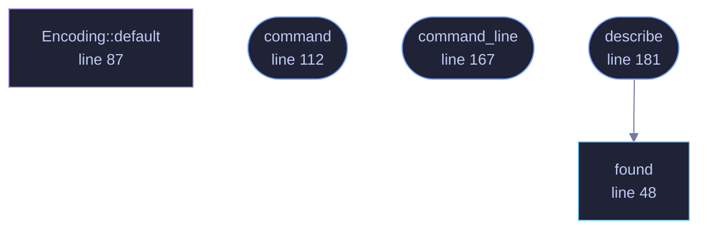

<!-- GENERATED by tools/docs/generate.py from the doc comments in the source. Do not edit: edit the .rs file and run the generator. -->

# `crates/veilvoice-video/src/ffmpeg.rs`

[[veilvoice-video|Crate-veilvoice-video]] &middot; 316 lines &middot; [read the source](https://github.com/tilas01/veilvoice/blob/main/crates/veilvoice-video/src/ffmpeg.rs)

## Contents

- [Why there is no encoder here](#why-there-is-no-encoder-here)
- [And VeilVoice will not run it for you](#and-veilvoice-will-not-run-it-for-you)
- [If the machine has no ffmpeg, nothing has failed](#if-the-machine-has-no-ffmpeg-nothing-has-failed)
- [In plain words](#in-plain-words)
  - [What calls what](#what-calls-what)
  - [Items](#items)

The video file, which needs a codec this project does not ship.

# Why there is no encoder here

A conversation an hour long is about 108,000 frames at 30 per second. Turning
those into something a phone will play means H.264 or AV1, and writing
either is not a sensible thing for a voice de-identifier to do. Pulling one
in is worse: every usable encoder is a large C library, and this project's
dependency graph containing no such thing is a claim on its front page that
a reader can check with `cargo tree` in ten seconds.

So the honest arrangement is the one the rest of the project already uses
for exactly this kind of problem — the download in `veilvoice-verify`, the
registry in `veilvoice-watch`, the driver list in `veilvoice-drivers`. Find
the tool the machine already has, prepare the exact command, and let the
person decide.

# And VeilVoice will not run it for you

`command` builds the argument list. Running it is the caller's, and a
front end should print it rather than execute it silently — the same rule
the companion installer follows, for the same reason.

# If the machine has no ffmpeg, nothing has failed

`crate::page::player` has already written a file that plays everywhere
and needs nothing installed. The video file is the extra, not the product.

# In plain words

This works out the command that would turn the pictures and the veiled audio
into a video file, and prints it for you to run.

It does not run it, and VeilVoice does not contain a video encoder. Every
usable one is a large piece of C code, and adding one would mean this project
no longer being something you can read the whole of. So it writes out the
command for `ffmpeg`, which many people already have, and leaves running it to
you.

## What this file contains

316 lines defining **5 functions** (4 public), **1 type** and **0 constants**. Everything below is read out of the source, so it cannot disagree with the code.

**The types it owns.**

- `struct Encoding` (line 68) -- How to render the file.

**What happens when it runs.** These are the ways in: public, and nothing else in this file calls them, so they are what an outside caller reaches first.

- `command` (line 112) -- The command that turns a directory of numbered frames and a WAV into a video file.
- `command_line` (line 167) -- The command as one line, for printing.
- `describe` (line 181) -- What to tell the user about their machine's ffmpeg.
  - reaches: `found`

## What calls what

_Colour key: **entry** -- a way in: public, and nothing in this file calls it; **api** -- public, and also used inside this file; **helper** -- private to this file._

  

The same graph as Mermaid source

## Items

| Item | Line | Documentation |
|---|---:|---|
| `found` pub fn | [48](https://github.com/tilas01/veilvoice/blob/main/crates/veilvoice-video/src/ffmpeg.rs#L48) | Where ffmpeg is, if this machine has one. |
| `Encoding` pub struct | [68](https://github.com/tilas01/veilvoice/blob/main/crates/veilvoice-video/src/ffmpeg.rs#L68) | How to render the file. |
| `Encoding::default` fn | [87](https://github.com/tilas01/veilvoice/blob/main/crates/veilvoice-video/src/ffmpeg.rs#L87) |  |
| `command` pub fn | [112](https://github.com/tilas01/veilvoice/blob/main/crates/veilvoice-video/src/ffmpeg.rs#L112) | The command that turns a directory of numbered frames and a WAV into a video file. |
| `command_line` pub fn | [167](https://github.com/tilas01/veilvoice/blob/main/crates/veilvoice-video/src/ffmpeg.rs#L167) | The command as one line, for printing. |
| `describe` pub fn | [181](https://github.com/tilas01/veilvoice/blob/main/crates/veilvoice-video/src/ffmpeg.rs#L181) | What to tell the user about their machine's ffmpeg. |
