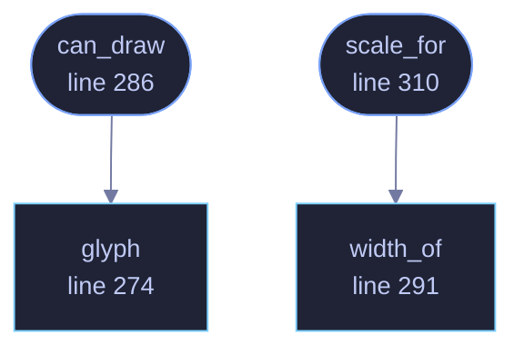

<!-- GENERATED by tools/docs/generate.py from the doc comments in the source. Do not edit: edit the .rs file and run the generator. -->

# `crates/veilvoice-video/src/font.rs`

[[veilvoice-video|Crate-veilvoice-video]] &middot; 418 lines &middot; [read the source](https://github.com/tilas01/veilvoice/blob/main/crates/veilvoice-video/src/font.rs)

## Contents

- [Why this exists rather than a font file](#why-this-exists-rather-than-a-font-file)
- [What it can and cannot draw](#what-it-can-and-cannot-draw)
- [Five by seven](#five-by-seven)
- [In plain words](#in-plain-words)
  - [What calls what](#what-calls-what)
  - [Items](#items)

A monospace face, five pixels by seven, drawn here.

# Why this exists rather than a font file

`crate::frames` draws the video's pictures as actual pixels, and names are
text. Text needs a face and a rasteriser, and the two usual ways to get
those are both wrong for this project.

Loading one of the system's fonts makes the output depend on which machine
drew it: the same recording rendered on two computers would produce
different files, and this project publishes reproducible builds and checks
them. Pulling in a font rasteriser means a large dependency to draw eight
names, in a program whose front page invites the reader to run `cargo tree`
and find nothing large.

So the face is here, it is ninety-five glyphs, and it is the same everywhere.

# What it can and cannot draw

Printable ASCII, from space to `~`. **Anything else is drawn as an open
box**, which is the honest way to render a character this cannot: a name in
Cyrillic or Japanese comes out as boxes rather than as nothing, and
`crate::frames` says so in its notes rather than letting somebody find out
by watching the finished video.

The preview page does not have this limit, because it is markup and uses
whatever the reader's machine has. That is a real difference between the two
outputs and it is written down rather than glossed over.

# Five by seven

Small enough to write out and check by eye, large enough to stay legible
when scaled up by whole numbers, which is the only way it is ever scaled: a
bitmap glyph drawn at a fractional size is a blurred glyph, so
`Face::scale_for` picks a whole-number multiple and the text is crisp at
any frame size.

# In plain words

The letters used in the video, drawn dot by dot inside this program.

It is here rather than taken from the computer so that the same recording
makes the same video on every machine, and so that this program does not have
to carry a large piece of somebody else's code to write eight names.

## What this file contains

418 lines defining **4 functions** (4 public), **0 types** and **7 constants**. Everything below is read out of the source, so it cannot disagree with the code.

**What happens when it runs.** These are the ways in: public, and nothing else in this file calls them, so they are what an outside caller reaches first.

- `can_draw` (line 286) -- Whether every character in text can be drawn.
  - reaches: `glyph`
- `scale_for` (line 310) -- The largest whole-number scale at which text fits inside room pixels.
  - reaches: `width_of`

## What calls what

_Colour key: **entry** -- a way in: public, and nothing in this file calls it; **api** -- public, and also used inside this file._

  

The same graph as Mermaid source

## Items

| Item | Line | Documentation |
|---|---:|---|
| `FIRST` pub const | [48](https://github.com/tilas01/veilvoice/blob/main/crates/veilvoice-video/src/font.rs#L48) | The first character the face has a glyph for. |
| `LAST` pub const | [50](https://github.com/tilas01/veilvoice/blob/main/crates/veilvoice-video/src/font.rs#L50) | The last character the face has a glyph for. |
| `WIDTH` pub const | [53](https://github.com/tilas01/veilvoice/blob/main/crates/veilvoice-video/src/font.rs#L53) | Width of one glyph, in pixels, before scaling. |
| `HEIGHT` pub const | [55](https://github.com/tilas01/veilvoice/blob/main/crates/veilvoice-video/src/font.rs#L55) | Height of one glyph, in pixels, before scaling. |
| `GAP` pub const | [61](https://github.com/tilas01/veilvoice/blob/main/crates/veilvoice-video/src/font.rs#L61) | The gap between two glyphs, in unscaled pixels. |
| `GLYPHS` const | [68](https://github.com/tilas01/veilvoice/blob/main/crates/veilvoice-video/src/font.rs#L68) | The glyphs, one row of five bits per line, seven lines per character. |
| `UNKNOWN` const | [266](https://github.com/tilas01/veilvoice/blob/main/crates/veilvoice-video/src/font.rs#L266) | The box drawn for a character this face has no glyph for. |
| `glyph` pub fn | [274](https://github.com/tilas01/veilvoice/blob/main/crates/veilvoice-video/src/font.rs#L274) | The rows of character, and whether the face actually had it. |
| `can_draw` pub fn | [286](https://github.com/tilas01/veilvoice/blob/main/crates/veilvoice-video/src/font.rs#L286) | Whether every character in text can be drawn. |
| `width_of` pub fn | [291](https://github.com/tilas01/veilvoice/blob/main/crates/veilvoice-video/src/font.rs#L291) | How wide text is at scale, in pixels. |
| `scale_for` pub fn | [310](https://github.com/tilas01/veilvoice/blob/main/crates/veilvoice-video/src/font.rs#L310) | The largest whole-number scale at which text fits inside room pixels. |
