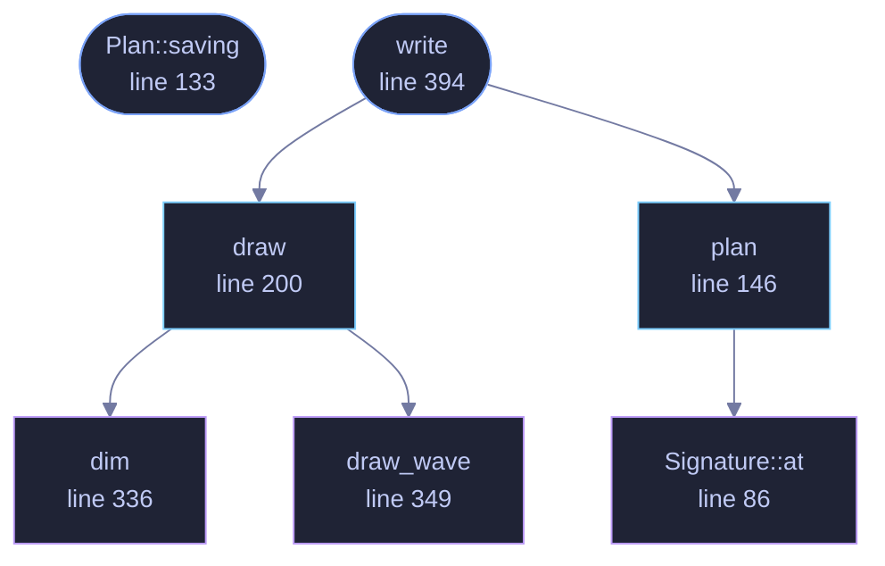

<!-- GENERATED by tools/docs/generate.py from the doc comments in the source. Do not edit: edit the .rs file and run the generator. -->

# `crates/veilvoice-video/src/frames.rs`

[[veilvoice-video|Crate-veilvoice-video]] &middot; 686 lines &middot; [read the source](https://github.com/tilas01/veilvoice/blob/main/crates/veilvoice-video/src/frames.rs)

## Contents

- [What this finishes](#what-this-finishes)
- [A frame is written when the picture changes, not thirty times a second](#a-frame-is-written-when-the-picture-changes-not-thirty-times-a-second)
- [What the video cannot draw that the page can](#what-the-video-cannot-draw-that-the-page-can)
- [In plain words](#in-plain-words)
  - [What calls what](#what-calls-what)
  - [Items](#items)

The video's pictures, and how many of them there really are.

# What this finishes

`crate::ffmpeg::command` has always known how to turn a directory of
pictures into a video file. Nothing filled the directory, so what a render
produced was veiled audio over a black picture, and the roadmap row said so
rather than letting somebody find out by playing the file.

This fills it, with `crate::raster` for the pixels and `crate::font` for
the names.

# A frame is written when the picture changes, not thirty times a second

An hour at thirty frames a second is 108,000 pictures. Written out at 1080p
that is gigabytes of intermediate files to make one video, and almost all of
them are identical to the one before.

So the frame rate decides when the picture is *looked at*, and a new file is
written only when what it would contain has actually changed. Three things
can change it, and `Signature` is exactly those three:

* the playhead, which moves one pixel at a time and not one frame at a time,
* the level bars, which move when the envelope column changes,
* who is lit, which changes at a turn boundary.

On a 1920-wide waveform over an hour the playhead moves a pixel about every
two seconds, so runs of fifty-odd identical frames collapse into one file
held for the length of the run. That is not a guess: `plan` reports how
many pictures it actually produced against how many frames the video has,
and a caller can show the ratio.

**A short recording saves nothing, and should not.** The playhead crosses
the whole waveform however long the recording is, so under about forty
seconds it moves more than a pixel per frame and every frame is genuinely a
different picture. The saving arrives with length, which is exactly where it
was needed.

**This is why the ffmpeg command is a concat list rather than a numbered
sequence.** `image2` gives every file the same duration; a held frame needs
its own. See `crate::ffmpeg::concat_command`.

# What the video cannot draw that the page can

Names outside printable ASCII. The page is markup and uses whatever face the
reader's machine has; this has one face, written here, for the reasons
`crate::font` gives. A name it cannot draw comes out as open boxes and is
**named in the notes**, because a person who typed a name in Cyrillic should
be told before they render an hour of video rather than after.

# In plain words

This draws the pictures the video is made of.

It only draws a new one when something on screen has actually moved, which
for a long recording is a tiny fraction of the frames the video has, so a
render writes hundreds of pictures rather than hundreds of thousands.

## What this file contains

686 lines defining **7 functions** (4 public), **5 types** and **0 constants**. Everything below is read out of the source, so it cannot disagree with the code.

**The types it owns.**

- `struct Signature` (line 76) -- What decides whether two moments look the same.
- `struct Frame` (line 109) -- One picture, and how long the video shows it for.
- `struct Plan` (line 118) -- The pictures a render will write, worked out without drawing any of them.
- `struct Notes` (line 187) -- What a drawn frame carried with it.
- `struct Written` (line 375) -- What a written sequence produced.

**What happens when it runs.** These are the ways in: public, and nothing else in this file calls them, so they are what an outside caller reaches first.

- `Plan::saving` (line 133) -- How many pictures were saved by holding the ones that did not change.
- `write` (line 394) -- Draw and write the whole sequence into directory.
  - reaches: `draw`, `plan`, `dim`, `draw_wave`, `at`

## What calls what

_Colour key: **entry** -- a way in: public, and nothing in this file calls it; **api** -- public, and also used inside this file; **helper** -- private to this file._

  

The same graph as Mermaid source

## Items

| Item | Line | Documentation |
|---|---:|---|
| `Signature` struct | [76](https://github.com/tilas01/veilvoice/blob/main/crates/veilvoice-video/src/frames.rs#L76) | What decides whether two moments look the same. |
| `Signature::at` fn | [86](https://github.com/tilas01/veilvoice/blob/main/crates/veilvoice-video/src/frames.rs#L86) |  |
| `Frame` pub struct | [109](https://github.com/tilas01/veilvoice/blob/main/crates/veilvoice-video/src/frames.rs#L109) | One picture, and how long the video shows it for. |
| `Plan` pub struct | [118](https://github.com/tilas01/veilvoice/blob/main/crates/veilvoice-video/src/frames.rs#L118) | The pictures a render will write, worked out without drawing any of them. |
| `Plan::saving` pub fn | [133](https://github.com/tilas01/veilvoice/blob/main/crates/veilvoice-video/src/frames.rs#L133) | How many pictures were saved by holding the ones that did not change. |
| `plan` pub fn | [146](https://github.com/tilas01/veilvoice/blob/main/crates/veilvoice-video/src/frames.rs#L146) | Work out which moments need a picture. |
| `Notes` pub struct | [187](https://github.com/tilas01/veilvoice/blob/main/crates/veilvoice-video/src/frames.rs#L187) | What a drawn frame carried with it. |
| `draw` pub fn | [200](https://github.com/tilas01/veilvoice/blob/main/crates/veilvoice-video/src/frames.rs#L200) | Draw the picture at at_secs. |
| `dim` fn | [336](https://github.com/tilas01/veilvoice/blob/main/crates/veilvoice-video/src/frames.rs#L336) | Mix colour towards background, keeping amount of it. |
| `draw_wave` fn | [349](https://github.com/tilas01/veilvoice/blob/main/crates/veilvoice-video/src/frames.rs#L349) | The envelope as filled columns inside the waveform's box. |
| `Written` pub struct | [375](https://github.com/tilas01/veilvoice/blob/main/crates/veilvoice-video/src/frames.rs#L375) | What a written sequence produced. |
| `write` pub fn | [394](https://github.com/tilas01/veilvoice/blob/main/crates/veilvoice-video/src/frames.rs#L394) | Draw and write the whole sequence into directory. |
