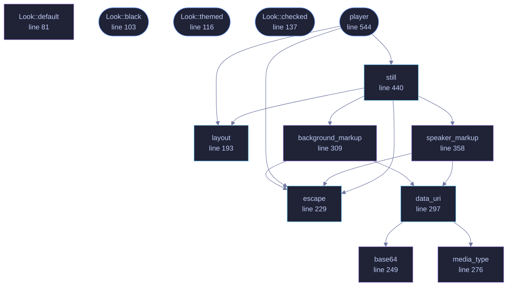

<!-- GENERATED by tools/docs/generate.py from the doc comments in the source. Do not edit: edit the .rs file and run the generator. -->

# `crates/veilvoice-video/src/page.rs`

[[veilvoice-video|Crate-veilvoice-video]] &middot; 1029 lines &middot; [read the source](https://github.com/tilas01/veilvoice/blob/main/crates/veilvoice-video/src/page.rs)

## Contents

- [Why a page rather than a video file](#why-a-page-rather-than-a-video-file)
- [The layout, and why the padding is a setting](#the-layout-and-why-the-padding-is-a-setting)
- [Everything user-supplied is escaped](#everything-user-supplied-is-escaped)
- [The script, and what happens without it](#the-script-and-what-happens-without-it)
- [In plain words](#in-plain-words)
  - [What calls what](#what-calls-what)
  - [Items](#items)

The picture: one still for a preview, and one page that plays.

# Why a page rather than a video file

It needs nothing installed, it contacts nothing, and it opens on every
browser and every phone. A video file needs an encoder this project does not
ship, as `crate::ffmpeg` explains, so the page is the thing that always exists
and the file is the extra.

It is also the honest artefact for this particular job. What is being drawn
is a waveform, some circles and a title: flat colour, hard edges and text.
That is what vector graphics are for, and it stays sharp at any size on any
screen rather than being resampled from a fixed grid of pixels.

# The layout, and why the padding is a setting

A title across the top, a row of circles under it, one per speaker, in
their colour and with their name beneath, and the waveform along the bottom
with a line that moves through it. `Look::padding` is a setting because
the same picture is wanted at very different sizes: a thumbnail wants little
and a full-screen render wants a lot, and a fixed margin looks wrong at one
end or the other.

# Everything user-supplied is escaped

Names and titles are typed by a person and end up inside markup. They are
escaped on the way in, every time, through one function. A name containing
`</text>` would otherwise end the element it is in and the rest of the file
would be whatever that person wrote, which is a nuisance in a local file
and a real problem in one that gets sent to somebody.

# The script, and what happens without it

Lighting the circle of whoever is speaking means knowing where the audio has
got to, and only the audio element knows that. There is a small inline
script, with no file, no library and no network, and a `<noscript>` saying what it
does. Without it the audio plays, the subtitles appear, the waveform is
drawn and the circles simply stay dim.

# In plain words

Draws the picture: a waveform, a circle for each person that lights up when it
is their turn, and the names.

It produces two things. A still, so you can see what you will get before
anything is rendered, and a self-contained web page that plays the veiled audio
with the picture moving along beside it.

A page rather than a video file, because a page needs nothing installed to
watch and can be opened by anybody. If you want an actual video file, the
command to make one is printed for you.

## What this file contains

1029 lines defining **13 functions** (8 public), **4 types** and **0 constants**. Everything below is read out of the source, so it cannot disagree with the code.

**The types it owns.**

- `struct Look` (line 62) -- What the picture looks like.
- `enum Background` (line 94) -- What sits behind the picture.
- `struct Layout` (line 175) -- Where each part of the picture goes.
- `struct Drawn` (line 426) -- What a render produced, and anything the user should know about it.

**What happens when it runs.** These are the ways in: public, and nothing else in this file calls them, so they are what an outside caller reaches first.

- `Look::black` (line 103) -- Black, for somebody who wants the plainest possible picture.
- `Look::themed` (line 116) -- The same look in another palette.
- `Look::checked` (line 137) -- Whether these numbers describe a picture that can be drawn.
- `player` (line 544) -- The self-contained page that plays.
  - reaches: `escape`, `layout`, `still`, `background_markup`, `speaker_markup`, `data_uri`, `base64`, `media_type`

## What calls what

_Colour key: **entry** -- a way in: public, and nothing in this file calls it; **api** -- public, and also used inside this file; **helper** -- private to this file._

  

The same graph as Mermaid source

## Items

| Item | Line | Documentation |
|---|---:|---|
| `Look` pub struct | [62](https://github.com/tilas01/veilvoice/blob/main/crates/veilvoice-video/src/page.rs#L62) | What the picture looks like. |
| `Look::default` fn | [81](https://github.com/tilas01/veilvoice/blob/main/crates/veilvoice-video/src/page.rs#L81) |  |
| `Background` pub enum | [94](https://github.com/tilas01/veilvoice/blob/main/crates/veilvoice-video/src/page.rs#L94) | What sits behind the picture. |
| `Look::black` pub fn | [103](https://github.com/tilas01/veilvoice/blob/main/crates/veilvoice-video/src/page.rs#L103) | Black, for somebody who wants the plainest possible picture. |
| `Look::themed` pub fn | [116](https://github.com/tilas01/veilvoice/blob/main/crates/veilvoice-video/src/page.rs#L116) | The same look in another palette. |
| `Look::checked` pub fn | [137](https://github.com/tilas01/veilvoice/blob/main/crates/veilvoice-video/src/page.rs#L137) | Whether these numbers describe a picture that can be drawn. |
| `Layout` pub struct | [175](https://github.com/tilas01/veilvoice/blob/main/crates/veilvoice-video/src/page.rs#L175) | Where each part of the picture goes. |
| `layout` pub fn | [193](https://github.com/tilas01/veilvoice/blob/main/crates/veilvoice-video/src/page.rs#L193) | Work out the layout for a look and a number of speakers. |
| `escape` pub fn | [229](https://github.com/tilas01/veilvoice/blob/main/crates/veilvoice-video/src/page.rs#L229) | Escape text for markup. |
| `base64` fn | [249](https://github.com/tilas01/veilvoice/blob/main/crates/veilvoice-video/src/page.rs#L249) | Base64, for embedding an image so the page stays one file. |
| `media_type` fn | [276](https://github.com/tilas01/veilvoice/blob/main/crates/veilvoice-video/src/page.rs#L276) | The media type for an image, by extension. |
| `data_uri` pub fn | [297](https://github.com/tilas01/veilvoice/blob/main/crates/veilvoice-video/src/page.rs#L297) | Read an image and turn it into a data: URI. |
| `background_markup` fn | [309](https://github.com/tilas01/veilvoice/blob/main/crates/veilvoice-video/src/page.rs#L309) | The background element, and anything worth telling the user about it. |
| `speaker_markup` fn | [358](https://github.com/tilas01/veilvoice/blob/main/crates/veilvoice-video/src/page.rs#L358) | One speaker's circle and name, as SVG. |
| `Drawn` pub struct | [426](https://github.com/tilas01/veilvoice/blob/main/crates/veilvoice-video/src/page.rs#L426) | What a render produced, and anything the user should know about it. |
| `still` pub fn | [440](https://github.com/tilas01/veilvoice/blob/main/crates/veilvoice-video/src/page.rs#L440) | A single frame, as standalone SVG. |
| `player` pub fn | [544](https://github.com/tilas01/veilvoice/blob/main/crates/veilvoice-video/src/page.rs#L544) | The self-contained page that plays. |
