<!-- GENERATED by tools/docs/generate.py from the doc comments in the source. Do not edit: edit the .rs file and run the generator. -->

# `crates/veilvoice-video/src/size.rs`

[[veilvoice-video|Crate-veilvoice-video]] &middot; 732 lines &middot; [read the source](https://github.com/tilas01/veilvoice/blob/main/crates/veilvoice-video/src/size.rs)

## Contents

- [Why this is a module rather than two numbers](#why-this-is-a-module-rather-than-two-numbers)
- [The rules a size has to obey, and where they come from](#the-rules-a-size-has-to-obey-and-where-they-come-from)
- [The default is the screen it will be watched on, when the screen will say](#the-default-is-the-screen-it-will-be-watched-on-when-the-screen-will-say)
- [In plain words](#in-plain-words)
  - [What calls what](#what-calls-what)
  - [Items](#items)

The size and frame rate a video is rendered at.

# Why this is a module rather than two numbers

The renderer used to write `1280x720` at thirty frames a second and offer no
way to say otherwise. Both numbers were reasonable defaults and neither was a
choice anybody could make, which is the whole of the problem: somebody
rendering a conversation to put on a screen wants it to look like the screen
they are putting it on.

Getting that wrong is expensive in a way a wrong colour is not. Frames are
rendered one file at a time before `ffmpeg` is asked for anything, so a
choice made at the start decides how long the render takes, how much disk it
wants while it runs, and whether it finishes at all. `Plan::estimate`
exists so a front end can say that before starting rather than after.

# The rules a size has to obey, and where they come from

**Both dimensions have to be even.** H.264 with `yuv420p`, which is what
every player and every platform accepts, stores colour at half resolution in
both directions, so an odd dimension has half a chroma sample in it. `ffmpeg`
refuses outright: "width not divisible by 2". A person typing 1921 has made a
typo rather than a request, so `Size::new` says so and
`Size::nearest_valid` offers the size they meant.

**There is a floor and a ceiling**, and both are about somebody's typo
rather than about taste. Under `MIN_EDGE` the subtitles are unreadable and
the waveform is a line. Over `MAX_EDGE`, which is 8K, an extra digit turns
a ten-minute render into one that fills the disk: at 4K a frame is about
eight megabytes before compression, and at 60 frames a second that is half a
gigabyte for every second of recording.

# The default is the screen it will be watched on, when the screen will say

`Choice::Monitor` is the default and it is *resolved late*: the size is
decided when the render starts, from the display the program is actually
running on, rather than stored as a number that becomes wrong when somebody
plugs in a different monitor.

Where nothing can say what the display is running at, and a command line on a
machine with no display server is the ordinary case, it falls back to
`Preset::Hd1080` **and says so**. A guess about somebody's monitor
presented as a detection would be worse than a stated default.

# In plain words

How big the video is and how many pictures a second it has.

By default it matches the screen you are using, because that is usually the
screen you are going to watch it on. You can pick 720p, 1080p, 1440p or 4K
instead, or type your own size, and anything up to 60 frames a second.

Bigger and faster is not better here. The picture is a waveform, some
circles and words on a flat background, none of which move quickly, so 4K at
60 costs a great deal of time and disk for something that looks the same as
1080p at 30 to almost everybody.

## What this file contains

732 lines defining **22 functions** (20 public), **7 types** and **7 constants**. Everything below is read out of the source, so it cannot disagree with the code.

**The types it owns.**

- `struct Size` (line 94) -- A frame size in pixels, known to be one a render can actually use.
- `enum Preset` (line 186) -- The sizes offered by name.
- `enum Choice` (line 252) -- What the user asked for, before anything has looked at the display.
- `struct Resolved` (line 268) -- A size, and why it is that size.
- `struct FrameRate` (line 375) -- Frames per second, known to be inside the range a render allows.
- `struct Plan` (line 429) -- A size and a frame rate together, with what they will cost.
- `struct Estimate` (line 438) -- What a render is going to want before it is started.

**What happens when it runs.** These are the ways in: public, and nothing else in this file calls them, so they are what an outside caller reaches first.

- `Size::new` (line 104) -- A size, if it is one a video can be rendered at.
- `Size::width` (line 145) -- Width in pixels.
- `Size::height` (line 150) -- Height in pixels.
- `Size::pixels` (line 159) -- How many pixels one frame holds.
- `Size::label` (line 167) -- What ffmpeg wants after -s, and what a person reads in a menu.
  - reaches: `matching`
- `Size::geometry` (line 175) -- Just the digits, for a command line argument.
- `Preset::size` (line 207) -- The size this preset means.
- `Preset::name` (line 222) -- What a person calls it.
- `Preset::key` (line 232) -- What it answers to on a command line.
- `Choice::parse` (line 287) -- Read a choice somebody typed.
- `Choice::describe` (line 319) -- What this reads as in a menu or a report.
- `Choice::resolve` (line 338) -- Turn a choice into a size, given what the display said.
  - reaches: `nearest_valid`
- `FrameRate::new` (line 379) -- A frame rate, if it is one a render allows.
- `FrameRate::get` (line 389) -- The number.
- `FrameRate::parse` (line 405) -- Read a frame rate somebody typed.
- `human_bytes` (line 457) -- A byte count, in the units a person reads.
- `Plan::new` (line 476) -- A plan.
- `Plan::estimate` (line 485) -- What rendering seconds of recording will want.

## What calls what

_Colour key: **entry** -- a way in: public, and nothing in this file calls it; **api** -- public, and also used inside this file; **helper** -- private to this file._

  

The same graph as Mermaid source

```mermaid
%%{init: {"theme":"base","themeVariables":{"background":"#1a1b26","primaryColor":"#1f2335","primaryTextColor":"#c0caf5","primaryBorderColor":"#7aa2f7","secondaryColor":"#16161e","tertiaryColor":"#16161e","lineColor":"#737aa2","textColor":"#c0caf5","mainBkg":"#1f2335","nodeBorder":"#7aa2f7","clusterBkg":"#16161e","clusterBorder":"#2f3549","fontFamily":"ui-monospace, SFMono-Regular, Consolas, monospace","fontSize":"14px"}}}%%
flowchart TD
    n_new(["Size::new<br/>line 104"])
    n_nearest_valid["Size::nearest_valid<br/>line 136"]
    n_width(["Size::width<br/>line 145"])
    n_height(["Size::height<br/>line 150"])
    n_pixels(["Size::pixels<br/>line 159"])
    n_label(["Size::label<br/>line 167"])
    n_geometry(["Size::geometry<br/>line 175"])
    n_size(["Preset::size<br/>line 207"])
    n_name(["Preset::name<br/>line 222"])
    n_key(["Preset::key<br/>line 232"])
    n_matching["Preset::matching<br/>line 242"]
    n_parse(["Choice::parse<br/>line 287"])
    n_describe(["Choice::describe<br/>line 319"])
    n_resolve(["Choice::resolve<br/>line 338"])
    n_new(["FrameRate::new<br/>line 379"])
    n_get(["FrameRate::get<br/>line 389"])
    n_parse(["FrameRate::parse<br/>line 405"])
    n_default["FrameRate::default<br/>line 419"]
    n_human_bytes(["human_bytes<br/>line 457"])
    n_new(["Plan::new<br/>line 476"])
    n_estimate(["Plan::estimate<br/>line 485"])
    n_default["Plan::default<br/>line 509"]
    n_label --> n_matching
    n_resolve --> n_nearest_valid
    click n_new href "https://github.com/tilas01/veilvoice/blob/main/crates/veilvoice-video/src/size.rs#L104" "open the source"
    click n_nearest_valid href "https://github.com/tilas01/veilvoice/blob/main/crates/veilvoice-video/src/size.rs#L136" "open the source"
    click n_width href "https://github.com/tilas01/veilvoice/blob/main/crates/veilvoice-video/src/size.rs#L145" "open the source"
    click n_height href "https://github.com/tilas01/veilvoice/blob/main/crates/veilvoice-video/src/size.rs#L150" "open the source"
    click n_pixels href "https://github.com/tilas01/veilvoice/blob/main/crates/veilvoice-video/src/size.rs#L159" "open the source"
    click n_label href "https://github.com/tilas01/veilvoice/blob/main/crates/veilvoice-video/src/size.rs#L167" "open the source"
    click n_geometry href "https://github.com/tilas01/veilvoice/blob/main/crates/veilvoice-video/src/size.rs#L175" "open the source"
    click n_size href "https://github.com/tilas01/veilvoice/blob/main/crates/veilvoice-video/src/size.rs#L207" "open the source"
    click n_name href "https://github.com/tilas01/veilvoice/blob/main/crates/veilvoice-video/src/size.rs#L222" "open the source"
    click n_key href "https://github.com/tilas01/veilvoice/blob/main/crates/veilvoice-video/src/size.rs#L232" "open the source"
    click n_matching href "https://github.com/tilas01/veilvoice/blob/main/crates/veilvoice-video/src/size.rs#L242" "open the source"
    click n_parse href "https://github.com/tilas01/veilvoice/blob/main/crates/veilvoice-video/src/size.rs#L287" "open the source"
    click n_describe href "https://github.com/tilas01/veilvoice/blob/main/crates/veilvoice-video/src/size.rs#L319" "open the source"
    click n_resolve href "https://github.com/tilas01/veilvoice/blob/main/crates/veilvoice-video/src/size.rs#L338" "open the source"
    click n_new href "https://github.com/tilas01/veilvoice/blob/main/crates/veilvoice-video/src/size.rs#L379" "open the source"
    click n_get href "https://github.com/tilas01/veilvoice/blob/main/crates/veilvoice-video/src/size.rs#L389" "open the source"
    click n_parse href "https://github.com/tilas01/veilvoice/blob/main/crates/veilvoice-video/src/size.rs#L405" "open the source"
    click n_default href "https://github.com/tilas01/veilvoice/blob/main/crates/veilvoice-video/src/size.rs#L419" "open the source"
    click n_human_bytes href "https://github.com/tilas01/veilvoice/blob/main/crates/veilvoice-video/src/size.rs#L457" "open the source"
    click n_new href "https://github.com/tilas01/veilvoice/blob/main/crates/veilvoice-video/src/size.rs#L476" "open the source"
    click n_estimate href "https://github.com/tilas01/veilvoice/blob/main/crates/veilvoice-video/src/size.rs#L485" "open the source"
    click n_default href "https://github.com/tilas01/veilvoice/blob/main/crates/veilvoice-video/src/size.rs#L509" "open the source"
    classDef entry fill:#1f2335,stroke:#7aa2f7,color:#c0caf5
    class n_new,n_width,n_height,n_pixels,n_label,n_geometry,n_size,n_name,n_key,n_parse,n_describe,n_resolve,n_new,n_get,n_parse,n_human_bytes,n_new,n_estimate entry
    classDef api fill:#1f2335,stroke:#7dcfff,color:#c0caf5
    class n_nearest_valid,n_matching api
    classDef helper fill:#1f2335,stroke:#bb9af7,color:#c0caf5
    class n_default,n_default helper
```

## Items

| Item | Line | Documentation |
|---|---:|---|
| `MIN_EDGE` pub const | [66](https://github.com/tilas01/veilvoice/blob/main/crates/veilvoice-video/src/size.rs#L66) | The shortest edge a render may have, in pixels. |
| `MAX_EDGE` pub const | [72](https://github.com/tilas01/veilvoice/blob/main/crates/veilvoice-video/src/size.rs#L72) | The longest edge a render may have, in pixels. |
| `MAX_FPS` pub const | [82](https://github.com/tilas01/veilvoice/blob/main/crates/veilvoice-video/src/size.rs#L82) | The most frames a second a render may have. |
| `MIN_FPS` pub const | [87](https://github.com/tilas01/veilvoice/blob/main/crates/veilvoice-video/src/size.rs#L87) | The fewest frames a second a render may have. |
| `Size` pub struct | [94](https://github.com/tilas01/veilvoice/blob/main/crates/veilvoice-video/src/size.rs#L94) | A frame size in pixels, known to be one a render can actually use. |
| `Size::new` pub fn | [104](https://github.com/tilas01/veilvoice/blob/main/crates/veilvoice-video/src/size.rs#L104) | A size, if it is one a video can be rendered at. |
| `Size::nearest_valid` pub fn | [136](https://github.com/tilas01/veilvoice/blob/main/crates/veilvoice-video/src/size.rs#L136) | The nearest size that obeys every rule, for offering after a refusal. |
| `Size::width` pub fn | [145](https://github.com/tilas01/veilvoice/blob/main/crates/veilvoice-video/src/size.rs#L145) | Width in pixels. |
| `Size::height` pub fn | [150](https://github.com/tilas01/veilvoice/blob/main/crates/veilvoice-video/src/size.rs#L150) | Height in pixels. |
| `Size::pixels` pub fn | [159](https://github.com/tilas01/veilvoice/blob/main/crates/veilvoice-video/src/size.rs#L159) | How many pixels one frame holds. |
| `Size::label` pub fn | [167](https://github.com/tilas01/veilvoice/blob/main/crates/veilvoice-video/src/size.rs#L167) | What ffmpeg wants after -s, and what a person reads in a menu. |
| `Size::geometry` pub fn | [175](https://github.com/tilas01/veilvoice/blob/main/crates/veilvoice-video/src/size.rs#L175) | Just the digits, for a command line argument. |
| `Preset` pub enum | [186](https://github.com/tilas01/veilvoice/blob/main/crates/veilvoice-video/src/size.rs#L186) | The sizes offered by name. |
| `Preset::ALL` pub const | [199](https://github.com/tilas01/veilvoice/blob/main/crates/veilvoice-video/src/size.rs#L199) | Every preset, in the order a menu should list them. |
| `Preset::size` pub fn | [207](https://github.com/tilas01/veilvoice/blob/main/crates/veilvoice-video/src/size.rs#L207) | The size this preset means. |
| `Preset::name` pub fn | [222](https://github.com/tilas01/veilvoice/blob/main/crates/veilvoice-video/src/size.rs#L222) | What a person calls it. |
| `Preset::key` pub fn | [232](https://github.com/tilas01/veilvoice/blob/main/crates/veilvoice-video/src/size.rs#L232) | What it answers to on a command line. |
| `Preset::matching` pub fn | [242](https://github.com/tilas01/veilvoice/blob/main/crates/veilvoice-video/src/size.rs#L242) | The preset a size is, if it is one of them. |
| `Choice` pub enum | [252](https://github.com/tilas01/veilvoice/blob/main/crates/veilvoice-video/src/size.rs#L252) | What the user asked for, before anything has looked at the display. |
| `Resolved` pub struct | [268](https://github.com/tilas01/veilvoice/blob/main/crates/veilvoice-video/src/size.rs#L268) | A size, and why it is that size. |
| `Choice::KEYS` pub const | [280](https://github.com/tilas01/veilvoice/blob/main/crates/veilvoice-video/src/size.rs#L280) | What this answers to on a command line, in the order help should list it. |
| `Choice::parse` pub fn | [287](https://github.com/tilas01/veilvoice/blob/main/crates/veilvoice-video/src/size.rs#L287) | Read a choice somebody typed. |
| `Choice::describe` pub fn | [319](https://github.com/tilas01/veilvoice/blob/main/crates/veilvoice-video/src/size.rs#L319) | What this reads as in a menu or a report. |
| `Choice::resolve` pub fn | [338](https://github.com/tilas01/veilvoice/blob/main/crates/veilvoice-video/src/size.rs#L338) | Turn a choice into a size, given what the display said. |
| `FrameRate` pub struct | [375](https://github.com/tilas01/veilvoice/blob/main/crates/veilvoice-video/src/size.rs#L375) | Frames per second, known to be inside the range a render allows. |
| `FrameRate::new` pub fn | [379](https://github.com/tilas01/veilvoice/blob/main/crates/veilvoice-video/src/size.rs#L379) | A frame rate, if it is one a render allows. |
| `FrameRate::get` pub fn | [389](https://github.com/tilas01/veilvoice/blob/main/crates/veilvoice-video/src/size.rs#L389) | The number. |
| `FrameRate::OFFERED` pub const | [398](https://github.com/tilas01/veilvoice/blob/main/crates/veilvoice-video/src/size.rs#L398) | The rates offered by name, in the order a menu should list them. |
| `FrameRate::parse` pub fn | [405](https://github.com/tilas01/veilvoice/blob/main/crates/veilvoice-video/src/size.rs#L405) | Read a frame rate somebody typed. |
| `FrameRate::default` fn | [419](https://github.com/tilas01/veilvoice/blob/main/crates/veilvoice-video/src/size.rs#L419) |  |
| `Plan` pub struct | [429](https://github.com/tilas01/veilvoice/blob/main/crates/veilvoice-video/src/size.rs#L429) | A size and a frame rate together, with what they will cost. |
| `Estimate` pub struct | [438](https://github.com/tilas01/veilvoice/blob/main/crates/veilvoice-video/src/size.rs#L438) | What a render is going to want before it is started. |
| `human_bytes` pub fn | [457](https://github.com/tilas01/veilvoice/blob/main/crates/veilvoice-video/src/size.rs#L457) | A byte count, in the units a person reads. |
| `Plan::new` pub fn | [476](https://github.com/tilas01/veilvoice/blob/main/crates/veilvoice-video/src/size.rs#L476) | A plan. |
| `Plan::estimate` pub fn | [485](https://github.com/tilas01/veilvoice/blob/main/crates/veilvoice-video/src/size.rs#L485) | What rendering seconds of recording will want. |
| `Plan::default` fn | [509](https://github.com/tilas01/veilvoice/blob/main/crates/veilvoice-video/src/size.rs#L509) |  |
