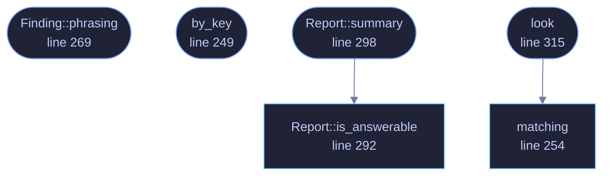

<!-- GENERATED by tools/docs/generate.py from the doc comments in the source. Do not edit: edit the .rs file and run the generator. -->

# `crates/veilvoice-watch/src/input.rs`

[[veilvoice-watch|Crate-veilvoice-watch]] &middot; 605 lines &middot; [read the source](https://github.com/tilas01/veilvoice/blob/main/crates/veilvoice-watch/src/input.rs)

## Contents

- [This is a heuristic, and the crate is built to keep saying so](#this-is-a-heuristic-and-the-crate-is-built-to-keep-saying-so)
- [What it does not do, deliberately](#what-it-does-not-do-deliberately)
- [In plain words](#in-plain-words)
  - [What calls what](#what-calls-what)
  - [Items](#items)

What on this machine could be watching the keyboard and the mouse.

# This is a heuristic, and the crate is built to keep saying so

There is no way to ask an operating system "is anything logging my
keystrokes" and get a true answer. The mechanisms a keylogger uses are the
same ones accessibility software, password managers, remote-support tools,
macro utilities and games legitimately use, and the good ones are written
not to be found. A tool that claimed to detect keyloggers would be making a
promise nothing can keep.

So this does the one thing that *can* be done honestly: it names the
programs running right now that are **able** to see your input, says what
each one is for, and leaves the judgement where it belongs. Every finding is
phrased as capability, never as an accusation, and `Finding::phrasing`
exists so that no front end has to invent that wording and get it wrong.

`LIMITS` is the paragraph a front end must show beside any result. It says
outright that a clean result proves nothing. That is not a disclaimer bolted
on; it is the most important thing this crate outputs, because somebody who
reads "nothing found" as "nothing there" has been made *less* safe by
running it.

# What it does not do, deliberately

It does not hook the keyboard, read input, count keystrokes, time them, or
watch the mouse. A program that monitored input to detect input monitoring
would be the thing it warns about, and on Windows it would need the same
`SetWindowsHookEx` that `#![forbid(unsafe_code)]` rules out anyway.

It also does not scan memory, inspect other processes' handles or read the
registry's autostart keys. `veilvoice-watch` already covers persistence,
and duplicating it here would give two answers to one question.

# In plain words

Software that records what you type is real, and there is no honest way for
any program to tell you for certain whether it is on your computer. Anything
that claims otherwise is guessing and not admitting it.

What this does instead: it looks at which programs are open, and tells you
which of them *could* see your typing or your mouse -- remote-support tools,
macro recorders, accessibility software, and so on. Most of the time these
are things you installed on purpose and there is nothing wrong. The point is
that you get to know they are running and decide for yourself.

If it finds nothing, that does **not** mean nothing is watching. It means
nothing it knows how to recognise is open, which is a much smaller claim,
and this crate will keep saying so every time.

## What this file contains

605 lines defining **7 functions** (7 public), **4 types** and **3 constants**. Everything below is read out of the source, so it cannot disagree with the code.

**The types it owns.**

- `enum Reach` (line 59) -- Why a program is in the table.
- `struct Watcher` (line 96) -- One program able to observe keyboard or mouse input.
- `struct Finding` (line 262) -- One program found running, and how to describe it.
- `struct Report` (line 276) -- What was found, and everything that qualifies it.

**What happens when it runs.** These are the ways in: public, and nothing else in this file calls them, so they are what an outside caller reaches first.

- `Reach::phrasing` (line 80) -- The wording a front end should use, and the reason this is not left to each caller to phrase.
- `by_key` (line 249) -- The program with this identifier.
- `Finding::phrasing` (line 269) -- The whole sentence to show, capability and all.
- `Report::summary` (line 298) -- A one-line summary, phrased so it cannot be read as a clean bill of health.
  - reaches: `is_answerable`
- `look` (line 315) -- Look, and report.
  - reaches: `matching`

## What calls what

_Colour key: **entry** -- a way in: public, and nothing in this file calls it; **api** -- public, and also used inside this file._

  

The same graph as Mermaid source

## Items

| Item | Line | Documentation |
|---|---:|---|
| `Reach` pub enum | [59](https://github.com/tilas01/veilvoice/blob/main/crates/veilvoice-watch/src/input.rs#L59) | Why a program is in the table. |
| `Reach::phrasing` pub fn | [80](https://github.com/tilas01/veilvoice/blob/main/crates/veilvoice-watch/src/input.rs#L80) | The wording a front end should use, and the reason this is not left to each caller to phrase. |
| `Watcher` pub struct | [96](https://github.com/tilas01/veilvoice/blob/main/crates/veilvoice-watch/src/input.rs#L96) | One program able to observe keyboard or mouse input. |
| `ALL` pub const | [124](https://github.com/tilas01/veilvoice/blob/main/crates/veilvoice-watch/src/input.rs#L124) | Every program this build knows how to recognise. |
| `by_key` pub fn | [249](https://github.com/tilas01/veilvoice/blob/main/crates/veilvoice-watch/src/input.rs#L249) | The program with this identifier. |
| `matching` pub fn | [254](https://github.com/tilas01/veilvoice/blob/main/crates/veilvoice-watch/src/input.rs#L254) | The entry a process name belongs to, if any. |
| `Finding` pub struct | [262](https://github.com/tilas01/veilvoice/blob/main/crates/veilvoice-watch/src/input.rs#L262) | One program found running, and how to describe it. |
| `Finding::phrasing` pub fn | [269](https://github.com/tilas01/veilvoice/blob/main/crates/veilvoice-watch/src/input.rs#L269) | The whole sentence to show, capability and all. |
| `Report` pub struct | [276](https://github.com/tilas01/veilvoice/blob/main/crates/veilvoice-watch/src/input.rs#L276) | What was found, and everything that qualifies it. |
| `Report::is_answerable` pub fn | [292](https://github.com/tilas01/veilvoice/blob/main/crates/veilvoice-watch/src/input.rs#L292) | Whether anything at all could be established. |
| `Report::summary` pub fn | [298](https://github.com/tilas01/veilvoice/blob/main/crates/veilvoice-watch/src/input.rs#L298) | A one-line summary, phrased so it cannot be read as a clean bill of health. |
| `look` pub fn | [315](https://github.com/tilas01/veilvoice/blob/main/crates/veilvoice-watch/src/input.rs#L315) | Look, and report. |
| `LIMITS` pub const | [343](https://github.com/tilas01/veilvoice/blob/main/crates/veilvoice-watch/src/input.rs#L343) | What a reader must be told, in the words to tell them. |
| `WHY_NOT_HOOKING` pub const | [353](https://github.com/tilas01/veilvoice/blob/main/crates/veilvoice-watch/src/input.rs#L353) | Why this crate does not watch input in order to detect input watching. |
