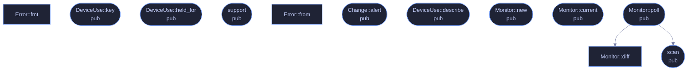

# `crates/veilvoice-watch/src/lib.rs`

[[veilvoice-watch|Crate-veilvoice-watch]] &middot; 401 lines &middot; [read the source](https://github.com/tilas01/veilvoice/blob/main/crates/veilvoice-watch/src/lib.rs)

## Contents

- [Why this belongs in a voice-privacy tool](#why-this-belongs-in-a-voice-privacy-tool)
- [What it can actually see, per platform](#what-it-can-actually-see-per-platform)
- [What calls what](#what-calls-what)
- [Items](#items)

Find out which applications are using your microphone and camera, right now.

## Why this belongs in a voice-privacy tool

VeilVoice protects the audio you choose to send. This answers a different
and more basic question: *is something listening that you did not choose?*
A de-identified voice on a call is worth very little if a second program is
recording the raw microphone at the same time.

Operating systems have grown indicators for this — the orange dot, the
taskbar icon — but they are small, easily missed, and tell you only that
*something* is active, rarely what. This reports the process, its PID and
how long it has held the device.

## What it can actually see, per platform

Detection is honest about its limits, because a monitor that quietly sees
nothing is worse than no monitor at all — it produces false confidence.
`support` reports what the current platform can do before you rely on it.

| Platform | Microphone | Camera | How |
|---|---|---|---|
| Windows | ✅ | ✅ | The same `CapabilityAccessManager` records the OS privacy indicator uses |
| Linux | ✅ | ✅ | `/proc/*/fd` handles open on `/dev/snd/pcm*` and `/dev/video*` |
| macOS | ❌ | ❌ | No public API exposes it; anything claiming otherwise on macOS is guessing |

On Linux you see every process you have permission to inspect. Without root
that means your own; other users' processes are invisible, and that is a
kernel permission boundary rather than something this crate can work around.

## What calls what

## Items

| Item | Line | Documentation |
|---|---:|---|
| `VERSION` pub const | [45](https://github.com/tilas01/veilvoice/blob/main/crates/veilvoice-watch/src/lib.rs#L45) | Crate version string, surfaced in the About panel. |
| `DeviceKind` pub enum | [49](https://github.com/tilas01/veilvoice/blob/main/crates/veilvoice-watch/src/lib.rs#L49) | The kind of device being used. |
| `DeviceKind::fmt` fn | [57](https://github.com/tilas01/veilvoice/blob/main/crates/veilvoice-watch/src/lib.rs#L57) |  |
| `DeviceUse` pub struct | [67](https://github.com/tilas01/veilvoice/blob/main/crates/veilvoice-watch/src/lib.rs#L67) | One application holding one device. |
| `DeviceUse::key` pub fn | [88](https://github.com/tilas01/veilvoice/blob/main/crates/veilvoice-watch/src/lib.rs#L88) | A stable key for comparing two scans, so an app is not reported as having stopped and restarted when nothing changed. |
| `DeviceUse::held_for` pub fn | [93](https://github.com/tilas01/veilvoice/blob/main/crates/veilvoice-watch/src/lib.rs#L93) | How long this application has held the device. |
| `Support` pub struct | [101](https://github.com/tilas01/veilvoice/blob/main/crates/veilvoice-watch/src/lib.rs#L101) | What detection is possible here. |
| `support` pub fn | [115](https://github.com/tilas01/veilvoice/blob/main/crates/veilvoice-watch/src/lib.rs#L115) | Report what this platform can detect. |
| `Error` pub enum | [149](https://github.com/tilas01/veilvoice/blob/main/crates/veilvoice-watch/src/lib.rs#L149) | Everything that can go wrong here. |
| `Error::from` fn | [157](https://github.com/tilas01/veilvoice/blob/main/crates/veilvoice-watch/src/lib.rs#L157) |  |
| `Error::fmt` fn | [163](https://github.com/tilas01/veilvoice/blob/main/crates/veilvoice-watch/src/lib.rs#L163) |  |
| `scan` pub fn | [177](https://github.com/tilas01/veilvoice/blob/main/crates/veilvoice-watch/src/lib.rs#L177) | Take one snapshot of what is currently using the microphone and camera. |
| `Change` pub enum | [194](https://github.com/tilas01/veilvoice/blob/main/crates/veilvoice-watch/src/lib.rs#L194) | A change between two scans. |
| `Change::alert` pub fn | [203](https://github.com/tilas01/veilvoice/blob/main/crates/veilvoice-watch/src/lib.rs#L203) | A one-line alert suitable for a notification or an overlay. |
| `DeviceUse::describe` pub fn | [213](https://github.com/tilas01/veilvoice/blob/main/crates/veilvoice-watch/src/lib.rs#L213) | name (pid 1234), or just the name when there is no PID. |
| `Monitor` pub struct | [226](https://github.com/tilas01/veilvoice/blob/main/crates/veilvoice-watch/src/lib.rs#L226) | Watches for changes between scans. |
| `Monitor::new` pub fn | [232](https://github.com/tilas01/veilvoice/blob/main/crates/veilvoice-watch/src/lib.rs#L232) | A monitor that has not yet seen anything. |
| `Monitor::current` pub fn | [237](https://github.com/tilas01/veilvoice/blob/main/crates/veilvoice-watch/src/lib.rs#L237) | The most recent snapshot. |
| `Monitor::poll` pub fn | [246](https://github.com/tilas01/veilvoice/blob/main/crates/veilvoice-watch/src/lib.rs#L246) | Scan, and report what changed since the previous call. |
| `Monitor::diff` fn | [251](https://github.com/tilas01/veilvoice/blob/main/crates/veilvoice-watch/src/lib.rs#L251) | The comparison, split out so it can be tested without a real system. |
