<!-- GENERATED by tools/docs/generate.py from the doc comments in the source. Do not edit: edit the .rs file and run the generator. -->

# `crates/veilvoice-watch/src/lib.rs`

[[veilvoice-watch|Crate-veilvoice-watch]] &middot; 423 lines &middot; [read the source](https://github.com/tilas01/veilvoice/blob/main/crates/veilvoice-watch/src/lib.rs)

## Contents

  - [Why this belongs in a voice-privacy tool](#why-this-belongs-in-a-voice-privacy-tool)
  - [What it can actually see, per platform](#what-it-can-actually-see-per-platform)
- [In plain words](#in-plain-words)
  - [What calls what](#what-calls-what)
  - [Items](#items)

Find out which applications are using your microphone and camera, right now.

## Why this belongs in a voice-privacy tool

VeilVoice protects the audio you choose to send. This answers a different
and more basic question: *is something listening that you did not choose?*
A de-identified voice on a call is worth very little if a second program is
recording the raw microphone at the same time.

Operating systems have grown indicators for this, the orange dot and the
taskbar icon, but they are small, easily missed, and tell you only that
*something* is active, rarely what. This reports the process, its PID and
how long it has held the device.

## What it can actually see, per platform

Detection is honest about its limits, because a monitor that quietly sees
nothing is worse than no monitor at all, because it produces false confidence.
`support` reports what the current platform can do before you rely on it.

| Platform | Microphone | Camera | How |
|---|---|---|---|
| Windows | ✅ | ✅ | The same `CapabilityAccessManager` records the OS privacy indicator uses |
| Linux | ✅ | ✅ | `/proc/*/fd` handles open on `/dev/snd/pcm*` and `/dev/video*` |
| macOS | ❌ | ❌ | No public API exposes it; anything claiming otherwise on macOS is guessing |

On Linux you see every process you have permission to inspect. Without root
that means your own; other users' processes are invisible, and that is a
kernel permission boundary rather than something this crate can work around.

# In plain words

This tells you when something is using your microphone or camera.

Not what it is doing with them -- just that a program has them open, and which
program. That is worth knowing before you start talking, and it is the kind of
thing an operating system knows and does not always show you.

It cannot see everything. Some ways of getting at a microphone do not go past
the place this reads.

## What this file contains

423 lines defining **13 functions** (9 public), **6 types** and **1 constant**. Everything below is read out of the source, so it cannot disagree with the code.

**The types it owns.**

- `enum DeviceKind` (line 71) -- The kind of device being used.
- `struct DeviceUse` (line 89) -- One application holding one device.
- `struct Support` (line 123) -- What detection is possible here.
- `enum Error` (line 171) -- Everything that can go wrong here.
- `enum Change` (line 216) -- A change between two scans.
- `struct Monitor` (line 248) -- Watches for changes between scans.

**What happens when it runs.** These are the ways in: public, and nothing else in this file calls them, so they are what an outside caller reaches first.

- `DeviceUse::key` (line 110) -- A stable key for comparing two scans, so an app is not reported as having stopped and restarted when nothing changed.
- `DeviceUse::held_for` (line 115) -- How long this application has held the device.
- `support` (line 137) -- Report what this platform can detect.
- `Change::alert` (line 225) -- A one-line alert suitable for a notification or an overlay.
- `DeviceUse::describe` (line 235) -- name (pid 1234), or just the name when there is no PID.
- `Monitor::new` (line 254) -- A monitor that has not yet seen anything.
- `Monitor::current` (line 259) -- The most recent snapshot.
- `Monitor::poll` (line 268) -- Scan, and report what changed since the previous call.
  - reaches: `diff`, `scan`

## What calls what

_Colour key: **entry** -- a way in: public, and nothing in this file calls it; **api** -- public, and also used inside this file; **helper** -- private to this file._

  

The same graph as Mermaid source

```mermaid
%%{init: {"theme":"base","themeVariables":{"background":"#1a1b26","primaryColor":"#1f2335","primaryTextColor":"#c0caf5","primaryBorderColor":"#7aa2f7","secondaryColor":"#16161e","tertiaryColor":"#16161e","lineColor":"#737aa2","textColor":"#c0caf5","mainBkg":"#1f2335","nodeBorder":"#7aa2f7","clusterBkg":"#16161e","clusterBorder":"#2f3549","fontFamily":"ui-monospace, SFMono-Regular, Consolas, monospace","fontSize":"14px"}}}%%
flowchart TD
    n_fmt["DeviceKind::fmt<br/>line 79"]
    n_key(["DeviceUse::key<br/>line 110"])
    n_held_for(["DeviceUse::held_for<br/>line 115"])
    n_support(["support<br/>line 137"])
    n_from["Error::from<br/>line 179"]
    n_fmt["Error::fmt<br/>line 185"]
    n_scan["scan<br/>line 199"]
    n_alert(["Change::alert<br/>line 225"])
    n_describe(["DeviceUse::describe<br/>line 235"])
    n_new(["Monitor::new<br/>line 254"])
    n_current(["Monitor::current<br/>line 259"])
    n_poll(["Monitor::poll<br/>line 268"])
    n_diff["Monitor::diff<br/>line 273"]
    n_poll --> n_diff
    n_poll --> n_scan
    click n_fmt href "https://github.com/tilas01/veilvoice/blob/main/crates/veilvoice-watch/src/lib.rs#L79" "open the source"
    click n_key href "https://github.com/tilas01/veilvoice/blob/main/crates/veilvoice-watch/src/lib.rs#L110" "open the source"
    click n_held_for href "https://github.com/tilas01/veilvoice/blob/main/crates/veilvoice-watch/src/lib.rs#L115" "open the source"
    click n_support href "https://github.com/tilas01/veilvoice/blob/main/crates/veilvoice-watch/src/lib.rs#L137" "open the source"
    click n_from href "https://github.com/tilas01/veilvoice/blob/main/crates/veilvoice-watch/src/lib.rs#L179" "open the source"
    click n_fmt href "https://github.com/tilas01/veilvoice/blob/main/crates/veilvoice-watch/src/lib.rs#L185" "open the source"
    click n_scan href "https://github.com/tilas01/veilvoice/blob/main/crates/veilvoice-watch/src/lib.rs#L199" "open the source"
    click n_alert href "https://github.com/tilas01/veilvoice/blob/main/crates/veilvoice-watch/src/lib.rs#L225" "open the source"
    click n_describe href "https://github.com/tilas01/veilvoice/blob/main/crates/veilvoice-watch/src/lib.rs#L235" "open the source"
    click n_new href "https://github.com/tilas01/veilvoice/blob/main/crates/veilvoice-watch/src/lib.rs#L254" "open the source"
    click n_current href "https://github.com/tilas01/veilvoice/blob/main/crates/veilvoice-watch/src/lib.rs#L259" "open the source"
    click n_poll href "https://github.com/tilas01/veilvoice/blob/main/crates/veilvoice-watch/src/lib.rs#L268" "open the source"
    click n_diff href "https://github.com/tilas01/veilvoice/blob/main/crates/veilvoice-watch/src/lib.rs#L273" "open the source"
    classDef entry fill:#1f2335,stroke:#7aa2f7,color:#c0caf5
    class n_key,n_held_for,n_support,n_alert,n_describe,n_new,n_current,n_poll entry
    classDef api fill:#1f2335,stroke:#7dcfff,color:#c0caf5
    class n_scan api
    classDef helper fill:#1f2335,stroke:#bb9af7,color:#c0caf5
    class n_fmt,n_from,n_fmt,n_diff helper
```

## Items

| Item | Line | Documentation |
|---|---:|---|
| `VERSION` pub const | [67](https://github.com/tilas01/veilvoice/blob/main/crates/veilvoice-watch/src/lib.rs#L67) | Crate version string, surfaced in the About panel. |
| `DeviceKind` pub enum | [71](https://github.com/tilas01/veilvoice/blob/main/crates/veilvoice-watch/src/lib.rs#L71) | The kind of device being used. |
| `DeviceKind::fmt` fn | [79](https://github.com/tilas01/veilvoice/blob/main/crates/veilvoice-watch/src/lib.rs#L79) |  |
| `DeviceUse` pub struct | [89](https://github.com/tilas01/veilvoice/blob/main/crates/veilvoice-watch/src/lib.rs#L89) | One application holding one device. |
| `DeviceUse::key` pub fn | [110](https://github.com/tilas01/veilvoice/blob/main/crates/veilvoice-watch/src/lib.rs#L110) | A stable key for comparing two scans, so an app is not reported as having stopped and restarted when nothing changed. |
| `DeviceUse::held_for` pub fn | [115](https://github.com/tilas01/veilvoice/blob/main/crates/veilvoice-watch/src/lib.rs#L115) | How long this application has held the device. |
| `Support` pub struct | [123](https://github.com/tilas01/veilvoice/blob/main/crates/veilvoice-watch/src/lib.rs#L123) | What detection is possible here. |
| `support` pub fn | [137](https://github.com/tilas01/veilvoice/blob/main/crates/veilvoice-watch/src/lib.rs#L137) | Report what this platform can detect. |
| `Error` pub enum | [171](https://github.com/tilas01/veilvoice/blob/main/crates/veilvoice-watch/src/lib.rs#L171) | Everything that can go wrong here. |
| `Error::from` fn | [179](https://github.com/tilas01/veilvoice/blob/main/crates/veilvoice-watch/src/lib.rs#L179) |  |
| `Error::fmt` fn | [185](https://github.com/tilas01/veilvoice/blob/main/crates/veilvoice-watch/src/lib.rs#L185) |  |
| `scan` pub fn | [199](https://github.com/tilas01/veilvoice/blob/main/crates/veilvoice-watch/src/lib.rs#L199) | Take one snapshot of what is currently using the microphone and camera. |
| `Change` pub enum | [216](https://github.com/tilas01/veilvoice/blob/main/crates/veilvoice-watch/src/lib.rs#L216) | A change between two scans. |
| `Change::alert` pub fn | [225](https://github.com/tilas01/veilvoice/blob/main/crates/veilvoice-watch/src/lib.rs#L225) | A one-line alert suitable for a notification or an overlay. |
| `DeviceUse::describe` pub fn | [235](https://github.com/tilas01/veilvoice/blob/main/crates/veilvoice-watch/src/lib.rs#L235) | name (pid 1234), or just the name when there is no PID. |
| `Monitor` pub struct | [248](https://github.com/tilas01/veilvoice/blob/main/crates/veilvoice-watch/src/lib.rs#L248) | Watches for changes between scans. |
| `Monitor::new` pub fn | [254](https://github.com/tilas01/veilvoice/blob/main/crates/veilvoice-watch/src/lib.rs#L254) | A monitor that has not yet seen anything. |
| `Monitor::current` pub fn | [259](https://github.com/tilas01/veilvoice/blob/main/crates/veilvoice-watch/src/lib.rs#L259) | The most recent snapshot. |
| `Monitor::poll` pub fn | [268](https://github.com/tilas01/veilvoice/blob/main/crates/veilvoice-watch/src/lib.rs#L268) | Scan, and report what changed since the previous call. |
| `Monitor::diff` fn | [273](https://github.com/tilas01/veilvoice/blob/main/crates/veilvoice-watch/src/lib.rs#L273) | The comparison, split out so it can be tested without a real system. |
