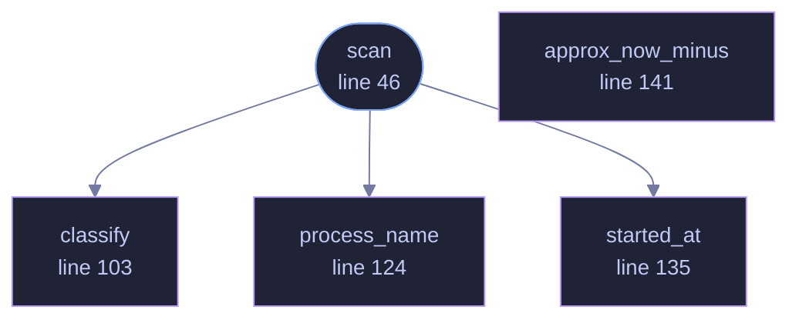

<!-- GENERATED by tools/docs/generate.py from the doc comments in the source. Do not edit: edit the .rs file and run the generator. -->

# `crates/veilvoice-watch/src/linux.rs`

[[veilvoice-watch|Crate-veilvoice-watch]] &middot; 201 lines &middot; [read the source](https://github.com/tilas01/veilvoice/blob/main/crates/veilvoice-watch/src/linux.rs)

## Contents

- [How it works](#how-it-works)
- [Sound servers](#sound-servers)
- [The permission boundary](#the-permission-boundary)
- [In plain words](#in-plain-words)
  - [What calls what](#what-calls-what)
  - [Items](#items)

Linux detection, via open file handles in `/proc`.

# How it works

A process using the microphone has a file descriptor open on an ALSA PCM
capture node, `/dev/snd/pcmC0D0c`, where the trailing `c` means capture as
opposed to `p` for playback. A process using the camera has one open on
`/dev/video*`. Walking `/proc/*/fd` and resolving the symlinks finds them,
along with the PID and the process name, with no dependency and no daemon.

Capture and playback are distinguished deliberately. Treating every open
`/dev/snd` handle as microphone use would report a music player as
listening to you, and a monitor that cries wolf gets ignored, which is the
worst possible outcome for this feature.

# Sound servers

On most desktops PipeWire or PulseAudio owns the hardware, so the process
holding the PCM node is the *server*, not the application behind it. That is
reported honestly rather than hidden: the server appearing means something
is capturing, and where the client can be identified from the ALSA
`/proc/asound` bookkeeping, it is named too.

# The permission boundary

`/proc/<pid>/fd` is readable only by the process owner and root. Without
root you therefore see your own processes; another user's are invisible.
That is a kernel boundary, not a gap in this code, and `crate::support`
says so rather than letting an empty list imply an empty machine.

# In plain words

Finds out which programs are using the microphone or camera on Linux, by
looking at which of them have the device open.

That is exactly what the system already knows and nothing has to be installed
to ask. It sees what your own account can see, so something running as another
user may not appear, and an empty list is not proof of a quiet machine.

## What this file contains

201 lines defining **5 functions** (1 public), **0 types** and **0 constants**. Everything below is read out of the source, so it cannot disagree with the code.

**What happens when it runs.** These are the ways in: public, and nothing else in this file calls them, so they are what an outside caller reaches first.

- `scan` (line 46)
  - reaches: `classify`, `process_name`, `started_at`

## What calls what

_Colour key: **entry** -- a way in: public, and nothing in this file calls it; **helper** -- private to this file._

  

The same graph as Mermaid source

## Items

| Item | Line | Documentation |
|---|---:|---|
| `scan` pub fn | [46](https://github.com/tilas01/veilvoice/blob/main/crates/veilvoice-watch/src/linux.rs#L46) |  |
| `classify` fn | [103](https://github.com/tilas01/veilvoice/blob/main/crates/veilvoice-watch/src/linux.rs#L103) | Decide whether an open handle means capture. |
| `process_name` fn | [124](https://github.com/tilas01/veilvoice/blob/main/crates/veilvoice-watch/src/linux.rs#L124) |  |
| `started_at` fn | [135](https://github.com/tilas01/veilvoice/blob/main/crates/veilvoice-watch/src/linux.rs#L135) | When the process started, from the modification time of its /proc entry. |
| `approx_now_minus` fn | [141](https://github.com/tilas01/veilvoice/blob/main/crates/veilvoice-watch/src/linux.rs#L141) | Unused today; kept because a future PipeWire client lookup will want it. |
